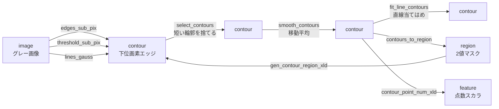
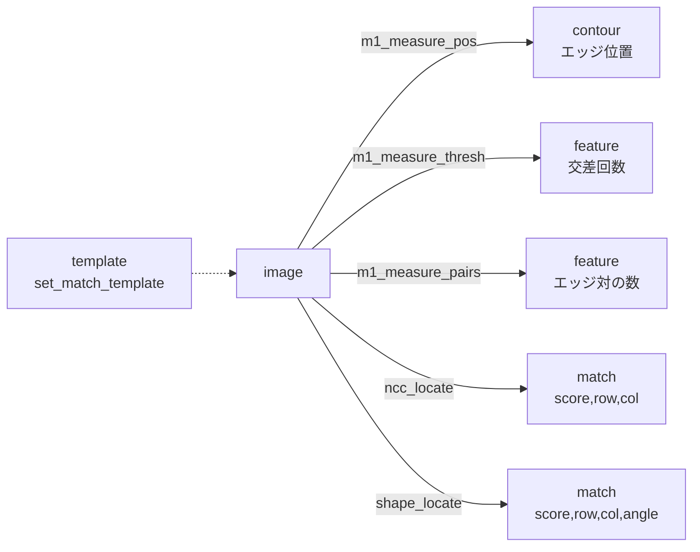

# 輪郭・1次元計測・テンプレート照合 — 使い方ガイド

## この族は何をする道具箱か

この族は、画像から **輪郭(contour)** を下位画素(sub-pixel)精度で取り出し、それを選別・平滑・変換・領域化する XLD 系(HALCON 流の *eXtended Line Description*)の道具に、**1 次元キャリパ計測(measure1d)** と **テンプレート照合(matching)** を加えた計測寄りのファミリです。入力は基本的に 1 枚のグレースケール画像(`[0,1]` の 2 次元 float。一部はカラー `H×W×3` や、既に得た輪郭 dict / 領域マスク)で、出力は用途に応じて 4 種に分かれます — **輪郭**(`{"shape": (H,W), "cs": [ (N,2) 点列, ... ]}`、点は `(row, col)`)、**領域**(`[0,1]` の 2 値マスク)、**特徴**(有限スカラ)、**照合結果**(`[score, row, col, ...]` の配列)。

平たく言えば「エッジや線をきれいな点列として取り出し → 短いゴミを捨て・平滑し・座標変換し → 領域に焼く/点数や長さを測る」という輪郭の一生と、「計測線 1 本に沿ってエッジ位置・本数・しきい値交差を測る」キャリパ、「テンプレートを画像内で探す」照合を、すべて同じ `fullseye.apply(img, "op名", a, b)` の呼び出しモデルで扱えるようにしたものです。2-D パイプライン op は「1 画像 + 2 つのつまみ `a, b ∈ [0,1]`」で、`a` は多くの場合しきい値/スケール、`b` は op ごとの二次パラメータ(計測線の閾値・オフセットなど)です。

## 代表的なパイプライン(op の繋がり)

輪郭の抽出 → 整形 → 領域化/計測という典型的な連鎖です。データ種(image / contour / region / feature)が op をまたいで繋がります。





## 使い方(op グループ別)

呼び出しは一律 `fullseye.apply(入力, "op名", a, b)`。カッコ内の *HALCON:* は対応する HALCON オペレータ名です。

### A. 画像 → 下位画素輪郭(image -> contour 抽出)

- **edges_sub_pix** — Sobel 勾配振幅を `0.15+0.5a` で閾値化し、連結成分を点列輪郭にする(*HALCON: edges_sub_pix*)。`fullseye.apply(img, "edges_sub_pix", 0.4, 0.5)`
- **threshold_sub_pix** — marching-squares で輝度レベル `0.2+0.5a` の等値線を下位画素輪郭にする(*HALCON: threshold_sub_pix*)。`fullseye.apply(img, "threshold_sub_pix", 0.5, 0.5)`
- **zero_crossing_sub_pix** — Gauss ラプラシアン(LoG)のゼロ交差を輪郭にする。`a` が平滑スケール(*HALCON: zero_crossing_sub_pix*)。`fullseye.apply(img, "zero_crossing_sub_pix", 0.5, 0.5)`
- **lines_gauss** — Frangi(Hessian リッジ)応答を閾値化して線状構造を抽出する Steger 流の線検出(*HALCON: lines_gauss*)。`fullseye.apply(img, "lines_gauss", 0.5, 0.5)`
- **lines_facet** — facet モデル系の線抽出(実装はリッジ応答ベース)(*HALCON: lines_facet*)。`fullseye.apply(img, "lines_facet", 0.5, 0.5)`
- **sk_find_contours** — skimage の marching-squares で等値線(既定 `0.2+0.5a`)を輪郭化する(HALCON 別名なし)。`fullseye.apply(img, "sk_find_contours", 0.5, 0.5)`
- **edges_color_sub_pix** — カラー入力の Di Zenzo 色勾配振幅を閾値化した輪郭(*HALCON: edges_color_sub_pix*、入力は color)。`fullseye.apply(color, "edges_color_sub_pix", 0.4, 0.5)`
- **lines_color** — カラーを輝度化し、その上のリッジ(LoG)線を抽出する(*HALCON: lines_color*、入力は color)。`fullseye.apply(color, "lines_color", 0.5, 0.5)`

### B. 輪郭の選別・平滑・当てはめ(contour -> contour)

- **select_contours** — 点数(≒長さ)が `3+40a` 未満の輪郭を捨てる(*HALCON: select_contours_xld*)。`fullseye.apply(cs, "select_contours", 0.1, 0.5)`
- **select_contours_xld** — 上と同じ点数しきい値による XLD 選別(*HALCON: select_contours_xld*)。`fullseye.apply(cs, "select_contours_xld", 0.1, 0.5)`
- **select_shape_xld** — 形状特徴で輪郭を選別(実装は点数ベースの選別)(*HALCON: select_shape_xld*)。`fullseye.apply(cs, "select_shape_xld", 0.1, 0.5)`
- **smooth_contours** — 幅 `1+3a` の移動平均で点列を平滑化する(*HALCON: smooth_contours_xld*)。`fullseye.apply(cs, "smooth_contours", 0.5, 0.5)`
- **smooth_contours_xld** — 上と同じ移動平均平滑の XLD 版(*HALCON: smooth_contours_xld*)。`fullseye.apply(cs, "smooth_contours_xld", 0.5, 0.5)`
- **fit_line_contours** — 各輪郭を SVD の第 1 主方向へ直線当てはめし、端点間の直線点列に置き換える(*HALCON: fit_line_contour_xld*)。`fullseye.apply(cs, "fit_line_contours", 0.5, 0.5)`
- **close_contours_xld** — 開いた輪郭を先頭点で閉じる(末尾に始点を付け足す)(*HALCON: close_contours_xld*)。`fullseye.apply(cs, "close_contours_xld", 0.5, 0.5)`

### C. 輪郭の幾何変換(contour -> contour, XLD)

- **affine_trans_contour_xld** — 画像中心まわりに角度 `-20°+40a°` の回転アフィンを掛ける(*HALCON: affine_trans_contour_xld*)。`fullseye.apply(cs, "affine_trans_contour_xld", 0.5, 0.5)`
- **affine_trans_polygon_xld** — 多角形(輪郭)への同種アフィン変換(*HALCON: affine_trans_polygon_xld*)。`fullseye.apply(cs, "affine_trans_polygon_xld", 0.5, 0.5)`
- **projective_trans_contour_xld** — 列方向に依存する遠近スケールを掛ける射影(ホモグラフィ)変換(*HALCON: projective_trans_contour_xld*)。`fullseye.apply(cs, "projective_trans_contour_xld", 0.5, 0.5)`
- **polar_trans_contour_xld** — 中心基準で直交座標を極座標 `(r, θ)` へ写す(*HALCON: polar_trans_contour_xld*)。`fullseye.apply(cs, "polar_trans_contour_xld", 0.5, 0.5)`
- **shape_trans_xld** — 形状変換(凸包など。cv2 があれば凸包)(*HALCON: shape_trans_xld*)。`fullseye.apply(cs, "shape_trans_xld", 0.5, 0.5)`

### D. 輪郭 ↔ 領域 の相互変換

- **contours_to_region** — 輪郭画素を 2 値マスクに描き、`1+2a` 回 dilation して領域化する(*HALCON: gen_region_contour_xld*)。`fullseye.apply(cs, "contours_to_region", 0.5, 0.5)`
- **gen_region_contour_xld** — 上と同じ輪郭→領域(2 値)(*HALCON: gen_region_contour_xld*)。`fullseye.apply(cs, "gen_region_contour_xld", 0.5, 0.5)`
- **gen_region_polygon_xld** — 輪郭を多角形とみて塗りつぶし領域を作る(*HALCON: gen_region_polygon_xld*)。`fullseye.apply(cs, "gen_region_polygon_xld", 0.5, 0.5)`
- **gen_contour_region_xld** — 領域(マスク)の境界を下位画素輪郭に戻す(*HALCON: gen_contour_region_xld*、入力は region)。境界点は**トレース順**(skimage `find_contours`、不在時は Moore 近傍トレース。2026-08-30 にラスタ順から修正 — 順序前提の EFD 等にそのまま渡せる)。`fullseye.apply(reg, "gen_contour_region_xld", 0.5, 0.5)`

### E. 輪郭の計測(contour -> feature)

- **contour_point_num_xld** — 最大輪郭の点数を `min(1, N/500)` に正規化して返す(*HALCON: contour_point_num_xld*)。`fullseye.apply(cs, "contour_point_num_xld", 0.5, 0.5)`

### F. 1 次元キャリパ計測(image -> feature / contour, measure1d)

計測線は画像中心を通り、向きは `θ = a·π`。線に沿ってバイリニアで輝度プロファイルを取り、その上でエッジ(勾配ピーク)を下位画素に refine します。`b` の意味は op ごとに違います。

- **m1_measure_projection** — 計測帯を線に垂直に平均した射影の平均輝度を返す。`b` は線の垂直オフセット(0.5=中央)(*HALCON: measure_projection*)。`fullseye.apply(img, "m1_measure_projection", 0.5, 0.5)`
- **m1_measure_pos** — 中央線上の下位画素エッジ位置を輪郭(1 点/エッジ)で返す。`b` は相対最小振幅(*HALCON: measure_pos*)。`fullseye.apply(img, "m1_measure_pos", 0.5, 0.3)`
- **m1_measure_thresh** — 生プロファイルが輝度レベル `b` を横切る回数を返す(*HALCON: measure_thresh*)。`fullseye.apply(img, "m1_measure_thresh", 0.5, 0.5)`
- **m1_measure_pairs** — 立上り→立下りのエッジ対(明るい対象)の数を返す。`b` は相対振幅しきい値(*HALCON: measure_pairs*)。`fullseye.apply(img, "m1_measure_pairs", 0.5, 0.3)`
- **m1_fuzzy_measure_pos** — 各エッジにファジー振幅スコア `∈[0,1]` を与え、`b` 以上のエッジ位置を輪郭で返す(*HALCON: fuzzy_measure_pos*)。`fullseye.apply(img, "m1_fuzzy_measure_pos", 0.5, 0.3)`

### G. テンプレート照合(image -> match, matching)

照合系は先に `ops.set_match_template(t)` で探すテンプレート(`[0,1]` の 2 次元 float)を **同じスレッドで** 設定してから呼びます。未設定なら 0 スコアの配列を返します(fail-safe)。

- **ncc_locate** — 正規化相互相関(NCC)の最大位置を `[score, row, col]` で返す。`row, col` はテンプレート中心(*HALCON: find_ncc_model*)。`ops.set_match_template(t); fullseye.apply(img, "ncc_locate", 0.5, 0.5)`
- **shape_locate** — テンプレートを 30° 刻みで回して各回転の NCC 最大を取り、最良の `[score, row, col, angle]` を返す(回転不変)(*HALCON: find_shape_model*)。`ops.set_match_template(t); fullseye.apply(img, "shape_locate", 0.5, 0.5)`

## 動く最小例(検証済み gallery2d_contour_measure から)

repo 直下で `py -3.11` で実行すると `PASS` を出力します(輪郭パイプライン・計測・照合の 3 系統を、既知の真値で確認する自己完結テスト)。

```python
import numpy as np
import fullseye
import ops  # matching ops read their template from a context set here

# --- structured test image + a flat control --------------------------------
n = 48
yy, xx = np.mgrid[0:n, 0:n].astype(float)
disk = ((yy - 24.0) ** 2 + (xx - 30.0) ** 2) < 5.0 ** 2
img = np.clip(0.2 + 0.2 * (xx / (n - 1)) + 0.7 * disk, 0, 1)   # gradient bg + bright disk
flat = np.full((n, n), 0.42)

# 1) contour pipeline: sub-pixel edges -> select -> smooth -> region
edges = fullseye.apply(img, "edges_sub_pix", 0.4, 0.5)          # image  -> contour
assert isinstance(edges, dict) and "cs" in edges and "shape" in edges
assert len(edges["cs"]) > 0                                    # structure => contours
assert len(fullseye.apply(flat, "edges_sub_pix", 0.4, 0.5)["cs"]) == 0   # beat-the-null

kept = fullseye.apply(edges, "select_contours", 0.1, 0.5)      # contour -> contour
assert len(kept["cs"]) <= len(edges["cs"])                     # selection never adds
smoothed = fullseye.apply(kept, "smooth_contours", 0.5, 0.5)   # contour -> contour
region = np.asarray(fullseye.apply(smoothed, "contours_to_region", 0.5, 0.5))  # -> region
assert set(np.unique(region).tolist()).issubset({0.0, 1.0})    # binary region
assert region.sum() > 0                                        # non-empty

# 2) 1-D caliper measurement: the projection recovers a constant profile
lo = fullseye.apply(np.full((n, n), 0.2), "m1_measure_projection", 0.5, 0.5)
hi = fullseye.apply(np.full((n, n), 0.8), "m1_measure_projection", 0.5, 0.5)
assert abs(lo - 0.2) < 0.05 and abs(hi - 0.8) < 0.05
assert fullseye.apply(flat, "m1_measure_thresh", 0.5, 0.5) == 0   # no crossings on flat

# 3) template matching: locate a known patch (structured, not flat)
tmpl = img[18:30, 24:36].copy()          # 12x12 crop around the disk (has structure)
ops.set_match_template(tmpl)             # NCC/shape ops read this template
score, row, col = fullseye.apply(img, "ncc_locate", 0.5, 0.5)     # image -> match
assert score > 0.99                      # a crop matches itself near-perfectly
assert abs(row - 24.0) < 2 and abs(col - 30.0) < 2               # at the disk centre

print("PASS")
```

## 数式(必要な op のみ)

**正規化相互相関(ncc_locate / shape_locate の核)** — 位置 `(y,x)` のスコアは、テンプレート `T` とそこに重なる同サイズ窓 `I_w` の Pearson 相関で、輝度・コントラスト不変(完全一致で `1`):

$$
\mathrm{NCC}(y,x) = \frac{\sum_w \big(I_w - \bar I_w\big)\big(T - \bar T\big)}{\sqrt{\sum_w (I_w - \bar I_w)^2}\ \sqrt{\sum_w (T - \bar T)^2}}\ \in [-1, 1]
$$

分母のテンプレート側エネルギーが 0(平坦テンプレート)だとスコアは 0 になります — 照合には構造のあるテンプレートが必要です。

**下位画素エッジの放物線 refine(measure1d のエッジ位置)** — 勾配振幅 `g` のピーク近傍 3 点に放物線を当て、頂点オフセット `δ` でサブ画素位置 `i+δ` を得ます:

$$
\delta = \frac{1}{2}\cdot\frac{g_{i-1} - g_{i+1}}{g_{i-1} - 2g_i + g_{i+1}}, \qquad \delta \in [-1, 1]
$$

**輪郭のアフィン変換(affine_trans_contour_xld)** — 画像中心 `c=(y_c,x_c)` まわりに回転 `R(φ)`(`φ = -20°+40a°`)を掛けます:

$$
q = R(\varphi)\,(p - c) + c, \qquad R(\varphi) = \begin{bmatrix} \cos\varphi & -\sin\varphi \\ \sin\varphi & \cos\varphi \end{bmatrix}
$$

**ファジー振幅メンバシップ(m1_fuzzy_measure_pos)** — 振幅 `amp` を下限 `lo=0.05\,g_{\max}` と最大 `g_{\max}` の間で正規化したスコアが `b` 以上のエッジを残します:

$$
\mu = \mathrm{clip}\!\left(\frac{amp - lo}{g_{\max} - lo},\ 0,\ 1\right), \qquad \text{keep if } \mu \ge b
$$

## サンプルデータ

この族のデバッグには 2-D 画像が使えます(外部 DL 不要)。輪郭・エッジ抽出には skimage の `coins` / `camera` / `page`(境界がはっきりした自然画像)、キャリパ計測とテンプレート照合には合成の `shapes` / `checker_noisy`(既知の段差・矩形を持つ)が向きます。取得法とライセンスは [`../../SAMPLES.md`](../../SAMPLES.md) を参照(`import sample_images; sample_images.load('coins')`)。

## 参考文献(正典)

台帳は [`../../../REFERENCES.md`](../../../REFERENCES.md)。この族のアルゴリズムの古典:

- Steger, C. (1998). "An Unbiased Detector of Curvilinear Structures." IEEE TPAMI. — 下位画素エッジ・線抽出(edges_sub_pix / lines_gauss / lines_facet)。
- Lorensen, W. & Cline, H. (1987). "Marching Cubes: A High Resolution 3D Surface Construction Algorithm." SIGGRAPH. — 等値線抽出 marching-squares の基礎(threshold_sub_pix / sk_find_contours)。
- Marr, D. & Hildreth, E. (1980). "Theory of Edge Detection." Proc. R. Soc. Lond. B. — LoG ゼロ交差(zero_crossing_sub_pix)。
- Frangi, A. et al. (1998). "Multiscale Vessel Enhancement Filtering." MICCAI. — Hessian リッジによる線強調(lines_gauss)。
- Di Zenzo, S. (1986). "A Note on the Gradient of a Multi-Image." CVGIP. — 多チャネル色勾配(edges_color_sub_pix)。
- Lewis, J. P. (1995). "Fast Normalized Cross-Correlation." Vision Interface. — 正規化相互相関(ncc_locate)。
- Steger, C. (2002). "Occlusion-, Clutter-, and Illumination-Invariant Object Recognition (Shape-Based Matching)." — 形状ベース照合(shape_locate)。
- Serra, J. (1982). "Image Analysis and Mathematical Morphology." — 領域化の膨張(contours_to_region の dilation)。

---

© 2026 Kazufumi Furuse — Fullseye operator documentation. Licensed under Apache-2.0.
