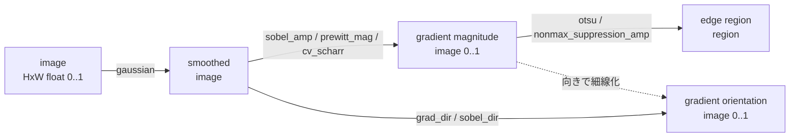
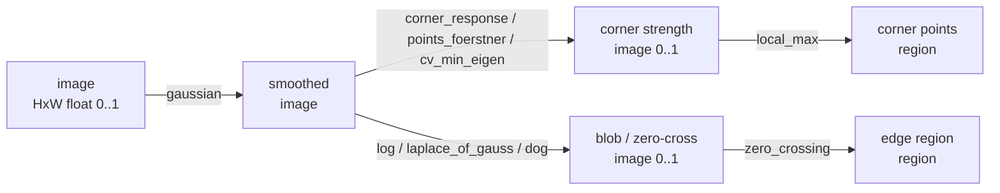

# エッジ・微分・コーナー — 使い方ガイド

> 呼び出しモデル: 2-D op は「1 画像 + 2 つのつまみ `a,b ∈ [0,1]`」。
> `out = fullseye.apply(img, "sobel_amp", a, b)`。連鎖は `fullseye.run_pipeline(img, ["gaussian", "sobel_amp", "otsu"], a, b)`。
> 入力は `image`（HxW float, 値域 [0,1]）、`edges_color` だけ `color`（HxWx3）。出力はすべて `image`（HxW float, 値域 [0,1]）。

## この族は何をする道具箱か

この族（`category == "edges"`、57 エントリ／ユニーク 56 名。`laplace` が素の実装と `_safe` ラップ版で 2 回登録されるため 1 名だけ重複）は、**画像の明るさが急に変わる場所（＝輪郭・エッジ）と、二方向に曲がる場所（＝コーナー特徴点）を取り出す**フィルタ群です。入力はグレースケール画像 1 枚（`edges_color` のみカラー）、出力はどれも同じ大きさの強度マップ（値域 [0,1]）で、「そのピクセルがどれだけエッジ／コーナーらしいか」あるいは「勾配がどちらを向いているか」を表します。用途は、物体の輪郭抽出、トラッキング／マッチング用の特徴点検出、欠陥・キズのエッジ強調、後段のしきい値化・細線化の前処理です。

中身は挙動で 4 系統に分かれます。**(1) 一次微分（勾配）**は明るさの傾きの大きさ（`*_amp`/`*_mag`）や向き（`*_dir`）を返し、段差で強く・平坦部でゼロに応答します。**(2) 二次微分・帯域通過**（Laplacian / LoG / DoG / Hessian）はゼロ交差でエッジを、点・線状構造でピークを出し、直流成分（一様な明るさ）には応答しません。**(3) コーナー／特徴点**（Harris・min-eigen・Förstner・FAST・Moravec・Kitchen-Rosenfeld）は直線エッジではなく「角」でだけ強く応答します。**(4) 拡張系**（`x*`/`f2_*`/`tf_*`）は PIL・scipy・kornia・wavelet や、位相合同性（phase congruency）・shock filter・topographic sketch など別バックエンド由来のエッジ／コーナー表現です。

## 代表的なパイプライン（op の繋がり）

エッジ強度マップを作って輪郭領域に落とす典型（`gauss`→勾配→しきい値化）と、コーナー強度マップから特徴点を拾う典型（`gauss`→コーナー応答→局所最大）です。`otsu`/`nonmax_suppression_amp`/`local_max` は隣の segmentation 族の下流 op（データ種 image→region で接続）。





## 使い方（op グループ別）

つまみ `a,b` は多くの固定カーネル系（Sobel/Prewitt/Roberts/Scharr/Frei/Kirsch/Robinson の `*_amp`・`*_dir`）では**未使用**です（カーネルが固定）。スケールを持つ op では下に意味を添えました。実在の op 名のみ。

### 1. 一次微分の輪郭検出 — 勾配の強さ（`*_amp` / `*_mag`）

`out ∈ [0,1]`、段差で大・平坦部で ~0。

- `sobel_amp` / `sobel_mag` — Sobel 勾配 `√(Gx²+Gy²)` を最大値で正規化。`fullseye.apply(img, "sobel_amp")`
- `prewitt_amp` / `prewitt_mag` — Prewitt 勾配（Sobel と同型・重み違い）。`fullseye.apply(img, "prewitt_mag")`
- `roberts` / `roberts_mag` — Roberts の 2×2 斜め差分（対角勾配）。`fullseye.apply(img, "roberts_mag")`
- `cv_scharr` / `sk_scharr` — Scharr（Sobel より回転等方性の良い 3×3）。`fullseye.apply(img, "sk_scharr")`
- `sk_farid` — Farid–Simoncelli の最適化微分フィルタ。`fullseye.apply(img, "sk_farid")`
- `frei_amp` — Frei–Chen（`√2` 重みの等方カーネル対の勾配）。`fullseye.apply(img, "frei_amp")`
- `kirsch_amp` — Kirsch コンパス（8 方向カーネルの絶対応答の最大）。`fullseye.apply(img, "kirsch_amp")`
- `robinson_amp` — Robinson コンパス（回転 8 方向の最大応答）。`fullseye.apply(img, "robinson_amp")`
- `derivate_gauss` — ガウス一次微分の勾配強度。`a` = ガウス σ（`0.5+2.5a`）。`fullseye.apply(img, "derivate_gauss", 0.4)`
- `xsp_gauss_grad_mag` — scipy の gaussian-gradient-magnitude。
- `tf_steerable_filter` — steerable G1（方向 `θ=a·π` の DoG 一次微分応答、`b`=σ）。0.5 が零・そこからの偏差が指定方向のエッジで最大。
- `edges_color` — **入力は color**。Di Zenzo の多チャンネル構造テンソル最大固有値＝カラー勾配振幅。`fullseye.apply(rgb, "edges_color")`
- 他（PIL カーネル系）: `xpil_find_edges`, `xpil_contour`

### 2. 勾配の向き（orientation, `*_dir`）

`out` は角度を [0,1] に写した「向きマップ」（強度ではない）。勾配が 0 の平坦部では向きは未定義になる点に注意。

- `grad_dir` — `atan2(Gy,Gx)` を [0,1] に。`fullseye.apply(img, "grad_dir")`
- 他: `sobel_dir`, `prewitt_dir`, `frei_dir`, `kirsch_dir`（最良応答カーネルの index）, `robinson_dir`（同）

### 3. 二次微分・帯域通過（ゼロ交差・点／線）

一様な明るさ（DC）には応答せず、段差・点・線でピーク。`signed01` 系は 0.5 が零。

- `laplace` — `|∇²I|`（Marr–Hildreth の Laplacian）。`fullseye.apply(img, "laplace")`
- `cv_laplacian` / `xkor_laplacian` / `xsp_morph_laplace` — OpenCV / kornia / scipy 形態学版の Laplacian。
- `log` / `laplace_of_gauss` — LoG（Gaussian で平滑してから Laplacian）。`a` = σ。`log` は絶対値、`laplace_of_gauss` は符号付き（`signed01`）。`fullseye.apply(img, "log", 0.4)`
- `dots_image` — LoG ベースの点／ブロブ強調（HALCON `dots_image`）。
- `dog` / `diff_of_gauss` / `sk_dog` / `xkor_dog` — DoG（`|G(σ₁)−G(σ₂)|`、LoG の近似の帯域通過）。`a` = 内側 σ、`b` = 外側 σ。`fullseye.apply(img, "dog", 0.2, 0.6)`
- `sk_hessian_det` / `xkor_hessian` / `xsk_hessian_eig` — Hessian 行列式／固有値（ブロブ・線状構造の強調）。`a` = σ。

### 4. コーナー／特徴点（二方向に曲がる角）

直線エッジ・平坦部より「角」で強い。`a` は積分（平滑）スケール。

- `corner_response` — 純 numpy の Harris 応答 `det(M) − 0.04·trace(M)²`。`fullseye.apply(img, "corner_response", 0.5)`
- `cv_corner_harris` / `sk_corner_harris` / `xkor_harris` — OpenCV / skimage / kornia の Harris。
- `points_harris_binomial` — 二項平滑した画像への Harris。`a`=Harris σ、`b`=前平滑 σ。
- `cv_min_eigen` / `xkor_gftt` — Shi–Tomasi の最小固有値（Good-Features-To-Track）。
- `cv_precorner` — OpenCV `preCornerDetect`。
- `points_foerstner` — Förstner 作用素（精密点位置）。
- `xsk2_corner_kr` — Kitchen–Rosenfeld コーナー検出。
- `xsk3_corner_moravec` — Moravec 作用素。
- `xsk3_corner_fast` — FAST コーナー。

### 5. 拡張・位相／幾何／波形（別バックエンド由来）

- `tf_phase_congruency` — 位相合同性（monogenic／log-Gabor）。照明変化に不変なエッジ・線特徴。`a`=ノイズ閾、`b`=基本波長。
- `f2_shock` — Osher–Rudin の shock filter（零交差で衝突させ、ぼけたエッジを鋭くする）。
- `f2_topographic` — Haralick の topographic primal sketch（peak/pit/ridge/ravine/saddle/flat/hillside に分類し gray code 化）。`a`=平滑スケール、`b`=平坦許容。
- `xsk2_inv_gauss_grad` — inverse Gaussian gradient（エッジで小さくなる edge-stopping マップ、level-set 用）。`a`=α。
- `xwt_hf_reconstruct` / `xwt_directional_detail` — wavelet の高周波再構成／方向別ディテール帯（エッジ成分）。

## 動く最小例（検証済み gallery2d_edges から）

段差・定数・塗り正方形という「答えが分かる」合成画像で、3 系統の**性質**を数値で確かめる自己完結スクリプト（repo 直下で `py -3.11` 実行可）。gallery2d_edges.py の GT ロジックを `fullseye.apply` 呼び出しに移したもの。

```python
# repo 直下で: py -3.11 this.py
import numpy as np
import fullseye

n = 48
step  = np.zeros((n, n)); step[:, n // 2:] = 1.0   # 縦エッジ（左0/右1）
const = np.full((n, n), 0.4)                        # 勾配ゼロの一様画像
sq    = np.zeros((n, n)); sq[14:34, 14:34] = 1.0    # 4隅を持つ塗り正方形

# (1) 一次微分の強度: 段差で大きく、平坦部・一様画像では ~0
m = fullseye.apply(step, "sobel_amp", 0.5, 0.5)
edge = float(m[:, n // 2 - 1:n // 2 + 1].mean())
flat = float(m[:, 4:8].mean())
assert edge > flat + 0.3, (edge, flat)
assert float(fullseye.apply(const, "sobel_amp").std()) < 1e-6   # 一様→応答ゼロ

# (2) Laplacian（二次微分）は DC 成分なし: 一様画像に沈黙し、段差で応答
lap_const = fullseye.apply(const, "laplace")
lap_step  = fullseye.apply(step,  "laplace")
assert float(np.abs(lap_const).mean()) < 1e-6
assert float(lap_step.max()) > 0.1

# (3) Harris コーナー応答は「角」で最大、直線エッジ・平坦部では弱い
r = fullseye.apply(sq, "corner_response", 0.5, 0.5)
corner   = float(r[12:17, 12:17].max())   # 角 (14,14) 近傍
straight = float(r[12:17, 22:27].max())   # 上辺中央（直線エッジ）
flat_in  = float(r[22:27, 22:27].mean())  # 内部平坦
assert corner > straight + 0.1 and corner > flat_in + 0.1, (corner, straight, flat_in)

print("PASS")
```

つまみ（向き）と連鎖の感触をつかむ 2 つ目の例（同じく `py -3.11` で実行可）。`*_amp` は「強さ」・`*_dir` は「向き」で、縦エッジと横エッジは強さは同じでも向きが違うこと、そして `run_pipeline` で平滑→勾配→Otsu を一気に繋げられることを示す。

```python
# repo 直下で: py -3.11 this.py
import numpy as np
import fullseye

n = 64
vert = np.zeros((n, n)); vert[:, n // 2:] = 1.0   # 縦エッジ（勾配は +x 方向）
horz = np.zeros((n, n)); horz[n // 2:, :] = 1.0   # 横エッジ（勾配は +y 方向）

# amp（強さ）は両者とも強い
assert fullseye.apply(vert, "sobel_amp").max() > 0.9
assert fullseye.apply(horz, "sobel_amp").max() > 0.9

# dir（向き）はエッジ画素上で異なる（平坦部は勾配0で未定義なのでエッジ上だけ読む）
dv = fullseye.apply(vert, "sobel_dir"); dh = fullseye.apply(horz, "sobel_dir")
ev = float(np.median(dv[:, n // 2 - 1:n // 2 + 1]))
eh = float(np.median(dh[n // 2 - 1:n // 2 + 1, :]))
assert abs(ev - eh) > 0.15, (ev, eh)

# 連鎖: 平滑 -> 勾配強度 -> Otsu 二値化（各段 1 つの共有つまみ）
seg = fullseye.run_pipeline(vert, ["gaussian", "sobel_amp", "otsu"], 0.3, 0.5)
assert set(np.unique(seg)) <= {0.0, 1.0} and 0.0 < seg.mean() < 0.5

print("PASS")
```

## 数式（必要な op のみ）

一次微分の勾配強度（`sobel_amp`/`prewitt_mag`/`cv_scharr` ほか、実装は最大絶対値で [0,1] に正規化）:

$$g = \sqrt{G_x^2 + G_y^2}, \qquad \hat g = \frac{g}{\max|g|}$$

勾配の向き（`grad_dir`/`sobel_dir`、角度を [0,1] に写像）:

$$\theta = \frac{\operatorname{atan2}(G_y, G_x) + \pi}{2\pi} \in [0,1]$$

Laplacian of Gaussian（`log`/`laplace_of_gauss`）と Difference of Gaussians 近似（`dog`/`diff_of_gauss`）:

$$\mathrm{LoG}_\sigma(I) = \nabla^2\!\big(G_\sigma * I\big), \qquad \mathrm{DoG} = \big|\,G_{\sigma_1}*I - G_{\sigma_2}*I\,\big|,\ \ \sigma_1<\sigma_2$$

Harris/Förstner のコーナー判定に使う構造テンソル（`corner_response`。$M$ は勾配積をガウス窓 $w$ で平滑した 2×2 行列、$k=0.04$）:

$$M = \begin{bmatrix} \langle G_x^2\rangle_w & \langle G_x G_y\rangle_w \\ \langle G_x G_y\rangle_w & \langle G_y^2\rangle_w \end{bmatrix}, \qquad R = \det(M) - k\,\operatorname{tr}(M)^2$$

Shi–Tomasi（`cv_min_eigen`/`xkor_gftt`）は同じ $M$ の最小固有値 $\min(\lambda_1,\lambda_2)$ をコーナー強度に使う。`edges_color` は各チャンネルの勾配から作る構造テンソルの最大固有値の平方根（Di Zenzo カラー勾配）。

## サンプルデータ

デバッグ用の 2-D 画像源は [`../../SAMPLES.md`](../../SAMPLES.md) 参照。この族は輪郭・角のはっきりした画像が向く: 合成の `shapes`・`checker_noisy`（明確な段差と角）、`skimage.data` の `coins`・`camera`（自然なエッジと特徴点）。取得は `import sample_images; sample_images.load("shapes")`（外部 DL 不要）。

## 参考文献（正典）

台帳: [`../../../REFERENCES.md`](../../../REFERENCES.md)。

- Roberts, L. G. (1965), "Machine Perception of Three-Dimensional Solids" — Roberts cross。
- Sobel, I. & Feldman, G. (1968), "A 3×3 Isotropic Gradient Operator for Image Processing" — Sobel。
- Prewitt, J. M. S. (1970), "Object Enhancement and Extraction" (Picture Processing and Psychopictorics) — Prewitt。
- Kirsch, R. A. (1971), "Computer Determination of the Constituent Structure of Biological Images" — Kirsch コンパス。
- Frei, W. & Chen, C.-C. (1977), "Fast Boundary Detection: A Generalization and a New Algorithm" — Frei–Chen。
- Marr, D. & Hildreth, E. (1980), "Theory of Edge Detection" (Proc. R. Soc. Lond. B) — Laplacian / LoG / DoG。
- Moravec, H. P. (1980), "Obstacle Avoidance and Navigation in the Real World by a Seeing Robot Rover" — Moravec コーナー。
- Kitchen, L. & Rosenfeld, A. (1982), "Gray-Level Corner Detection" — Kitchen–Rosenfeld。
- Haralick, R. M., Watson, L. T. & Laffey, T. J. (1983), "The Topographic Primal Sketch" — topographic sketch。
- Förstner, W. & Gülch, E. (1987), "A Fast Operator for Detection and Precise Location of Distinct Points, Corners and Centres of Circular Features" — Förstner。
- Harris, C. & Stephens, M. (1988), "A Combined Corner and Edge Detector" (Alvey Vision Conf.) — Harris。
- Osher, S. & Rudin, L. I. (1990), "Feature-Oriented Image Enhancement Using Shock Filters" (SIAM J. Numer. Anal.) — shock filter。
- Freeman, W. T. & Adelson, E. H. (1991), "The Design and Use of Steerable Filters" (IEEE TPAMI) — steerable filter。
- Shi, J. & Tomasi, C. (1994), "Good Features to Track" (CVPR) — 最小固有値 / GFTT。
- Kovesi, P. (1999), "Image Features from Phase Congruency" — phase congruency。
- Farid, H. & Simoncelli, E. P. (2004), "Differentiation of Discrete Multidimensional Signals" (IEEE TIP) — Farid 微分フィルタ。
- Rosten, E. & Drummond, T. (2006), "Machine Learning for High-Speed Corner Detection" (ECCV) — FAST。

© 2026 Kazufumi Furuse — Fullseye operator documentation. Licensed under Apache-2.0.
