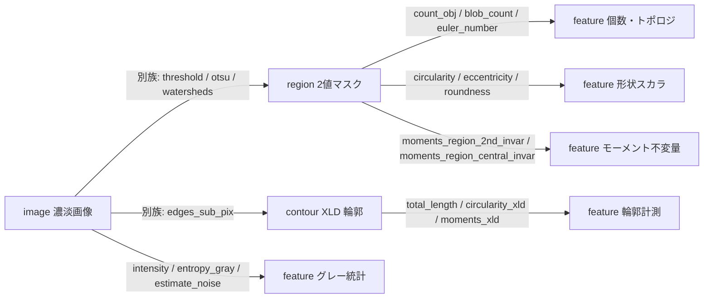
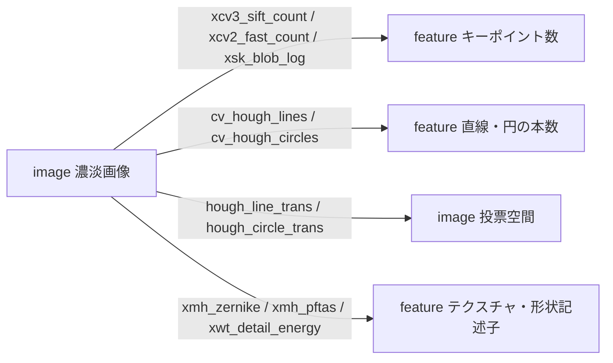

# 特徴抽出・テクスチャ・形状記述 — 使い方ガイド

## この族は何をする道具箱か

この族は「画像を別の画像に変える」フィルタ群とは目的が違う。**入力（region / contour(XLD) / image / color / volume）を受け取り、数えて測った“数値”を返す**——「いくつ物体があるか」「どれだけ丸いか／細長いか」「明るさの平均・分散・エントロピー」「モーメント不変量」「キーポイントや直線・円の本数」「ざらつき（テクスチャ）記述子」——を一括で扱う計測・記述レイヤである。ほとんどの op は `feature`（有限スカラ、`fullseye.apply` は Python の `float` を返す）を出力し、Hough 変換系の 2 つ（`hough_line_trans` / `hough_circle_trans`）と自己相似の `xmh_selfmatch` だけは投票空間／相似マップという `image` を返す。

前段（2値化・領域分割・輪郭抽出）は別の族が担い、この族はその出力に対して「言い当てる」役に回る。典型的には `gallery2d_segmentation` の閾値・分割 op で `image → region` を作り、そこへ本族の region 計測をかける。あるいは `edges_sub_pix` などで `image → contour(XLD)` を作り、本族の `*_xld` 計測をかける。`image` を直接受けるグレー統計・キーポイント計数系はその前処理すら要らない。HALCON の `count_obj` / `circularity` / `moments_region_*` / `*_xld` / gray feature 群に対応し、加えて scikit-image・OpenCV・mahotas・PyWavelets 由来の blob/コーナー/ウェーブレット記述子を同じ registry に載せている。

## 代表的なパイプライン（op の繋がり）





呼び出しモデルはこの族でも 2-D パイプラインと同じ「1 入力 + 2 つのつまみ `a,b∈[0,1]`」: `fullseye.apply(x, "op名", a, b)`。region op に濃淡画像を渡すと 0.5 で自動 2 値化される（`coerce=True`）。contour は `{'shape':(H,W), 'cs':[ (N,2) 配列 ... ]}`、color は `HxWx3`、volume は `Zx(H)x(W)` をそのまま渡す。

## 使い方（op グループ別）

### 1. 数える・トポロジ（region / contour / volume → feature）
- `count_obj` — 連結成分の個数（`scipy.ndimage.label`、**8 連結既定** = HALCON `connection` パリティ。対角接触は 1 個。2026-08-30 に 4 連結から修正）。3 つに分かれた領域なら厳密に 3。呼び出し: `fullseye.apply(region, "count_obj")`
- `blob_count` — `count_obj` と同義の blob 計数（同じく 8 連結既定。旧 4 連結は `ops._blob_count(..., connectivity=4)`）。呼び出し: `fullseye.apply(region, "blob_count")`
- `cv_cc_count` — OpenCV `connectedComponents` による連結成分数（cv2 が要る）。呼び出し: `fullseye.apply(region, "cv_cc_count")`
- `connect_and_holes` — 連結成分の個数を返す（metric=`count`）。呼び出し: `fullseye.apply(region, "connect_and_holes")`
- `euler_number` / `sk_euler` — オイラー数（連結成分数 − 穴の数、`skimage.measure.euler_number`）。呼び出し: `fullseye.apply(region, "euler_number")`
- `area_holes` — 穴の面積比 `(穴埋め面積 − 面積)/穴埋め面積`。呼び出し: `fullseye.apply(region, "area_holes")`
- `area_frac` — マスクの面積比（前景画素の割合 = `mean(mask)`、`feature` の 1 スカラ）。呼び出し: `fullseye.apply(region, "area_frac")`
- `area_center` — HALCON と同じ **(面積, 行, 列)** の 3 成分を返す（`region → match` の 1-D ベクトル）。3 成分とも解像度に依らないよう正規化してある: `[0]=面積/画像画素数`、`[1]=重心行/(H-1)`、`[2]=重心列/(W-1)`。空領域は `(0, 0.5, 0.5)`。呼び出し: `fullseye.apply(region, "area_center")`  
  <br>★2026-09-02 まではこの op は `mean(mask)` の 1 スカラだけを返しており、名前にある **中心を返していなかった**（面積も画素数ではなく比率で、解像度依存だった）。1 スカラでは HALCON の 3 値を表せないため、`ncc_locate` と同じ `match` sort に移した。
- `count_contours` — 輪郭リスト `cs` の本数。呼び出し: `fullseye.apply(contour, "count_contours")`
- `vol_count` — 3-D ボリューム内の連結成分数（`> 0.5` を 3-D ラベリング）。呼び出し: `fullseye.apply(volume, "vol_count")`

### 2. 形の丸み・細長さ（region → feature、`skimage.regionprops` ベース、最大領域について測る）
- `circularity` — 円形度 `min(1, 4πA/P²)`（円盤 ≈ 1、細長い棒は桁違いに小さい）。呼び出し: `fullseye.apply(region, "circularity")`
- `compactness` — コンパクトさ `min(1, (P²/4πA)/10)`（`circularity` の逆向き指標、1/10 に正規化）。呼び出し: `fullseye.apply(region, "compactness")`
- `convexity` — 凸性 `面積 / 凸包面積`（≤1、凸なら 1）。呼び出し: `fullseye.apply(region, "convexity")`
- `rectangularity` — 矩形度 `extent = 面積 / bbox 面積`。呼び出し: `fullseye.apply(region, "rectangularity")`
- `roundness` — 真円度 `min(1, 4A/(π·長軸²))`。呼び出し: `fullseye.apply(region, "roundness")`
- `eccentricity` — 離心率 `√(1−(短軸/長軸)²)`（円=0、細長いほど→1）。呼び出し: `fullseye.apply(region, "eccentricity")`
- `orientation_region` — 長軸の向きを `[0,1]` に正規化（`(θ+π/2)/π`）。呼び出し: `fullseye.apply(region, "orientation_region")`
- `elliptic_axis` — 異方度 `長軸/短軸/10`（近似楕円の軸比）。呼び出し: `fullseye.apply(region, "elliptic_axis")`
- `diameter_region` — 等価円直径を画像サイズで正規化。呼び出し: `fullseye.apply(region, "diameter_region")`
- `height_width_ratio` — bbox の縦横比 `min(1, 高さ/幅)`。呼び出し: `fullseye.apply(region, "height_width_ratio")`
- `contlength` — 周長を `2(H+W)` で正規化。呼び出し: `fullseye.apply(region, "contlength")`
- `get_region_thickness` — 最大内接距離の 2 倍（EDT の最大値×2）を正規化。呼び出し: `fullseye.apply(region, "get_region_thickness")`

### 3. モーメント（region → feature、正規化中心モーメント／Hu 不変量）
- `classify_shape` — 最大領域の円形度 `min(1, 4πA/P²)`（形の“丸さ”による簡易分類量）。呼び出し: `fullseye.apply(region, "classify_shape")`
- `moments_region_2nd` — 2 次正規化中心モーメント `|η₂₀+η₀₂|`（広がり）。呼び出し: `fullseye.apply(region, "moments_region_2nd")`
- `moments_region_3rd` — 3 次 `|η₃₀+η₀₃|`（歪み）。
- `moments_region_central` — `|η₂₀+η₁₁+η₀₂|`。
- `moments_region_2nd_invar` — Hu 第 1 不変量 `|φ₁|`（回転・スケール不変）。呼び出し: `fullseye.apply(region, "moments_region_2nd_invar")`
- `moments_region_central_invar` — Hu 第 2 不変量 `|φ₂|`。
- `moments_region_2nd_rel_invar` — Hu 第 3 不変量 `|φ₃|`。
- `moments_region_3rd_invar` — Hu 第 4 不変量 `|φ₄|`。
- （いずれも `skimage.measure.moments_central / moments_normalized / moments_hu` に基づき、`min(1, ·)` でクリップ）

### 4. 輪郭（XLD）計測（contour → feature、最長輪郭について測る）
- `total_length` / `length_xld` — 折れ線の総長 `Σ√(Δx²+Δy²)`（閉じる最終辺は加えない。円輪郭で ≈ 2πR）。呼び出し: `fullseye.apply(contour, "total_length")`
- `area_center_xld` — シューレース公式の面積を画像面積で正規化。呼び出し: `fullseye.apply(contour, "area_center_xld")`
- `circularity_xld` — 輪郭の円形度 `min(1, 4πA/P²)`（円 ≈ 1 > 正方形）。呼び出し: `fullseye.apply(contour, "circularity_xld")`
- `compactness_xld` — 輪郭コンパクトさ（`circularity_xld` の逆向き、1/10 正規化）。
- `convexity_xld` — 輪郭面積 / 凸包面積（cv2 が要る、無ければ 1.0）。
- `eccentricity_xld` — 当てはめ楕円の離心率 `√(1−(b/a)²)`（cv2 `fitEllipse`、要 5 点以上）。呼び出し: `fullseye.apply(contour, "eccentricity_xld")`
- `orientation_xld` — 当てはめ楕円の角度 `(θ mod 180)/180`。
- `elliptic_axis_xld` — 楕円の軸比 `短軸/長軸`。
- `diameter_xld` — 最小外接円の直径を正規化（`minEnclosingCircle`）。
- `rectangularity_xld` — 面積 / 最小外接矩形面積（`minAreaRect`）。
- `moments_xld` — `(μ₂₀+μ₀₂)/m₀₀²`（cv2 `moments`）。
- （`*_xld` の楕円・矩形・凸包系は OpenCV があるときのみ genuine 計算、無ければ 0.0/1.0 に degrade する）

### 5. グレー値統計（image → feature）
- `intensity` — 平均輝度（定数画像なら厳密にその値）。呼び出し: `fullseye.apply(image, "intensity")`
- `min_max_gray` — `[0,1]` にクリップした最大値（HALCON は min/max/range、本実装は max）。呼び出し: `fullseye.apply(image, "min_max_gray")`
- `gray_histo_abs` — 標準偏差（ヒストグラムの広がりを 1 スカラで要約）。呼び出し: `fullseye.apply(image, "gray_histo_abs")`
- `entropy_gray` — 64 ビンヒストグラムの Shannon エントロピー `/6`（平坦画像 ≈ 0、ノイズ画像で大）。呼び出し: `fullseye.apply(image, "entropy_gray")`
- `sk_entropy_feat` — `skimage.measure.shannon_entropy`。
- `estimate_noise` — ラプラシアンの MAD による頑健ノイズ **σ そのもの**（[0,1] 階調の単位つき量）。`σ = 1.4826·MAD(∇²x)/√20`（√20 は 5 点ラプラシアンのノイズ利得）。平坦画像 + ガウス雑音での実測は σ=0.01〜0.30 で真値の ±10% 以内。呼び出し: `fullseye.apply(image, "estimate_noise")`  
  <br>★2026-09-02 まではこれが `min(1, 1.4826·MAD·3)` で、**σ の単位ですらなく σ≳0.08 から 1.0 に張り付いて**いた（σ を 0.02→0.22 と 11 点振ると 8 点が厳密に 1.0）。上限 1.0 の clip は残っているが、入力が [0,1] である以上 σ≥1 は起こらないので **到達しない安全弁**であって動作域ではない。
- `xsk3_estimate_sigma` — `skimage.restoration.estimate_sigma` を `×5` 正規化。
- `xsk3_is_low_contrast` — 低コントラスト判定フラグ（0/1）。
- `xcv2_lap_var` — ラプラシアンの分散（ピント／ぼけ指標、`min(1, ·×20)`）。呼び出し: `fullseye.apply(image, "xcv2_lap_var")`
- `sk_blur_effect` — `skimage.measure.blur_effect` によるぼけ度。

### 6. キーポイント・直線・円を数える（image → feature、Hough 2 つのみ → image）
- `cv_good_features` — Shi–Tomasi の `goodFeaturesToTrack` 検出点数。呼び出し: `fullseye.apply(image, "cv_good_features")`
- `cv_hough_lines` — 確率的 Hough（`HoughLinesP`）で検出した線分本数。呼び出し: `fullseye.apply(image, "cv_hough_lines")`
- `cv_hough_circles` — `HoughCircles` で検出した円の個数。
- `hough_line_trans` — Hough 直線変換の投票空間（`image`、`[0,1]` 正規化）。呼び出し: `fullseye.apply(image, "hough_line_trans")`
- `hough_circle_trans` — Hough 円変換の投票空間（`image`、半径方向 max 投影）。
- `xcv2_fast_count` / `xcv3_agast_count` — FAST / AGAST コーナー数。
- `xsk_orb_count` / `xcv_orb_count` — ORB キーポイント数（skimage / cv2）。
- `xcv3_sift_count` — SIFT 検出点数。`xcv3_brisk_count` — BRISK 検出点数。`xcv3_lsd_count` — 線分検出器（LSD）の線分数。
- `xsk_blob_log` / `xsk_blob_dog` / `xsk_blob_doh` — LoG / DoG / DoH スケール空間 blob の個数。呼び出し: `fullseye.apply(image, "xsk_blob_log")`

### 7. テクスチャ・形状記述子・自己相似（image → feature、`xmh_selfmatch` のみ image）
- `xmh_zernike` — Zernike モーメントの総和（回転不変な形状記述子、mahotas）。呼び出し: `fullseye.apply(image, "xmh_zernike")`
- `xmh_pftas` — parameter-free Threshold Adjacency Statistics の平均（mahotas のテクスチャ記述子）。
- `xcv3_gray_hu1` — 濃淡画像そのものの第 1 Hu モーメント。
- `xwt_detail_energy` — ウェーブレット詳細係数のエネルギー比（全詳細/(詳細+近似)、PyWavelets）。呼び出し: `fullseye.apply(image, "xwt_detail_energy")`
- `xwt_packet_entropy` — ウェーブレットパケットのサブバンドエネルギー分布の正規化エントロピー。
- `xmh_selfmatch` — 中心パッチを自分自身にテンプレートマッチした自己相似マップ（`image` 出力、mahotas `template_match`）。呼び出し: `fullseye.apply(image, "xmh_selfmatch")`

### 8. カラー（color → feature）
- `count_channels` — チャネル数（`HxWx3` なら 3）。呼び出し: `fullseye.apply(color, "count_channels")`

## 動く最小例（検証済み gallery2d_features から）

repo 直下で `py -3.11` 実行可。個数・円形度・輪郭長・チャネル数・平均輝度の“零点を上回る”GT を確認する。

```python
import numpy as np
import fullseye

n = 64
yy, xx = np.mgrid[0:n, 0:n]

# (a) 3 つに分かれた領域（2-D {0,1} float マスク）-> 個数はちょうど 3
three = np.zeros((n, n), np.float64)
for cy, cx in [(16, 16), (16, 48), (48, 32)]:
    three[((yy - cy) ** 2 + (xx - cx) ** 2) < 25] = 1.0
assert fullseye.apply(three, "count_obj") == 3.0
assert fullseye.apply(three, "blob_count") == 3.0

# (b) 円盤は細長い棒より桁違いに「丸い」
disk = (((yy - n // 2) ** 2 + (xx - n // 2) ** 2) < (n * 0.22) ** 2).astype(np.float64)
bar = np.zeros((n, n), np.float64); bar[28:36, 6:58] = 1.0
c_disk = fullseye.apply(disk, "circularity")
c_bar = fullseye.apply(bar, "circularity")
assert c_disk > 0.8 and c_disk > 2.0 * c_bar

# (c) 閉じた円輪郭（XLD dict）-> 総周長 ~= 2*pi*R
R = n * 0.28
t = np.linspace(0, 2 * np.pi, 200, endpoint=False)
circle = {"shape": (n, n),
          "cs": [np.column_stack([n / 2 + R * np.sin(t), n / 2 + R * np.cos(t)])]}
L = fullseye.apply(circle, "total_length")
assert abs(L - 2 * np.pi * R) < 0.02 * (2 * np.pi * R)

# (d) HxWx3 カラー画像はチャネル数ちょうど 3
color = np.stack([disk, 0.7 * disk + 0.1, 1 - disk], -1)
assert fullseye.apply(color, "count_channels") == 3.0

# (e) グレー統計: 明るい定数画像は暗い定数画像より平均が高い
assert fullseye.apply(np.full((n, n), 0.8), "intensity") > \
       fullseye.apply(np.full((n, n), 0.1), "intensity") + 0.5

print("PASS")
```

## 数式（必要な op のみ）

円形度（`circularity` / `classify_shape` / `circularity_xld`）。面積 $A$、周長 $P$:

$$C = \min\!\left(1,\ \frac{4\pi A}{P^2}\right)$$

真円度（`roundness`）と離心率（`eccentricity` / `eccentricity_xld`）。長軸 $a$、短軸 $b$:

$$\mathrm{roundness} = \min\!\left(1,\ \frac{4A}{\pi a^2}\right), \qquad e = \sqrt{1 - \left(\tfrac{b}{a}\right)^2}$$

Hu 第 1 不変量（`moments_region_2nd_invar`）。$\eta_{pq}$ は正規化中心モーメント:

$$\phi_1 = \eta_{20} + \eta_{02}$$

Shannon エントロピー（`entropy_gray` / `xwt_packet_entropy`）。ビン確率 $p_i$:

$$H = -\sum_i p_i \log_2 p_i$$

頑健ノイズ推定（`estimate_noise`）。ラプラシアン $L = \nabla^2 x$ の MAD を正規分布換算し、**カーネルのノイズ利得で割って σ に戻す**:

$$\hat{\sigma} = \frac{1.4826 \cdot \mathrm{median}\big|\,L - \mathrm{median}(L)\,\big|}{\sqrt{20}}$$

$\sqrt{20}$ は 5 点ラプラシアン $[[0,1,0],[1,-4,1],[0,1,0]]$ のノイズ利得（独立同分布ノイズ $\sigma$ を通すと分散が $(-4)^2 + 4\cdot 1^2 = 20$ 倍になる）。実測（平坦画像 + ガウス雑音 512×512、$\sigma = 0.01 \ldots 0.30$）で $1.4826\,\mathrm{MAD}/\sigma = 4.4501 \ldots 4.4816$、$\sqrt{20} = 4.4721$ と 0.5% 以内で一致する。★2026-09-02 以前は $\sqrt{20}$ で割る代わりに **3 を掛けて** おり、σ の単位ですらないうえ σ≳0.08 で 1.0 に飽和していた。

折れ線長（`total_length` / `length_xld`）。頂点列 $(x_i, y_i)$:

$$L = \sum_i \sqrt{(x_{i+1}-x_i)^2 + (y_{i+1}-y_i)^2}$$

## サンプルデータ

この族のデバッグには 2 値化しやすい合成図形と実写グレー画像が向く。`../../SAMPLES.md` の `shapes` / `blobs`（合成・個数と形状の GT が明快）、`coins` / `camera`（`skimage.data`、キーポイント・Hough・グレー統計の実写確認）を使う（`import sample_images; sample_images.load('<name>')`）。

## 参考文献（正典）

- Rosenfeld, A. & Pfaltz, J. (1966). "Sequential Operations in Digital Picture Processing." — 連結成分ラベリング（`count_obj` / `blob_count` / `cv_cc_count` / `euler_number`）
- Hu, M.-K. (1962). "Visual Pattern Recognition by Moment Invariants." — Hu モーメント不変量（`moments_region_*_invar` / `xcv3_gray_hu1`）
- Danielsson, P.-E. (1978). "A New Shape Factor." — 円形度（`circularity` / `classify_shape`）
- Teague, M. R. (1980). "Image Analysis via the General Theory of Moments." — Zernike モーメント（`xmh_zernike`）
- Shannon, C. E. (1948). "A Mathematical Theory of Communication." — エントロピー（`entropy_gray` / `xwt_packet_entropy`）
- Immerkær, J. (1996). "Fast Noise Variance Estimation." — ラプラシアンによるノイズ推定（`estimate_noise`）
- Duda, R. O. & Hart, P. E. (1972). "Use of the Hough Transformation to Detect Lines and Curves in Pictures." — Hough 変換（`hough_line_trans` / `hough_circle_trans` / `cv_hough_lines` / `cv_hough_circles`）
- Harris, C. & Stephens, M. (1988). "A Combined Corner and Edge Detector." — コーナー検出（`cv_good_features` の系譜）
- Rosten, E. & Drummond, T. (2006). "Machine Learning for High-Speed Corner Detection." — FAST/AGAST（`xcv2_fast_count` / `xcv3_agast_count`）
- Lowe, D. G. (2004). "Distinctive Image Features from Scale-Invariant Keypoints." — SIFT（`xcv3_sift_count`）
- Lindeberg, T. (1998). "Feature Detection with Automatic Scale Selection." — スケール空間 blob（`xsk_blob_log` / `xsk_blob_dog` / `xsk_blob_doh`）
- Mallat, S. (1989). "A Theory for Multiresolution Signal Decomposition: The Wavelet Representation." — ウェーブレット記述子（`xwt_detail_energy` / `xwt_packet_entropy`）
- Steger, C. (1998). "An Unbiased Detector of Curvilinear Structures." — 部分画素輪郭長（`total_length` / `length_xld`）

（台帳: `../../../REFERENCES.md`）

---
© 2026 Kazufumi Furuse — Fullseye operator documentation. Licensed under Apache-2.0.
