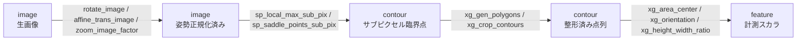
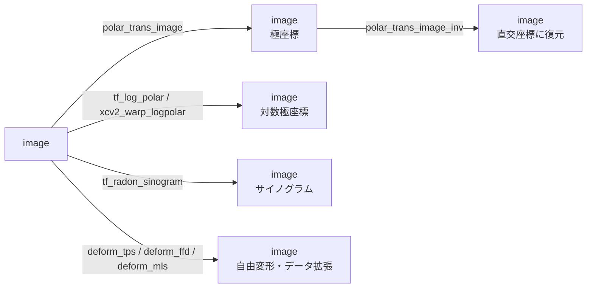

# 2-D 幾何変換 — 使い方ガイド

## この族は何をする道具箱か

`gallery2d_geometry` は「画素・点をどこへ動かすか(写像)」を担う族で、視覚パイプラインの
**前処理・姿勢正規化・データ拡張・計測** の土台になる。入力は 3 種類 —
濃淡画像 `image`(`[0,1]` の 2-D float64)、二値領域 `region`(同じ形の 0/1 マスク)、
XLD 輪郭 `contour`(`{"shape": (H,W), "cs": [Nx2 の (row,col) 点列]}`)— で、出力は
入力を写した `image`/`region`、抽出した点集合 `contour`、または計測スカラ `feature`。
中身は 5 カテゴリに分かれる: **geometry**(回転・拡大縮小・鏡映・アフィン/射影/極座標変換)、
**transform**(ラドン変換サイノグラム・Haar/Daubechies ウェーブレット)、
**subpix**(濃淡曲面の臨界点をサブピクセルで抽出)、
**xldgeom**(輪郭点集合の幾何量と整形)、**deformation**(制御点ベースの自由変形)。

呼び出しモデルは族全体で統一されている: **1 入力 + 2 スカラつまみ `a,b∈[0,1]`** で
`fullseye.apply(x, "op_name", a, b)`。慣習として `a` が変形の主強度(回転角・倍率・
変形振幅・検出しきい値)、`b` が副パラメータ(せん断量・空間周波数・角度オフセット等)を担う。
`a=0` を恒等写像に寄せた op(`deform_*`)もあり、変形量をゼロから連続的に上げられる。
つまみの具体的な割り当ては各 op で異なるので、下の「使い方」節と検証済みサンプルを見てほしい。

## 代表的なパイプライン(op の繋がり)

幾何正規化で姿勢を整え、サブピクセル臨界点を輪郭として取り出し、XLD 幾何量で計測する
「正規化 → 抽出 → 計測」の縦串(`image → image → contour → feature`):



座標系変換・自由変形の系統(すべて `image → image`。極座標は往復でき、変形は拡張に使う):



## 使い方(op グループ別)

### A. 剛体・相似・アフィン変換(`image → image`)
- **rotate_image** — 画像中心まわりに回転(角度 `= -45° + 90°·a`、反射境界)。 — `fullseye.apply(img, "rotate_image", 0.5, 0.5)`(`a=0.5` で 0°)
- **rotate_img** — `rotate_image` と同型の回転(コア registry 版、HALCON `rotate_image` 相当)。 — `fullseye.apply(img, "rotate_img", 0.7, 0.5)`
- **zoom_image_factor** — 中心固定で拡大縮小(倍率 `s = 0.7 + 0.6·a`)。 — `fullseye.apply(img, "zoom_image_factor", 0.8, 0.5)`
- **zoom_image_size** — サイズ指定ズームの型(挙動は中心スケーリング、HALCON `zoom_image_size` 相当)。 — `fullseye.apply(img, "zoom_image_size", 0.3, 0.5)`
- **rescale_img** — コア版の再スケール(`zoom_image_size` と同系、Wolberg の画像ワープ)。 — `fullseye.apply(img, "rescale_img", 0.6, 0.5)`
- **affine_trans_image** — 回転+せん断のアフィン写像(回転 `-20°+40°·a`、せん断 `(b-0.5)·0.4`)。 — `fullseye.apply(img, "affine_trans_image", 0.5, 0.7)`
- **affine_trans_image_size** — 出力サイズ指定型のアフィン(同じアフィン核)。 — `fullseye.apply(img, "affine_trans_image_size", 0.5, 0.5)`
- **affine_warp** — コア版のアフィンワープ(`affine_trans_image` と同核)。 — `fullseye.apply(img, "affine_warp", 0.5, 0.6)`
- **mirror_image** — 鏡映(`a<0.34`=行反転 / `a<0.67`=列反転 / それ以上=転置)。画素の多重集合を保存する置換。 — `fullseye.apply(img, "mirror_image", 0.2, 0.5)`
- **xpil_offset** — トーラス状(巻き戻し)平行移動(横シフト量 `≈ a·W`)。 — `fullseye.apply(img, "xpil_offset", 0.25, 0.5)`

### B. 射影・極座標・非線形ワープ(`image → image`)
- **projective_trans_image** — 透視(射影)変換。台形ゆがみを与える(強度 `a`、非対称度 `b`)。 — `fullseye.apply(img, "projective_trans_image", 0.5, 0.5)`
- **polar_trans_image** — 直交座標 → 極座標へリサンプル(中心 `(W/2,H/2)`、最大半径 `min(H,W)/2`)。 — `fullseye.apply(img, "polar_trans_image", 0.5, 0.5)`
- **polar_trans_image_inv** — 極座標 → 直交座標の逆変換(`polar_trans_image` の相棒)。 — `fullseye.apply(img, "polar_trans_image_inv", 0.5, 0.5)`
- **tf_log_polar** — 対数極座標へリサンプル。**中心まわりのスケール変化=行シフト、回転=列シフト**になる(`a`=最大半径、`b`=角度オフセット)。 — `fullseye.apply(img, "tf_log_polar", 0.5, 0.0)`
- **sk_swirl** — 中心まわりの角度ねじれ(strength `= 1 + 4·a`、半径 30)。 — `fullseye.apply(img, "sk_swirl", 0.5, 0.5)`
- 他: **projective_trans_image_size**(出力サイズ指定の射影)· **polar_trans_image_ext**(拡張極座標)· **xcv2_warp_logpolar**(OpenCV 実装の対数極座標ワープ)。

### C. 領域の幾何変換(`region → region`)
同じ幾何写像を二値マスクへ適用する。`fullseye.apply` はグレー配列を 0.5 で二値化してから渡す。
- **transpose_region** — 行列転置(対合: 2 回で元に戻る、1 回では入れ替わる)。 — `fullseye.apply(reg, "transpose_region", 0.5, 0.5)`
- **mirror_region** — 領域の鏡映。 — `fullseye.apply(reg, "mirror_region", 0.2, 0.5)`
- **zoom_region** — 領域の拡大縮小。 — `fullseye.apply(reg, "zoom_region", 0.7, 0.5)`
- 他: **affine_trans_region**(アフィン)· **projective_trans_region**(射影)· **polar_trans_region_inv**(逆極座標)。

### D. キャンバス整形(`image → image`)
- **it_add_image_border** — 反射境界を幅 `≈a` で追加(パディング)。 — `fullseye.apply(img, "it_add_image_border", 0.3, 0.5)`
- **it_crop_part** — 中央 `a` 割合を切り出して元サイズへ再サンプル(中央ズーム)。 — `fullseye.apply(img, "it_crop_part", 0.5, 0.5)`
- **it_crop_rectangle1** — `[a … 1-a]` の中央矩形を切り出す。 — `fullseye.apply(img, "it_crop_rectangle1", 0.2, 0.5)`
- **it_change_format** — 行列サイズを最大辺の正方形へ整形(正方形入力は素通し)。 — `fullseye.apply(img, "it_change_format", 0.5, 0.5)`

### E. 座標系変換 / ウェーブレット(`image → image`)
- **tf_radon_sinogram** — ラドン変換をサイノグラム画像として描く(各行=角度 `θ` のパラレルビーム投影、角度スパン `= 180°·(0.25+0.75·a)`)。回転対称物は行が一定、偏心点は正弦を描く。 — `fullseye.apply(img, "tf_radon_sinogram", 0.8, 0.5)`
- **xmh_haar** — Haar ウェーブレット変換(mahotas 実装、`[0,1]` へ再スケール)。 — `fullseye.apply(img, "xmh_haar", 0.5, 0.5)`
- **xmh_daubechies** — Daubechies ウェーブレット変換(`a` で D2/D4/D6/D8 を選択)。 — `fullseye.apply(img, "xmh_daubechies", 0.5, 0.5)`

### F. 制御点ベース自由変形(`image → image`)
`a`=変形振幅、`b`=空間周波数/格子解像度/局所性。いずれも `a=0` はサブピクセル補間誤差を除いて恒等。
- **deform_tps** — 薄板スプライン変形(5×5 制御格子、内側 3×3 を平滑な決定的場で変位、外枠は固定)。 — `fullseye.apply(img, "deform_tps", 0.8, 0.5)`
- **deform_ffd** — 3 次 B-spline 自由形状変形(FFD、各制御点が 4 スパンにコンパクト支持、振幅は単射条件に沿って上限)。 — `fullseye.apply(img, "deform_ffd", 0.8, 0.5)`
- **deform_mls** — Moving Least Squares(アフィン版)変形(画素ごとに重み付き最小二乗アフィンを解く)。 — `fullseye.apply(img, "deform_mls", 0.8, 0.5)`

### G. サブピクセル臨界点抽出(`image → contour`)
濃淡曲面の臨界点を、3×3 近傍への 2 次多項式フィット `grad z = 0` でサブピクセル精度に絞る。
出力は各点を 1 点のサブ輪郭にした XLD dict(`count_contours` で個数が取れる)。`a`=顕著度/しきい値、`b`=未使用。
- **sp_local_max_sub_pix** — 局所極大(8 近傍より厳密に大)。 — `fullseye.apply(img, "sp_local_max_sub_pix", 0.2, 0.0)`
- **sp_local_min_sub_pix** — 局所極小。 — `fullseye.apply(img, "sp_local_min_sub_pix", 0.2, 0.0)`
- **sp_saddle_points_sub_pix** — 鞍点(フィット Hessian が不定 `det H<0`、臨界オフセットがセル内)。 — `fullseye.apply(img, "sp_saddle_points_sub_pix", 0.2, 0.0)`
- 他: **sp_critical_points_sub_pix**(極大・極小・鞍点をまとめて)· **sp_plateaus**(等値の連結平坦領域の重心)· **sp_lowlands_center**(領域極小=盆地の中心)。

### H. XLD 輪郭の幾何量・整形(`contour → feature` / `contour → contour`)
点集合の共分散・中心モーメント(標準的な 2-D 定義)から不変量を測り、あるいは点列を整形する。
- **xg_area_center** — シューレース公式による多角形面積。 — `fullseye.apply(cont, "xg_area_center", 0.5, 0.5)`
- **xg_moments** — 正規化 2 次中心モーメントのトレース `μ20+μ02`(回転不変スカラ)。 — `fullseye.apply(cont, "xg_moments", 0.5, 0.5)`
- **xg_orientation** — 主軸方位を `[0,180)` 度に畳んで `/180` 正規化(対角線→0.25、水平→0.0)。 — `fullseye.apply(cont, "xg_orientation", 0.5, 0.5)`
- **xg_eccentricity** — 点共分散からの離心率 `sqrt(1 - λmin/λmax)`。 — `fullseye.apply(cont, "xg_eccentricity", 0.5, 0.5)`
- **xg_elliptic_axis** — 長軸/短軸比 `sqrt(λmax/λmin)`。 — `fullseye.apply(cont, "xg_elliptic_axis", 0.5, 0.5)`
- **xg_height_width_ratio** — 軸平行バウンディングボックスの縦横比。 — `fullseye.apply(cont, "xg_height_width_ratio", 0.5, 0.5)`
- **xg_regress_contours** — 全最小二乗(直交回帰)残差 RMS(=最小共分散固有値の平方根)。 — `fullseye.apply(cont, "xg_regress_contours", 0.5, 0.5)`
- **xg_gen_polygons** — Douglas–Peucker による折れ線簡略化(許容誤差 `eps = a·bbox 対角長`)。 — `fullseye.apply(cont, "xg_gen_polygons", 0.3, 0.5)`
- **xg_clip_contours** — 折れ線長が `a·最大長` 未満の輪郭を除去。 — `fullseye.apply(cont, "xg_clip_contours", 0.2, 0.5)`
- **xg_crop_contours** — 中央 `a` 割合の窓に入る点だけ残す。 — `fullseye.apply(cont, "xg_crop_contours", 0.5, 0.5)`

## 動く最小例(検証済み gallery2d_geometry から)

repo 直下で `py -3.11 <file>.py`(または `PYTHONPATH=. py -3.11 …`)として実行できる自己完結例。
`examples/gallery2d_geometry.py` の GT を土台に、族の 5 カテゴリを 1 本で叩いて既知効果を assert する。

```python
import numpy as np
import fullseye

# --- 合成 [0,1] 濃淡画像: 勾配 + 明るい円板 + 市松 + 微小ノイズ ---
n = 48
yy, xx = np.mgrid[0:n, 0:n].astype(float)
grad = xx / (n - 1)
disk = ((yy - n * 0.35) ** 2 + (xx - n * 0.4) ** 2) < (n * 0.18) ** 2
checker = ((xx.astype(int) // 6 + yy.astype(int) // 6) % 2) * 0.15
noise = 0.03 * np.random.default_rng(20260812).standard_normal((n, n))
img = np.clip(0.35 * grad + 0.45 * disk + checker + noise, 0.0, 1.0)

# (1) mirror_image (a<0.34 -> 行反転): 画素の置換なので値の多重集合は不変、かつ恒等ではない
mir = fullseye.apply(img, "mirror_image", 0.2, 0.5)
assert np.array_equal(np.sort(mir.ravel()), np.sort(img.ravel()))
assert not np.array_equal(mir, img)

# (2) transpose_region は対合(2 回適用で元へ戻る / 1 回では入れ替わる)
reg = (((yy - 24) ** 2 + (xx - 19) ** 2) < 10 ** 2).astype(float)   # 偏心した円板
t1 = fullseye.apply(reg, "transpose_region", 0.5, 0.5)
t2 = fullseye.apply(t1,  "transpose_region", 0.5, 0.5)
assert np.array_equal(t1, reg.T) and np.array_equal(t2, reg)

# (3) deform_tps: a=0 は恒等写像、a=0.8 では明確に変形する
o0 = fullseye.apply(img, "deform_tps", 0.0, 0.5)
o8 = fullseye.apply(img, "deform_tps", 0.8, 0.5)
assert np.abs(o0 - img).max() < 1e-6
assert np.abs(o8 - img).mean() > 1e-2

# (4) sp_local_max_sub_pix: 単峰ガウスの峰をサブピクセルで検出(出力は XLD dict)
bump = np.exp(-(((yy - 20) ** 2 + (xx - 28) ** 2) / (2 * 3.0 ** 2)))
peaks = fullseye.apply(bump, "sp_local_max_sub_pix", 0.2, 0.0)
pts = np.array([c[0] for c in peaks["cs"]])
assert len(pts) >= 1 and float(np.min(np.hypot(pts[:, 0] - 20, pts[:, 1] - 28))) < 1.0

# (5) xg_area_center: 一辺 20 の正方形輪郭のシューレース面積 = 400(出力は float)
square = {"shape": (50, 50),
          "cs": [np.array([[10., 10.], [10., 30.], [30., 30.], [30., 10.], [10., 10.]])]}
area = fullseye.apply(square, "xg_area_center", 0.5, 0.5)
assert abs(area - 400.0) < 1e-6

print("PASS")
```

族の *全 op* を契約(有限・型・決定性)+ 既知効果(GT + beat-the-null)で検証する完全版は
`examples/gallery2d_geometry.py`(`py -3.11 examples/gallery2d_geometry.py`)。

## 数式(必要な op のみ)

**回転・アフィン写像**(`rotate_image` / `affine_trans_image` / `affine_warp`)— 出力画素 `p` を
逆写像 `M^{-1}` で入力座標へ引き戻して補間する。回転角は `θ = -45° + 90°a`(アフィンは `-20°+40°a`):

$$M(\theta)=\begin{pmatrix}\cos\theta & -\sin\theta\\ \sin\theta & \cos\theta\end{pmatrix},\qquad
M_{\text{affine}}=\begin{pmatrix}\cos\theta & -\sin\theta+(b-0.5)\cdot0.4\\ \sin\theta & \cos\theta\end{pmatrix}$$

**シューレース面積**(`xg_area_center`)— 閉多角形 $\{(x_i,y_i)\}$ について
$A=\tfrac12\left|\sum_i \left(x_i y_{i+1}-x_{i+1}y_i\right)\right|$。

**主軸方位・中心モーメント**(`xg_orientation` / `xg_moments`)— 点集合の 2 次中心モーメント
$\mu_{20},\mu_{02},\mu_{11}$ から共分散行列を作り、その主固有ベクトルの角度が方位:
$\theta=\operatorname{atan2}(v_y,v_x)\bmod 180^\circ$。`xg_moments` はトレース $\mu_{20}+\mu_{02}$(回転不変)を返す。

**薄板スプライン**(`deform_tps`)— 放射基底関数 $U(r)=r^2\log r$ を用い、制御点で
$\sum_i w_i=0,\ \sum_i w_i \mathbf{p}_i=\mathbf 0$ の側条件つき線形系を解いて滑らかな変位場を作る。

**ラドン変換**(`tf_radon_sinogram`)— 角度 $\theta$・検出器位置 $s$ に対する線積分:
$R(\theta,s)=\iint f(x,y)\,\delta(x\cos\theta+y\sin\theta-s)\,dx\,dy$。サイノグラムは行が $\theta$、列が $s$。

**対数極座標**(`tf_log_polar`)— 中心からの半径 $r$ と角度 $\phi$ を
$\rho=\log r,\ \phi=\operatorname{atan2}(y,x)$ に写す。スケール変化は $\rho$(行)の平行移動、
回転は $\phi$(列)の平行移動になり、スケール・回転が加法的シフトに線形化される。

**サブピクセル臨界点**(`sp_*`)— 3×3 近傍に 2 次曲面
$z=a_0+a_1x+a_2y+a_3x^2+a_4y^2+a_5xy$ を最小二乗で当て、$\nabla z=0$ を解いて
オフセット $\Delta=-H^{-1}g$(勾配 $g$、Hessian $H$)を得る。$\det H<0$ は鞍点。

## サンプルデータ

デバッグ用の 2-D 画像源は [サンプルデータ カタログ](../../SAMPLES.md) を参照。
`import sample_images; sample_images.load("checker_noisy")` の合成市松や `"coins"`/`"camera"`
(skimage.data、BSD/public)は回転・極座標・サブピクセル臨界点の効果確認に向く。回転対称な
`"blobs"` は `tf_radon_sinogram` の行一定性、偏心した円板は正弦軌跡の確認に使える。

## 参考文献(正典)

台帳は [../../../REFERENCES.md](../../../REFERENCES.md)。この族のアルゴリズムの古典:

- Wolberg, G. (1990). *Digital Image Warping*. IEEE Computer Society Press. — 回転・ズーム・アフィン/射影の画像ワップとリサンプリング。
- Bookstein, F. L. (1989). "Principal Warps: Thin-Plate Splines and the Decomposition of Deformations". *IEEE TPAMI* 11(6). — `deform_tps`。
- Rueckert, D., et al. (1999). "Nonrigid Registration Using Free-Form Deformations". *IEEE TMI* 18(8). — `deform_ffd`。
- Schaefer, S., McPhail, T., & Warren, J. (2006). "Image Deformation Using Moving Least Squares". *ACM TOG (SIGGRAPH)* 25(3). — `deform_mls`。
- Radon, J. (1917). "Über die Bestimmung von Funktionen durch ihre Integralwerte längs gewisser Mannigfaltigkeiten". — ラドン変換 / `tf_radon_sinogram`。
- Reddy, B. S., & Chatterji, B. N. (1996). "An FFT-Based Technique for Translation, Rotation, and Scale-Invariant Image Registration". *IEEE TIP* 5(8). — 対数極座標(`tf_log_polar` / `xcv2_warp_logpolar`)。
- Daubechies, I. (1988). "Orthonormal Bases of Compactly Supported Wavelets". *Comm. Pure Appl. Math.* 41(7). — `xmh_daubechies`。
- Mallat, S. (1989). "A Theory for Multiresolution Signal Decomposition: The Wavelet Representation". *IEEE TPAMI* 11(7). — Haar/多重解像度(`xmh_haar`)。
- Hu, M.-K. (1962). "Visual Pattern Recognition by Moment Invariants". *IRE Trans. Information Theory* 8(2). — `xg_moments` / `xg_orientation`。
- Douglas, D., & Peucker, T. (1973). "Algorithms for the Reduction of the Number of Points Required to Represent a Digitized Line or its Caricature". *Cartographica* 10(2). — `xg_gen_polygons`。
- Steger, C. (1998). "An Unbiased Detector of Curvilinear Structures". *IEEE TPAMI* 20(2). — サブピクセル輪郭抽出(`sp_*`)の系譜。

---
© 2026 Kazufumi Furuse — Fullseye operator documentation. Licensed under Apache-2.0.
