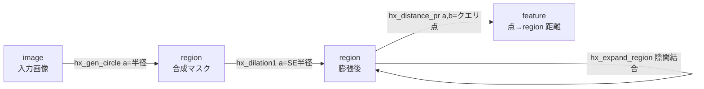
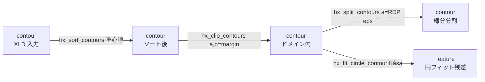

# HALCON 拡充 tier（hx_） — 使い方ガイド

## この族は何をする道具箱か

`hx_` 族は、Fullseye の既存 registry では未カバーだった **実在の HALCON operator**（`data/halcon_operators.json` に載るもの）を、外部 HALCON に依存せず自作 numpy で genuine に再実装した「拡充 tier」です。1 つのファイルに複数分野が同居する寄せ集めですが、全 op が Fullseye 共通の進化契約 `fn(v, a, b)` を守ります — 入力 `v`（1 枚の 2-D 画像 or 二値 region、あるいは XLD 輪郭 dict）と 2 つのスカラつまみ `a, b ∈ [0,1]` を受け取り、1 つの「種（sort）」を別の種へ写します。呼び出しは全 op 共通で `fullseye.apply(v, "<op名>", a, b)` です。

扱う入出力の「種」は 4 つ — **image**（`[0,1]` の 2-D float 配列）、**region**（`{0,1}` の 2-D マスク）、**contour**（XLD 輪郭 `{"shape": (H,W), "cs": [Nx2 の (row,col) 配列, ...]}`）、**feature**（有限スカラ）。この族は「幾何 region を作る（gen_*）」「region を形態変換する（erosion1/dilation1/…）」「グレー画像を照明面近似・陰影・周波数マスクで加工する（fit_surface/shade/gen_lowpass/…）」「画像を region へ切り出す（char_threshold/lowlands/…）」「XLD 輪郭を整形しフィットして 1 つのスカラ計測値を出す（sort/split/fit_circle/…）」「陰影から光源方向・アルベドを推定する（estimate_*）」といった、産業ビジョンの前処理〜計測〜復元の断片を横断的に供給します。

> 契約の根拠: 検証済みサンプル `examples/gallery2d_halcon_ext.py` が全 81 op を叩き、(1) 出力に NaN/Inf が無い (2) 宣言 `out_sort` と型が一致 (3) 同じ入力・ノブなら 2 回の呼び出しがビット一致（乱数 op も固定 seed）、を機械検証します。以下の説明はすべて実装 `backends_halcon_ext.py` を読んだ挙動に基づきます。

## 代表的なパイプライン（op の繋がり）

`hx_` 族は「種を写す」ので、ある op の出力の種が次の op の入力の種と一致すれば繋がります。産業計測で頻出する 2 本の鎖:



*region を「作って（gen）→ 形態で整えて（dilation/expand）→ 計測する（distance）」流れ。全ステージが region を受け渡し、最後に 1 スカラへ落ちます。*



*XLD 輪郭を「整列（sort）→ 定義域でクリップ（clip）→ 支配点で分割（split）」と整形し、別経路で形状フィット（fit_circle）に掛けて丸さの残差を得る流れ。整形系（→contour）と計測系（→feature）が同じ contour を共有します。*

## 使い方（op グループ別）

呼び出しは全て `fullseye.apply(v, "<name>", a, b)`。`v` の種は各グループの見出しに記載。`feature` 出力は Python `float`、`region`/`image` 出力は `float64` の 2-D 配列、`contour` 出力は `{"shape","cs"}` dict が返ります。

### A. 幾何 region の生成（image → region、`v` は画布サイズの参照にのみ使う）
- `hx_gen_circle` — 中心に半径 `a` の充実円 region を描く。 例: `fullseye.apply(img, "hx_gen_circle", 0.6, 0.0)`
- `hx_gen_ellipse` — 半軸 `a`（横）・`b`（縦）の楕円 region。 例: `fullseye.apply(img, "hx_gen_ellipse", 0.5, 0.3)`
- `hx_gen_rectangle2` — 角度 `b·π` 回転・幅高 `a` の矩形 region。 例: `fullseye.apply(img, "hx_gen_rectangle2", 0.5, 0.25)`
- `hx_gen_circle_sector` — 開始角 `b·2π`・掃引角 `a·2π` の扇形（円セクタ）region。
- 他（同型・`a`/`b` が幾何パラメータ）: `hx_gen_ellipse_sector`（楕円セクタ）, `hx_gen_checker_region`（市松、セル幅 `a`）, `hx_gen_grid_region`（格子線、間隔 `a`）, `hx_gen_disc_se`（円板構造要素、半径 `a`）, `hx_gen_empty_region`（全 0 の空 region）。

### B. 画像の定義域を region 化（image → region）
- `hx_full_domain` — 定義域を全面に広げた region（全 1）を返す。 例: `fullseye.apply(img, "hx_full_domain", 0.5, 0.5)`
- `hx_get_domain` — 画像の現在の定義域 region を取得（既定は全面 = 全 1）。
- `hx_rectangle1_domain` — 定義域を中央の `a`（縦）×`b`（横）割合の軸並行矩形に縮小した region。

### C. Region の形態・移動（region → region、`v` は 0.5 で二値化）
- `hx_erosion1` — 半径 `a` の円板 SE で侵食（前景を痩せさせ、面積を減らす）。 例: `fullseye.apply(reg, "hx_erosion1", 0.5, 0.0)`
- `hx_dilation1` — 同 SE で膨張（前景を太らせ、面積を増やす）。 例: `fullseye.apply(reg, "hx_dilation1", 0.5, 0.0)`
- `hx_opening` / `hx_closing` — 侵食→膨張 / 膨張→侵食で細突起除去 / 隙間充填（SE 半径 `a`）。
- `hx_expand_region` — region を膨張して近接領域間の隙間を埋め連結を促す（反復回数 `a`）。 例: `fullseye.apply(reg, "hx_expand_region", 0.4, 0.0)`
- 他: `hx_dilation2`（膨張後に参照点オフセット `b` で並進）, `hx_clip_region_rel`（外接矩形に対し各辺から `a` 割合を削る）, `hx_move_region`（`dy=a, dx=b` を中心 0 として平行移動）, `hx_split_skeleton_region`（1 画素幅骨格を分岐点で切り連結成分に分ける）。

### D. Region の点包含・距離（region → feature）
- `hx_test_region_point` — 正規化点 `(a=行, b=列)` が region 内なら 1、外なら 0。 例: `fullseye.apply(reg, "hx_test_region_point", 0.5, 0.5)`
- `hx_test_region_points` — 間隔 `a` の格子点のうち region に含まれる割合。
- `hx_distance_pr` — 正規化クエリ点 `(a,b)` から region までの最小距離（距離変換ベース、`max(H,W)` 正規化）。

### E. グレー画像の空間フィルタ・照明/形状加工（image → image）
- `hx_gabor` — 方位 `a·π`・周波数 `b` の Gabor フィルタ応答の大きさ（DC 除去済みで平坦部は 0）。 例: `fullseye.apply(img, "hx_gabor", 0.3, 0.5)`
- `hx_fit_surface1` / `hx_fit_surface2` — グレー値を 1 次 / 2 次多項式面で最小二乗近似（照明・背景の緩やかな傾きを推定）。 例: `fullseye.apply(img, "hx_fit_surface2", 0.5, 0.5)`
- `hx_plane_deviation` — 1 次平面近似からの偏差 `|v − plane|`（平坦度・欠陥検査）。
- `hx_shade_height_field` — 高さ場 `v` を方位 `a`・仰角 `b` の Lambertian 陰影で描画。
- 他: `hx_mean_shape`（半径 `a` の円板マスク平均平滑化）, `hx_nonmax_dir`（勾配方向に沿う非最大抑制でエッジを 1 画素へ細線化、弱エッジ抑制 `a`）, `hx_close_edges`（`a` で二値化 → 形態 closing で隙間閉じ、半径 `b`）, `hx_close_edges_length`（さらに長さ `b` 未満の短断片を除去）, `hx_fill_interlace`（奇数行を隣接偶数行平均で置換するデインターレース）, `hx_region_to_mean`（閾値 `a` で連結領域化し各領域を平均グレーで塗る）, `hx_region_to_label`（閾値 `a` の連結成分を正規化ラベル画像へ）, `hx_gen_image_proto`（値 `a` の定数グレー画像を生成）, `hx_disparity_to_xyz`（視差 `v` から深度 `Z=f·baseline/disp` を計算、焦点 `a`・基線 `b`）。

### F. 周波数マスク画像の生成（image → image、`v` は形状の参照にのみ使う）
- `hx_gen_lowpass` — 遮断半径 `a` の理想ローパス円板マスク（中心 = DC を通す）。 例: `fullseye.apply(img, "hx_gen_lowpass", 0.5, 0.0)`
- `hx_gen_highpass` — 同遮断半径 `a` のハイパス（DC を殺す）。
- `hx_gen_bandpass` — 内半径 `a`・帯域幅 `b` の円環バンドパス。
- 他: `hx_gen_bandfilter`（中心半径 `a`・幅 `b` の円環バンドフィルタ、bandpass と別 operator）, `hx_gen_derivative_filter`（周波数半径に比例する微分フィルタ）。

### G. 画像 → region のセグメンテーション（image → region）
- `hx_char_threshold` — 暗い文字を明背景から抽出。閾値 `thr = mean − k·std`（`k = 0.2+1.8a`）で下側を選ぶ。 例: `fullseye.apply(img, "hx_char_threshold", 0.5, 0.0)`
- `hx_histo_to_thresh` — ヒストグラムの 2 主ピーク間の谷を閾値に二値化（Otsu の分散基準ではなく谷検出）。
- `hx_lowlands` — グレー値の窪地（近傍最小に一致し全体平均未満の平坦域）を region に。
- 他: `hx_plateaus_center`（勾配≈0 の平坦連結成分の重心をマーカー region に）, `hx_detect_edge_segments`（NMS 細線化 → PCA で細長い＝直線状の成分のみ残す、細長さ閾値 `b`）。

### H. テクスチャ特徴（image → feature）
- `hx_cooc_feature` — 8 階調に量子化した距離 `d=1+3a` の共起行列（GLCM）から Haralick contrast を返す（`b<0.5` で水平, ≥0.5 で垂直）。 例: `fullseye.apply(img, "hx_cooc_feature", 0.3, 0.0)`

### I. 陰影からの光源推定・1D 計測（image → feature）
- `hx_estimate_tilt_lr` — Lee–Rosenfeld 法。平均勾配方向 `atan2(⟨Ey⟩,⟨Ex⟩)` から光源方位角 tilt を推定（`[0,1]` 正規化）。 例: `fullseye.apply(img, "hx_estimate_tilt_lr", 0.5, 0.5)`
- `hx_estimate_tilt_zc` — Zheng–Chellappa 法。正規化勾配の平均方向で tilt を推定（局所コントラスト非依存）。
- `hx_estimate_sl_al_lr` / `hx_estimate_sl_al_zc` — 光源の slant（天頂角、0=正面〜π/2=真横）を Lambertian の `⟨I⟩=albedo·cos(slant)` から / 勾配エネルギー補正付きで推定。
- `hx_estimate_al_am` — アルベド（反射率）の代理として輝度ダイナミックレンジ `max−min` を返す。
- `hx_fuzzy_measure_pairs` — 中央水平プロファイルでレベル `a` を横切るエッジ対（立上り→立下り境界）を数える 1D 計測（`/10` 正規化）。

### J. XLD 輪郭の整形（contour → contour、`v` は `{"shape","cs"}` dict）
- `hx_sort_contours` — 各輪郭を重心の `(row, col)` 順にソート。 例: `fullseye.apply(cnt, "hx_sort_contours", 0.5, 0.5)`
- `hx_clip_contours` — 中央 margin `a`（縦）/`b`（横）を残す矩形へクリップ（範囲外点を除去）。
- `hx_split_contours` — 各輪郭を Ramer–Douglas–Peucker の支配点（許容 `eps=0.5+5a`）で線分に分割。 例: `fullseye.apply(cnt, "hx_split_contours", 0.4, 0.0)`
- `hx_gen_parallel_contour` — 各輪郭の法線オフセット平行輪郭を生成（符号つき距離 `(a−0.5)·10`）。
- 他: `hx_clip_end_points`（両端を `k=1+5a` 点ずつ切る）, `hx_crop_contours`（中央 `a`×`b` 割合矩形で crop）, `hx_union_adjacent`（端点間距離 `a` 未満の輪郭を貪欲連結）, `hx_select_xld_point`（正規化点 `(a,b)` を外接矩形に含む輪郭のみ選ぶ）, `hx_polar_trans_inv`（点を `(radius, angle)` とみなし直交座標へ逆変換）, `hx_add_noise_contour`（点に白色ガウス雑音 std `a` を付加、固定 seed）, `hx_radial_distort_contour`（放射歪み `r'=r(1+k·r²)`、`k=(a−0.5)·1.5` で樽/糸巻き）。

### K. XLD 輪郭の計測・形状フィット（contour → feature）
- `hx_fit_circle_contour` — Kåsa 代数法で点群に円を当て、フィット残差 RMS を返す（小＝円に近い）。 例: `fullseye.apply(cnt, "hx_fit_circle_contour", 0.5, 0.5)`
- `hx_fit_ellipse_contour` — 2 次モーメントから楕円を当て軸比（短/長、真円=1）を返す。
- `hx_fit_rectangle2_contour` — 角度掃引で最小面積外接矩形を当て、そのアスペクト比（短辺/長辺）を返す。
- `hx_regress_contours` — 各輪郭に回帰直線を当て平均残差を返す（小＝直線的）。
- 他（すべて正規化スカラ）: `hx_smallest_circle_xld`（点群の最小包含円半径）, `hx_smallest_rect1_xld`（外接軸並行矩形の面積比）, `hx_smallest_rect2_xld`（最小面積外接矩形の面積比）, `hx_test_closed_xld`（端点近接で閉曲線と判定した割合）, `hx_moments_any_xld`（2 次中心モーメントの広がり）, `hx_dist_ellipse_contour`（当てはめ楕円境界からの平均距離）, `hx_dist_ellipse_points`（同・最大距離）, `hx_dist_rect2_points`（矩形中心からの平均正規化距離）, `hx_test_self_intersect`（自己交差する輪郭の割合）, `hx_distance_pc`（正規化点 `(a,b)` から輪郭までの最小距離）, `hx_distance_sc`（行 `a·H` の水平線から輪郭までの最小距離）。

## 動く最小例（検証済み gallery2d_halcon_ext から）

repo 直下で `py -3.11 <file>.py` として実行可。`examples/gallery2d_halcon_ext.py` の GT チェックを `fullseye.apply` 経由に落とした自己完結版で、3 種（生成・形態・輪郭フィット）を横断します。

```python
# repo 直下で: py -3.11 this_file.py  → 最後に PASS を印字
import numpy as np
import fullseye


def image_normal(n=48):
    """勾配 + 円板 + 市松 + 微小ノイズ（gallery の 'normal' 入力と同構成）。"""
    yy, xx = np.mgrid[0:n, 0:n].astype(np.float64)
    grad = xx / (n - 1)
    disk = ((yy - n * 0.35) ** 2 + (xx - n * 0.4) ** 2) < (n * 0.18) ** 2
    checker = ((xx.astype(int) // 6 + yy.astype(int) // 6) % 2) * 0.15
    rng = np.random.default_rng(20260812)
    return np.clip(0.35 * grad + 0.45 * disk + checker + 0.03 * rng.standard_normal((n, n)), 0, 1)


def region_disk(n=48):
    yy, xx = np.mgrid[0:n, 0:n]
    return (((yy - n // 2) ** 2 + (xx - n // 2) ** 2) < (n * 0.25) ** 2).astype(np.float64)


img = image_normal()
reg = region_disk()
n = img.shape[0]

# 1) hx_gen_circle は二値 region を作り、半径ノブ a が面積を単調に増やす（beat-the-null）。
small = fullseye.apply(img, "hx_gen_circle", 0.0, 0.0)   # image -> region (ndarray)
big = fullseye.apply(img, "hx_gen_circle", 1.0, 0.0)
assert set(np.unique(big)) <= {0.0, 1.0}, "生成 region が二値でない"
assert big[n // 2, n // 2] == 1.0 and big[0, 0] == 0.0, "中心内/隅外が不成立"
assert big.sum() > small.sum() * 3, "半径ノブが面積を増やさない"

# 2) region 形態の単調性: 侵食 < 原面積 < 膨張。
ar_orig = float(reg.sum())
ar_er = float(fullseye.apply(reg, "hx_erosion1", 0.5, 0.0).sum())   # region -> region
ar_di = float(fullseye.apply(reg, "hx_dilation1", 0.5, 0.0).sum())
assert ar_er < ar_orig < ar_di, f"morphology 単調性が破れた {ar_er}<{ar_orig}<{ar_di}"

# 3) hx_fit_circle_contour: 円周点への残差≈0、四角の点には大きい残差（beat-the-null）。
t = np.linspace(0.0, 2 * np.pi, 60, endpoint=False)
circ = {"shape": (n, n), "cs": [np.column_stack([24 + 15 * np.sin(t), 24 + 15 * np.cos(t)])]}
lo, hi = n * 0.2, n * 0.8
ts = np.linspace(0.0, 1.0, 12, endpoint=False)
top = np.column_stack([np.full_like(ts, lo), lo + (hi - lo) * ts])
right = np.column_stack([lo + (hi - lo) * ts, np.full_like(ts, hi)])
bot = np.column_stack([np.full_like(ts, hi), hi - (hi - lo) * ts])
left = np.column_stack([hi - (hi - lo) * ts, np.full_like(ts, lo)])
square = {"shape": (n, n), "cs": [np.vstack([top, right, bot, left, top[:1]])]}
res_circ = fullseye.apply(circ, "hx_fit_circle_contour", 0.5, 0.5)     # contour -> feature (float)
res_sq = fullseye.apply(square, "hx_fit_circle_contour", 0.5, 0.5)
assert res_circ < 1e-3, f"円周点への円フィット残差が大きすぎ {res_circ}"
assert res_sq > res_circ * 20 + 1e-3, f"円モデルが四角にも当たっている {res_circ} vs {res_sq}"

print("PASS")
```

## 数式（必要な op のみ）

**Kåsa 代数円フィット**（`hx_fit_circle_contour`）— 点 $(x_i,y_i)$ に対し $x^2+y^2 = 2c_x x + 2c_y y + (r^2 - c_x^2 - c_y^2)$ を線形最小二乗で解き、中心 $(c_x,c_y)$・半径 $r=\sqrt{c_z + c_x^2 + c_y^2}$ を得て、残差を返す:

$$
\mathrm{RMS} = \sqrt{\frac{1}{N}\sum_{i=1}^{N}\bigl(\sqrt{(x_i-c_x)^2+(y_i-c_y)^2}\; - \; r\bigr)^2}
$$

**Gabor カーネル**（`hx_gabor`）— 方位 $\theta=a\pi$、周波数 $f=0.08+0.35b$、包絡 $\sigma=2.2$。回転座標 $x_\theta = x\cos\theta + y\sin\theta$ に対し DC 除去した実 Gabor（応答の大きさを正規化して返す）:

$$
g(x,y) = \exp\!\Bigl(-\tfrac{x_\theta^2 + y_\theta^2}{2\sigma^2}\Bigr)\,\cos\!\bigl(2\pi f\, x_\theta\bigr)
$$

**Lambertian 光源方位**（`hx_estimate_tilt_lr`）— 画像勾配 $E_x,E_y$ の平均から光源 tilt を推定（$[0,1]$ 正規化）:

$$
\mathrm{tilt} = \operatorname{atan2}\bigl(\langle E_y\rangle,\ \langle E_x\rangle\bigr)
$$

**視差→深度**（`hx_disparity_to_xyz`）— 焦点距離 $f$・基線 $B$ の平行ステレオで、視差 $d$（画素）から深度 $Z$:

$$
Z = \frac{f\,B}{d}
$$

## サンプルデータ

デバッグ用の 2-D 画像源は `../../SAMPLES.md`（Fullseye サンプルカタログ）を参照。外部 DL 不要で使える合成画像 `gradient`/`blobs`/`shapes`/`checker_noisy`（Fullseye 自作）と、`skimage.data` 由来の `coins`/`camera`/`page`/`cell`（BSD / public domain）が `import sample_images; sample_images.load("<name>")` で取得できます。この族なら文字抽出（`hx_char_threshold`）に `page`、形態・生成 region の重畳確認に `blobs`/`shapes` が向きます。

## 参考文献（正典）

台帳は `../../../REFERENCES.md`。この族のアルゴリズムに対応する古典:

- Haralick, R.M., Shanmugam, K. & Dinstein, I. (1973). "Textural Features for Image Classification." IEEE Trans. Systems, Man, and Cybernetics. — `hx_cooc_feature`（GLCM contrast）
- Kåsa, I. (1976). "A circle fitting procedure and its error analysis." IEEE Trans. Instrumentation and Measurement. — `hx_fit_circle_contour`（代数円フィット）
- Douglas, D.H. & Peucker, T.K. (1973). "Algorithms for the reduction of the number of points required to represent a digitized line or its caricature." The Canadian Cartographer. — `hx_split_contours`（RDP 分割）
- Serra, J. (1982). "Image Analysis and Mathematical Morphology." Academic Press (Matheron 1975). — `hx_erosion1`/`hx_dilation1`/`hx_opening`/`hx_closing`
- Daugman, J.G. (1985). "Uncertainty relation for resolution in space, spatial frequency, and orientation optimized by two-dimensional visual cortical filters." JOSA A. — `hx_gabor`
- Canny, J. (1986). "A computational approach to edge detection." IEEE TPAMI. — `hx_nonmax_dir`/`hx_close_edges`/`hx_detect_edge_segments`
- Hu, M.-K. (1962). "Visual pattern recognition by moment invariants." IRE Trans. Information Theory. — `hx_fit_ellipse_contour`/`hx_moments_any_xld`（2 次モーメント）
- Horn, B.K.P. (1975). "Obtaining shape from shading information." In The Psychology of Computer Vision (P.H. Winston, ed.). — shape-from-shading の土台（`hx_estimate_*`）
- Lee, C.H. & Rosenfeld, A. (1985). "Improved methods of estimating shape from shading using the light source coordinate system." Artificial Intelligence. — `hx_estimate_tilt_lr`/`hx_estimate_sl_al_lr`
- Zheng, Q. & Chellappa, R. (1991). "Estimation of illuminant direction, albedo, and shape from shading." IEEE TPAMI. — `hx_estimate_tilt_zc`/`hx_estimate_sl_al_zc`
- Brown, D.C. (1971). "Close-range camera calibration." Photogrammetric Engineering. — `hx_radial_distort_contour`（Brown–Conrady 放射歪み）
- Rosenfeld, A. & Pfaltz, J.L. (1966). "Sequential operations in digital picture processing." JACM. — `hx_distance_pr`（距離変換）

---
© 2026 Kazufumi Furuse — Fullseye operator documentation. Licensed under Apache-2.0.
