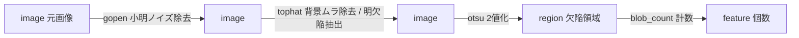
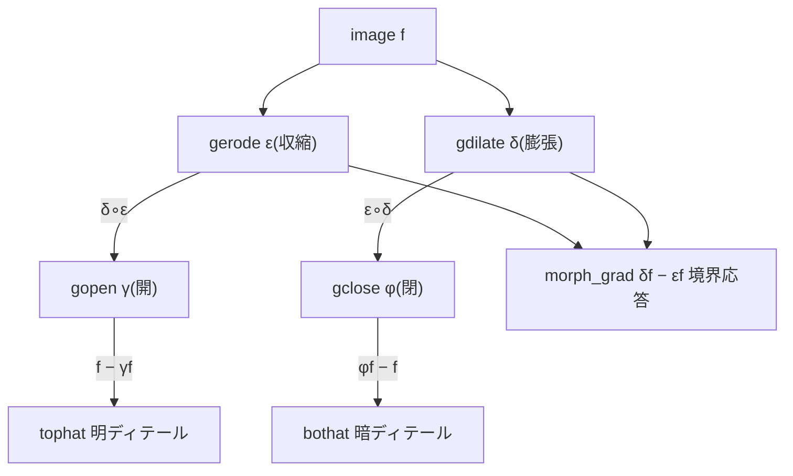

# モルフォロジー(形態学) — 使い方ガイド

## この族は何をする道具箱か

モルフォロジー(数理形態学)は、画像の明るい塊・暗い塊の「形」を **構造要素(SE, structuring element = 近傍窓)** で削る・盛る演算の一族です。土台は二つだけ — **erosion(収縮 = SE 内の局所 min)** と **dilation(膨張 = SE 内の局所 max)**。この二つを合成すると **opening(SE より小さい明点を消す)** と **closing(SE より小さい暗穴を埋める)** になり、元画像との差分をとると **top-hat(SE より小さい明ディテール抽出)/ black-hat(暗ディテール抽出)/ morphological gradient(境界 = エッジ応答)** になります。

入力はすべて `image`(グレースケール [0,1] 配列)、出力もすべて `image`。つまり「画像を入れると画像が返る」前処理・特徴抽出の一族で、**特定サイズの構造だけ残す/消す** のが仕事です。典型用途は照明ムラ補正、粒径解析、欠陥検出、文字・血管など細い構造の強調。SE のサイズはつまみ `a` で決まり(基本 op は 3→5→7→9 px の正方 SE)、どのつまみでも必ず効果が出る(恒等ではない)よう最小 3 px から始まります。この族には基本 4 演算に加え、SE 形状(正方/円盤)を変えた変種、OpenCV/skimage/scipy 由来の実装、そして SE ではなく **面積・直径・再構成** で成分を選ぶ属性フィルタ(粒径解析の本命)、骨格・穴埋めまで含みます。

## 代表的なパイプライン(op の繋がり)

明るい欠陥を背景ムラごと拾って数える定番の流れ。モルフォロジーが前処理を担い、下流の segmentation・features 族へデータ種が `image → region → feature` と繋がります。



この族の内部代数(すべてコード上の定義そのもの)。erosion / dilation という二演算から opening / closing / top-hat / black-hat / gradient が導かれます。



## 使い方(op グループ別)

呼び出しは 1 画像 + 2 スカラつまみ `a,b∈[0,1]`: `fullseye.apply(img, "<name>", a, b)`。基本 op では `a` が SE サイズ(`(3,5,7,9)[min(3,int(a*4))]` px の正方 SE)、`b` は基本 4 演算では未使用。**HALCON 別名**は括弧で併記。

### 基本4演算(erosion / dilation / opening / closing)

同じ挙動を「scipy 系(正方 SE)/ HALCON 名 / OpenCV(楕円 SE)」の 3 実装で提供します。順序律 `erosion ≤ opening ≤ 入力 ≤ closing ≤ dilation` が全画素で成立(examples で数値検証済み)。

- **gerode** / **gray_erosion**(HALCON `gray_erosion`)/ **cv_erode** — 収縮。SE 内の最小値を返す(明部を削り暗部を広げる。出力 ≤ 入力)。`fullseye.apply(img, "gerode", a, b)`。cv_erode は SE が楕円(`3+2·int(3a)` px)。
- **gdilate** / **gray_dilation**(HALCON `gray_dilation`)/ **cv_dilate** — 膨張。SE 内の最大値(明部を広げ暗部を削る。出力 ≥ 入力)。`fullseye.apply(img, "gdilate", a, b)`。
- **gopen** / **gray_opening**(HALCON `gray_opening`)/ **cv_open** — 開演算(収縮→膨張)。SE より小さい **明** の突起・スパイクを除去し、面は残す。`fullseye.apply(img, "gopen", a, b)`。
- **gclose** / **gray_closing**(HALCON `gray_closing`)/ **cv_close** — 閉演算(膨張→収縮)。SE より小さい **暗** の穴・隙間を埋める。`fullseye.apply(img, "gclose", a, b)`。

### SE 形状バリアント(円盤 disk / 矩形 rect)

基本 4 演算と同じ演算を、SE の形を明示的に選んで実行します。円盤 SE は半径 `1+int(3a)`(1〜4 px, skimage.disk)、矩形 SE は `(3,5,7,9)` px の正方。円盤は方向依存の少ない等方な削り/盛りに向きます。

- **gray_erosion_shape** / **gray_dilation_shape**(HALCON `gray_erosion_shape` / `gray_dilation_shape`)— 円盤 SE の収縮 / 膨張。`fullseye.apply(img, "gray_erosion_shape", a, b)`。
- **gray_opening_shape** / **gray_closing_shape**(HALCON `gray_opening_shape` / `gray_closing_shape`)— 円盤 SE の開 / 閉。
- **gray_opening_rect** / **gray_closing_rect**(HALCON `gray_opening_rect` / `gray_closing_rect`)— 矩形(正方)SE の開 / 閉。

### 差分演算(ディテール抽出・境界応答)

元画像と opening/closing の差、あるいは dilation と erosion の差。いずれも出力は絶対値の最大で正規化され [0,1] に収まります。

- **tophat** / **gray_tophat**(HALCON `gray_tophat`)/ **cv_tophat** — white top-hat = 入力 − opening。SE より小さい **明** ディテールと背景ムラを抽出(照明ムラ補正の定番)。`fullseye.apply(img, "tophat", a, b)`。
- **bothat** / **gray_bothat**(HALCON `gray_bothat`)/ **cv_blackhat** — black top-hat = closing − 入力。SE より小さい **暗** ディテールを抽出。`fullseye.apply(img, "bothat", a, b)`。
- **morph_grad**(HALCON `gray_range_rect`)/ **cv_gradient** — 形態学的勾配 = dilation − erosion。境界(エッジ)で強く応答し平坦部はゼロ。`fullseye.apply(img, "morph_grad", a, b)`。

### 属性フィルタ(面積・直径による成分選択)

SE ではなく **接続成分の属性(面積/直径)** で残す・消すを決めます。SE 演算が形を丸めるのに対し、こちらは **残す成分の形を保ったまま** 小さいものだけ消せる(粒径解析・小欠陥除去の本命)。しきい値はつまみ `a` に連動。

- **sk_area_opening** — 面積オープニング。面積が `int(16+100a)` px 未満の **明** 成分を除去(大きい明領域は無傷)。`fullseye.apply(img, "sk_area_opening", a, b)`。
- **xsk2_diameter_opening** — 直径オープニング。外接直径が `4+int(30a)` px 未満の **明** 成分を除去。`fullseye.apply(img, "xsk2_diameter_opening", a, b)`。
- **xsk3_area_closing** — 面積クロージング。面積が `int(16+100a)` px 未満の **暗** 成分(穴)を埋める。
- **xsk3_diameter_closing** — 直径クロージング。直径が `4+int(30a)` px 未満の **暗** 成分を埋める。

### 再構成・骨格・穴埋め

- **xsk2_reconstruction** — 膨張による形態学的再構成。入力を高さ `0.05+0.25a` 下げたマーカーから、元画像を上限として再構成(小さな明ピークを均しつつ、生き残る構造の形と縁は SE 開のように丸めない)。`fullseye.apply(img, "xsk2_reconstruction", a, b)`。
- **f2_gray_skeleton**(HALCON `gray_skeleton`)— しきい値 `0.15+0.60a` で明領域を2値化 → 1 px 幅に細線化(Zhang–Suen)→ 元のグレー値を載せ直した中軸。`b` は未使用。`fullseye.apply(img, "f2_gray_skeleton", a, b)`。
- **f2_gray_inside**(HALCON `gray_inside`)— グレースケール穴埋め。各画素で「境界へ至る任意経路上の最小グレー値」= 縁アンカーのマーカーからの erosion 再構成。明るい壁に囲まれた暗い窪みを壁の高さへ持ち上げる。`a` が最大埋め深さ、`b` は未使用。

## 動く最小例(検証済み gallery2d_morphology から)

repo 直下で `py -3.11` で実行可。基本 4 演算の順序律、top-hat の明点抽出、面積オープニングの「形保存」を数値で確認して `PASS` を出します。

```python
import numpy as np
import fullseye

# GT 画像: 平坦 + 縦エッジ + SE より小さい明点/暗点(決定的・ノイズ無し)
g = np.full((48, 48), 0.3)
g[:, 24:] = 0.7            # 列24に縦エッジ(0.3 -> 0.7)
g[8:11, 8:11] = 0.95      # 左平坦域の小さな明点(3x3 < SE7)
g[38:41, 38:41] = 0.05    # 右平坦域の小さな暗点(3x3)
EPS = 1e-9

# --- 基本4演算(同一 SE=3x3: a=0.0 -> _k=3)---
er = np.asarray(fullseye.apply(g, "gerode",  0.0, 0.0))
di = np.asarray(fullseye.apply(g, "gdilate", 0.0, 0.0))
op = np.asarray(fullseye.apply(g, "gopen",   0.0, 0.0))
cl = np.asarray(fullseye.apply(g, "gclose",  0.0, 0.0))

# 1) erosion は anti-extensive(<=入力)/ dilation は extensive(>=入力)
assert (er <= g + EPS).all() and er.mean() < g.mean() - 1e-4
assert (di >= g - EPS).all() and di.mean() > g.mean() + 1e-4

# 2) 順序律: erosion <= opening <= 入力 <= closing <= dilation(全画素)
assert (er <= op + EPS).all() and (op <= g + EPS).all()
assert (g <= cl + EPS).all() and (cl <= di + EPS).all()

# 3) white top-hat(SE 7x7 > 3x3 明点)は SE より小さい明点を強く拾う
th = np.asarray(fullseye.apply(g, "tophat", 0.5, 0.0))
assert th[8:11, 8:11].mean() > th[18:30, 30:40].mean() + 0.1

# 4) 面積オープニング: SE と違い「形」を保ったまま小面積の明成分だけ消す
ao = np.asarray(fullseye.apply(g, "sk_area_opening", 0.9, 0.0))
assert ao[8:11, 8:11].mean() < g[8:11, 8:11].mean() - 0.1   # 明点(面積9)は除去
assert abs(ao[:, 24:].mean() - g[:, 24:].mean()) < 0.05      # 大面積の明領域は保持

print("PASS")
```

## 数式(必要な op のみ)

構造要素 $B$ とグレースケール画像 $f$ に対し、この族の中核は次の通り(コード上は erosion/dilation が SE 内の min/max、他はその合成・差分)。

$$
(\varepsilon_B f)(x) = \min_{s\in B} f(x+s), \qquad
(\delta_B f)(x) = \max_{s\in B} f(x+s)
$$

$$
\gamma_B f = \delta_B(\varepsilon_B f)\ \text{(opening)}, \qquad
\phi_B f = \varepsilon_B(\delta_B f)\ \text{(closing)}
$$

$$
\mathrm{WTH}(f) = f - \gamma_B f, \qquad
\mathrm{BTH}(f) = \phi_B f - f, \qquad
g_B f = \delta_B f - \varepsilon_B f
$$

これらから、同一 SE のもとで常に成り立つ **順序律**(examples の GT でも検証):

$$
\varepsilon_B f \ \le\ \gamma_B f \ \le\ f \ \le\ \phi_B f \ \le\ \delta_B f
$$

なお `tophat`/`bothat`/`morph_grad` の出力は実装上 $\max|\cdot|$ で割って [0,1] に正規化されます。

## サンプルデータ

デバッグには合成画像が扱いやすい: `blobs`(大小の塊 → opening/面積フィルタで粒径選別)、`shapes`(境界が明快 → morph_grad で確認)。文字・線構造なら `page`(skimage.data、細線 → f2_gray_skeleton / bothat 向き)。取得は `import sample_images; sample_images.load("blobs")`。一覧・ライセンスは [`../../SAMPLES.md`](../../SAMPLES.md)。

## 参考文献(正典)

台帳は [`../../../REFERENCES.md`](../../../REFERENCES.md)。この族のアルゴリズムの古典:

- Matheron, G. (1975), *Random Sets and Integral Geometry*.
- Serra, J. (1982), *Image Analysis and Mathematical Morphology*.
- Sternberg, S. R. (1986), "Grayscale Morphology", *Computer Vision, Graphics, and Image Processing*.
- Soille, P. (2004), *Morphological Image Analysis: Principles and Applications* (2nd ed.), Springer.
- Vincent, L. (1993), "Morphological Grayscale Reconstruction in Image Analysis: Applications and Efficient Algorithms", *IEEE Transactions on Image Processing* — 再構成・面積オープニング。
- Breen, E. J. & Jones, R. (1996), "Attribute Openings, Thinnings, and Granulometries", *Computer Vision and Image Understanding* — 面積/直径による属性フィルタ。
- Zhang, T. Y. & Suen, C. Y. (1984), "A Fast Parallel Algorithm for Thinning Digital Patterns", *Communications of the ACM* — 骨格(細線化)。

---
© 2026 Kazufumi Furuse — Fullseye operator documentation. Licensed under Apache-2.0.
