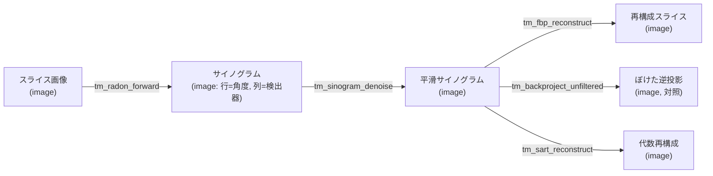
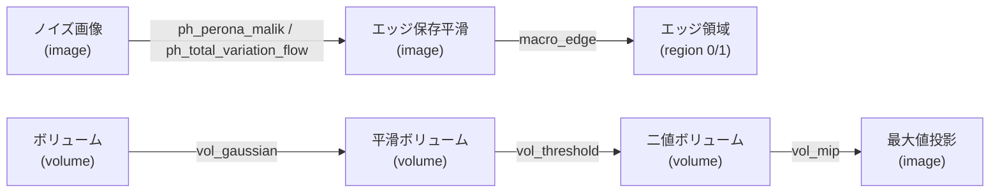

# 物理PDE・人工生命・トモグラフィ・3D — 使い方ガイド

## この族は何をする道具箱か

この族は、画像を「絵」ではなく **力学系・物理場・投影データ** として扱う op を集めた道具箱です。入力の 2-D 画像を **PDE(偏微分方程式)の初期条件**とみなして数ステップ積分する物理フロー(`ph_*`: 熱拡散・Perona-Malik・平均曲率流・TV 流)、**パターン形成モデルの初期状態**とみなす生成 op(`alife_*`: 反応拡散・セルオートマトン・励起媒質・Lenia・砂山)、そして **CT のサイノグラム(生投影)** とみなして再構成する断層撮影 op(`tm_*`: Radon 前方投影 / フィルタ補正逆投影 / 代数再構成)が中心です。加えて、`scipy.ndimage` が N 次元であることを活かした **3-D ボリューム** op(`vol_*`: CT/MRI/深度スタックの平滑・モルフォロジ・しきい値・投影)、進化探索が発見したチャンピオン pipeline を 1 op に凍結した **マクロ op**(`macro_*`)、中央走査線の暗バーを数える **バーコード**(`decode_barcode`)が入っています。

用途をひとことで言うと「ノイズ除去・エッジ保存平滑(physics/macro)」「テクスチャ・模様の生成(alife)」「疎ビュー/限定角 CT の再構成(tomography)」「3-D スタックの前処理と投影(3d)」です。入出力の型は op ごとに異なり、image→image が大半ですが、断層の前方投影は image(スライス)→image(サイノグラム)、ボリューム投影は volume→image、`macro_edge` は image→region、`decode_barcode` は image→feature(スカラ)になります。挙動はすべて決定的(同一入力→ビット一致)で、`examples/gallery2d_physics_alife_3d.py` が全 op を叩いて契約(有限・型・[0,1]・決定性)と既知挙動 GT を検証済みです。

## 代表的なパイプライン(op の繋がり)

断層撮影は「スライス→サイノグラム→スライス」のデータ変換が明確な連鎖です。



PDE 平滑と 3-D 前処理は「場を整えてから測る/投影する」連鎖になります。



## 使い方(op グループ別)

2-D image op は「1 画像 + 2 つのつまみ a,b∈[0,1]」で呼びます: `fullseye.apply(img, "name", a, b)`。volume op は 3-D 配列を同じ形で渡します: `fullseye.apply(vol, "name", a, b)`。

### 物理 PDE フロー(`ph_*`, image→image)

- `ph_heat_flow` — 線形熱方程式(等方拡散)を数ステップ陽解法で積分。ガウス平滑と等価で分散を下げる。a=拡散時間(ステップ数)、b は未使用。HALCON 別名: `isotropic_diffusion`。呼び出し例: `fullseye.apply(img, "ph_heat_flow", 0.6, 0.0)`
- `ph_perona_malik` — Perona-Malik 異方性拡散。伝導度 g=1/(1+(|∇|/k)²) で平坦部は拡散、強エッジは保存。a=ステップ数、b=エッジ閾値 k。HALCON 別名: `anisotropic_diffusion`。呼び出し例: `fullseye.apply(img, "ph_perona_malik", 0.5, 0.5)`
- `ph_total_variation_flow` — Rudin-Osher-Fatemi TV 勾配降下。エッジを保ちつつノイズを平坦化(忠実度項で入力に係留)。a=ステップ数、b=忠実度重み λ。呼び出し例: `fullseye.apply(img, "ph_total_variation_flow", 0.5, 0.3)`
- 他: `ph_coherence_enhancing_diffusion`(Weickert 構造テンソル拡散、線に沿って平滑・HALCON `coherence_enhancing_diff`)、`ph_mean_curvature_motion`(平均曲率流、レベル曲線を曲率で内向きに動かす・HALCON `mean_curvature_flow`)、`ph_reaction_diffusion`(Gray-Scott 反応拡散、a→feed / b→kill)。

### 人工生命 / 生成場(`alife_*`, image→image)

- `alife_life_step` — Conway 系ライフゲーム(トーラス格子)。入力を 0.5 でしきい値化して初期盤面にする。a=ルールプリセット(Conway/HighLife/Day&Night/Seeds)、b=世代数。呼び出し例: `fullseye.apply(img, "alife_life_step", 0.0, 0.5)`
- `alife_gray_scott` — Gray-Scott 反応拡散。明るい画素を核にスポット/縞/迷路模様が育つ。a=feed とステップ数、b=kill。呼び出し例: `fullseye.apply(img, "alife_gray_scott", 0.5, 0.5)`
- `alife_lenia` — Lenia 連続セルオートマトン。ガウス環カーネルの畳み込みと成長関数を連続時間で積分(二値化しない)。a=成長中心 μ/幅 σ/dt、b=ステップ数。呼び出し例: `fullseye.apply(img, "alife_lenia", 0.4, 0.5)`
- `alife_sandpile` — Abelian 砂山(Bak-Tang-Wiesenfeld、自己組織化臨界)。整数の粒高に量子化し 4 粒以上のセルを崩す。a=初期粒スケール、b=緩和スイープ数。呼び出し例: `fullseye.apply(img, "alife_sandpile", 0.5, 0.5)`
- 他: `alife_turing`(Gierer-Meinhardt 活性化-抑制)、`alife_cyclic_ca`(巡回 CA、螺旋波)、`alife_reaction_bz`(Greenberg-Hastings 励起媒質)、`alife_wolfram1d`(1-D 素朴 CA の時空図)、`alife_langton_ant`(Langton のアリ)、`alife_dla`(拡散律速凝集の決定的近似)、`alife_perona_malik` / `alife_curvature_flow`(`ph_*` と同族の evolver パラメータ版)。

> 正直な限界: `alife_*` は「フィルタ」ではなく **生成 op** です。入力を初期条件としてのみ消費し、その後は自前の力学を固定ステップ回します。平坦/一様な入力では対称性が破れず、いくつかの op は平坦な出力を返します(モデルの正しい挙動であって失敗ではありません)。

### 断層撮影(`tm_*`, image↔サイノグラム)

- `tm_radon_forward` — 入力をスライス画像とみなし平行線に沿って積分してサイノグラム(行=角度, 列=検出器)を作る。a=取得角数(疎ビュー)、b=角度スパン(<1 は限定角 CT)。呼び出し例: `fullseye.apply(img, "tm_radon_forward", 0.7, 1.0)`
- `tm_fbp_reconstruct` — 入力をサイノグラムとみなしフィルタ補正逆投影で再構成。b<0.5→Ram-Lak(ランプ)、b≥0.5→Shepp-Logan。a は未使用。呼び出し例: `fullseye.apply(sino, "tm_fbp_reconstruct", 0.0, 0.3)`
- `tm_sinogram_denoise` — サイノグラムを **角度方向(行)** に平滑(隣接角はほぼ同じ物体を見るという整合性事前分布)。a=角度軸 σ、b=検出器軸 σ。呼び出し例: `fullseye.apply(sino, "tm_sinogram_denoise", 1.0, 0.0)`
- 他: `tm_sart_reconstruct`(SART/SIRT 代数再構成、a=反復数 / b=緩和係数)、`tm_backproject_unfiltered`(ランプ無しの素朴逆投影 = FBP のフィルタが必要な理由を示すぼけた対照、a/b 未使用)。scikit-image があれば本物の `radon`/`iradon`/`iradon_sart` を、無ければ自己完結 NumPy 実装(回転加算 Radon + FFT ランプ)を使う。HALCON に対応 op は無い(全 `halcon=""`)。

### 3-D ボリューム(`vol_*`, volume→volume|image)

- `vol_threshold` — ボリュームを閾値 a で二値化(volume→binary volume)。呼び出し例: `fullseye.apply(vol, "vol_threshold", 0.5, 0.5)`
- `vol_gaussian` — 3-D ガウス平滑。a=σ(0.3+2.7a)。呼び出し例: `fullseye.apply(vol, "vol_gaussian", 0.4, 0.0)`
- `vol_mip` — z 軸(axis 0)最大値投影して 2-D 画像化(volume→image、正規化)。呼び出し例: `fullseye.apply(vol, "vol_mip", 0.0, 0.0)`
- 他: `vol_median`(3×3×3 メディアン)、`vol_erode` / `vol_dilate`(グレースケール収縮/膨張、a で size)、`vol_slice`(z=int(a·Z) の断面を 2-D 画像として取り出す)。

### マクロ(進化チャンピオンの凍結 op)

進化探索が発見した pipeline を名前固定ステージ列として凍結した「DNA op」。a,b は凍結済み(不使用)で、ステージを逐次実行するのとビット一致します。

- `macro_denoise` — bilateral ×3(ノイズの std と clean 基準 MSE を下げる)。image→image。
- `macro_edge` — gamma → bilateral → sobel_mag → scale_clip → otsu(構造画像は 2 クラスの二値領域、平坦画像は 1 クラスに潰れる)。image→region。
- `macro_binarize` — bilateral → unsharp → bilateral → lowpass → gopen → unsharp。image→image。
- `macro_vol_denoise` — vol_threshold → vol_gaussian。volume→volume。

### バーコード

- `decode_barcode` — 中央走査線上で暗バー(<0.3+0.4a)の本数を数える簡易デコーダ。image→feature(スカラ)。HALCON 別名: `find_bar_code`。呼び出し例: `fullseye.apply(bars, "decode_barcode", 0.5, 0.0)`

## 動く最小例(検証済み gallery2d_physics_alife_3d から)

repo 直下で `py -3.11 <file>.py` として実行できます(`examples/gallery2d_physics_alife_3d.py` の検証済みコードを土台に短縮)。

```python
# -*- coding: utf-8 -*-
"""物理PDE・トモグラフィ・3D・alife・バーコード族の最小 GT 例(repo 直下で実行)。"""
import sys
from pathlib import Path
sys.path.insert(0, str(Path(__file__).resolve().parents[0]))  # repo root

import numpy as np
import fullseye
import ops

# --- 構造のある 2-D 画像とボリュームを合成(examples と同じ作り) --------------- #
n = 48
yy, xx = np.mgrid[0:n, 0:n].astype(np.float64)
grad = xx / (n - 1)
disk = ((yy - n * 0.35) ** 2 + (xx - n * 0.4) ** 2) < (n * 0.18) ** 2
noise = 0.03 * np.random.default_rng(20260812).standard_normal((n, n))
img = np.clip(0.35 * grad + 0.45 * disk + noise, 0.0, 1.0)

zz, vy, vx = np.mgrid[0:8, 0:24, 0:24]
vol = np.clip(0.5 + 0.3 * np.sin(vx / 3.0) * np.cos(vy / 4.0) * (zz / 8.0), 0.0, 1.0)

# --- GT1: 熱拡散は分散を下げる(ぼかし)。null=何もしない は分散を保つ ---------- #
heat = fullseye.apply(img, "ph_heat_flow", 1.0, 0.0)
assert heat.shape == img.shape and np.isfinite(heat).all()
assert heat.var() < img.var() * 0.9, (heat.var(), img.var())

# --- GT2: サイノグラム角度方向平滑は隣接行差を下げる ---------------------------- #
sino = fullseye.apply(img, "tm_radon_forward", 0.7, 1.0)      # image -> サイノグラム
den = fullseye.apply(sino, "tm_sinogram_denoise", 1.0, 0.0)   # 角度軸(行)平滑
d_before = float(np.abs(np.diff(sino, axis=0)).mean())
d_after = float(np.abs(np.diff(den, axis=0)).mean())
assert d_after < d_before, (d_after, d_before)
rec = fullseye.apply(sino, "tm_fbp_reconstruct", 0.0, 0.3)    # FBP 再構成
assert rec.shape == img.shape and np.isfinite(rec).all()

# --- GT3: vol_threshold は厳密二値・両クラスを含む / vol_mip は 2-D 画像 ------- #
vt = fullseye.apply(vol, "vol_threshold", 0.5, 0.5)
assert set(np.unique(vt).tolist()) <= {0.0, 1.0}
assert vt.min() == 0.0 and vt.max() == 1.0
mip = fullseye.apply(vol, "vol_mip", 0.0, 0.0)
assert mip.ndim == 2 and 0.0 - 1e-9 <= mip.min() and mip.max() <= 1.0 + 1e-9

# --- GT4: decode_barcode は仕込んだ 5 本を正確に数える(a=0.5 -> 暗閾値 0.5) --- #
bar = np.ones((10, 40), np.float64)
for k in range(5):
    s = 3 + k * 7
    bar[5, s:s + 3] = 0.0
cnt = float(fullseye.apply(bar, "decode_barcode", 0.5, 0.0))
assert cnt == 5.0, cnt

# --- GT5: macro_edge は構造画像を 2 クラス、平坦画像を 1 クラスに(エッジのみ分割) - #
me = fullseye.apply(img, "macro_edge", 0.5, 0.5)
assert set(np.unique(me).tolist()) <= {0.0, 1.0} and np.unique(me).size == 2
flat = fullseye.apply(np.full((n, n), 0.42), "macro_edge", 0.5, 0.5)
assert np.unique(flat).size == 1

# --- 決定性: 同一入力 -> ビット一致(alife も含め全 op が満たす契約) ---------- #
assert np.array_equal(fullseye.apply(img, "alife_life_step", 0.0, 0.5),
                      fullseye.apply(img, "alife_life_step", 0.0, 0.5))

print("PASS")
```

## 数式(必要な op のみ)

熱方程式 / 等方拡散(`ph_heat_flow`)は 5 点ラプラシアンの陽解法(FTCS):

$$I_t = \nabla^2 I,\qquad I^{k+1} = I^k + \Delta t\,\big(I_{i-1,j}+I_{i+1,j}+I_{i,j-1}+I_{i,j+1}-4I_{i,j}\big).$$

Perona-Malik 異方性拡散(`ph_perona_malik`)は伝導度 $g$ でエッジを保つ:

$$I_t = \operatorname{div}\!\big(g(|\nabla I|)\,\nabla I\big),\qquad g(s) = \frac{1}{1+(s/k)^2}.$$

平均曲率流(`ph_mean_curvature_motion` / `alife_curvature_flow`)は数値安定な代数形で:

$$I_t = |\nabla I|\,\operatorname{div}\!\frac{\nabla I}{|\nabla I|} = \frac{I_{xx}I_y^2 - 2I_xI_yI_{xy} + I_{yy}I_x^2}{I_x^2 + I_y^2 + \varepsilon}.$$

Total Variation(ROF)流(`ph_total_variation_flow`)はエネルギー $\mathrm{TV}(I) + \tfrac{\lambda}{2}\lVert I-I_0\rVert^2$ の勾配降下:

$$I_t = \operatorname{div}\!\frac{\nabla I}{|\nabla I|} - \lambda\,(I - I_0).$$

Gray-Scott 反応拡散(`ph_reaction_diffusion` / `alife_gray_scott`)は 2 種 $u,v$ の連立:

$$u_t = D_u\nabla^2 u - uv^2 + F(1-u),\qquad v_t = D_v\nabla^2 v + uv^2 - (F+\kappa)v.$$

FBP(`tm_fbp_reconstruct`)は各角度 $\theta$ の投影 $p_\theta$ をランプフィルタ後に逆投影:

$$f(x,y) = \int_0^\pi \big(p_\theta * h\big)\big(x\cos\theta + y\sin\theta\big)\,d\theta,\qquad \hat h(\omega) = |\omega|.$$

## サンプルデータ

`../../SAMPLES.md` を参照。この族のデバッグには 2-D の合成画像 `checker_noisy` / `blobs`(`import sample_images; sample_images.load("blobs")`)や `skimage.data` の `coins` / `cell`(PDE 平滑・断層の入力スライスに好適)が使えます。3-D `vol_*` の検証には `open-scivis`(open-scivis-datasets、SAMPLES.md 参照)のボリュームや、上例のような合成ボリュームを使います。

## 参考文献(正典)

台帳 `../../../REFERENCES.md`。この族のアルゴリズムの古典:

- Perona, P. & Malik, J. (1990). "Scale-space and edge detection using anisotropic diffusion." IEEE TPAMI.
- Weickert, J. (1999). "Coherence-enhancing diffusion filtering." International Journal of Computer Vision.
- Rudin, L., Osher, S. & Fatemi, E. (1992). "Nonlinear total variation based noise removal algorithms." Physica D.
- Osher, S. & Sethian, J.A. (1988). "Fronts propagating with curvature-dependent speed: algorithms based on Hamilton-Jacobi formulations." Journal of Computational Physics.
- Pearson, J.E. (1993). "Complex patterns in a simple system." Science.
- Turing, A.M. (1952). "The chemical basis of morphogenesis." Phil. Trans. R. Soc. B.
- Gierer, A. & Meinhardt, H. (1972). "A theory of biological pattern formation." Kybernetik.
- Gardner, M. (1970). "Mathematical Games: The fantastic combinations of John Conway's new solitaire game 'life'." Scientific American.
- Wolfram, S. (1983). "Statistical mechanics of cellular automata." Reviews of Modern Physics.
- Langton, C.G. (1986). "Studying artificial life with cellular automata." Physica D.
- Chan, B.W.-C. (2019). "Lenia: Biology of Artificial Life." Complex Systems.
- Bak, P., Tang, C. & Wiesenfeld, K. (1987). "Self-organized criticality: an explanation of 1/f noise." Physical Review Letters.
- Witten, T.A. & Sander, L.M. (1981). "Diffusion-limited aggregation, a kinetic critical phenomenon." Physical Review Letters.
- Greenberg, J.M. & Hastings, S.P. (1978). "Spatial patterns for discrete models of diffusion in excitable media." SIAM Journal on Applied Mathematics.
- Radon, J. (1917). "Über die Bestimmung von Funktionen durch ihre Integralwerte längs gewisser Mannigfaltigkeiten."
- Shepp, L.A. & Logan, B.F. (1974). "The Fourier reconstruction of a head section." IEEE Transactions on Nuclear Science.
- Andersen, A.H. & Kak, A.C. (1984). "Simultaneous algebraic reconstruction technique (SART)." Ultrasonic Imaging.
- Kak, A.C. & Slaney, M. (1988). Principles of Computerized Tomographic Imaging. IEEE Press.
- Serra, J. (1982). Image Analysis and Mathematical Morphology. Academic Press.

© 2026 Kazufumi Furuse — Fullseye operator documentation. Licensed under Apache-2.0.
