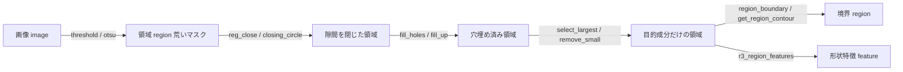
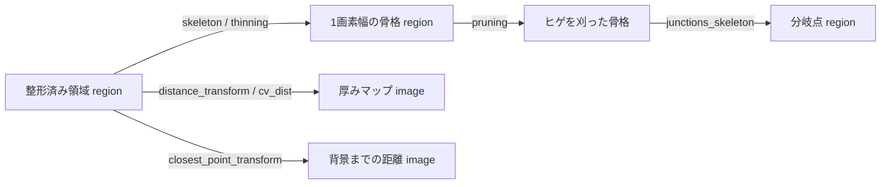

# 領域(region)処理 — 使い方ガイド

## この族は何をする道具箱か

`gallery2d_region` は **二値マスク**(前景=1 / 背景=0 の 2 次元 float 配列、以下「領域(region)」)の
**形を整え・選り分け・測る** ためのオペレータ族です。しきい値処理(segmentation 族)や検出で得た
生のマスクは、ギザギザ・小さな穴・ノイズ塊・複数成分が混ざった状態になりがちです。この族は、
モルフォロジー(収縮・膨張・開閉)で輪郭をならし、穴を埋め、連結成分を選別し、
スケルトン(骨格)や境界を抜き出し、外接/内接図形や距離変換で形状を定量化します。
用途は前処理後のマスク整形・ブロブ選別・形状計測で、検査(欠陥/寸法)・OCR 前処理・
顕微鏡・医用・歩行 Physical AI の踏み場領域処理などに向きます。

呼び出しは全オペレータ共通で「**1 領域 + 2 スカラつまみ `a,b`∈[0,1]**」です:
`fullseye.apply(region, "op_name", a, b)`。多くは領域→領域(`out_sort=region`)ですが、
距離変換は領域→**画像**(`out_sort=image`、連続値マップ)、ラン長・形状計測は
領域→**特徴量**(`out_sort=feature`、有限スカラ)を返します。グレースケール画像を渡した場合は
0.5 で二値化されてから処理されます(`apply(..., coerce=True)` が既定)。

## 代表的なパイプライン(op の繋がり)

しきい値処理で得た荒いマスクを、整形→成分選別→計測へと繋ぐのが典型です。



骨格化・距離変換は「形の芯」や「厚みマップ」を取り出す別の枝です。



## 使い方(op グループ別)

以下は実在の op のみ。呼び出しは `fullseye.apply(region, "<op>", a, b)`。

### モルフォロジー(収縮・膨張・開・閉)

前景を構造要素(円 disk / 矩形 rect)で削る・太らせる・開く(erode→dilate)・閉じる(dilate→erode)。
つまみ `a` が構造要素の大きさ/反復回数を決めます(膨張は面積増、収縮は面積減、
開は突起・小塊を除き、閉は隙間・小穴を埋める)。

- `reg_erode` / `reg_dilate` / `reg_open` / `reg_close` — 円形 SE の基本 4 種(反復 `1+int(a*3)` 回)。GROUNDED(`ndimage.binary_*`)。例: `fullseye.apply(m, "reg_close", 0.4, 0.5)`
- `erosion_circle` / `dilation_circle` / `opening_circle` / `closing_circle` — 円形 SE(半径をノブ化)。HALCON 同名。
- `erosion_rectangle1` / `dilation_rectangle1` / `opening_rectangle1` / `closing_rectangle1` — 矩形 SE 版。HALCON 同名。
- `erosion_seq` / `dilation_seq` — 反復適用型(反復 `1+int(a*3)`、HALCON `erosion_seq`/`dilation_seq`)。
- `erosion_golay` / `dilation_golay` / `opening_golay` / `closing_golay` — 円形 SE の別名系(HALCON `*_golay`)。
- `remove_noise_region` — 開(opening)で小ノイズ塊を除去(HALCON `remove_noise_region`)。
- `xsk2_isotropic_close` — 等方な閉(skimage `isotropic_closing`、半径 `1+a*4`)。
- `xmh_majority` / `xsk3_rank_majority` — 多数決フィルタで縁を平滑化(近傍で前景が過半なら前景)。
- `xcv2_hitmiss` — hit-or-miss 変換(十字テンプレート、孤立点/角の検出)。GROUNDED(`cv2.MORPH_HITMISS`)。

### 穴埋め・成分選別(トポロジ整形)

穴(内部背景)を埋める、連結成分を面積や位置で選り分ける、補集合を取る。

- `fill_holes` / `fill_up` — 内部の穴を塗りつぶす(面積が増え、中実形状になる)。GROUNDED(`binary_fill_holes`)。
- `fill_up_shape` / `sk_remove_holes` — 面積しきい以下の小穴のみ埋める(HALCON `fill_up_shape` / skimage `remove_small_holes`)。
- `select_largest` / `select_shape_std` — 最大連結成分だけ残す(小ブロブを消す)。GROUNDED(`ndimage.label`+最大面積)。
- `remove_small` / `select_shape` — 面積が小さい成分を捨てる(`a` がしきいを上げる)。GROUNDED。
- `r2_sort_region` — 面積で降順に並べ **k 番目**の成分を残す(`k=round(a*(n-1))`)。
- `r2_union1` — 全連結成分を 1 つのマスクに統合(OR)。
- `r3_select_region_point` — 点 `(a*H, b*W)` を含む成分だけを残す(背景を指すと空)。
- `sk_clear_border` — 画像の縁に接する成分を除去(skimage `clear_border`)。
- `r3_background_seg` — 背景の連結成分を抽出(`a` で相対面積フィルタ、HALCON `background_seg`)。
- `r3_label_to_region` — ラベル画像から 1 つのグレー値の画素を領域化(HALCON `label_to_region`)。
- `invert_region` — 厳密な二値補集合(前景↔背景)。GROUNDED(`1.0 - mask`)。

### スケルトン・細線化(1 画素幅の骨格)

領域を連結性を保ったまま 1 画素幅へ細らせ、形の「芯」を得る。

- `skeleton` / `sk_skeleton` / `morph_skeleton` — Zhang–Suen 系スケルトン化(skimage `skeletonize`)。GROUNDED。
- `em_skeleton` — Eckhardt–Maderlechner 型の不変細線化(HALCON `skeleton` と同系のアルゴリズム。純 numpy 実装、対称・位相保存・冪等。Zhang–Suen より枝を多く残す)。GROUNDED。
- `thinning` / `sk_thin` / `thinning_golay` / `thinning_seq` — 反復細線化(skimage `thin`)。
- `sk_medial` — 中心軸変換(medial axis、Blum の骨格。skimage `medial_axis`)。
- `pruning` — スケルトンのヒゲ(短い枝)を刈る(端点を `1+int(a*4)` 回除去 = **枝長 ≤5px 相当**)。HALCON の `pruning` の Length 引数に相当する枝長閾値は、この op の**重ね掛け**で伸ばせる(1 回ごとに +5px)。より長い断片除去は `r2_split_skeleton_lines` の `a`(`a*8`px 未満を除去)。GROUNDED。
- `junctions_skeleton` — スケルトンの分岐点(8 近傍が 3 個以上)を抽出。GROUNDED。
- `r2_split_skeleton_lines` — 骨格を分岐点で切り、線分に分割(`a` で短い断片を除去)。

> **HALCON との差(重要)**: HALCON の `skeleton` は Eckhardt–Maderlechner 法、
> Fullseye の既定 `skeleton`/`sk_skeleton` は Zhang–Suen 法(skimage)で、
> **アルゴリズムが異なります**。HALCON からの移植で骨格の枝ぶりを
> 近づけたい場合は、同系アルゴリズムの **`em_skeleton`** を使ってください
> (論文準拠の独立実装。HALCON 実装との画素単位の一致までは未検証)。
> スケルトンは実装依存性が強い代表例で、細い枝(ヒゲ)の生え方・分岐点の
> 画素位置・斜め 2 画素幅部の残り方は一致しません。したがって
> `junctions_skeleton` / `r2_split_skeleton_lines` の分岐数・線分数も
> HALCON と同数にはなりません。一致するのは位相的な性質
> (連結性の保存・穴の数・おおむね 1 画素幅)です。HALCON からの移植で
> 分岐数などを閾値に使っている場合は、`pruning` でヒゲを刈ってから
> 閾値を取り直してください。`sk_medial`(距離変換の稜線)はさらに別物で、
> ヒゲが多い代わりに局所半径(厚み)が得られます。

### 境界・輪郭抽出

領域から外周(1 画素の縁)を取り出す。いずれも元領域の部分集合になる薄いリング。

- `boundary` / `region_boundary` / `get_region_contour` — 領域から収縮を引いた縁(`region − erosion`)。GROUNDED。元領域の部分集合。
- `sk_find_boundaries` — 成分間/前景背景の境界(skimage `find_boundaries`)。
- `xmh_bwperim` — 周囲画素(perimeter、`b>0.5` で 8 連結/否 4 連結)。

### 凸包・外接/内接図形(形状近似)

領域を凸包・外接矩形/円・内接矩形/円などの単純図形で包む/満たす。計測やアライメントの土台。

- `shape_trans` / `sk_convex` / `get_region_convex` — 凸包(convex hull)で満たす(面積は元以上)。GROUNDED(`convex_hull_image`)。
- `convex_fill` — 強めの閉で凹みを埋める凸化近似(`border_value=1` の `binary_closing`)。GROUNDED。
- `smallest_rectangle1` / `r2_smallest_rectangle1` — 軸並行外接矩形(bounding box)。元領域を包含。GROUNDED。
- `r2_smallest_rectangle2` — 最小面積の**回転**外接矩形(rotating calipers)。
- `r2_smallest_circle` — 最小外接円(Welzl)。元領域を包含。GROUNDED。
- `r2_inner_circle` — 最大内接円をマスク化(中心=距離変換の argmax、半径≈inradius をノブ `a` で調整)。GROUNDED。
- `r2_inner_rectangle1` — 最大内接の軸並行矩形(全前景の最大長方形、`a` で内側に縮小)。

### 距離変換(領域 → 画像)

領域を連続値マップに変換する。出力は `image`(0..1 に正規化)。

- `distance_transform` / `dist_transform` / `cv_dist` — 前景各点から**背景**までの距離(EDT)。中心ほど大、厚みマップ。GROUNDED。
- `closest_point_transform` — 各点から**最も近い前景**までの距離(補集合の EDT)。前景内は 0、離れるほど大。GROUNDED。
- `xsp_chamfer_dist` — チャンファ(city-block 系)距離変換(`ndimage.distance_transform_cdt`)。GROUNDED。

### 分割・クリップ・幾何再配置

領域を窓で切り出す、格子や首(くびれ)で分割する、極座標へ写す、細い横ランを消す。

- `r3_clip_region` — 中央の矩形窓に切り取る(`a`=残す高さ割合、`b`=残す幅割合)。GROUNDED。
- `r2_partition_rectangle` — 外接 bbox を N×N 格子に割り、領域と重なるセルだけ残す(`a` で分割数 2..6)。
- `r3_partition_dynamic` — 縦方向の密度が低い列(くびれ)で領域を切り分ける。GROUNDED。
- `r3_eliminate_runs` — 長さがしきい未満の横ランを除去(細い橋を切る)。GROUNDED。
- `r3_rank_region` — モルフォロジカル rank(窓内前景数 ≥ number で点灯。number=面積→収縮、=1→膨張)。GROUNDED。
- `r3_polar_trans_region` — 重心まわりの極座標リマップ(`a`=半径範囲、`b`=角度掃引)。GROUNDED。

### ラン長・形状の計測(領域 → 特徴量)

領域を 1 つの有限スカラに要約する(`out_sort=feature`)。

- `r2_runlength_features` — 横方向前景ランの平均長。GROUNDED。
- `r3_region_features` — `a<0.5` で面積割合、`a≥0.5` でコンパクトネス `P²/(4πA)`(円で ~1)。GROUNDED。
- `r3_runlength_distribution` — ラン長分布の要約(`a<0.5` で分散、`a≥0.5` でエントロピー)。GROUNDED。

## 動く最小例(検証済み gallery2d_region から)

repo 直下で `py -3.11` から実行可能な自己完結スニペット(検証済みギャラリーの GT を写経・短縮)。
モルフォロジー・反転・穴埋め・境界・距離変換の既知性質を機械検証します。

```python
import numpy as np
import fullseye

# --- 合成の二値領域(前景=1 の中実円)を作る ---
n = 64
yy, xx = np.mgrid[0:n, 0:n]
disk = (((yy - n // 2) ** 2 + (xx - n // 2) ** 2) < (n * 0.28) ** 2).astype(np.float64)
area = float(disk.sum())

# 膨張は面積を増やし、収縮は減らす(モルフォロジーの基本性質)
dil = fullseye.apply(disk, "reg_dilate", 0.5, 0.5)
ero = fullseye.apply(disk, "reg_erode", 0.5, 0.5)
assert dil.sum() > area > ero.sum()

# 反転は厳密な二値補集合
inv = fullseye.apply(disk, "invert_region", 0.5, 0.5)
assert np.array_equal(inv > 0.5, disk <= 0.5)

# 穴あき円環を穴埋めすると中実円に戻る(面積が増える)
annulus = disk.copy()
annulus[(((yy - n // 2) ** 2 + (xx - n // 2) ** 2) < (n * 0.12) ** 2)] = 0.0
filled = fullseye.apply(annulus, "fill_holes", 0.5, 0.5)
assert filled.sum() > annulus.sum()
assert abs(filled.sum() - area) < 1e-9

# 境界抽出は薄いリングで、かつ元領域の部分集合
bnd = fullseye.apply(disk, "region_boundary", 0.5, 0.5)
assert 0 < bnd.sum() < area * 0.4
assert np.all((bnd > 0.5) <= (disk > 0.5))

# 距離変換(領域 -> 画像): 中心が縁より高い(距離のピークは内側)
dt = fullseye.apply(disk, "distance_transform", 0.5, 0.5)
assert dt[n // 2, n // 2] > dt[n // 2, n // 2 + int(n * 0.28) - 2] + 0.3

print("PASS")
```

op を数珠つなぎにする実務パターン(閉→穴埋め→最大成分→境界)も同じ呼び方で書けます。

```python
import numpy as np
import fullseye

n = 64
yy, xx = np.mgrid[0:n, 0:n]
# 大きな塊(内部に穴)+ 離れた小ノイズ塊
mask = (((yy - 34) ** 2 + (xx - 30) ** 2) < 15 ** 2).astype(np.float64)
mask[(((yy - 34) ** 2 + (xx - 30) ** 2) < 4 ** 2)] = 0.0   # 穴
mask[(((yy - 8) ** 2 + (xx - 55) ** 2) < 3 ** 2)] = 1.0    # 小ノイズ

closed  = fullseye.apply(mask,    "reg_close",       0.4, 0.5)
filled  = fullseye.apply(closed,  "fill_holes",      0.5, 0.5)
largest = fullseye.apply(filled,  "select_largest",  0.5, 0.5)
edge    = fullseye.apply(largest, "region_boundary", 0.5, 0.5)

# 最大成分選択は小ノイズを消す / 境界は最大成分の薄い部分集合
assert largest.sum() < filled.sum()
assert np.all((edge > 0.5) <= (largest > 0.5))
assert edge.sum() < largest.sum() * 0.5

# region -> feature: ラン長平均は正、コンパクトネスは円で ~1 近傍
disk = (((yy - 32) ** 2 + (xx - 32) ** 2) < 14 ** 2).astype(np.float64)
assert float(fullseye.apply(disk, "r2_runlength_features", 0.5, 0.5)) > 0
comp = float(fullseye.apply(disk, "r3_region_features", 0.9, 0.5))  # a>=0.5 -> compactness
assert 0.8 < comp < 1.6

print("PASS")
```

## 数式(必要な op のみ)

領域 $A \subseteq \mathbb{Z}^2$(前景画素の集合)、構造要素 $B$ とする。

モルフォロジー(Minkowski 演算)。収縮・膨張・開・閉:

$$A \ominus B = \{\,z : B_z \subseteq A\,\}, \qquad A \oplus B = \{\,z : B_z \cap A \neq \varnothing\,\}$$

$$A \circ B = (A \ominus B) \oplus B, \qquad A \bullet B = (A \oplus B) \ominus B$$

境界(`boundary` / `region_boundary`)は領域から収縮を引いた薄い縁:

$$\partial A = A \setminus (A \ominus B)$$

距離変換。`distance_transform` は前景各点から**背景**までのユークリッド距離、
`closest_point_transform` は各点から**最も近い前景**までの距離(= 補集合の距離変換):

$$D_A(p) = \min_{q \notin A} \lVert p - q \rVert, \qquad D^{\ast}_A(p) = \min_{q \in A} \lVert p - q \rVert$$

コンパクトネス(`r3_region_features` の `a≥0.5`)。周囲長 $P$、面積 $A$ に対し
(理想的な円で 1、細長いほど大):

$$C = \frac{P^2}{4\pi A}$$

## サンプルデータ

この族のデバッグには **二値化しやすい形状画像**が便利です。詳細は [`../../SAMPLES.md`](../../SAMPLES.md) を参照。
`import sample_images; sample_images.load("blobs")`(合成ブロブ、穴埋め/成分選別に好適)や
`sample_images.load("coins")`(skimage.data、BSD/public。しきい値→モルフォロジー整形の題材)を
`fullseye.apply(img, "otsu")` などで二値化してから領域 op を試せます。

## 参考文献(正典)

台帳は [`../../../REFERENCES.md`](../../../REFERENCES.md)。この族のアルゴリズムの古典:

- Serra, J. (1982). "Image Analysis and Mathematical Morphology." (Matheron 1975) — 収縮・膨張・開閉・トップハット。
- Rosenfeld, A. & Pfaltz, J. L. (1966). "Sequential operations in digital picture processing." JACM — 距離変換・連結成分ラベリング。
- Zhang, T. Y. & Suen, C. Y. (1984). "A fast parallel algorithm for thinning digital patterns." CACM — スケルトン化・細線化。
- Blum, H. (1967). "A transformation for extracting new descriptors of shape." — 中心軸変換(medial axis)。
- Welzl, E. (1991). "Smallest enclosing disks (balls and ellipsoids)." — 最小外接円(`r2_smallest_circle`)。
- Toussaint, G. T. (1983). "Solving geometric problems with the rotating calipers." — 最小面積回転外接矩形(`r2_smallest_rectangle2`)。

---
© 2026 Kazufumi Furuse — Fullseye operator documentation. Licensed under Apache-2.0.
