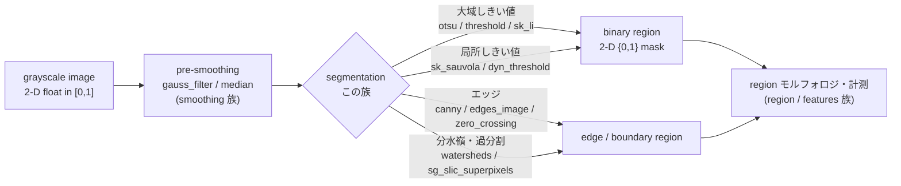
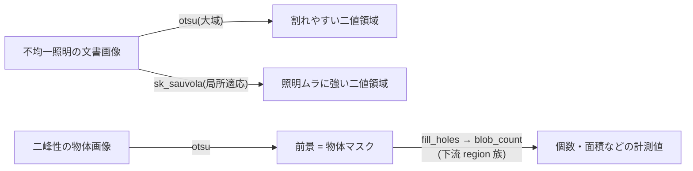

# セグメンテーション — 使い方ガイド

## この族は何をする道具箱か

このファミリは **「グレー画像 → 領域(region)」への分割** を担う演算子群です。入力はどの op も
`in_sort = image`(2 次元 `float64`、値域 `[0,1]`)、出力はほぼすべて `out_sort = region`
(入力と同じ形の 2 次元 `float64` で、値は `{0, 1}` の **二値マスク**)。つまり「各画素は前景か
背景か / どの区画に属するか」を決めて、後段の領域モルフォロジや計測が扱える形に落とす道具です。

やり方の系統は幅広く、大域しきい値(Otsu / Li / Yen)、局所適応しきい値(Sauvola / Niblack /
適応ガウス)、エッジ抽出(Canny / LoG ゼロ交差)、局所ピーク・極値のマーカー検出、領域成長・
分水嶺(watershed / pouring)、特徴空間クラスタリング(k-means / GMM / mean-shift)、グラフ分割
(normalized-cut / GrabCut / random-walker)、過分割スーパーピクセル(SLIC / Felzenszwalb)、
能動輪郭(Chan-Vese)までを一列に並べています。どれも同じ呼び出し形 `fullseye.apply(img, "name", a, b)`
で叩けて、つまみ `a, b ∈ [0,1]` が各手法の主要パラメータ(しきい値・平滑量・窓サイズ・粗さ)へ
写像されます。

**出力型の例外(正直に)**: 次の 3 op だけは `out_sort = image`(二値マスクではなく多値/連続の画像)を
返します — `xsk2_multiotsu`(多値ラベル画像、≥3 階調)、`xcv2_meanshift`(mean-shift 平滑画像)、
`it_region_to_bin`(領域を二値画像へレンダリング)。残りはすべて `{0,1}` の region です。

## 代表的なパイプライン(op の繋がり)

セグメンテーション op は多くが「image を受けて region を出す」終端です。したがって典型的な連鎖は
**前段の平滑化(smoothing 族)→ 本族の 1 手法 → 後段の region モルフォロジ/計測(region・features 族)**
というデータ種の受け渡しになります。



同じ入力でも手法で頑健性が変わる、という「使い分け」の連鎖:



## 使い方(op グループ別)

呼び出しは全 op 共通で `fullseye.apply(img, "<name>", a, b)`(`a, b ∈ [0,1]`、既定 0.5)。
`region` 出力は入力と同形の `{0,1}` 二値 `float64`。HALCON 別名がある場合は「≈ HALCON名」で併記。

### 大域しきい値(1 つの閾値で前景/背景)
- `threshold` — 固定しきい値 `v > a`(`a` が閾値そのもの)。≈ HALCON `threshold`。 `fullseye.apply(img, "threshold", 0.5, 0)`
- `otsu` — ヒストグラムのクラス間分散最大で自動閾値(つまみ不使用)。≈ `binary_threshold`。 `fullseye.apply(img, "otsu")`
- `binary_threshold` / `auto_threshold` / `bin_threshold` — いずれも Otsu 自動二値化(登録別名)。≈ 同名 HALCON。
- `fast_threshold` — 固定バンド `a < v < a+0.5+0.5b`(区間しきい値)。≈ HALCON `fast_threshold`。
- `h_threshold` — しきい値系 image→region(≈ HALCON `threshold`)。 `fullseye.apply(img, "h_threshold", 0.5, 0.5)`
- `dual_threshold` — 中央からの偏差 `|v-0.5| > (0.1+0.35a)` で両側を前景化。≈ `dual_threshold`。
- `sk_li` — Li の最小交差エントロピー閾値(skimage)。≈ `binary_threshold`。
- `sk_yen` — Yen の最大相関基準閾値(skimage)。≈ `binary_threshold`。
- `cv_otsu` — OpenCV の Otsu 二値化。≈ `binary_threshold`。
- 他(多値/局所 Otsu): `xsk2_multiotsu`(**出力 image**、多値ラベル ≥3 階調)、`xsk3_rank_otsu`。

### 局所適応しきい値(照明ムラ・文書に強い)
- `dyn_threshold` — 局所平均 + オフセット `v > mean_W(v) + (b-0.5)·0.4`(窓は `a`)。≈ `dyn_threshold`。
- `local_threshold` / `adaptive_gauss_thresh` — 局所ガウス平均に対する差分でしきい。≈ `local_threshold`。
- `var_threshold` — Sauvola 局所しきい値(窓 = `2·⌊6a⌋+3`)。≈ `var_threshold`。
- `sk_sauvola` — Sauvola 適応二値化(skimage、文書 OCR 前処理の定番)。 `fullseye.apply(img, "sk_sauvola", 0.5, 0)`
- `sk_niblack` — Niblack 適応二値化(局所平均 + `k·` 局所標準偏差)。
- `cv_adaptive_mean` / `cv_adaptive_gauss` — OpenCV の適応平均/適応ガウスしきい(ブロック = `2·⌊6a⌋+3`、定数 `⌊10b⌋`)。
- `hysteresis_threshold` / `sk_hysteresis` — 2 段しきい(低 `0.2+0.3a`、高 `0.5+0.3b`)で高値の種から連結を残す。≈ `hysteresis_threshold`。
- 他: `xmh_bernsen`(Bernsen 局所コントラスト)、`xsk3_threshold_local_median`(局所中央値しきい)。

### エッジ → 領域(境界を前景化)
- `canny` — ガウス平滑(σ = `0.5+1.5a`)後の Sobel 勾配強度がしきい `0.1+0.5b` を超えた画素。≈ `edges_image`。 `fullseye.apply(img, "canny", 0.3, 0.3)`
- `sk_canny` — skimage の Canny(非最大抑制 + ヒステリシス込み、σ = `0.5+2a`)。≈ `edges_image`。
- `cv_canny` — OpenCV Canny(下限 `50+100a`、上限 `100+150b`)。≈ `edges_image`。
- `edges_image` — skimage Canny を薄くラップした登録別名。≈ `edges_image`。
- `xkor_canny` — kornia(GPU 対応)版 Canny。
- `zero_crossing` — LoG(ガウス・ラプラシアン、σ = `0.5+2a`)の符号反転位置。≈ `zero_crossing`。

### 局所ピーク / 極値(マーカー検出)
- `local_max` — 局所最大かつ `v > 0.3+0.4b` の画素だけ(窓 = `a`)。明るい点状ターゲット向け。≈ `local_max`。 `fullseye.apply(img, "local_max", 0.3, 0.5)`
- `local_min` — 局所最小かつ `v < 0.7-0.4b`(暗い極小)。≈ `local_min`。
- `sk_local_maxima` — skimage の regional maxima。≈ `local_max`。
- `nonmax_suppression_amp` — 非最大抑制的な局所ピーク抽出(local_max 系)。≈ `nonmax_suppression_amp`。
- 他: `xsk3_peak_local_max`、`xsk2_h_maxima`(h-maxima)、`xsk3_h_minima`(h-minima)、`xmh_regmin`(regional minima マーカー)。

### 領域成長 / 分水嶺(連結で塗り広げる)
- `regiongrowing` — 種(`v > 0.5+0.3a`)を `1+⌊4b⌋` 回膨張して成長。≈ `regiongrowing`。
- `regiongrowing_mean` — 平均基準の領域成長(登録別名、regiongrow 系)。≈ `regiongrowing_mean`。
- `sg_region_growing_seeded` — 中心画素の種から `±a` の均質性で連結成分を成長(`b>0.5` で 8 近傍)。
- `xsk_flood` — flood-fill 型の領域塗り。
- `watersheds` / `watersheds_threshold` — 勾配上のマーカー分水嶺の境界(dam)を返す。≈ `watersheds`。
- `pouring` — 分水嶺系の登録別名。≈ HALCON `pouring`。
- `xcv_watershed_markers` — OpenCV のマーカー制御分水嶺。≈ `watersheds`。
- `sg_watershed_gradient` — Sobel 勾配 + h-minima(深さ `0.02+0.3a`)マーカーの分水嶺境界。

### 特徴空間クラスタリング / グラフ分割
- `sg_kmeans_intensity` — 輝度の k-means(`k = 2+round(4a)`)、最も明るいクラスタ領域を返す。
- `sg_gmm_segment` — 2 成分ガウス混合を EM で当て、明るいクラスの事後確率 `≥ 0.25+0.5a` を前景化。
- `sg_normalized_cut_2` — 縮小グリッド上の親和グラフの Fiedler ベクトル(Shi & Malik)を中央値で 2 分割。
- `xcv_grabcut` — GrabCut(グラフカット + GMM)前景抽出。
- `xsk_random_walker` — random-walker(ラプラシアン確率伝播)分割。
- `xcv2_meanshift` — mean-shift(**出力 image**、色/輝度空間で平滑・分割)。

### 過分割スーパーピクセル / 能動輪郭
- `sg_slic_superpixels` / `sk_slic` — SLIC スーパーピクセルの境界格子(`a` で個数/コンパクトさ)。
- `sg_felzenszwalb` / `sk_felzenszwalb` — Felzenszwalb グラフ分割の領域境界(`a`=スケール、`b`=最小サイズ)。
- `segment_image_mser` — MSER(最大安定極値領域)の境界。≈ `segment_image_mser`。
- `sk_chan_vese` — Chan-Vese 能動輪郭(領域ベース、エッジ不要、`mu = 0.1+0.4a`)。

### 変換(領域 ↔ 画像)
- `it_region_to_bin` — 領域を二値画像へレンダリング(**出力 image**)。≈ HALCON `region_to_bin`。

## 動く最小例(検証済み gallery2d_segmentation から)

repo 直下で `py -3.11 <this>.py` として実行可能。検証済み例 `examples/gallery2d_segmentation.py` の
GT(ground truth)チェックを公開ファサード `fullseye.apply` で書き直した自己完結コード。各 op が
「動く」ではなく「正しく効く」ことを beat-the-null で確かめ、最後に `PASS` を印字する。

```python
# repo 直下(C:/dev/projects/imgevolve)で: py -3.11 this_file.py
import warnings
import numpy as np
import fullseye

warnings.filterwarnings("ignore")  # 各バックエンドの境界警告は本題ではない

# --- GT1: threshold は v>a。閾値 a を上げると前景が単調に減る(横勾配画像) ---
grad = np.tile(np.linspace(0, 1, 48), (48, 1))
fg_lo = fullseye.apply(grad, "threshold", 0.25, 0.0)
fg_hi = fullseye.apply(grad, "threshold", 0.75, 0.0)
assert set(np.unique(fg_lo).tolist()) <= {0.0, 1.0}          # region は二値
assert fg_lo.sum() > fg_hi.sum()                             # 単調(無関係なら差 0 = beat-the-null)
assert float(grad[fg_lo == 1].min()) > 0.25                  # 前景は必ず a 超

# --- GT2: otsu は二峰性を谷で分離。前景平均>背景平均、真円との IoU≈1 ---
n = 48
yy, xx = np.mgrid[0:n, 0:n]
disk = ((yy - 24) ** 2 + (xx - 24) ** 2) < 12 ** 2
rng = np.random.default_rng(1)
bim = np.clip(np.where(disk, 0.8, 0.2) + 0.02 * rng.standard_normal((n, n)), 0, 1)
reg = fullseye.apply(bim, "otsu", 0.0, 0.0)
fg_mean, bg_mean = float(bim[reg == 1].mean()), float(bim[reg == 0].mean())
iou = np.logical_and(reg == 1, disk).sum() / np.logical_or(reg == 1, disk).sum()
assert fg_mean - bg_mean > 0.4                               # ランダム分割なら ≈0
assert iou > 0.9                                             # 真の物体をほぼ復元

# --- GT3: canny は鋭いエッジ近傍だけ応答。平坦部は 0 ---
edge = np.full((48, 48), 0.1)
edge[:, 24:] = 0.9
ce = fullseye.apply(edge, "canny", 0.2, 0.2)
band = float(ce[:, 22:27].sum())                             # 境界列の帯
flat = float(ce[5:15, 3:13].sum())                           # 平坦パッチ
assert band > 0 and flat == 0.0 and band > 10 * (flat + 1)

# --- GT4: local_max は明るいピークだけ検出、平坦背景は拾わない ---
peak = np.full((48, 48), 0.2)
peak[24, 24] = 1.0
lm = fullseye.apply(peak, "local_max", 0.3, 0.5)             # 閾値 = 0.3 + 0.4*0.5 = 0.5
assert lm[24, 24] == 1.0                                     # ピークは検出
assert float(lm[0:10, 0:10].sum()) == 0.0                    # 平坦背景は 0
assert float(lm.sum()) < 5                                   # 疎な検出

# --- GT5: 系統ごとの代表 op が有限・同形・二値 region を返す(一般契約) ---
for name in ["binary_threshold", "sk_li", "sk_yen", "sk_sauvola", "dyn_threshold",
             "sk_canny", "edges_image", "watersheds", "regiongrowing",
             "sg_slic_superpixels", "sg_kmeans_intensity", "sg_watershed_gradient"]:
    out = fullseye.apply(bim, name, 0.5, 0.5)
    assert out.shape == bim.shape, name
    assert np.all(np.isfinite(out)), name
    assert set(np.unique(np.round(out, 6)).tolist()) <= {0.0, 1.0}, name

print("PASS")
```

## 数式(必要な op のみ)

**Otsu(`otsu` / `binary_threshold` / `sk_otsu` / `cv_otsu`)** — しきい値 $t$ で二分したときの
クラス間分散を最大化する:

$$
t^\star = \arg\max_{t}\; \sigma_B^2(t),\qquad
\sigma_B^2(t) = \omega_0(t)\,\omega_1(t)\,\bigl[\mu_0(t) - \mu_1(t)\bigr]^2
$$

ここで $\omega_0(t)=\sum_{i\le t} p_i$ は背景の画素比率、$\mu_0,\mu_1$ は各クラスの平均輝度。
実装は等価な形 $\sigma_B^2(t) = \dfrac{\bigl[\mu_T\,\omega(t) - \mu(t)\bigr]^2}{\omega(t)\,\bigl(1-\omega(t)\bigr)}$
を全 $t$ で評価して最大の $t$ を選ぶ。

**固定/適応しきい値** — 前景領域は集合として定義される。固定 `threshold`:

$$
R = \{\,x : v(x) > a\,\}
$$

局所適応(`dyn_threshold` / `cv_adaptive_mean`)は局所平均 $\bar v_W$ に対する差分:

$$
R = \{\,x : v(x) > (\bar v_W * v)(x) + c\,\}
$$

**Sauvola / Niblack(`sk_sauvola` / `sk_niblack` / `var_threshold`)** — 窓ごとの平均 $m(x)$ と
標準偏差 $s(x)$ から局所しきい値を作る:

$$
T_{\text{Niblack}}(x) = m(x) + k\,s(x),\qquad
T_{\text{Sauvola}}(x) = m(x)\left[\,1 + k\left(\frac{s(x)}{R} - 1\right)\right]
$$

$R$ は標準偏差のダイナミックレンジ。照明ムラのある文書で大域 Otsu より頑健。

**Canny / LoG(`canny` / `zero_crossing`)** — ガウス平滑後の勾配強度をしきい、あるいは
ガウス・ラプラシアンのゼロ交差を取る:

$$
g = \bigl\lVert \nabla (G_\sigma * I) \bigr\rVert,\quad R=\{x: g(x)>\tau\};
\qquad
\text{zero-crossing of }\; \nabla^2 (G_\sigma * I)
$$

**ヒステリシス(`hysteresis_threshold` / `sk_hysteresis`)** — 2 つのしきい値 $t_\text{low}<t_\text{high}$。
$v>t_\text{high}$ の種を残し、そこから $v>t_\text{low}$ で連結する画素だけを前景に加える(弱いエッジの
断片化を防ぐ)。

**Normalized cut(`sg_normalized_cut_2`)** — 親和行列 $W$、次数対角行列 $D$ の一般化固有問題
$(D-W)\,y = \lambda\,D\,y$ の第 2 固有ベクトル(Fiedler ベクトル)を中央値でしきって 2 分割する
(Shi & Malik)。

## サンプルデータ

デバッグ・動作確認には [`../../SAMPLES.md`](../../SAMPLES.md) の 2-D 画像源が使える。二峰性/勾配/
チェッカの合成画像(`gradient` / `blobs` / `shapes` / `checker_noisy`)はしきい値・エッジの GT 検証に、
`skimage.data` の `coins`(硬貨=Otsu/watershed)・`page`(文書=Sauvola/Niblack 適応二値化)・`cell`
(細胞=領域成長/分水嶺)は実データでの挙動確認に向く。取得は `import sample_images; sample_images.load('coins')`。

## 参考文献(正典)

台帳 [`../../../REFERENCES.md`](../../../REFERENCES.md) に準拠。この族のアルゴリズムの古典:

- Otsu, N. (1979). "A threshold selection method from gray-level histograms." IEEE Trans. SMC.
- Canny, J. (1986). "A computational approach to edge detection." IEEE TPAMI.
- Marr, D. & Hildreth, E. (1980). "Theory of edge detection." Proc. R. Soc. Lond. B. (LoG ゼロ交差)
- Li, C.H. & Lee, C.K. (1993). "Minimum cross entropy thresholding." Pattern Recognition.
- Yen, J.C., Chang, F.J. & Chang, S. (1995). "A new criterion for automatic multilevel thresholding." IEEE TIP.
- Niblack, W. (1986). "An Introduction to Digital Image Processing." Prentice Hall.
- Sauvola, J. & Pietikäinen, M. (2000). "Adaptive document image binarization." Pattern Recognition.
- Vincent, L. & Soille, P. (1991). "Watersheds in digital spaces: an efficient algorithm based on immersion simulations." IEEE TPAMI.
- Adams, R. & Bischof, L. (1994). "Seeded region growing." IEEE TPAMI.
- Achanta, R. et al. (2012). "SLIC superpixels compared to state-of-the-art superpixel methods." IEEE TPAMI.
- Felzenszwalb, P. & Huttenlocher, D. (2004). "Efficient graph-based image segmentation." IJCV.
- Shi, J. & Malik, J. (2000). "Normalized cuts and image segmentation." IEEE TPAMI.
- Chan, T. & Vese, L. (2001). "Active contours without edges." IEEE TIP.
- Comaniciu, D. & Meer, P. (2002). "Mean shift: a robust approach toward feature space analysis." IEEE TPAMI.
- Rother, C., Kolmogorov, V. & Blake, A. (2004). "GrabCut: interactive foreground extraction using iterated graph cuts." ACM SIGGRAPH.
- Grady, L. (2006). "Random walks for image segmentation." IEEE TPAMI.
- Matas, J. et al. (2002). "Robust wide-baseline stereo from maximally stable extremal regions." BMVC. (MSER)
- Dempster, A., Laird, N. & Rubin, D. (1977). "Maximum likelihood from incomplete data via the EM algorithm." J. Royal Stat. Soc. B. (GMM)
- Lloyd, S. (1982). "Least squares quantization in PCM." IEEE Trans. Information Theory. (k-means)

---
© 2026 Kazufumi Furuse — Fullseye operator documentation. Licensed under Apache-2.0.
