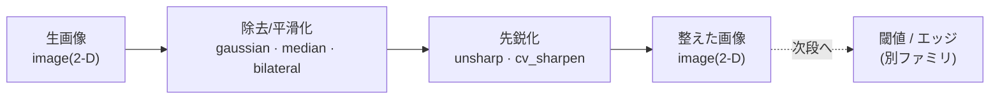
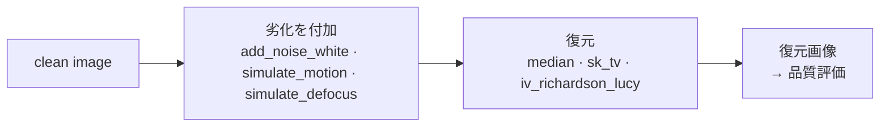

# 平滑化・ランク・復元フィルタ — 使い方ガイド

> 呼び出しモデル: 2-D op は「1 画像 + 2 つのつまみ `a`,`b`∈[0,1]」。
> `out = fullseye.apply(img, "<op名>", a, b)`。すべて **image → image**(2-D float、入力と同形状)。
> 検証済みサンプル: [`examples/gallery2d_smoothing_rank.py`](../../../../examples/gallery2d_smoothing_rank.py)(この族 86 op を全数、有限性・型・決定性・効果 GT で assert)。

## この族は何をする道具箱か

画像を **「均す / 直す / 汚す」** ための道具箱です。入力も出力も 2-D の濃淡画像(grayscale)で、撮像・計測の前処理の中核を担います。用途は 4 つに分かれます。

- **平滑化(smoothing)** — ぼかしてノイズを消す。線形(Gaussian・箱型平均)、エッジを残す非線形(bilateral・sigma フィルタ・拡散 PDE)、強力な非局所/変分/変換ドメイン denoiser(NLM・全変動 TV・ウェーブレット収縮)まで段階がある。
- **ランク(rank)** — 近傍画素を並べ替えて順位統計を取り、外れ値を叩く。中央値(median、salt-pepper に強い)/ 最小・最大(= グレー erosion・dilation)/ 任意の p 分位・トリム平均など。
- **復元(restoration)** — 劣化した画像を逆問題として直す。逆畳み込み(Richardson-Lucy・Wiener)、欠損補間(inpaint)、超解像、位相アンラップ。
- **ノイズ注入(noise)** — 逆にノイズやブレを**人工的に加える**。学習データ拡張やロバスト性評価の入力を作るための劣化シミュレータ。

つまみ `a`,`b` の割り当ては op ごとに違いますが、多くの近傍フィルタで **`a` = 窓の大きさや平滑化強度**、`b` = 二次パラメータ(分位・レンジ幅・ノイズ強度など)です。出力は設計上 [0,1] を超えることを許容します(先鋭化・逆畳み込みはレンジを越えうる。クリップはパイプライン境界側の責任)。

## 代表的なパイプライン(op の繋がり)

前処理の王道は「均す → 先鋭化 → 次段(閾値・エッジ)」。データ種は image のまま繋がります。



もう一つの典型は「劣化を人工付加 → 復元」。学習・ロバスト性評価の骨格で、`examples` の GT もこの往復(ぼかし/ノイズ → 中央値・先鋭化で戻す)を検証しています。



## 使い方(op グループ別)

各 op は `fullseye.apply(img, "<名前>", a, b)` で呼びます。HALCON 相当名がある op は末尾に添えます。

### 線形平滑化(ぼかす)— smoothing

- `gaussian` — Gaussian 畳み込み。`a` が σ(=0.3+2.7·a)。`fullseye.apply(img, "gaussian", 0.6, 0.0)`(HALCON: gauss_filter)
- `mean_box` — 箱型(一様)平均。`a` が窓辺 3/5/7/9。`fullseye.apply(img, "mean_box", 0.5, 0.0)`(HALCON: mean_image)
- `binomial_filter` — 二項係数カーネルの分離畳み込み(Gaussian の整数近似)。`a` が窓。(HALCON: binomial_filter)
- `gauss_filter` / `gauss_image` / `cv_gaussian` — Gaussian の別実装(HALCON / OpenCV 経路)。
- `mean_image` / `cv_box` — 箱型平均の別実装(HALCON: mean_image)。
- `smooth_image` — 汎用平滑(Gaussian、`a` が σ)。(HALCON: smooth_image)
- `simulate_defocus` — デフォーカス(円形ボケ)を平均フィルタで模擬。(HALCON: simulate_defocus)
- `f2_gauss_pyramid` — Gaussian ピラミッド(縮小→再拡大で低域のみ残す)。(HALCON: gen_gauss_pyramid)
- 他: `xkor_gaussian`(Kornia), `xpil_smooth_more`(PIL), `xsp_cspline_smooth`(3次スプライン平滑)。

### エッジ保存平滑化(均すが輪郭は残す)

- `bilateral` — 空間 Gaussian × 輝度差 Gaussian の二重重み。`a` が空間 σ、`b` が値域 σ。`fullseye.apply(img, "bilateral", 0.5, 0.5)`(HALCON: bilateral_filter)
- `bilateral_filter` / `cv_bilateral` / `xkor_bilateral` — bilateral の別実装(HALCON/OpenCV/Kornia)。
- `guided_filter` / `dl_guided_filter` — ガイド画像の局所線形回帰で平滑化(He 2010)。(HALCON: guided_filter)
- `sigma_image` — 局所平均から ±σ 以内の近傍だけを平均(σ フィルタ、Lee 1983)。`b` が σ 幅。(HALCON: sigma_image)
- `xcv_edge_preserving` — OpenCV edge-preserving filter。
- `xsk3_rank_mean_bilateral` — ランク→平均→bilateral の合成 denoiser。

### 拡散平滑化(PDE)

- `anisotropic_diffusion` — Perona-Malik 異方性拡散。勾配が大きい所(エッジ)で伝導を止める反復。`a` が反復数、`b` がコントラスト係数 K。(HALCON: anisotropic_diffusion)
- `dl_aniso_diffusion` / `coherence_enhancing_diff` — 異方性拡散の変種(方向性強調系)。
- `isotropic_diffusion` — 等方拡散(= Gaussian スケール空間、`a` が拡散時間)。(HALCON: isotropic_diffusion)
- `mean_curvature_flow` — 平均曲率流的な反復平滑(輪郭を縮める向きに均す)。(HALCON: mean_curvature_flow)

### 非局所 / 変分 / 変換ドメイン除去(強い denoiser)

- `sk_nlm` / `cv_nlmeans` — 非局所平均。似たパッチを画像全体から集めて平均(Buades 2005)。`a` がフィルタ強度 h。
- `sk_tv` / `sk_tv_bregman` / `xcv3_denoise_tvl1` — 全変動(TV)最小化。区分的に平坦な復元(ROF、Rudin 1992)。`a` が正則化重み。
- `sk_wavelet` / `xwt_visushrink` / `xwt_firm_denoise` / `xwt_lf_reconstruct` — ウェーブレット係数の収縮/再構成(Donoho & Johnstone 1994)。
- `xsp_wiener` — 適応 Wiener フィルタ(局所平均・分散でノイズを抑える、`a` が窓)。
- `xsp_savgol` — Savitzky-Golay 2-D 多項式平滑(`a` が窓幅)。
- `xsp_dct_denoise` — DCT 係数の閾値化で高周波ノイズを削る。

### 先鋭化(sharpen)

- `unsharp` — アンシャープマスク。ぼかし版との差を足し戻す。`a` が強調量 amount、`b` がマスクの Gaussian σ。`fullseye.apply(img, "unsharp", 0.6, 0.5)`(HALCON: emphasize)
- `cv_sharpen` — 3×3 シャープ化カーネルの畳み込み。
- `xpil_unsharp_mask` / `xkor_unsharp` — PIL / Kornia のアンシャープ。
- `xcv3_pyr_laplacian` — Laplacian ピラミッドで高域を強調。

### 背景 / 劣化シミュレーション

- `sk_rolling_ball` — ローリングボール法で背景(低周波の陰影)を推定して除去(Sternberg 1983)。`a` が球半径。
- `simulate_motion` — 直線モーションブラー。`a` が方向、`b` が長さ。(HALCON: simulate_motion)
- `xkor_motion_blur` — Kornia のモーションブラー。

### ランク(順位統計)— rank

中央値系:

- `median` — 中央値フィルタ。salt-pepper 除去の定番(Tukey 1977)。`a` が窓辺。`fullseye.apply(img, "median", 0.5, 0.0)`(HALCON: median_image)
- `median_image` / `cv_median` / `sk_median_disk` / `xkor_median` — 中央値の別実装(HALCON / OpenCV / skimage 円形窓 / Kornia)。
- `median_rect` — 矩形窓の中央値(`a` が縦、`b` が横)。(HALCON: median_rect)
- `median_separate` — 分離型中央値(HALCON: median_separate)。
- `median_weighted` — 重み付き中央値(HALCON: median_weighted)。
- `eliminate_min_max` — 近傍の最小/最大に当たる外れ値を叩く(中央値系、HALCON: eliminate_min_max)。

最小 / 最大 / レンジ:

- `min_filter` — 局所最小(= グレー erosion)。`fullseye.apply(img, "min_filter", 0.5, 0.0)`(HALCON: gray_erosion_rect)
- `max_filter` — 局所最大(= グレー dilation)。(HALCON: gray_dilation_rect)
- `gray_erosion_rect` / `gray_dilation_rect` — 矩形窓の最小 / 最大(min_filter / max_filter と同義)。
- `gray_range_rect` — 局所レンジ(最大−最小 = モルフォロジ勾配)。(HALCON: gray_range_rect)

分位 / ランク:

- `percentile` — p 分位フィルタ。`a` が窓、`b` が分位(5〜95%)。`fullseye.apply(img, "percentile", 0.5, 0.9)`(HALCON: rank_image)
- `rank_image` / `rank_rect` / `dual_rank` — 分位ランクフィルタの別実装(HALCON: rank_image / rank_rect / dual_rank)。

トリム / salt-pepper / 幾何平均 / 最頻値:

- `trimmed_mean` — トリム平均(両端の外れ値を落として平均、実装は 20/80 分位の中点)。(HALCON: trimmed_mean)
- `mean_sp` — salt-pepper 向けのトリム平均(HALCON: mean_sp)。
- `eliminate_sp` — σ フィルタで salt-pepper を除去(HALCON: eliminate_sp)。
- `xsk2_rank_geomean` — 幾何平均型のランクフィルタ。
- `xpil_mode_filter` — 最頻値(mode)フィルタ。

### 復元(逆問題)— restoration

逆畳み込み:

- `iv_richardson_lucy` / `xsk_richardson_lucy` — Richardson-Lucy 反復逆畳み込み。想定 PSF(小さな Gaussian)で乗算的に鮮鋭化。`a` が反復数(1〜15)。
- `iv_wiener_deconv_spatial` / `xsk2_wiener` — Wiener 逆畳み込み。`a` が想定ボケ σ、`b` がノイズ対信号比(大きいほど穏やか)。
- `iv_unsharp_deblur` — 反復アンシャープによる近似デブラー。`a` が反復数、`b` が毎回の強調量。
- `iv_motion_deblur` — モーションブラーの逆畳み込み。

欠損補間(inpaint):

- `xsk_inpaint` / `xcv_inpaint` / `xcv3_inpaint_ns` / `iv_gradient_inpaint` — マスク/欠損領域を近傍から補間(`iv_gradient_inpaint` は既知画素を固定した調和補間 = ラプラシアン反復。`xcv*` は OpenCV inpaint)。

超解像 / 位相:

- `iv_backproject_superres` — 反復逆投影による超解像。
- `xsk_unwrap_phase` — 位相アンラップ(2π の巻き戻しを解く)。

### ノイズ注入(学習 / 評価用)— noise

- `add_noise_white` — 白色 Gaussian ノイズを加える。`b` が強度(σ=0.02+0.2·b)。`fullseye.apply(img, "add_noise_white", 0.5, 0.5)`(HALCON: add_noise_white)
- `add_noise_distribution` — 分布ベースのノイズを加える(HALCON: add_noise_distribution)。

### 一般フィルタ — filtering

- `tf_gradient_domain_reintegrate` — 勾配ドメインで処理して Poisson 的に再積分(勾配→画像の逆変換)。

## 動く最小例(検証済み gallery2d_smoothing_rank から)

repo 直下に保存して `py -3.11 <file>` で実行できます(`import fullseye` が通る位置 = repo 直下)。汚した段差エッジを作り、この族の効果 GT(中央値の salt-pepper 除去 / Gaussian の分散低減 / ランクの順序保存 / unsharp の勾配増大 / 型契約)を assert します。

```python
# -*- coding: utf-8 -*-
"""平滑化・ランク・復元フィルタ族の効果 GT(examples/gallery2d_smoothing_rank.py 準拠)。"""
import numpy as np
import fullseye

# --- 汚した段差エッジ(左 0.2 / 右 0.8 + salt-pepper)と Gaussian ノイズ場 --------
n = 64
rng = np.random.default_rng(7)
_, xx = np.mgrid[0:n, 0:n]
clean = np.where(xx >= n // 2, 0.8, 0.2).astype(np.float64)
sp = clean.copy()
m = rng.random((n, n))
sp[m < 0.05] = 0.0            # salt
sp[m > 0.95] = 1.0           # pepper
noisy = np.clip(0.5 + 0.15 * rng.standard_normal((n, n)), 0.0, 1.0)

mae = lambda a, c: float(np.mean(np.abs(a - c)))
grad_energy = lambda a: float(np.sum(np.diff(a, axis=1) ** 2) + np.sum(np.diff(a, axis=0) ** 2))

# (1) median(rank): salt-pepper を除去 → clean への誤差が半減以下(null=何もしない を圧倒)
med = fullseye.apply(sp, "median", 0.5, 0.0)
assert mae(med, clean) < 0.5 * mae(sp, clean), "median が salt-pepper を除去していない"

# (2) gaussian(smoothing): ノイズ場の分散を下げる
assert float(np.var(fullseye.apply(noisy, "gaussian", 0.5, 0.0))) < float(np.var(noisy))

# (3) rank の順序保存: min_filter <= 入力 <= max_filter(各画素)
mn = fullseye.apply(noisy, "min_filter", 0.5, 0.0)
mx = fullseye.apply(noisy, "max_filter", 0.5, 0.0)
assert np.all(mn <= noisy + 1e-9) and np.all(mx >= noisy - 1e-9), "min<=in<=max が壊れている"

# (4) unsharp(smoothing): ぼけを先鋭化 → 勾配エネルギー増
blur = fullseye.apply(clean, "gaussian", 0.6, 0.0)
sharp = fullseye.apply(blur, "unsharp", 0.6, 0.5)
assert grad_energy(sharp) > grad_energy(blur), "unsharp が先鋭化していない"

# (5) 型契約(image -> image): 2-D float、同形状、有限。復元/エッジ保存系も含めて確認
for name in ("bilateral", "sigma_image", "anisotropic_diffusion", "iv_richardson_lucy"):
    out = np.asarray(fullseye.apply(noisy, name, 0.5, 0.5))
    assert out.ndim == 2 and out.shape == noisy.shape
    assert np.issubdtype(out.dtype, np.floating) and np.all(np.isfinite(out))

print("PASS")
```

## 数式(必要な op のみ)

**Gaussian(`gaussian`, `gauss_filter`)** — 分離 Gaussian カーネルとの畳み込み。σ はつまみ `a` で決まる($\sigma = 0.3 + 2.7a$)。

$$G_\sigma(x,y)=\frac{1}{2\pi\sigma^2}\exp\!\left(-\frac{x^2+y^2}{2\sigma^2}\right),\qquad I'=G_\sigma * I$$

**Bilateral(`bilateral`)** — 空間の近さと輝度の近さの積を重みにする(エッジを跨いだ平均を避ける)。

$$I'(p)=\frac{1}{W_p}\sum_{q\in\Omega} \exp\!\left(-\frac{\lVert p-q\rVert^2}{2\sigma_s^2}\right)\exp\!\left(-\frac{(I(p)-I(q))^2}{2\sigma_r^2}\right) I(q)$$

ここで $\sigma_s$ は空間つまみ `a`、$\sigma_r$ は値域つまみ `b`、$W_p$ は重みの総和。

**Unsharp mask(`unsharp`)** — 元画像に「元 − ぼかし」(高域)を足し戻す。$\text{amount}=1.5a$、マスクの $\sigma=0.5+1.5b$。

$$I' = I + \text{amount}\,\bigl(I - G_\sigma * I\bigr)$$

**σ フィルタ(`sigma_image`, `eliminate_sp`)** — 局所平均 $\mu$ から $\pm\sigma$ 以内の近傍だけで平均を取る(外れ値を混ぜない、Lee 1983)。

$$I'(p)=\frac{\sum_{q:\,|I(q)-\mu(p)|<\sigma} I(q)}{\#\{q:\,|I(q)-\mu(p)|<\sigma\}}$$

**Perona-Malik 異方性拡散(`anisotropic_diffusion`)** — 伝導率 $c$ を勾配で抑え、エッジを保ちながら平坦部だけ拡散させる反復 PDE($K$ はつまみ `b`)。

$$\frac{\partial u}{\partial t}=\operatorname{div}\!\bigl(c(\lVert\nabla u\rVert)\,\nabla u\bigr),\qquad c(s)=\exp\!\left(-\left(\frac{s}{K}\right)^2\right)$$

**Richardson-Lucy 逆畳み込み(`iv_richardson_lucy`)** — 観測 $d=\text{psf}\otimes u$ を満たすよう推定 $u$ を乗算的に更新(反復数はつまみ `a`)。

$$u^{(t+1)} = u^{(t)}\cdot\left(\text{psf}^{\!*} \otimes \frac{d}{\text{psf}\otimes u^{(t)}}\right)$$

## サンプルデータ

デバッグ・動作確認には [`../../SAMPLES.md`](../../SAMPLES.md) の 2-D 画像源が使えます(外部 DL 不要)。合成の `checker_noisy` / `blobs`(`import sample_images; sample_images.load("checker_noisy")`)は平滑化・ランク除去の効果を見るのに向き、`skimage.data` の `coins` / `camera`(BSD/public domain)はエッジ保存や先鋭化・復元(逆畳み込み・inpaint)の題材になります。

## 参考文献(正典)

台帳 [`../../../REFERENCES.md`](../../../REFERENCES.md) に op ごとの出典を収録。この族の中核アルゴリズムの古典は以下。

- Tukey, J. W. (1977). "Exploratory Data Analysis"(running median smoothing). — `median` ほかランク中央値系
- Serra, J. (1982). "Image Analysis and Mathematical Morphology"(Matheron 1975). — `min_filter`/`max_filter`/`gray_range_rect`(グレー erosion/dilation/勾配)
- Lee, J.-S. (1983). "Digital image smoothing and the sigma filter". Computer Vision, Graphics, and Image Processing. — `sigma_image`/`eliminate_sp`
- Sternberg, S. R. (1983). "Biomedical Image Processing"(rolling-ball background). IEEE Computer. — `sk_rolling_ball`
- Perona, P. & Malik, J. (1990). "Scale-space and edge detection using anisotropic diffusion". IEEE TPAMI. — `anisotropic_diffusion`
- Rudin, L., Osher, S. & Fatemi, E. (1992). "Nonlinear total variation based noise removal algorithms"(ROF). Physica D. — `sk_tv`/`sk_tv_bregman`/`xcv3_denoise_tvl1`
- Donoho, D. & Johnstone, I. (1994). "Ideal spatial adaptation by wavelet shrinkage". Biometrika. — `sk_wavelet`/`xwt_visushrink`
- Tomasi, C. & Manduchi, R. (1998). "Bilateral filtering for gray and color images". ICCV. — `bilateral`/`cv_bilateral`
- Buades, A., Coll, B. & Morel, J.-M. (2005). "A non-local algorithm for image denoising". CVPR. — `sk_nlm`/`cv_nlmeans`
- He, K., Sun, J. & Tang, X. (2010). "Guided image filtering". ECCV. — `guided_filter`/`dl_guided_filter`
- Richardson, W. H. (1972). "Bayesian-based iterative method of image restoration". JOSA; Lucy, L. B. (1974). "An iterative technique for the rectification of observed distributions". Astronomical Journal. — `iv_richardson_lucy`
- Wiener, N. (1949). "Extrapolation, Interpolation, and Smoothing of Stationary Time Series". — `iv_wiener_deconv_spatial`/`xsp_wiener`
- Savitzky, A. & Golay, M. J. E. (1964). "Smoothing and Differentiation of Data by Simplified Least Squares Procedures". Analytical Chemistry. — `xsp_savgol`
- Weickert, J. (1999). "Coherence-enhancing diffusion filtering". IJCV. — `coherence_enhancing_diff`
- Telea, A. (2004). "An Image Inpainting Technique Based on the Fast Marching Method". Journal of Graphics Tools; Bertalmío, M., Sapiro, G., Caselles, V. & Ballester, C. (2000). "Image Inpainting". SIGGRAPH. — `xcv_inpaint`/`xsk_inpaint`/`iv_gradient_inpaint`
- Pérez, P., Gangnet, M. & Blake, A. (2003). "Poisson Image Editing". SIGGRAPH. — `tf_gradient_domain_reintegrate`(勾配ドメイン再積分)

---
© 2026 Kazufumi Furuse — Fullseye operator documentation. Licensed under Apache-2.0.
