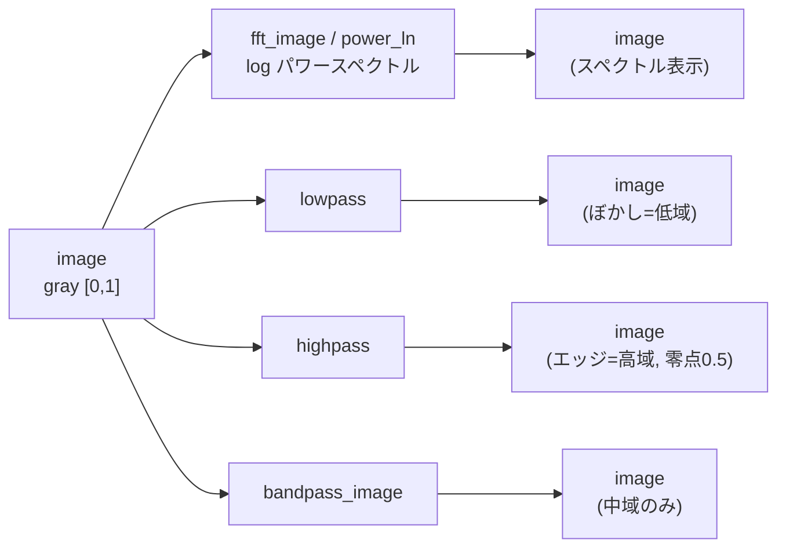
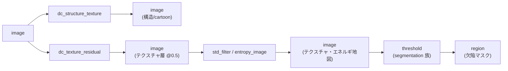

# テクスチャ・周波数・分解 — 使い方ガイド

## この族は何をする道具箱か

この族は「**模様・周期・照明/反射の分離**」を測るための 2-D オペレータ 48 本の道具箱です。入力は一枚のグレー画像(float64、`[0,1]`)、つまみは 2 つのスカラ `a,b ∈ [0,1]`。出力は用途に応じて次の 3 種になります。**画像→画像**(スペクトル、フィルタ済み画像、テクスチャ応答マップ、分解した各層)が大半で、`cooc_feature_matrix` だけは **画像→特徴スカラ**(`[0,1]` の GLCM Haralick 値)を返します。

大きく 3 つのカテゴリに分かれます。**texture**(局所統計・エントロピ・Gabor/LBP/Laws・リッジ強調・census/rank)は「そこに模様があるか、どの向きか」を画素ごとに応答へ変える。**frequency**(FFT/DCT/wavelet のスペクトル、ローパス/ハイパス/バンドパス、Radon)は画像を周波数の言葉に置き換えて、帯域で通したり落としたりする。**decomposition**(構造+テクスチャ、RPCA の低ランク+疎、Retinex、homomorphic、局所コントラスト正規化)は一枚の画像を「滑らかな背景/照明」と「その上のディテール/欠陥」に分ける。工業表面検査では *欠陥* とはまさに背景モデルに属さない残差のことなので、この分解層がそのまま検査対象になります。値域は `[0,1]` に固定されません — ハイパス/バンドパス/逆FFT は負のディテールを持つのが正しく、実装は零点を 0.5 に写す `signed01` 正規化で負の半分を保存します(グラウンドトゥルース検査済み: `examples/gallery2d_texture_freq.py`)。

## 代表的なパイプライン(op の繋がり)

周波数側は「スペクトルを覗く」経路と「帯域で空間フィルタする」経路に分かれます。



テクスチャ・分解側は「背景と残差に割る → 残差のエネルギを測る → しきい値で欠陥領域にする」と繋がり、下流の segmentation 族へ橋渡しされます。



## 使い方(op グループ別)

呼び出しは全 op 共通で `fullseye.apply(img, "<name>", a, b)`。`a,b` 省略時は 0.5。以下、各 op を「名前 — 何をするか — 呼び出し例」で。

### 周波数変換とスペクトル(FFT / DCT / wavelet / Radon)

- `fft_image` — 2-D FFT の対数パワースペクトル `log(1+|F|)` を `[0,1]` 表示。`fullseye.apply(img, "fft_image")`
- `fft_generic` — `fft_image` と同じ対数パワースペクトル(HALCON `fft_generic` 別名)。`fullseye.apply(img, "fft_generic")`
- `power_ln` — 対数パワースペクトル(HALCON `power_ln`、`fft_image` と同経路)。`fullseye.apply(img, "power_ln")`
- `power_real` — スペクトル実部の絶対値 `|Re(F)|` を正規化(HALCON `power_real`)。`fullseye.apply(img, "power_real")`
- `rft_generic` — `power_real` と同じ実部スペクトル(HALCON `rft_generic`)。`fullseye.apply(img, "rft_generic")`
- `power_byte` — パワースペクトル(対数パワー、byte 表示相当、HALCON `power_byte`)。`fullseye.apply(img, "power_byte")`
- `phase_rad` — スペクトルの位相角を `(angle+π)/2π` で `[0,1]` へ(HALCON `phase_rad`)。`fullseye.apply(img, "phase_rad")`
- `phase_deg` — `phase_rad` と同じ位相マップ(HALCON `phase_deg`)。`fullseye.apply(img, "phase_deg")`
- `fft_image_inv` — 逆 FFT の実部を正規化(HALCON `fft_image_inv`)。`fullseye.apply(img, "fft_image_inv")`
- `xsp_dct` — 2-D DCT の対数振幅スペクトル。`fullseye.apply(img, "xsp_dct")`
- `xwt_subband_tile` — Haar DWT の 4 サブバンド(LL/LH/HL/HH)を 2×2 に敷き詰めたモザイク。`fullseye.apply(img, "xwt_subband_tile")`
- `xwt_mra_component` — 多重解像度解析(MRA, db2, 3 レベル)の 1 成分を `a` で選択。`fullseye.apply(img, "xwt_mra_component", 0.5)`
- `xsk2_radon` — Radon 変換のサイノグラム(0..180°)を入力サイズへリサイズ。`fullseye.apply(img, "xsk2_radon")`

### 周波数フィルタ(帯域で通す/落とす)

- `lowpass` — FFT の円形マスクで半径 `≤ 0.05+0.4a` を残す(高周波を落とす=ぼかし)。`fullseye.apply(img, "lowpass", 0.5)`
- `highpass` — FFT の高周波側を通す(エッジ検出、零点 0.5 の `signed01`)。`fullseye.apply(img, "highpass", 0.5)`
- `highpass_image` — `highpass` 同等(HALCON `highpass_image` 別名)。`fullseye.apply(img, "highpass_image")`
- `bandpass_image` — 半径 `a` 下限〜`b` 上限の帯域だけを通す(HALCON `bandpass_image`)。`fullseye.apply(img, "bandpass_image", 0.3, 0.7)`
- `sk_butterworth` — Butterworth 低域通過(`a` = カットオフ比)。`fullseye.apply(img, "sk_butterworth", 0.5)`
- `xsp_dct_lowpass` — DCT 係数の左上ブロックだけ残す低域通過(周波数領域のぼかし)。`fullseye.apply(img, "xsp_dct_lowpass", 0.5)`
- `dc_homomorphic` — `log(I)` を Fourier 領域で高域強調し照明を平坦化(`a` = カットオフ、`b` = 高/低ゲイン差)。`fullseye.apply(img, "dc_homomorphic", 0.5, 0.5)`

### テクスチャ記述(局所統計・エントロピ・対称性)

- `std_filter` — 局所窓の標準偏差 `√(⟨I²⟩−⟨I⟩²)` を正規化(平坦部≈0、模様部で大)。`fullseye.apply(img, "std_filter", 0.5)`
- `deviation_image` — 局所標準偏差(HALCON `deviation_image`、`std_filter` と同族)。`fullseye.apply(img, "deviation_image", 0.5)`
- `texture_laws` — 局所分散ベースのテクスチャエネルギ(Laws、HALCON `texture_laws`)。`fullseye.apply(img, "texture_laws", 0.5)`
- `entropy_image` — 局所ヒストグラムのエントロピ(定数≈0、ノイズ/模様で高、HALCON `entropy_image`)。`fullseye.apply(img, "entropy_image", 0.5)`
- `sk_entropy` — skimage rank エントロピによる局所エントロピ(`entropy_image` の別実装)。`fullseye.apply(img, "sk_entropy", 0.5)`
- `cooc_feature_matrix` — GLCM(共起行列)の Haralick 特徴 energy を **スカラ** `[0,1]` で返す(HALCON `cooc_feature_matrix`)。`fullseye.apply(img, "cooc_feature_matrix", 0.5)`
- `f2_symmetry` — 行方向の局所左右対称性(非対称度、低値=対称、HALCON `symmetry`)。`fullseye.apply(img, "f2_symmetry", 0.5)`

### 方向性・リッジ・畳み込み系テクスチャフィルタ

- `gabor` — DC を除いた Gabor カーネルで畳み込み帯域応答(`a`=向き θ、`b`=周波数)。`fullseye.apply(img, "gabor", 0.5, 0.5)`
- `gen_gabor` — `gabor` と同じ Gabor 帯域応答(HALCON `gen_gabor` 別名)。`fullseye.apply(img, "gen_gabor", 0.5, 0.5)`
- `sk_gabor` — skimage Gabor 実部の振幅(`a`=周波数)。`fullseye.apply(img, "sk_gabor", 0.5)`
- `sk_frangi` — Frangi vesselness(多スケール Hessian で管状/リッジ構造を強調)。`fullseye.apply(img, "sk_frangi")`
- `sk_meijering` — Meijering neuriteness(神経突起状の線構造を強調)。`fullseye.apply(img, "sk_meijering")`
- `xsk_meijering` — `sk_meijering` 同等の Meijering 線フィルタ。`fullseye.apply(img, "xsk_meijering")`
- `sk_hessian` — Hessian ベースのリッジ/ブロブ強調フィルタ。`fullseye.apply(img, "sk_hessian")`
- `xsk_sato` — Sato tubeness(多スケール Hessian の管状構造フィルタ)。`fullseye.apply(img, "xsk_sato")`
- `sk_shape_index` — Koenderink 形状インデックス(局所曲面の形、`signed01`、`a`=σ)。`fullseye.apply(img, "sk_shape_index", 0.5)`
- `xsk_struct_coherence` — 構造テンソル固有値のコヒーレンス `(λ1−λ2)/(λ1+λ2)`(異方性の強さ)。`fullseye.apply(img, "xsk_struct_coherence", 0.5)`
- `xsk2_hog` — HOG(勾配方向ヒストグラム)の可視化画像。`fullseye.apply(img, "xsk2_hog", 0.5)`
- `sk_lbp` — Local Binary Pattern のコード画像(`a`=半径)。`fullseye.apply(img, "sk_lbp", 0.5)`
- `xsp_hilbert_env` — 行方向の解析信号(Hilbert 変換)の包絡振幅。`fullseye.apply(img, "xsp_hilbert_env")`

### 順序不変(census / rank、照明ゲインに頑健)

- `tf_census_transform` — 3×3 近傍との大小比較 8 ビットの census 署名(正のゲインで不変)。`fullseye.apply(img, "tf_census_transform", 0.5)`
- `tf_rank_transform` — 局所窓で自分より小さい近傍の割合=順位(正のゲインで不変)。`fullseye.apply(img, "tf_rank_transform", 0.5)`

### 構造+テクスチャ / 低ランク+疎の分解(検査向け)

- `dc_structure_texture` — TV-L2(ROF, Chambolle 双対)で構造/cartoon 層を抽出(`a`=平滑重み)。`fullseye.apply(img, "dc_structure_texture", 0.5)`
- `dc_texture_residual` — テクスチャ層 = 入力 − 構造(0.5 中心)。`structure + (texture−0.5) == input`(飽和しない範囲で)。`fullseye.apply(img, "dc_texture_residual", 0.5)`
- `dc_rpca_lowrank` — Robust PCA(Principal Component Pursuit)の低ランク(背景)層(`a`=疎/ランクしきい)。`fullseye.apply(img, "dc_rpca_lowrank", 0.5)`
- `dc_rpca_sparse` — RPCA の疎(欠陥/異常)残差 = 入力 − 低ランク(0.5 中心)。`fullseye.apply(img, "dc_rpca_sparse", 0.5)`
- `dc_retinex` — 単一スケール Retinex `log(I)−log(G_σ*I)`(照明不変な反射率、`a`=スケール、`b`=ゲイン)。`fullseye.apply(img, "dc_retinex", 0.5, 0.5)`
- `dc_local_contrast_norm` — 局所コントラスト正規化 `(I−μ_w)/(σ_w+ε)`(0.5 中心、`a`=窓、`b`=std 下限)。`fullseye.apply(img, "dc_local_contrast_norm", 0.5, 0.5)`

## 動く最小例(検証済み gallery2d_texture_freq から)

repo 直下(`C:/dev/projects/imgevolve`)で `py -3.11 <保存名>.py` を実行すると、周波数フィルタ・テクスチャ統計・順序不変性・分解の再構成をグラウンドトゥルースで検証し、最後に `PASS` を出力します。検証済みギャラリー `examples/gallery2d_texture_freq.py` の GT を土台にした自己完結コードです。

```python
import os, sys
sys.path.insert(0, os.getcwd())          # imgevolve リポジトリ直下から実行する
import numpy as np
import fullseye


def lapvar(z):
    """高周波エネルギの近似: 4 近傍ラプラシアンの分散。"""
    lap = z[2:, 1:-1] + z[:-2, 1:-1] + z[1:-1, 2:] + z[1:-1, :-2] - 4 * z[1:-1, 1:-1]
    return float((lap ** 2).mean())


# --- テスト画像を合成(勾配 + 円盤 + 市松 + 微小ノイズ)と補助パターン ---
n = 64
yy, xx = np.mgrid[0:n, 0:n].astype(np.float64)
rng = np.random.default_rng(20260812)
disk = ((yy - n * 0.35) ** 2 + (xx - n * 0.4) ** 2) < (n * 0.18) ** 2
checker = ((xx.astype(int) // 6 + yy.astype(int) // 6) % 2) * 0.15
img = np.clip(0.35 * (xx / (n - 1)) + 0.45 * disk + checker
              + 0.03 * rng.standard_normal((n, n)), 0, 1)
step = np.where(xx < n / 2, 0.2, 0.8)          # 中央に鋭い縦エッジ
flat = np.full((n, n), 0.4)                    # 平坦
tex = np.clip(0.4 + 0.25 * rng.standard_normal((n, n)), 0, 1)  # テクスチャ

# 1) lowpass は高周波エネルギを半分未満に落とす(ぼかし)
assert lapvar(fullseye.apply(img, "lowpass", 0.5, 0.5)) < 0.5 * lapvar(img)

# 2) highpass はエッジ上で平坦部よりはるかに強く応答する(0.5 = ディテール無し)
hp = fullseye.apply(step, "highpass", 0.5, 0.5)
col = n // 2
edge = float(np.abs(hp[:, col - 1:col + 1] - 0.5).mean())
flat_e = float(np.abs(hp[:, 2:6] - 0.5).mean())
assert edge > 3.0 * flat_e

# 3) std_filter: 平坦部の局所標準偏差 ≈ 0、テクスチャ部で大
assert float(fullseye.apply(flat, "std_filter", 0.5, 0.5).mean()) < 1e-3
assert float(fullseye.apply(tex, "std_filter", 0.5, 0.5).mean()) > 0.1

# 4) entropy_image: 定数画像 ≈ 0、ノイズ/テクスチャで高い
assert float(fullseye.apply(flat, "entropy_image", 0.5, 0.5).mean()) < 1e-6
assert float(fullseye.apply(tex, "entropy_image", 0.5, 0.5).mean()) > 0.3

# 5) tf_rank_transform: 正のゲインに不変(順序のみ依存)、コントラスト反転では変化
r1 = fullseye.apply(img, "tf_rank_transform", 0.5, 0.0)
assert np.array_equal(r1, fullseye.apply(0.6 * img, "tf_rank_transform", 0.5, 0.0))
assert not np.array_equal(r1, fullseye.apply(1.0 - img, "tf_rank_transform", 0.5, 0.0))

# 6) xsp_dct_lowpass も高周波エネルギを半減以下にする(周波数領域のぼかし)
assert lapvar(fullseye.apply(img, "xsp_dct_lowpass", 0.5, 0.5)) < 0.5 * lapvar(img)

# 7) 構造 + (テクスチャ - 0.5) は入力を再構成する(飽和しない画素で厳密)
s = fullseye.apply(img, "dc_structure_texture", 0.5, 0.5)
t = fullseye.apply(img, "dc_texture_residual", 0.5, 0.5)
unsat = (t > 1e-9) & (t < 1 - 1e-9)
assert np.allclose((s + (t - 0.5))[unsat], img[unsat], atol=1e-6)

# 8) cooc_feature_matrix は [0,1] のスカラ特徴を返す(画像 → 特徴)
c = float(fullseye.apply(img, "cooc_feature_matrix", 0.5, 0.5))
assert 0.0 <= c <= 1.0

print("PASS")
```

## 数式(必要な op のみ)

パワースペクトル(`fft_image` / `fft_generic` / `power_ln` / `power_byte`)は FFT の対数振幅で、$S(u,v) = \log\!\bigl(1 + |\mathcal{F}\{I\}(u,v)|\bigr)$。位相(`phase_rad` / `phase_deg`)は $\phi = \dfrac{\angle \mathcal{F}\{I\} + \pi}{2\pi} \in [0,1]$。

周波数フィルタ(`lowpass` / `highpass` / `bandpass_image`)は放射周波数 $r=\sqrt{f_u^2+f_v^2}$ のマスク乗算と逆変換:

$$\hat{I} = \mathcal{F}^{-1}\!\bigl\{ \mathcal{F}\{I\}\cdot M(r) \bigr\},\quad
M_{\text{lp}}(r)=\mathbb{1}[r\le r_0],\;\;
M_{\text{hp}}(r)=\mathbb{1}[r> r_0],\;\;
M_{\text{bp}}(r)=\mathbb{1}[r_{\text{lo}}<r<r_{\text{hi}}].$$

局所標準偏差(`std_filter` / `deviation_image`)は窓 $w$ 上で $\sigma_w=\sqrt{\overline{I^2}-\bar{I}^2}$。局所コントラスト正規化(`dc_local_contrast_norm`)は $\dfrac{I-\mu_w}{\sigma_w+\epsilon}$ を 0.5 中心へ。

局所エントロピ(`entropy_image` / `sk_entropy`)は局所ヒストグラム $\{p_k\}$ に対し $H=-\sum_k p_k\log_2 p_k$。GLCM energy(`cooc_feature_matrix`)は正規化共起行列 $P$ の角二次モーメント $E=\sum_{i,j} P(i,j)^2$。

Gabor カーネル(`gabor` / `gen_gabor`)は $g(x,y)=e^{-(x^2+y^2)/2\sigma^2}\cos\!\bigl(2\pi f\,x_\theta\bigr)$($x_\theta=x\cos\theta+y\sin\theta$)を **DC 除去** $g\leftarrow g-\bar{g}$ して帯域通過にしたもの。構造テンソルのコヒーレンス(`xsk_struct_coherence`)は固有値 $\lambda_1\ge\lambda_2$ から $C=\dfrac{\lambda_1-\lambda_2}{\lambda_1+\lambda_2}$。

Retinex 反射率(`dc_retinex`)は $R=\log I-\log(G_\sigma * I)$。構造/テクスチャ分解(`dc_structure_texture` / `dc_texture_residual`)は ROF の TV-L2 問題 $\min_u \dfrac{1}{2\lambda}\lVert u-I\rVert_2^2+\mathrm{TV}(u)$ の解 $u$(構造)と残差 $I-u$(テクスチャ)。Robust PCA(`dc_rpca_lowrank` / `dc_rpca_sparse`)は Principal Component Pursuit $\min_{L,S}\lVert L\rVert_*+\lambda\lVert S\rVert_1 \ \text{s.t.}\ L+S=I$ の低ランク $L$ と疎 $S$。

## サンプルデータ

デバッグには `../../SAMPLES.md` の 2-D 画像源を使えます。合成の `checker_noisy`・`grain_synth`・`weave_synth`・`brick_quilt` は周期/テクスチャ応答(Gabor/LBP/`std_filter`/`cooc_feature_matrix`)や帯域フィルタの確認に、`skimage.data` の `camera`・`coins`(BSD/public domain)は構造+テクスチャ分解や FFT スペクトルの確認に向きます。取得は `import sample_images; sample_images.load("<name>")`。

## 参考文献(正典)

台帳 `../../../REFERENCES.md`。DOI は付さず Author Year, "Title" 形式。

- Cooley, J. W. & Tukey, J. W. (1965). "An Algorithm for the Machine Calculation of Complex Fourier Series." *Mathematics of Computation.* — `fft_image` / `fft_generic` / `power_*` / `phase_*` / `fft_image_inv`
- Ahmed, N., Natarajan, T. & Rao, K. R. (1974). "Discrete Cosine Transform." *IEEE Transactions on Computers.* — `xsp_dct` / `xsp_dct_lowpass`
- Mallat, S. (1989). "A Theory for Multiresolution Signal Decomposition: The Wavelet Representation." *IEEE TPAMI.* — `xwt_subband_tile` / `xwt_mra_component`
- Radon, J. (1917). "Über die Bestimmung von Funktionen durch ihre Integralwerte längs gewisser Mannigfaltigkeiten." — `xsk2_radon`
- Gonzalez, R. C. & Woods, R. E. "Digital Image Processing." — 周波数領域フィルタ `lowpass` / `highpass` / `bandpass_image` / `sk_butterworth`(Butterworth 1930)
- Oppenheim, A. V., Schafer, R. W. & Stockham, T. G. (1968). "Nonlinear Filtering of Multiplied and Convolved Signals." *Proceedings of the IEEE.* — `dc_homomorphic`
- Gabor, D. (1946). "Theory of Communication." *Journal of the IEE.* — 解析信号包絡 `xsp_hilbert_env`
- Daugman, J. G. (1985). "Uncertainty Relation for Resolution in Space, Spatial Frequency, and Orientation Optimized by Two-Dimensional Visual Cortical Filters." *JOSA A.* — `gabor` / `gen_gabor` / `sk_gabor`
- Haralick, R. M., Shanmugam, K. & Dinstein, I. (1973). "Textural Features for Image Classification." *IEEE Transactions on Systems, Man, and Cybernetics.* — `cooc_feature_matrix`
- Laws, K. I. (1980). "Textured Image Segmentation." *Ph.D. Dissertation, University of Southern California.* — `texture_laws`
- Ojala, T., Pietikäinen, M. & Mäenpää, T. (2002). "Multiresolution Gray-Scale and Rotation Invariant Texture Classification with Local Binary Patterns." *IEEE TPAMI.* — `sk_lbp`
- Frangi, A. F., Niessen, W. J., Vincken, K. L. & Viergever, M. A. (1998). "Multiscale Vessel Enhancement Filtering." *MICCAI.* — `sk_frangi`
- Meijering, E. et al. (2004). "Design and Validation of a Tool for Neurite Tracing and Analysis in Fluorescence Microscopy Images." *Cytometry Part A.* — `sk_meijering` / `xsk_meijering`
- Sato, Y. et al. (1998). "Three-Dimensional Multi-Scale Line Filter for Segmentation and Visualization of Curvilinear Structures in Medical Images." *Medical Image Analysis.* — `xsk_sato`
- Koenderink, J. J. & van Doorn, A. J. (1992). "Surface Shape and Curvature Scales." *Image and Vision Computing.* — `sk_shape_index`
- Bigün, J. & Granlund, G. H. (1987). "Optimal Orientation Detection of Linear Symmetry." *ICCV.* — `xsk_struct_coherence`
- Dalal, N. & Triggs, B. (2005). "Histograms of Oriented Gradients for Human Detection." *CVPR.* — `xsk2_hog`
- Zabih, R. & Woodfill, J. (1994). "Non-Parametric Local Transforms for Computing Visual Correspondence." *ECCV.* — `tf_census_transform` / `tf_rank_transform`
- Rudin, L. I., Osher, S. & Fatemi, E. (1992). "Nonlinear Total Variation Based Noise Removal Algorithms." *Physica D.* — `dc_structure_texture` / `dc_texture_residual`
- Chambolle, A. (2004). "An Algorithm for Total Variation Minimization and Applications." *Journal of Mathematical Imaging and Vision.* — `dc_structure_texture`(双対射影)
- Candès, E. J., Li, X., Ma, Y. & Wright, J. (2011). "Robust Principal Component Analysis?" *Journal of the ACM.* — `dc_rpca_lowrank` / `dc_rpca_sparse`
- Land, E. H. & McCann, J. J. (1971). "Lightness and Retinex Theory." *JOSA.* — `dc_retinex`
- Jobson, D. J., Rahman, Z. & Woodell, G. A. (1997). "Properties and Performance of a Center/Surround Retinex." *IEEE Transactions on Image Processing.* — `dc_retinex`(単一スケール)

---

© 2026 Kazufumi Furuse — Fullseye operator documentation. Licensed under Apache-2.0.
