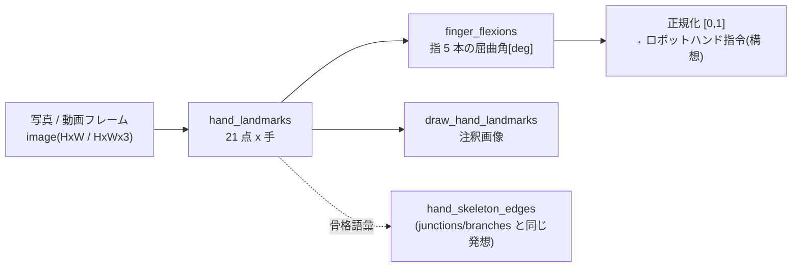

# 手の 21 キーポイントと指屈曲角 — 使い方ガイド

> 呼び出しモデル: この族は `apply(img, "<op名>", a, b)` の 2 つまみ規約では**なく**、
> ファサード関数(`import fullseye; fullseye.hand_landmarks(...)`)です。
> 検出結果が dict のリストという構造化データで、a/b の連続つまみに馴染まないため。
> 検証済みテスト: [`tests/test_handpose.py`](../../../../tests/test_handpose.py)
> (幾何 = 伸びきり 0° / 直角 90° / 描画非破壊 / fail-closed を機械検証)。

## この族は何をする道具箱か

写真・動画から**手の 21 キーポイント**(手首 1 + 各指 4×5)を取り、そこから
**指 5 本の屈曲角**を計算するための入口です。位置づけは Physical AI ブリッジ ——
「人の動きを見て、ロボットに写す」パイプラインの手版の第一歩です。

- `hand_landmarks(image)` — 画像 → 手ごとの 21 点。画像正規化座標(描画用)と
  **world 座標(メートル、手の幾何中心原点)**の両方を返します。関節角の計算は
  遠近で歪まない world 側を使います。
- `finger_flexions(det)` — 1 検出 → 指 5 本の屈曲角[deg]。伸びきり ~0°、
  直角 90°、握り込み ~180°+。**リターゲットの入口**(屈曲量を [0,1] に正規化
  すればロボットハンドの相反駆動指令の最初の近似になる)。
- `hand_skeleton_edges()` — 21 点の骨格結線(手首→付け根、指内、掌の橋)。
  描画やグラフ解析(骨格 op 族と同じ語彙)に。
- `draw_hand_landmarks(image, dets)` — numpy だけで点+骨を描いた注釈画像。

## 依存と fail-closed(重要)

**検出だけ** optional extra です。`mediapipe`(Apache-2.0)と手モデル
`hand_landmarker.task`(~8MB、Apache-2.0)が要り、どちらか欠けると
**導入手順つきの明示エラー**を送出します(黙って空リストは返しません)。
幾何側(`finger_flexions` / `hand_skeleton_edges` / `draw_hand_landmarks`)は
numpy のみで動きます。

```
py -3.11 -m pip install mediapipe
curl -L -o %USERPROFILE%/.cache/fullseye/hand_landmarker.task ^
    https://storage.googleapis.com/mediapipe-models/hand_landmarker/hand_landmarker/float16/1/hand_landmarker.task
```

## 代表的なパイプライン(op の繋がり)



## 使い方

```python
import numpy as np
import handpose as H

# --- 検出(mediapipe + モデルが要る。無ければ導入手順つきエラー)---
# dets = H.hand_landmarks(rgb_image)          # list[dict]

# --- 幾何は numpy だけで動く: 合成 world 座標で屈曲角を確かめる ---
w = np.zeros((21, 3))
for f, chain in enumerate(H.FINGERS.values()):
    d = np.array([1.0, 0.15 * f, 0.0]); d /= np.linalg.norm(d)
    for j, idx in enumerate(chain):
        w[idx] = 0.03 * (j + 1) * d                 # 全指伸びきり(手首から放射直線)
flex = H.finger_flexions({"world_landmarks": w})
assert all(abs(v) < 0.1 for v in flex.values())     # 伸びきり = 0°

mcp, pip, dip, tip = H.FINGERS["index"]
w[dip] = w[pip] + (0.0, 0.0, 0.03)                  # 人差し指を PIP で直角に折る
w[tip] = w[dip] + (0.0, 0.0, 0.03)
flex = H.finger_flexions({"world_landmarks": w})
assert abs(flex["index"] - 90.0) < 0.1              # 直角 = 90°
print({k: round(v, 1) for k, v in flex.items()})
```

デモ(画像 1 枚 / Web カメラ 1 フレーム):
[`examples/hand_tracking_demo.py`](../../../../examples/hand_tracking_demo.py)

## 正直な現状と落とし穴

- **検証済み**: 幾何(屈曲角の 0°/90° GT、結線の全点被覆、描画の非破壊)、
  モデル不在の fail-closed、空画像 → 0 検出の機械的 e2e。
- **未検証**: 実写での検出品質はまだ運用実績がありません(モデルは MediaPipe
  Hands の公開学習済み。手が画面の 1/10 以上を占める距離が目安)。
- **落とし穴 1**: 関節角は正規化座標でなく **world 座標で**計算すること。
  正規化座標は遠近とアスペクトで歪みます(`finger_flexions` は world 前提)。
- **落とし穴 2**: `handedness` は解剖学的左右(鏡像の自撮り映像では見た目と
  逆になり得る)。
- **落とし穴 3**: 屈曲角は MCP+PIP の折れ角の**和**という素朴な定義です。
  過伸展(反り)は 0° 側に折り返さず正の角になります —— 反り分離が要る用途は
  符号付き定義に差し替えてから使ってください。

## 関連

- 骨格グラフ族(`junctions_skeleton` / `skeleton_branches3d` など)—— 「点と結線で
  形を読む」同じ発想の 2D/3D 版。
- Physical AI 知覚スタック(ステレオ・6DoF 姿勢)—— 手の 3D 化(両眼/深度で
  world 座標を実測に置換)はこの先の接続点。
