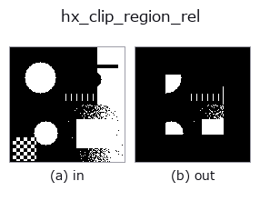
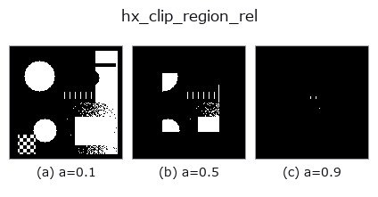
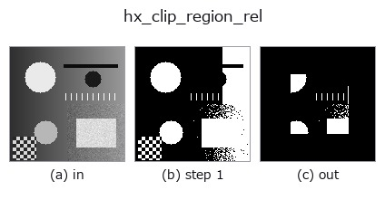
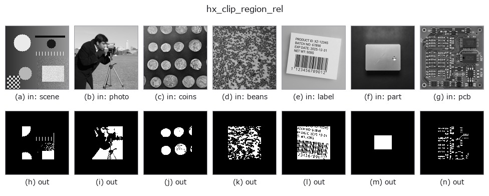

# hx_clip_region_rel — 2D `halcon_ext` op

- **データ種**: `region` → `region`
- **呼び出し**: `fullseye.apply(img, "hx_clip_region_rel", a=0.5, b=0.5)` (2-D は 1 画像 + 2 スカラつまみ `a,b∈[0,1]` のモデル)
- **HALCON 相当**: `clip_region_rel`(意味・パラメータは HALCON リファレンスが参考になる)



*図は合成の入力 128×128 で実際に走らせた出力。左が入力、右が出力。点群は上から見た散布(明るさ = z)、1-D 列は折れ線、体積は z 方向の最大値投影、動画は中央フレーム、複素画像は振幅、絵にならない返り値は値そのもの。*

**つまみ a を振る**(0.1 / 0.5 / 0.9、もう一方は既定):



*つまみ b は出力を変えない(実測: 0.1 / 0.5 / 0.9 で同一)。*

**段階**(前置きの op → この op。左から順):



**別の画像でも**(合成シーン / 写真 / 硬貨。上段が入力、下段がその出力。つまみは既定):



## 使い方

region をその外接矩形に対し相対的にクリップ(各辺から a の割合を削る)。

``v > 0.5`` の region の外接矩形 ``[y0, y1] × [x0, x1]`` を求め、その高さ・幅の ``0.5*a`` ずつを上下左右から
削った内側の矩形に含まれる画素だけを残して 0/1 の float 配列で返す。

- ``a`` → 各辺から削る割合 ``my = int((y1-y0)*0.5*a)``、``mx = int((x1-x0)*0.5*a)``。a=0 で無変化、a=1 で
外接矩形の中心線付近(1 行・1 列程度)しか残らない。
- ``b`` は未使用。
- region が空なら空のまま返す。

削るのは外接矩形に対する相対量なので、region の大きさが違っても「周辺 x% を落とす」意味が保たれる。外接矩形は
region 全体で 1 つ(成分ごとではない)ため、離れた小成分が並ぶ場合は端の成分がまるごと消えることがある。
画像基準の中央矩形で切るなら ``hx_rectangle1_domain`` との論理積を使う。

## 詳しい使い方ガイド

- [gallery2d_halcon_ext ファミリ ガイド](../guides/gallery2d_halcon_ext.md)

## 参考(サンプルデータ・文献)

- [サンプルデータ カタログ(DL URL / ライセンス)](../../SAMPLES.md) — 2-D は skimage.data(BSD/public)+ 合成、3-D は実データ源(Stanford/PDS 等)の DL URL。
- [演算子の来歴・参考文献](../../../REFERENCES.md) — この op 族の元になった研究/手法の出典。
- アルゴリズムの正典(著者・年)と用途は上記**ファミリ使い方ガイド**に記載。

## Studio で試す

下のプログラムは実際に走ることを確かめてある(図と同じ入力)。Studio のヘルプではこのブロックがボタンになり、その場で読み込んで実行できる。

```program
threshold 0.50 0.50
hx_clip_region_rel 0.50 0.50
```

## 実行できる例(この op を実際に呼ぶ検証済みサンプル)

- [gallery2d_halcon_ext](../../../../examples/gallery2d_halcon_ext.py) — `py -3.11 examples/gallery2d_halcon_ext.py`

## 型が繋がる次の op(`region` を入力に取れる)

[identity](../misc/identity.md) · [reg_erode](../region/reg_erode.md) · [reg_dilate](../region/reg_dilate.md) · [reg_open](../region/reg_open.md) · [reg_close](../region/reg_close.md) · [fill_holes](../region/fill_holes.md) · [select_largest](../region/select_largest.md) · [remove_small](../region/remove_small.md)

## 同カテゴリ(`halcon_ext`)

[hx_gen_circle](hx_gen_circle.md) · [hx_gen_ellipse](hx_gen_ellipse.md) · [hx_gen_rectangle2](hx_gen_rectangle2.md) · [hx_gen_checker_region](hx_gen_checker_region.md) · [hx_gen_grid_region](hx_gen_grid_region.md) · [hx_gabor](hx_gabor.md) · [hx_fit_surface1](hx_fit_surface1.md) · [hx_fit_surface2](hx_fit_surface2.md)

---
*Provenance: ops.py — 2D operator registry. この per-op ノートは `tools/opdocs.py md` が自動生成(手編集しない)。*

© 2026 Kazufumi Furuse — Fullseye operator documentation. Licensed under Apache-2.0.
