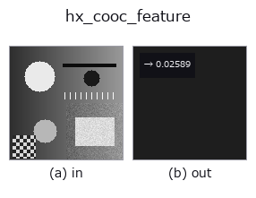
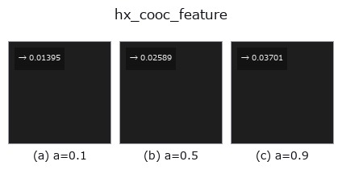
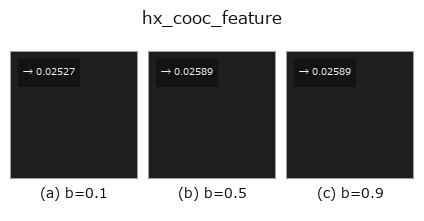

# hx_cooc_feature — 2D `halcon_ext` op

- **データ種**: `image` → `feature`
- **呼び出し**: `fullseye.apply(img, "hx_cooc_feature", a=0.5, b=0.5)` (2-D は 1 画像 + 2 スカラつまみ `a,b∈[0,1]` のモデル)
- **HALCON 相当**: `cooc_feature_image`(意味・パラメータは HALCON リファレンスが参考になる)



*図は合成の入力 128×128 で実際に走らせた出力。左が入力、右が出力。点群は上から見た散布(明るさ = z)、1-D 列は折れ線、体積は z 方向の最大値投影、動画は中央フレーム、複素画像は振幅、絵にならない返り値は値そのもの。*

**つまみ a を振る**(0.1 / 0.5 / 0.9、もう一方は既定):



**つまみ b を振る**(0.1 / 0.5 / 0.9、もう一方は既定):



## 使い方

量子化して距離 d の水平共起行列を作り、Haralick contrast を返す(a=距離, b は角度選択)。

入力 ``v``([0,1] 画像)を ``int(v*8)`` で 8 階調に量子化し(clip で 0〜7)、距離 ``d`` だけ離れた画素対の
出現回数を 8×8 の共起行列にして転置を足し(対称化)、総和で割って確率にする。返すのは Haralick の
contrast ``sum p(i,j)*(i-j)^2`` を最大値 ``(8-1)^2 = 49`` で割った ``np.float64``(値域 [0,1])。

- ``a`` → 距離 ``d = 1 + int(a*3)``(1〜4 画素)。
- ``b`` → 方向。``b < 0.5`` で水平(同じ行で ``d`` 列右)、``b >= 0.5`` で垂直(同じ列で ``d`` 行下)。斜め方向は無い。
- 画像の幅(または高さ)が ``d`` 以下で画素対が 1 つも作れないと総和 0 とみなして 0.0 を返す(例外は出さない)。

値が大きいほど隣接画素の階調差が大きい(粗い/コントラストの高いテクスチャ)。8 階調のため微妙な濃淡差は同じ
階調に潰れる。16 階調の ``skimage`` 実装 ``cooc_feature_matrix`` とは階調数・正規化が異なり数値は一致しない。
前段に ``hx_gabor`` や ``mean_image`` など画像 op、後段は feature として比較・しきい値に使う。

## 詳しい使い方ガイド

- [gallery2d_halcon_ext ファミリ ガイド](../guides/gallery2d_halcon_ext.md)

## 参考(サンプルデータ・文献)

- [サンプルデータ カタログ(DL URL / ライセンス)](../../SAMPLES.md) — 2-D は skimage.data(BSD/public)+ 合成、3-D は実データ源(Stanford/PDS 等)の DL URL。
- [演算子の来歴・参考文献](../../../REFERENCES.md) — この op 族の元になった研究/手法の出典。
- アルゴリズムの正典(著者・年)と用途は上記**ファミリ使い方ガイド**に記載。

## Studio で試す

下のプログラムは実際に走ることを確かめてある(図と同じ入力)。Studio のヘルプではこのブロックがボタンになり、その場で読み込んで実行できる。

```program
hx_cooc_feature 0.50 0.50
```

## 実行できる例(この op を実際に呼ぶ検証済みサンプル)

- [gallery2d_halcon_ext](../../../../examples/gallery2d_halcon_ext.py) — `py -3.11 examples/gallery2d_halcon_ext.py`

## 型が繋がる次の op(`feature` を入力に取れる)

[identity](../misc/identity.md)

## 同カテゴリ(`halcon_ext`)

[hx_gen_circle](hx_gen_circle.md) · [hx_gen_ellipse](hx_gen_ellipse.md) · [hx_gen_rectangle2](hx_gen_rectangle2.md) · [hx_gen_checker_region](hx_gen_checker_region.md) · [hx_gen_grid_region](hx_gen_grid_region.md) · [hx_gabor](hx_gabor.md) · [hx_fit_surface1](hx_fit_surface1.md) · [hx_fit_surface2](hx_fit_surface2.md)

---
*Provenance: ops.py — 2D operator registry. この per-op ノートは `tools/opdocs.py md` が自動生成(手編集しない)。*

© 2026 Kazufumi Furuse — Fullseye operator documentation. Licensed under Apache-2.0.
