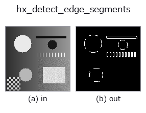
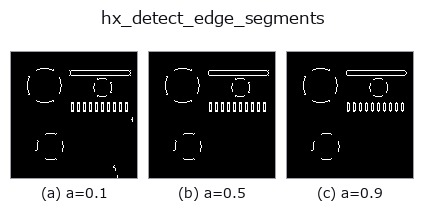
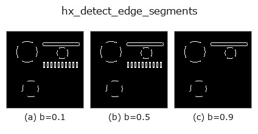
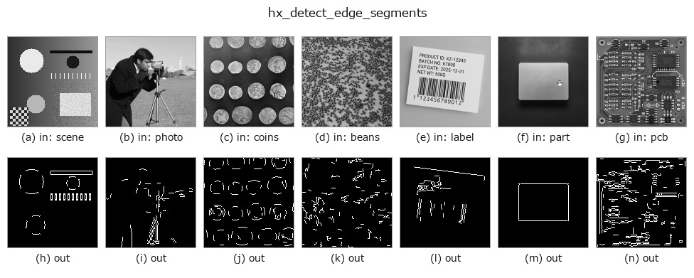

# hx_detect_edge_segments — 2D `halcon_ext` op

- **データ種**: `image` → `region`
- **呼び出し**: `fullseye.apply(img, "hx_detect_edge_segments", a=0.5, b=0.5)` (2-D は 1 画像 + 2 スカラつまみ `a,b∈[0,1]` のモデル)
- **HALCON 相当**: `detect_edge_segments`(意味・パラメータは HALCON リファレンスが参考になる)



*図は合成の入力 128×128 で実際に走らせた出力。左が入力、右が出力。点群は上から見た散布(明るさ = z)、1-D 列は折れ線、体積は z 方向の最大値投影、動画は中央フレーム、複素画像は振幅、絵にならない返り値は値そのもの。*

**つまみ a を振る**(0.1 / 0.5 / 0.9、もう一方は既定):



**つまみ b を振る**(0.1 / 0.5 / 0.9、もう一方は既定):



**別の画像でも**(合成シーン / 写真 / 硬貨。上段が入力、下段がその出力。つまみは既定):



*4 列目はカラー (H,W,3) の入力。この op は色を跨がずに扱える(色チャネルを 3 本目の空間軸として畳み込まない)。*

## 使い方

直線的なエッジ断片を検出: NMS で細線化 → 連結成分のうち PCA で細長い(直線状)ものを残す。

``hx_nonmax_dir(v, a, 0)`` で細線化したエッジ(``> 0``)を 8 近傍で連結成分に分け、各成分の画素座標の共分散
固有値比 ``λmax/λmin`` が ``min_ratio`` 以上のもの(細長い=直線状)だけを 1 とする 0/1 の float region を返す。

- ``a`` → 細線化段の弱エッジしきい値(``hx_nonmax_dir`` の ``a`` と同じ。正規化振幅 ``a*0.3`` 未満を捨てる)。
- ``b`` → 細長さのしきい値 ``min_ratio = 3 + b*12``(3〜15)。大きいほど真っ直ぐな断片だけ残る。
- 画素数 5 未満の成分は無条件に捨てる。``λmin`` がほぼ 0(完全な直線)なら比を無限大として採用する。

注意: 直線性の判定は「点群の広がりが 1 軸に偏っているか」であり、曲線でも十分細長ければ通る。細線化段が斜め
エッジをほとんど細線化しない(``hx_nonmax_dir`` の注記参照)ため、斜めのエッジは幅を持った塊になり固有値比が
下がって落とされやすい。連結成分単位なので、交差した線は 1 つの成分として比が下がる。後段で線分ごとに扱うなら
``hx_region_to_label`` や ``hough_line_trans``。

## 詳しい使い方ガイド

- [gallery2d_halcon_ext ファミリ ガイド](../guides/gallery2d_halcon_ext.md)

## 参考(サンプルデータ・文献)

- [サンプルデータ カタログ(DL URL / ライセンス)](../../SAMPLES.md) — 2-D は skimage.data(BSD/public)+ 合成、3-D は実データ源(Stanford/PDS 等)の DL URL。
- [演算子の来歴・参考文献](../../../REFERENCES.md) — この op 族の元になった研究/手法の出典。
- アルゴリズムの正典(著者・年)と用途は上記**ファミリ使い方ガイド**に記載。

## Studio で試す

下のプログラムは実際に走ることを確かめてある(図と同じ入力)。Studio のヘルプではこのブロックがボタンになり、その場で読み込んで実行できる。

```program
hx_detect_edge_segments 0.50 0.50
```

## 実行できる例(この op を実際に呼ぶ検証済みサンプル)

- [gallery2d_halcon_ext](../../../../examples/gallery2d_halcon_ext.py) — `py -3.11 examples/gallery2d_halcon_ext.py`

## 型が繋がる次の op(`region` を入力に取れる)

[identity](../misc/identity.md) · [reg_erode](../region/reg_erode.md) · [reg_dilate](../region/reg_dilate.md) · [reg_open](../region/reg_open.md) · [reg_close](../region/reg_close.md) · [fill_holes](../region/fill_holes.md) · [select_largest](../region/select_largest.md) · [remove_small](../region/remove_small.md)

## 同カテゴリ(`halcon_ext`)

[hx_gen_circle](hx_gen_circle.md) · [hx_gen_ellipse](hx_gen_ellipse.md) · [hx_gen_rectangle2](hx_gen_rectangle2.md) · [hx_gen_checker_region](hx_gen_checker_region.md) · [hx_gen_grid_region](hx_gen_grid_region.md) · [hx_gabor](hx_gabor.md) · [hx_fit_surface1](hx_fit_surface1.md) · [hx_fit_surface2](hx_fit_surface2.md)

---
*Provenance: ops.py — 2D operator registry. この per-op ノートは `tools/opdocs.py md` が自動生成(手編集しない)。*

© 2026 Kazufumi Furuse — Fullseye operator documentation. Licensed under Apache-2.0.
