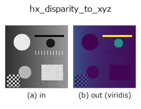
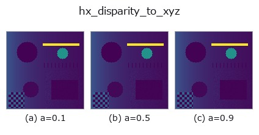
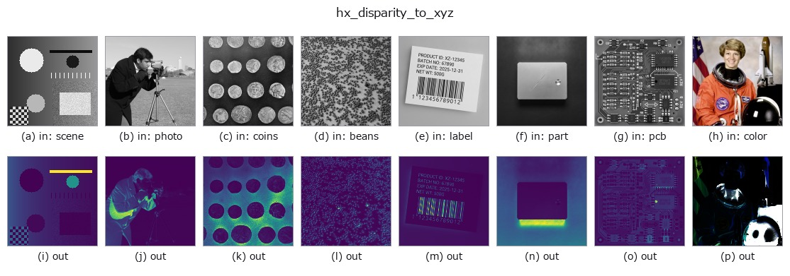

# hx_disparity_to_xyz — 2D `halcon_ext` op

- **データ種**: `image` → `image`
- **呼び出し**: `fullseye.apply(img, "hx_disparity_to_xyz", a=0.5, b=0.5)` (2-D は 1 画像 + 2 スカラつまみ `a,b∈[0,1]` のモデル)
- **HALCON 相当**: `disparity_image_to_xyz`(意味・パラメータは HALCON リファレンスが参考になる)



*図は合成の入力 128×128 で実際に走らせた出力。左が入力、右が出力。点群は上から見た散布(明るさ = z)、1-D 列は折れ線、体積は z 方向の最大値投影、動画は中央フレーム、複素画像は振幅、絵にならない返り値は値そのもの。*

*出力は viridis 風の疑似カラー(暗い紫 = 小、黄 = 大)。距離・位相・向き・深度のような「量の場」を読むため。*

**つまみ a を振る**(0.1 / 0.5 / 0.9、もう一方は既定):



**つまみ b を振る**(0.1 / 0.5 / 0.9、もう一方は既定):


**別の画像でも**(合成シーン / 写真 / 硬貨。上段が入力、下段がその出力。つまみは既定):



*4 列目はカラー (H,W,3) の入力。この op は色を跨がずに扱える(色チャネルを 3 本目の空間軸として畳み込まない)。*

## 使い方

視差画像から深度 Z = f*baseline/disparity を計算(焦点/基線は a,b で可変)。正規化 Z。

``v``(0〜1)を視差 ``disp = v*63 + 0.5`` 画素相当に写し、``Z = f * baseline / disp`` を計算して min-max で
[0,1] に正規化した画像を返す。X, Y は計算しない(Z のみ)。

- ``a`` → 焦点距離 ``f = 200 + 600*a``。
- ``b`` → 基線長 ``baseline = 0.05 + 0.15*b``。
- 視差の下限を 0.5 に置いているのでゼロ除算は起きない。

注意: ``f * baseline`` は全画素共通の定数倍で、最後の min-max 正規化で打ち消されるため、``a``, ``b`` を変えても
出力は変わらない(実測で完全一致)。出力は実質「視差の逆数を正規化したもの」で、視差最大(``v = 1``)が 0、
視差最小(``v = 0``)が 1 になる(近い物ほど暗い)。絶対的な深度が要る用途には使えない。逆数変換で遠方の
量子化が粗くなるので、``v`` が小さい領域の値は不安定。

## 詳しい使い方ガイド

- [gallery2d_halcon_ext ファミリ ガイド](../guides/gallery2d_halcon_ext.md)

## 参考(サンプルデータ・文献)

- [サンプルデータ カタログ(DL URL / ライセンス)](../../SAMPLES.md) — 2-D は skimage.data(BSD/public)+ 合成、3-D は実データ源(Stanford/PDS 等)の DL URL。
- [演算子の来歴・参考文献](../../../REFERENCES.md) — この op 族の元になった研究/手法の出典。
- アルゴリズムの正典(著者・年)と用途は上記**ファミリ使い方ガイド**に記載。

## Studio で試す

下のプログラムは実際に走ることを確かめてある(図と同じ入力)。Studio のヘルプではこのブロックがボタンになり、その場で読み込んで実行できる。

```program
hx_disparity_to_xyz 0.50 0.50
```

## 実行できる例(この op を実際に呼ぶ検証済みサンプル)

- [gallery2d_halcon_ext](../../../../examples/gallery2d_halcon_ext.py) — `py -3.11 examples/gallery2d_halcon_ext.py`

## 型が繋がる次の op(`image` を入力に取れる)

[identity](../misc/identity.md) · [gaussian](../smoothing/gaussian.md) · [mean_box](../smoothing/mean_box.md) · [bilateral](../smoothing/bilateral.md) · [unsharp](../smoothing/unsharp.md) · [median](../rank/median.md) · [min_filter](../rank/min_filter.md) · [max_filter](../rank/max_filter.md)

## 同カテゴリ(`halcon_ext`)

[hx_gen_circle](hx_gen_circle.md) · [hx_gen_ellipse](hx_gen_ellipse.md) · [hx_gen_rectangle2](hx_gen_rectangle2.md) · [hx_gen_checker_region](hx_gen_checker_region.md) · [hx_gen_grid_region](hx_gen_grid_region.md) · [hx_gabor](hx_gabor.md) · [hx_fit_surface1](hx_fit_surface1.md) · [hx_fit_surface2](hx_fit_surface2.md)

---
*Provenance: ops.py — 2D operator registry. この per-op ノートは `tools/opdocs.py md` が自動生成(手編集しない)。*

© 2026 Kazufumi Furuse — Fullseye operator documentation. Licensed under Apache-2.0.
