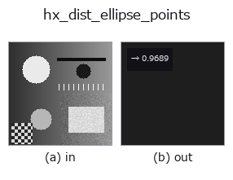
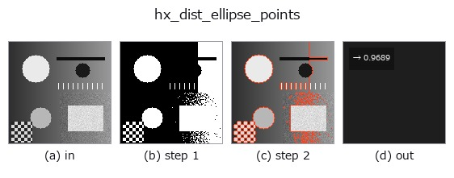

# hx_dist_ellipse_points — 2D `halcon_ext` op

- **データ種**: `contour` → `feature`
- **呼び出し**: `fullseye.apply(img, "hx_dist_ellipse_points", a=0.5, b=0.5)` (2-D は 1 画像 + 2 スカラつまみ `a,b∈[0,1]` のモデル)
- **HALCON 相当**: `dist_ellipse_contour_points_xld`(意味・パラメータは HALCON リファレンスが参考になる)



*図は合成の入力 128×128 で実際に走らせた出力。左が入力、右が出力。点群は上から見た散布(明るさ = z)、1-D 列は折れ線、体積は z 方向の最大値投影、動画は中央フレーム、複素画像は振幅、絵にならない返り値は値そのもの。*

*つまみ a は出力を変えない(実測: 0.1 / 0.5 / 0.9 で同一)。*

*つまみ b は出力を変えない(実測: 0.1 / 0.5 / 0.9 で同一)。*

**段階**(前置きの op → この op。左から順):



## 使い方

contour 各点の当てはめ楕円境界からの最大距離を返す(点別 distance の集約=max、feature)。

``hx_dist_ellipse_contour`` と同じ手順(全点をまとめ、重心と共分散の固有分解から半軸 ``2*sqrt(λ)`` の楕円を
当て、各点の正規化半径 ``rad`` を計算)で、``|rad - 1|`` の平均ではなく最大値を 1 で頭打ちした ``np.float64``
で返す。

- ``a``, ``b`` は未使用。
- 点が 4 個未満なら 0.0。

最大値なので外れ点 1 つで決まる(雑音に敏感)。値は楕円の正規化座標での差で画素距離ではない。半軸 2σ の
取り方は境界だけの点群に対して sqrt(2) 倍大きいため、完全な楕円輪郭でも約 0.29 の下駄が乗る点は平均版と同じ。
平均版は ``hx_dist_ellipse_contour``、外れ点を減らすなら前段に ``smooth_contours_xld``。

## 詳しい使い方ガイド

- [gallery2d_halcon_ext ファミリ ガイド](../guides/gallery2d_halcon_ext.md)

## 参考(サンプルデータ・文献)

- [サンプルデータ カタログ(DL URL / ライセンス)](../../SAMPLES.md) — 2-D は skimage.data(BSD/public)+ 合成、3-D は実データ源(Stanford/PDS 等)の DL URL。
- [演算子の来歴・参考文献](../../../REFERENCES.md) — この op 族の元になった研究/手法の出典。
- アルゴリズムの正典(著者・年)と用途は上記**ファミリ使い方ガイド**に記載。

## Studio で試す

下のプログラムは実際に走ることを確かめてある(図と同じ入力)。Studio のヘルプではこのブロックがボタンになり、その場で読み込んで実行できる。

```program
threshold 0.50 0.50
sk_find_contours 0.50 0.50
hx_dist_ellipse_points 0.50 0.50
```

## 実行できる例(この op を実際に呼ぶ検証済みサンプル)

- [gallery2d_halcon_ext](../../../../examples/gallery2d_halcon_ext.py) — `py -3.11 examples/gallery2d_halcon_ext.py`

## 型が繋がる次の op(`feature` を入力に取れる)

[identity](../misc/identity.md)

## 同カテゴリ(`halcon_ext`)

[hx_gen_circle](hx_gen_circle.md) · [hx_gen_ellipse](hx_gen_ellipse.md) · [hx_gen_rectangle2](hx_gen_rectangle2.md) · [hx_gen_checker_region](hx_gen_checker_region.md) · [hx_gen_grid_region](hx_gen_grid_region.md) · [hx_gabor](hx_gabor.md) · [hx_fit_surface1](hx_fit_surface1.md) · [hx_fit_surface2](hx_fit_surface2.md)

---
*Provenance: ops.py — 2D operator registry. この per-op ノートは `tools/opdocs.py md` が自動生成(手編集しない)。*

© 2026 Kazufumi Furuse — Fullseye operator documentation. Licensed under Apache-2.0.
