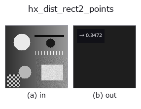
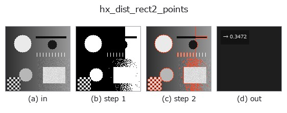

# hx_dist_rect2_points — 2D `halcon_ext` op

- **データ種**: `contour` → `feature`
- **呼び出し**: `fullseye.apply(img, "hx_dist_rect2_points", a=0.5, b=0.5)` (2-D は 1 画像 + 2 スカラつまみ `a,b∈[0,1]` のモデル)
- **HALCON 相当**: `dist_rectangle2_contour_points_xld`(意味・パラメータは HALCON リファレンスが参考になる)



*図は合成の入力 128×128 で実際に走らせた出力。左が入力、右が出力。点群は上から見た散布(明るさ = z)、1-D 列は折れ線、体積は z 方向の最大値投影、動画は中央フレーム、複素画像は振幅、絵にならない返り値は値そのもの。*

*つまみ a は出力を変えない(実測: 0.1 / 0.5 / 0.9 で同一)。*

*つまみ b は出力を変えない(実測: 0.1 / 0.5 / 0.9 で同一)。*

**段階**(前置きの op → この op。左から順):



## 使い方

contour 各点から最小面積外接矩形の辺までの正規化距離の平均(feature)。

全 contour の点をまとめて厳密な最小面積外接矩形(回転キャリパー)を求め、各点からその矩形の
最も近い辺までのユークリッド距離の平均を ``max(H, W)`` で割り、1 で頭打ちした ``np.float64`` を返す。
矩形は全点を包むので、点 ``(u, w)``(矩形の軸方向の座標、中心が原点)の距離は
``min(h1 - |u|, h2 - |w|)``(``h1``/``h2`` は半辺長)になる。

- ``a``, ``b`` は未使用。
- 点が 3 個未満なら 0.0。全点が一直線に並ぶ(幅 0 の矩形)ときも 0.0。

値は「輪郭がどれだけ矩形の縁に沿っているか」を表す: 矩形の輪郭そのものなら 0、円なら半径の
約 0.0997 倍(``1 - (4/π)·sin(π/4)``)、内側に点が多いほど大きい。矩形の向きによらない
(回転不変)。HALCON の ``dist_rectangle2_contour_points_xld`` は矩形を引数で受け取り点ごとの距離を
返すが、この op は contour 自身に当てた最小面積矩形を使い、平均の 1 値に畳む。

2026-10-11 まで、名前に反して矩形を求めず「点の重心からの平均距離」を返していた
(矩形の輪郭でも 0 にならず、正方形の輪郭で約 0.57·辺長/``max(H, W)``)。矩形そのものは
``hx_smallest_rect2_xld`` / ``hx_fit_rectangle2_contour``、重心からの広がりは ``hx_moments_any_xld``。

## 詳しい使い方ガイド

- [gallery2d_halcon_ext ファミリ ガイド](../guides/gallery2d_halcon_ext.md)

## 参考(サンプルデータ・文献)

- [サンプルデータ カタログ(DL URL / ライセンス)](../../SAMPLES.md) — 2-D は skimage.data(BSD/public)+ 合成、3-D は実データ源(Stanford/PDS 等)の DL URL。
- [演算子の来歴・参考文献](../../../REFERENCES.md) — この op 族の元になった研究/手法の出典。
- アルゴリズムの正典(著者・年)と用途は上記**ファミリ使い方ガイド**に記載。

## Studio で試す

下のプログラムは実際に走ることを確かめてある(図と同じ入力)。Studio のヘルプではこのブロックがボタンになり、その場で読み込んで実行できる。

```program
threshold 0.50 0.50
sk_find_contours 0.50 0.50
hx_dist_rect2_points 0.50 0.50
```

## 実行できる例(この op を実際に呼ぶ検証済みサンプル)

- [gallery2d_halcon_ext](../../../../examples/gallery2d_halcon_ext.py) — `py -3.11 examples/gallery2d_halcon_ext.py`

## 型が繋がる次の op(`feature` を入力に取れる)

[identity](../misc/identity.md) · [feature_to_img](../bridge/feature_to_img.md)

## 同カテゴリ(`halcon_ext`)

[hx_gen_circle](hx_gen_circle.md) · [hx_gen_ellipse](hx_gen_ellipse.md) · [hx_gen_rectangle2](hx_gen_rectangle2.md) · [hx_gen_checker_region](hx_gen_checker_region.md) · [hx_gen_grid_region](hx_gen_grid_region.md) · [hx_gabor](hx_gabor.md) · [hx_fit_surface1](hx_fit_surface1.md) · [hx_fit_surface2](hx_fit_surface2.md)

---
*Provenance: ops.py — 2D operator registry. この per-op ノートは `tools/opdocs.py md` が自動生成(手編集しない)。*

© 2026 Kazufumi Furuse — Fullseye operator documentation. Licensed under Apache-2.0.
