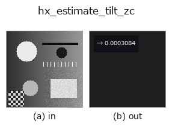

# hx_estimate_tilt_zc — 2D `halcon_ext` op

- **データ種**: `image` → `feature`
- **呼び出し**: `fullseye.apply(img, "hx_estimate_tilt_zc", a=0.5, b=0.5)` (2-D は 1 画像 + 2 スカラつまみ `a,b∈[0,1]` のモデル)
- **HALCON 相当**: `estimate_tilt_zc`(意味・パラメータは HALCON リファレンスが参考になる)



*図は合成の入力 128×128 で実際に走らせた出力。左が入力、右が出力。点群は上から見た散布(明るさ = z)、1-D 列は折れ線、体積は z 方向の最大値投影、動画は中央フレーム、複素画像は振幅、絵にならない返り値は値そのもの。*

*つまみ a は出力を変えない(実測: 0.1 / 0.5 / 0.9 で同一)。*

*つまみ b は出力を変えない(実測: 0.1 / 0.5 / 0.9 で同一)。*

## 使い方

Zheng-Chellappa: 正規化勾配の平均方向で tilt を推定(局所コントラスト非依存)。

Sobel 勾配 ``(Ex, Ey)`` を各画素で振幅 ``hypot(Ex, Ey) + 1e-9`` で割った単位ベクトルにしてから平均し、
``tilt = arctan2(<Ey/|E|>, <Ex/|E|>)`` を ``(tilt / 2π) mod 1`` で [0,1) に写した ``np.float64`` を返す
(Zheng-Chellappa の tilt 推定)。

- ``a``, ``b`` は未使用。
- 角度の規約は ``hx_estimate_tilt_lr`` と同じ(0 が +列方向、0.25 が +行方向)。

各画素の寄与が方向だけになるため、強いエッジや明るい部分に引きずられにくい。反面、勾配がほぼ 0 の平坦部でも
(``1e-9`` で割った)雑音の方向が等しく 1 票を持つので、平坦な背景が広い画像では推定がぼやける。前段で
``gauss_filter`` を掛けて雑音の勾配を減らすと安定する。

## 詳しい使い方ガイド

- [gallery2d_halcon_ext ファミリ ガイド](../guides/gallery2d_halcon_ext.md)

## 参考(サンプルデータ・文献)

- [サンプルデータ カタログ(DL URL / ライセンス)](../../SAMPLES.md) — 2-D は skimage.data(BSD/public)+ 合成、3-D は実データ源(Stanford/PDS 等)の DL URL。
- [演算子の来歴・参考文献](../../../REFERENCES.md) — この op 族の元になった研究/手法の出典。
- アルゴリズムの正典(著者・年)と用途は上記**ファミリ使い方ガイド**に記載。

## Studio で試す

下のプログラムは実際に走ることを確かめてある(図と同じ入力)。Studio のヘルプではこのブロックがボタンになり、その場で読み込んで実行できる。

```program
hx_estimate_tilt_zc 0.50 0.50
```

## 実行できる例(この op を実際に呼ぶ検証済みサンプル)

- [gallery2d_halcon_ext](../../../../examples/gallery2d_halcon_ext.py) — `py -3.11 examples/gallery2d_halcon_ext.py`

## 型が繋がる次の op(`feature` を入力に取れる)

[identity](../misc/identity.md)

## 同カテゴリ(`halcon_ext`)

[hx_gen_circle](hx_gen_circle.md) · [hx_gen_ellipse](hx_gen_ellipse.md) · [hx_gen_rectangle2](hx_gen_rectangle2.md) · [hx_gen_checker_region](hx_gen_checker_region.md) · [hx_gen_grid_region](hx_gen_grid_region.md) · [hx_gabor](hx_gabor.md) · [hx_fit_surface1](hx_fit_surface1.md) · [hx_fit_surface2](hx_fit_surface2.md)

---
*Provenance: ops.py — 2D operator registry. この per-op ノートは `tools/opdocs.py md` が自動生成(手編集しない)。*

© 2026 Kazufumi Furuse — Fullseye operator documentation. Licensed under Apache-2.0.
