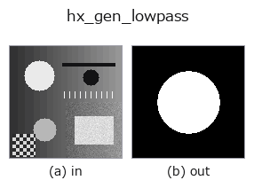
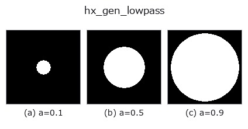
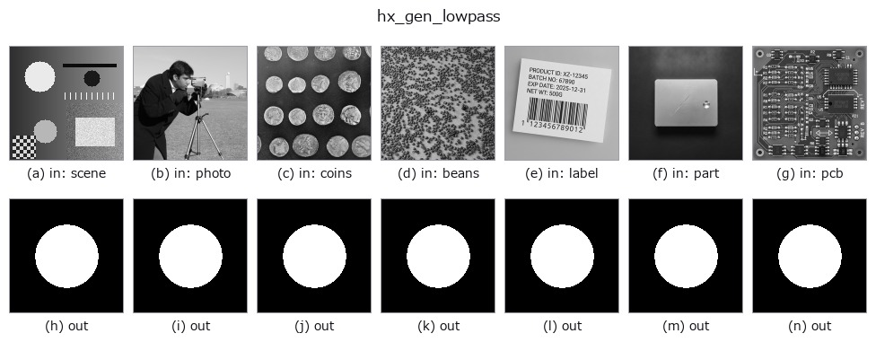

# hx_gen_lowpass — 2D `halcon_ext` op

- **データ種**: `image` → `image`
- **呼び出し**: `fullseye.apply(img, "hx_gen_lowpass", a=0.5, b=0.5)` (2-D は 1 画像 + 2 スカラつまみ `a,b∈[0,1]` のモデル)
- **HALCON 相当**: `gen_lowpass`(意味・パラメータは HALCON リファレンスが参考になる)



*図は合成の入力 128×128 で実際に走らせた出力。左が入力、右が出力。点群は上から見た散布(明るさ = z)、1-D 列は折れ線、体積は z 方向の最大値投影、動画は中央フレーム、複素画像は振幅、絵にならない返り値は値そのもの。*

**つまみ a を振る**(0.1 / 0.5 / 0.9、もう一方は既定):



*つまみ b は出力を変えない(実測: 0.1 / 0.5 / 0.9 で同一)。*

**別の画像でも**(合成シーン / 写真 / 硬貨。上段が入力、下段がその出力。つまみは既定):



*4 列目はカラー (H,W,3) の入力。この op は色を跨がずに扱える(色チャネルを 3 本目の空間軸として畳み込まない)。*

## 使い方

理想ローパスフィルタ画像(周波数領域の中心円板マスク、遮断半径 a)。

入力 ``v`` は形を決めるためだけに使い、``np.fft.fftfreq`` で各軸の正規化周波数(-0.5〜0.5)を作って
``fftshift`` した半径 ``r = sqrt(fy^2 + fx^2)``(中心=DC、四隅で約 0.707)に対し ``r <= cutoff`` を 1 とする
0/1 の float 画像(周波数領域マスク)を返す。画像そのものにフィルタを掛けるのではない。

- ``a`` → 遮断半径 ``cutoff = 0.05 + 0.45*a``(0.05〜0.5。a=1 で軸方向のナイキスト周波数まで通す)。
- ``b`` は未使用。

DC が中央に来る配置(``fftshift`` 済)なので、``fft_generic`` / ``fft_image`` のような「中心が低周波」の
スペクトル画像と画素どうしで掛け合わせる用途に合う。自前で ``np.fft.fft2`` の結果に掛けるときは
``ifftshift`` で戻してから使う。兄弟 op に ``hx_gen_highpass``(補集合)/ ``hx_gen_bandpass`` /
``hx_gen_bandfilter``(円環)。

## 詳しい使い方ガイド

- [gallery2d_halcon_ext ファミリ ガイド](../guides/gallery2d_halcon_ext.md)

## 参考(サンプルデータ・文献)

- [サンプルデータ カタログ(DL URL / ライセンス)](../../SAMPLES.md) — 2-D は skimage.data(BSD/public)+ 合成、3-D は実データ源(Stanford/PDS 等)の DL URL。
- [演算子の来歴・参考文献](../../../REFERENCES.md) — この op 族の元になった研究/手法の出典。
- アルゴリズムの正典(著者・年)と用途は上記**ファミリ使い方ガイド**に記載。

## Studio で試す

下のプログラムは実際に走ることを確かめてある(図と同じ入力)。Studio のヘルプではこのブロックがボタンになり、その場で読み込んで実行できる。

```program
hx_gen_lowpass 0.50 0.50
```

## 実行できる例(この op を実際に呼ぶ検証済みサンプル)

- [gallery2d_halcon_ext](../../../../examples/gallery2d_halcon_ext.py) — `py -3.11 examples/gallery2d_halcon_ext.py`

## 型が繋がる次の op(`image` を入力に取れる)

[identity](../misc/identity.md) · [gaussian](../smoothing/gaussian.md) · [mean_box](../smoothing/mean_box.md) · [bilateral](../smoothing/bilateral.md) · [unsharp](../smoothing/unsharp.md) · [median](../rank/median.md) · [min_filter](../rank/min_filter.md) · [max_filter](../rank/max_filter.md)

## 同カテゴリ(`halcon_ext`)

[hx_gen_circle](hx_gen_circle.md) · [hx_gen_ellipse](hx_gen_ellipse.md) · [hx_gen_rectangle2](hx_gen_rectangle2.md) · [hx_gen_checker_region](hx_gen_checker_region.md) · [hx_gen_grid_region](hx_gen_grid_region.md) · [hx_gabor](hx_gabor.md) · [hx_fit_surface1](hx_fit_surface1.md) · [hx_fit_surface2](hx_fit_surface2.md)

---
*Provenance: ops.py — 2D operator registry. この per-op ノートは `tools/opdocs.py md` が自動生成(手編集しない)。*

© 2026 Kazufumi Furuse — Fullseye operator documentation. Licensed under Apache-2.0.
