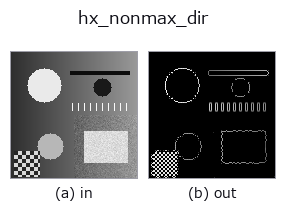
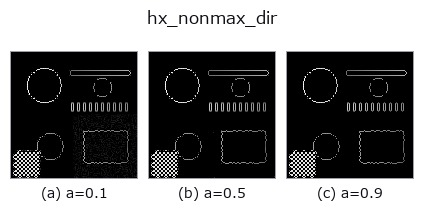
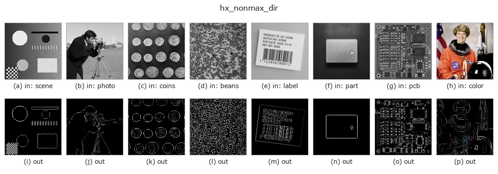

# hx_nonmax_dir — 2D `halcon_ext` op

- **データ種**: `image` → `image`
- **呼び出し**: `fullseye.apply(img, "hx_nonmax_dir", a=0.5, b=0.5)` (2-D は 1 画像 + 2 スカラつまみ `a,b∈[0,1]` のモデル)
- **HALCON 相当**: `nonmax_suppression_dir`(意味・パラメータは HALCON リファレンスが参考になる)



*図は合成の入力 128×128 で実際に走らせた出力。左が入力、右が出力。点群は上から見た散布(明るさ = z)、1-D 列は折れ線、体積は z 方向の最大値投影、動画は中央フレーム、複素画像は振幅、絵にならない返り値は値そのもの。*

**つまみ a を振る**(0.1 / 0.5 / 0.9、もう一方は既定):



*つまみ b は出力を変えない(実測: 0.1 / 0.5 / 0.9 で同一)。*

**別の画像でも**(合成シーン / 写真 / 硬貨。上段が入力、下段がその出力。つまみは既定):



*4 列目はカラー (H,W,3) の入力。この op は色を跨がずに扱える(色チャネルを 3 本目の空間軸として畳み込まない)。*

## 使い方

勾配方向に沿った非最大抑制(Canny の NMS 段)。エッジを 1 画素に細線化する。

Sobel で ``gx``(列方向)・``gy``(行方向)を取り、振幅 ``hypot(gx, gy)`` と方向 ``arctan2(gy, gx) mod 180°`` を
求める。方向を 45° 刻みの 4 区分に量子化し、各画素をその区分に対応する 2 つの隣接画素と比べて
``mag >= 両隣`` の画素だけ残す(それ以外は 0)。残った振幅を min-max で [0,1] に正規化し、``a*0.3`` 未満を 0 に落とす。

- ``a`` → 弱エッジのしきい値 ``a*0.3``(正規化後の値に対して。a=0 でしきい値なし)。
- ``b`` は未使用。

注意点:
- 隣接比較は ``np.roll`` なので画像端では反対側の画素と比較される(端 1 画素は信用しない)。
- 比較が ``>=`` のため、同じ振幅が並ぶ理想的なステップエッジは 2 画素幅で残る(1 画素にはならない)。
- 現状の実装では 45° と 135° の区分で比較する隣接画素の対が入れ替わっており、斜めのエッジは勾配方向でなく
エッジに沿った方向で比較される。そのため水平・垂直エッジは細線化されるが、斜めエッジはほとんど細線化されない
(ぼかした対角ステップエッジで 1400 画素前後がそのまま残る実測)。斜めエッジの細線化が要る場合は ``canny`` や
``skeleton`` を検討する。

``sobel_amp`` のような振幅画像ではなく元の gray 画像を渡す(内部で微分する)。後段は ``hx_close_edges`` /
``hx_detect_edge_segments`` / ``threshold``。

## 詳しい使い方ガイド

- [gallery2d_halcon_ext ファミリ ガイド](../guides/gallery2d_halcon_ext.md)

## 参考(サンプルデータ・文献)

- [サンプルデータ カタログ(DL URL / ライセンス)](../../SAMPLES.md) — 2-D は skimage.data(BSD/public)+ 合成、3-D は実データ源(Stanford/PDS 等)の DL URL。
- [演算子の来歴・参考文献](../../../REFERENCES.md) — この op 族の元になった研究/手法の出典。
- アルゴリズムの正典(著者・年)と用途は上記**ファミリ使い方ガイド**に記載。

## Studio で試す

下のプログラムは実際に走ることを確かめてある(図と同じ入力)。Studio のヘルプではこのブロックがボタンになり、その場で読み込んで実行できる。

```program
hx_nonmax_dir 0.50 0.50
```

## 実行できる例(この op を実際に呼ぶ検証済みサンプル)

- [gallery2d_halcon_ext](../../../../examples/gallery2d_halcon_ext.py) — `py -3.11 examples/gallery2d_halcon_ext.py`

## 型が繋がる次の op(`image` を入力に取れる)

[identity](../misc/identity.md) · [gaussian](../smoothing/gaussian.md) · [mean_box](../smoothing/mean_box.md) · [bilateral](../smoothing/bilateral.md) · [unsharp](../smoothing/unsharp.md) · [median](../rank/median.md) · [min_filter](../rank/min_filter.md) · [max_filter](../rank/max_filter.md)

## 同カテゴリ(`halcon_ext`)

[hx_gen_circle](hx_gen_circle.md) · [hx_gen_ellipse](hx_gen_ellipse.md) · [hx_gen_rectangle2](hx_gen_rectangle2.md) · [hx_gen_checker_region](hx_gen_checker_region.md) · [hx_gen_grid_region](hx_gen_grid_region.md) · [hx_gabor](hx_gabor.md) · [hx_fit_surface1](hx_fit_surface1.md) · [hx_fit_surface2](hx_fit_surface2.md)

---
*Provenance: ops.py — 2D operator registry. この per-op ノートは `tools/opdocs.py md` が自動生成(手編集しない)。*

© 2026 Kazufumi Furuse — Fullseye operator documentation. Licensed under Apache-2.0.
