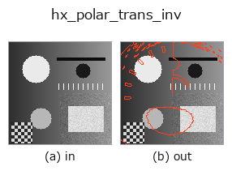
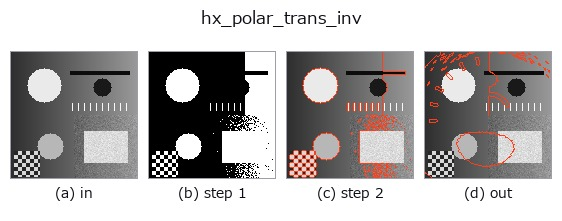
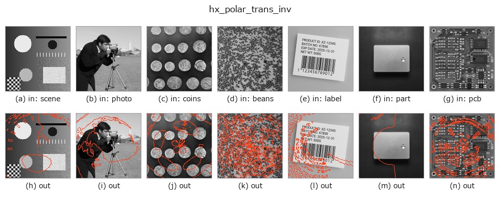

# hx_polar_trans_inv — 2D `halcon_ext` op

- **データ種**: `contour` → `contour`
- **呼び出し**: `fullseye.apply(img, "hx_polar_trans_inv", a=0.5, b=0.5)` (2-D は 1 画像 + 2 スカラつまみ `a,b∈[0,1]` のモデル)
- **HALCON 相当**: `polar_trans_contour_xld_inv`(意味・パラメータは HALCON リファレンスが参考になる)



*図は合成の入力 128×128 で実際に走らせた出力。左が入力、右が出力。点群は上から見た散布(明るさ = z)、1-D 列は折れ線、体積は z 方向の最大値投影、動画は中央フレーム、複素画像は振幅、絵にならない返り値は値そのもの。*

*つまみ a は出力を変えない(実測: 0.1 / 0.5 / 0.9 で同一)。*

*つまみ b は出力を変えない(実測: 0.1 / 0.5 / 0.9 で同一)。*

**段階**(前置きの op → この op。左から順):



**別の画像でも**(合成シーン / 写真 / 硬貨。上段が入力、下段がその出力。つまみは既定):



## 使い方

contour 点を (radius, angle) とみなし直交座標へ逆変換(polar_trans の逆)。

各 contour の点を ``(row, col) = (半径 rad, 角度)`` とみなし、``ang = col / W * 2*pi`` として
``(cy + rad*sin(ang), cx + rad*cos(ang))``(``cy, cx = H/2, W/2``)の直交座標に戻した contour を返す。

- ``a``, ``b`` は未使用。
- 半径は行の値をそのまま画素距離として使い、角度は列を画像幅で 0〜2π に写す。

注意: 順変換 ``polar_trans_contour_xld`` は行を ``r / max(H, W) * H``、列を ``(θ + π) / 2π * W`` として
出力するため、この op はその厳密な逆にはなっていない。角度に π のずれ(点が中心対称の位置に写る)、非正方画像では
半径に ``max(H, W)/H`` 倍のずれが出る(往復で半径の 2 倍の誤差が出る実測)。順変換との往復を期待するときは
この差を織り込むか、この op を「列=角度・行=半径の一般的な極座標表現から直交へ」の変換として単独で使う。

## 詳しい使い方ガイド

- [gallery2d_halcon_ext ファミリ ガイド](../guides/gallery2d_halcon_ext.md)

## 参考(サンプルデータ・文献)

- [サンプルデータ カタログ(DL URL / ライセンス)](../../SAMPLES.md) — 2-D は skimage.data(BSD/public)+ 合成、3-D は実データ源(Stanford/PDS 等)の DL URL。
- [演算子の来歴・参考文献](../../../REFERENCES.md) — この op 族の元になった研究/手法の出典。
- アルゴリズムの正典(著者・年)と用途は上記**ファミリ使い方ガイド**に記載。

## Studio で試す

下のプログラムは実際に走ることを確かめてある(図と同じ入力)。Studio のヘルプではこのブロックがボタンになり、その場で読み込んで実行できる。

```program
threshold 0.50 0.50
sk_find_contours 0.50 0.50
hx_polar_trans_inv 0.50 0.50
```

## 実行できる例(この op を実際に呼ぶ検証済みサンプル)

- [gallery2d_halcon_ext](../../../../examples/gallery2d_halcon_ext.py) — `py -3.11 examples/gallery2d_halcon_ext.py`

## 型が繋がる次の op(`contour` を入力に取れる)

[identity](../misc/identity.md) · [select_contours](../contour/select_contours.md) · [smooth_contours](../contour/smooth_contours.md) · [fit_line_contours](../contour/fit_line_contours.md) · [contours_to_region](../contour/contours_to_region.md) · [count_contours](../features/count_contours.md) · [total_length](../features/total_length.md) · [select_contours_xld](../contour/select_contours_xld.md)

## 同カテゴリ(`halcon_ext`)

[hx_gen_circle](hx_gen_circle.md) · [hx_gen_ellipse](hx_gen_ellipse.md) · [hx_gen_rectangle2](hx_gen_rectangle2.md) · [hx_gen_checker_region](hx_gen_checker_region.md) · [hx_gen_grid_region](hx_gen_grid_region.md) · [hx_gabor](hx_gabor.md) · [hx_fit_surface1](hx_fit_surface1.md) · [hx_fit_surface2](hx_fit_surface2.md)

---
*Provenance: ops.py — 2D operator registry. この per-op ノートは `tools/opdocs.py md` が自動生成(手編集しない)。*

© 2026 Kazufumi Furuse — Fullseye operator documentation. Licensed under Apache-2.0.
