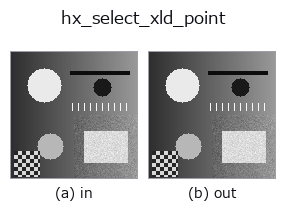
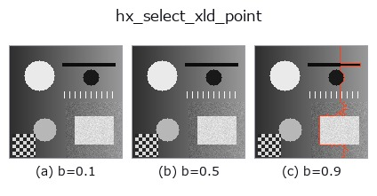
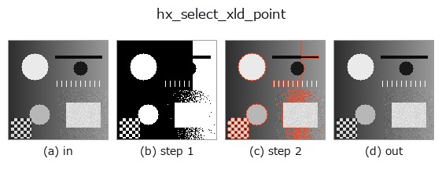
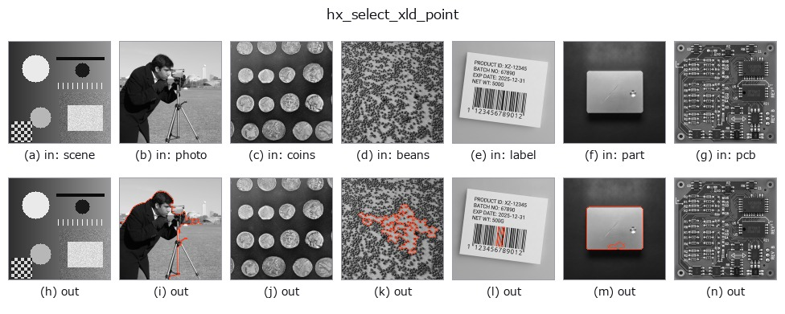

# hx_select_xld_point — 2D `halcon_ext` op

- **データ種**: `contour` → `contour`
- **呼び出し**: `fullseye.apply(img, "hx_select_xld_point", a=0.5, b=0.5)` (2-D は 1 画像 + 2 スカラつまみ `a,b∈[0,1]` のモデル)
- **HALCON 相当**: `select_xld_point`(意味・パラメータは HALCON リファレンスが参考になる)



*図は合成の入力 128×128 で実際に走らせた出力。左が入力、右が出力。点群は上から見た散布(明るさ = z)、1-D 列は折れ線、体積は z 方向の最大値投影、動画は中央フレーム、複素画像は振幅、絵にならない返り値は値そのもの。*

*つまみ a は出力を変えない(実測: 0.1 / 0.5 / 0.9 で同一)。*

**つまみ b を振る**(0.1 / 0.5 / 0.9、もう一方は既定):



**段階**(前置きの op → この op。左から順):



**別の画像でも**(合成シーン / 写真 / 硬貨。上段が入力、下段がその出力。つまみは既定):



## 使い方

クエリ点(正規化 a,b)を外接矩形に含む contour のみ選ぶ(filter)。

正規化座標 ``(a, b)`` のクエリ点 ``(qy, qx) = (a*H, b*W)`` が、contour の外接軸並行矩形
``[min row, max row] × [min col, max col]`` に入る contour だけを残して返す。

- ``a`` → クエリ点の行(0〜1 を高さに写す)。
- ``b`` → クエリ点の列(0〜1 を幅に写す)。

判定は外接矩形であって contour の内側(多角形の内外)ではないので、L 字や環状の contour では contour の外の
点でも選ばれる。厳密な内外判定が要るなら ``contours_to_region`` で region 化して ``hx_test_region_point``。
点に最も近い contour までの距離は ``hx_distance_pc``。該当が無ければ空の contour 集合。

## 詳しい使い方ガイド

- [gallery2d_halcon_ext ファミリ ガイド](../guides/gallery2d_halcon_ext.md)

## 参考(サンプルデータ・文献)

- [サンプルデータ カタログ(DL URL / ライセンス)](../../SAMPLES.md) — 2-D は skimage.data(BSD/public)+ 合成、3-D は実データ源(Stanford/PDS 等)の DL URL。
- [演算子の来歴・参考文献](../../../REFERENCES.md) — この op 族の元になった研究/手法の出典。
- アルゴリズムの正典(著者・年)と用途は上記**ファミリ使い方ガイド**に記載。

## Studio で試す

下のプログラムは実際に走ることを確かめてある(図と同じ入力)。Studio のヘルプではこのブロックがボタンになり、その場で読み込んで実行できる。

```program
threshold 0.50 0.50
sk_find_contours 0.50 0.50
hx_select_xld_point 0.50 0.50
```

## 実行できる例(この op を実際に呼ぶ検証済みサンプル)

- [gallery2d_halcon_ext](../../../../examples/gallery2d_halcon_ext.py) — `py -3.11 examples/gallery2d_halcon_ext.py`

## 型が繋がる次の op(`contour` を入力に取れる)

[identity](../misc/identity.md) · [select_contours](../contour/select_contours.md) · [smooth_contours](../contour/smooth_contours.md) · [fit_line_contours](../contour/fit_line_contours.md) · [contours_to_region](../contour/contours_to_region.md) · [count_contours](../features/count_contours.md) · [total_length](../features/total_length.md) · [select_contours_xld](../contour/select_contours_xld.md)

## 同カテゴリ(`halcon_ext`)

[hx_gen_circle](hx_gen_circle.md) · [hx_gen_ellipse](hx_gen_ellipse.md) · [hx_gen_rectangle2](hx_gen_rectangle2.md) · [hx_gen_checker_region](hx_gen_checker_region.md) · [hx_gen_grid_region](hx_gen_grid_region.md) · [hx_gabor](hx_gabor.md) · [hx_fit_surface1](hx_fit_surface1.md) · [hx_fit_surface2](hx_fit_surface2.md)

---
*Provenance: ops.py — 2D operator registry. この per-op ノートは `tools/opdocs.py md` が自動生成(手編集しない)。*

© 2026 Kazufumi Furuse — Fullseye operator documentation. Licensed under Apache-2.0.
