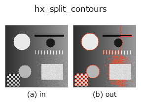
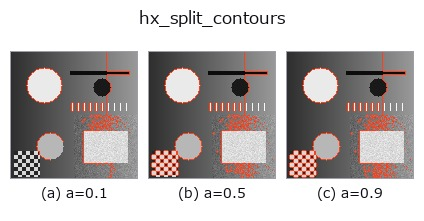
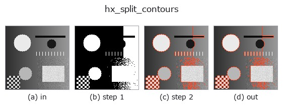
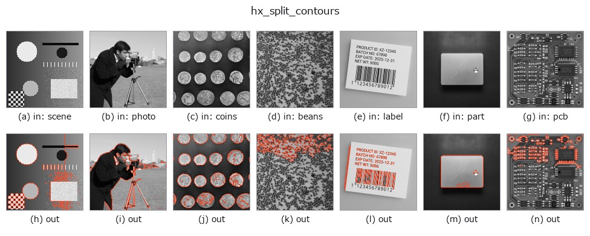

# hx_split_contours — 2D `halcon_ext` op

- **データ種**: `contour` → `contour`
- **呼び出し**: `fullseye.apply(img, "hx_split_contours", a=0.5, b=0.5)` (2-D は 1 画像 + 2 スカラつまみ `a,b∈[0,1]` のモデル)
- **HALCON 相当**: `split_contours_xld`(意味・パラメータは HALCON リファレンスが参考になる)



*図は合成の入力 128×128 で実際に走らせた出力。左が入力、右が出力。点群は上から見た散布(明るさ = z)、1-D 列は折れ線、体積は z 方向の最大値投影、動画は中央フレーム、複素画像は振幅、絵にならない返り値は値そのもの。*

**つまみ a を振る**(0.1 / 0.5 / 0.9、もう一方は既定):



*つまみ b は出力を変えない(実測: 0.1 / 0.5 / 0.9 で同一)。*

**段階**(前置きの op → この op。左から順):



**別の画像でも**(合成シーン / 写真 / 硬貨。上段が入力、下段がその出力。つまみは既定):



## 使い方

各 contour を支配点(RDP)で線分に分割する(許容 eps は a)。

各 contour(点数 3 以上)に Ramer-Douglas-Peucker を掛けて支配点の index を求め、隣り合う支配点の間の部分列
``c[s:e+1]`` を新しい contour として並べる(隣り合う線分は端点を共有する)。点数 2 以下の contour はそのまま通す。

- ``a`` → 許容距離 ``eps = 0.5 + a*5``(0.5〜5.5 画素)。この距離以内の折れは無視されるので、大きいほど線分が
長く少なくなる。
- ``b`` は未使用。

出力は「線分ごとの contour」であって折れ線の頂点だけではない(元の点は全部残る)。閉じた contour(始点=終点)は
始点から最も遠い点で最初に分割される。線分の本数が角の数の目安になり、``hx_regress_contours`` を後段に置くと
各線分の直線性が測れる。

## 詳しい使い方ガイド

- [gallery2d_halcon_ext ファミリ ガイド](../guides/gallery2d_halcon_ext.md)

## 参考(サンプルデータ・文献)

- [サンプルデータ カタログ(DL URL / ライセンス)](../../SAMPLES.md) — 2-D は skimage.data(BSD/public)+ 合成、3-D は実データ源(Stanford/PDS 等)の DL URL。
- [演算子の来歴・参考文献](../../../REFERENCES.md) — この op 族の元になった研究/手法の出典。
- アルゴリズムの正典(著者・年)と用途は上記**ファミリ使い方ガイド**に記載。

## Studio で試す

下のプログラムは実際に走ることを確かめてある(図と同じ入力)。Studio のヘルプではこのブロックがボタンになり、その場で読み込んで実行できる。

```program
threshold 0.50 0.50
sk_find_contours 0.50 0.50
hx_split_contours 0.50 0.50
```

## 実行できる例(この op を実際に呼ぶ検証済みサンプル)

- [gallery2d_halcon_ext](../../../../examples/gallery2d_halcon_ext.py) — `py -3.11 examples/gallery2d_halcon_ext.py`
- [poc_screw_thread_metrology](../../../../examples/poc_screw_thread_metrology.py) — `py -3.11 examples/poc_screw_thread_metrology.py`

## 型が繋がる次の op(`contour` を入力に取れる)

[identity](../misc/identity.md) · [select_contours](../contour/select_contours.md) · [smooth_contours](../contour/smooth_contours.md) · [fit_line_contours](../contour/fit_line_contours.md) · [contours_to_region](../contour/contours_to_region.md) · [count_contours](../features/count_contours.md) · [total_length](../features/total_length.md) · [select_contours_xld](../contour/select_contours_xld.md)

## 同カテゴリ(`halcon_ext`)

[hx_gen_circle](hx_gen_circle.md) · [hx_gen_ellipse](hx_gen_ellipse.md) · [hx_gen_rectangle2](hx_gen_rectangle2.md) · [hx_gen_checker_region](hx_gen_checker_region.md) · [hx_gen_grid_region](hx_gen_grid_region.md) · [hx_gabor](hx_gabor.md) · [hx_fit_surface1](hx_fit_surface1.md) · [hx_fit_surface2](hx_fit_surface2.md)

---
*Provenance: ops.py — 2D operator registry. この per-op ノートは `tools/opdocs.py md` が自動生成(手編集しない)。*

© 2026 Kazufumi Furuse — Fullseye operator documentation. Licensed under Apache-2.0.
