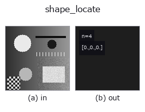

# shape_locate — 2D `matching` op

- **データ種**: `image` → `match`
- **呼び出し**: `fullseye.apply(img, "shape_locate", a=0.5, b=0.5)` (2-D は 1 画像 + 2 スカラつまみ `a,b∈[0,1]` のモデル)
- **HALCON 相当**: `find_shape_model`(意味・パラメータは HALCON リファレンスが参考になる)



*図は合成の入力 128×128 で実際に走らせた出力。左が入力、右が出力。点群は上から見た散布(明るさ = z)、1-D 列は折れ線、体積は z 方向の最大値投影、動画は中央フレーム、複素画像は振幅、絵にならない返り値は値そのもの。*

*つまみ a は出力を変えない(実測: 0.1 / 0.5 / 0.9 で同一)。*

*つまみ b は出力を変えない(実測: 0.1 / 0.5 / 0.9 で同一)。*

## 使い方

回転を考慮したテンプレートマッチング（shape-based matching）。HALCON の ``find_shape_model``（Find the best matches of a shape model in an image.）に相当。

``a``, ``b`` は未使用——テンプレートは ``_ncc_locate`` と同じく ``set_match_template`` で事前登録する。テンプレートを ``0°〜330°`` まで ``30°`` 刻みで回転させながらそれぞれ ``_ncc_map``（NCC）を計算し、全位置・全角度を通じて最良の相関を ``[相関値, y, x, 角度]`` で返す。角度の刻みが粗い（30°）ぶん、HALCON の ``find_shape_model`` のような連続的な角度精度は出ない——大まかな向き検出用。テンプレート未設定時は ``[0,0,0,0]``。

## 詳しい使い方ガイド

- [gallery2d_contour_measure ファミリ ガイド](../guides/gallery2d_contour_measure.md)

## 参考(サンプルデータ・文献)

- [サンプルデータ カタログ(DL URL / ライセンス)](../../SAMPLES.md) — 2-D は skimage.data(BSD/public)+ 合成、3-D は実データ源(Stanford/PDS 等)の DL URL。
- [演算子の来歴・参考文献](../../../REFERENCES.md) — この op 族の元になった研究/手法の出典。
- アルゴリズムの正典(著者・年)と用途は上記**ファミリ使い方ガイド**に記載。

## Studio で試す

下のプログラムは実際に走ることを確かめてある(図と同じ入力)。Studio のヘルプではこのブロックがボタンになり、その場で読み込んで実行できる。

```program
shape_locate 0.50 0.50
```

## 実行できる例(この op を実際に呼ぶ検証済みサンプル)

- [gallery2d_contour_measure](../../../../examples/gallery2d_contour_measure.py) — `py -3.11 examples/gallery2d_contour_measure.py`
- [poc_template_tracking](../../../../examples/poc_template_tracking.py) — `py -3.11 examples/poc_template_tracking.py`

## 型が繋がる次の op(`match` を入力に取れる)

[identity](../misc/identity.md)

## 同カテゴリ(`matching`)

[ncc_locate](ncc_locate.md)

---
*Provenance: ops.py — 2D operator registry. この per-op ノートは `tools/opdocs.py md` が自動生成(手編集しない)。*

© 2026 Kazufumi Furuse — Fullseye operator documentation. Licensed under Apache-2.0.
