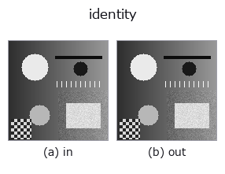
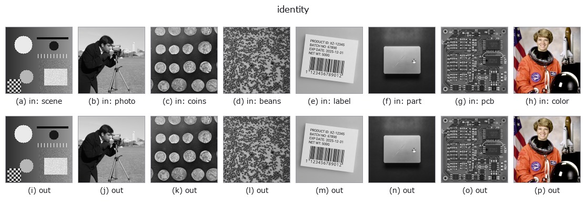

# identity — 2D `misc` op

- **データ種**: `any` → `any`
- **呼び出し**: `fullseye.apply(img, "identity", a=0.5, b=0.5)` (2-D は 1 画像 + 2 スカラつまみ `a,b∈[0,1]` のモデル)
- **HALCON 相当**: `copy_image`(意味・パラメータは HALCON リファレンスが参考になる)



*図は合成の入力 128×128 で実際に走らせた出力。左が入力、右が出力。点群は上から見た散布(明るさ = z)、1-D 列は折れ線、体積は z 方向の最大値投影、動画は中央フレーム、複素画像は振幅、絵にならない返り値は値そのもの。*

*つまみ a は出力を変えない(実測: 0.1 / 0.5 / 0.9 で同一)。*

*つまみ b は出力を変えない(実測: 0.1 / 0.5 / 0.9 で同一)。*

**別の画像でも**(合成シーン / 写真 / 硬貨。上段が入力、下段がその出力。つまみは既定):



*4 列目はカラー (H,W,3) の入力。この op は色を跨がずに扱える(色チャネルを 3 本目の空間軸として畳み込まない)。*

## 使い方

恒等写像。HALCON の ``copy_image``（Copy an image and allocate new memory for it.）に対応付けられているが、実装は新しいメモリを確保して複製する ``copy_image`` とは異なり、入力の配列をそのまま返すだけ（複製しない）。

``a``, ``b`` は未使用。sort が ``ANY``（image/region/feature いずれの入力にも一致）なのはこの op だけの特別扱いで、パイプラインの型を変えずに「何もしない」スロットを置くために使う（進化がスロット数を埋めたいだけのとき等）。値を作り直さず入力をそのまま返すため、呼び出し側で戻り値を書き換えると入力の配列も一緒に変わる点に注意。

## 参考(サンプルデータ・文献)

- [サンプルデータ カタログ(DL URL / ライセンス)](../../SAMPLES.md) — 2-D は skimage.data(BSD/public)+ 合成、3-D は実データ源(Stanford/PDS 等)の DL URL。
- [演算子の来歴・参考文献](../../../REFERENCES.md) — この op 族の元になった研究/手法の出典。

## Studio で試す

下のプログラムは実際に走ることを確かめてある(図と同じ入力)。Studio のヘルプではこのブロックがボタンになり、その場で読み込んで実行できる。

```program
identity 0.50 0.50
```

## 実行できる例(この op を実際に呼ぶ検証済みサンプル)

- (まだありません)

## 型が繋がる次の op(`any` を入力に取れる)

[gaussian](../smoothing/gaussian.md) · [mean_box](../smoothing/mean_box.md) · [bilateral](../smoothing/bilateral.md) · [unsharp](../smoothing/unsharp.md) · [median](../rank/median.md) · [min_filter](../rank/min_filter.md) · [max_filter](../rank/max_filter.md) · [percentile](../rank/percentile.md)

## 同カテゴリ(`misc`)

—

---
*Provenance: ops.py — 2D operator registry. この per-op ノートは `tools/opdocs.py md` が自動生成(手編集しない)。*

© 2026 Kazufumi Furuse — Fullseye operator documentation. Licensed under Apache-2.0.
