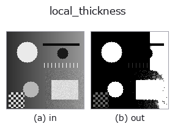
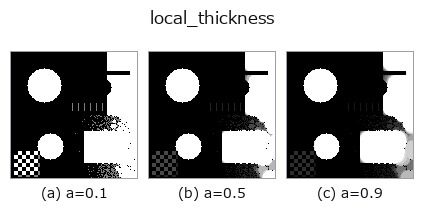
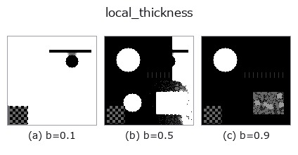
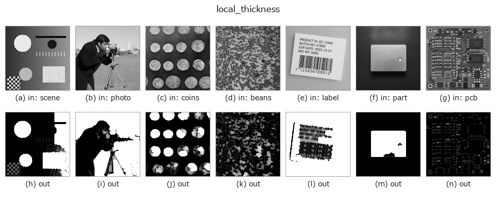

# local_thickness — 2D `morphology` op

- **データ種**: `image` → `image`
- **呼び出し**: `fullseye.apply(img, "local_thickness", a=0.5, b=0.5)` (2-D は 1 画像 + 2 スカラつまみ `a,b∈[0,1]` のモデル)



*図は合成の入力 128×128 で実際に走らせた出力。左が入力、右が出力。点群は上から見た散布(明るさ = z)、1-D 列は折れ線、体積は z 方向の最大値投影、動画は中央フレーム、複素画像は振幅、絵にならない返り値は値そのもの。*

**つまみ a を振る**(0.1 / 0.5 / 0.9、もう一方は既定):



**つまみ b を振る**(0.1 / 0.5 / 0.9、もう一方は既定):



**別の画像でも**(合成シーン / 写真 / 硬貨。上段が入力、下段がその出力。つまみは既定):



*4 列目はカラー (H,W,3) の入力。この op は色を跨がずに扱える(色チャネルを 3 本目の空間軸として畳み込まない)。*

## 使い方

各前景画素に「そこを覆える**最大の円の直径**」を入れて返す(局所肉厚)。

明るい側を前景とみなす閾値が ``b``(0.1〜0.9)。``a`` が測る上限の半径(1〜12 画素)で、
出力はその上限で割って ``[0,1]`` に収めてある —— **絶対値が要るときは ``a`` から
上限を逆算して掛け戻すこと**。

粒径・気孔径・肉厚を「1 枚の地図」として出す古典的な量で、モルフォロジーの
粒度測定(granulometry)と同じもの: ある画素の値が ``r`` なら、その画素は半径 ``r`` の
円による開処理を生き残る。距離変換で内接円の半径を求め、半径の大きい順にその円が
覆う範囲へ書き込む、という素直な実装。

**適用条件**: (1) 前景を 1 つの閾値で決めるので、照明むらがあると太さが場所によって
偏る —— 先に ``local_threshold`` などで平坦化すること。(2) 上限 ``a`` より太い構造は
**上限で頭打ちになる**(飽和しているかは出力の最大値が 1.0 に貼りついているかで分かる)。
(3) 画素単位の量なので、直径が 3 画素を切ると量子化の刻みが 30% を超える。

**用途**: 鋳巣・発泡体の気孔径分布、粉体の粒径、薄肉部の検出、繊維の太さ。
3-D 版は ``ops3d`` の ``vol_wall_thickness``。HALCON に対応する単体 op は無い。

## 詳しい使い方ガイド

- [gallery2d_morphology ファミリ ガイド](../guides/gallery2d_morphology.md)

## 参考(サンプルデータ・文献)

- [サンプルデータ カタログ(DL URL / ライセンス)](../../SAMPLES.md) — 2-D は skimage.data(BSD/public)+ 合成、3-D は実データ源(Stanford/PDS 等)の DL URL。
- [演算子の来歴・参考文献](../../../REFERENCES.md) — この op 族の元になった研究/手法の出典。
- アルゴリズムの正典(著者・年)と用途は上記**ファミリ使い方ガイド**に記載。

## Studio で試す

下のプログラムは実際に走ることを確かめてある(図と同じ入力)。Studio のヘルプではこのブロックがボタンになり、その場で読み込んで実行できる。

```program
local_thickness 0.35 0.50
```

## 実行できる例(この op を実際に呼ぶ検証済みサンプル)

- [gallery2d_morphology](../../../../examples/gallery2d_morphology.py) — `py -3.11 examples/gallery2d_morphology.py`
- [poc_bone_trabecular_thickness](../../../../examples/poc_bone_trabecular_thickness.py) — `py -3.11 examples/poc_bone_trabecular_thickness.py`

## 型が繋がる次の op(`image` を入力に取れる)

[identity](../misc/identity.md) · [gaussian](../smoothing/gaussian.md) · [mean_box](../smoothing/mean_box.md) · [bilateral](../smoothing/bilateral.md) · [unsharp](../smoothing/unsharp.md) · [median](../rank/median.md) · [min_filter](../rank/min_filter.md) · [max_filter](../rank/max_filter.md)

## 同カテゴリ(`morphology`)

[gerode](gerode.md) · [gdilate](gdilate.md) · [gopen](gopen.md) · [gclose](gclose.md) · [tophat](tophat.md) · [bothat](bothat.md) · [morph_grad](morph_grad.md) · [sk_area_opening](sk_area_opening.md)

---
*Provenance: ops.py — 2D operator registry. この per-op ノートは `tools/opdocs.py md` が自動生成(手編集しない)。*

© 2026 Kazufumi Furuse — Fullseye operator documentation. Licensed under Apache-2.0.
