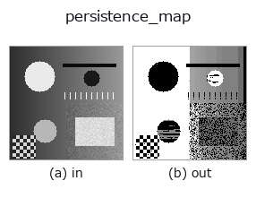
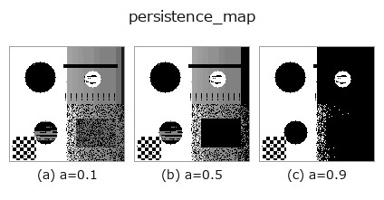
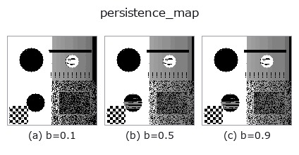
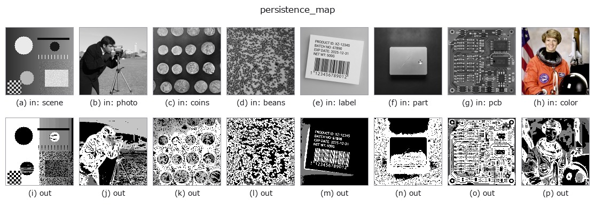

# persistence_map — 2D `morphology` op

- **データ種**: `image` → `image`
- **呼び出し**: `fullseye.apply(img, "persistence_map", a=0.5, b=0.5)` (2-D は 1 画像 + 2 スカラつまみ `a,b∈[0,1]` のモデル)



*図は合成の入力 128×128 で実際に走らせた出力。左が入力、右が出力。点群は上から見た散布(明るさ = z)、1-D 列は折れ線、体積は z 方向の最大値投影、動画は中央フレーム、複素画像は振幅、絵にならない返り値は値そのもの。*

**つまみ a を振る**(0.1 / 0.5 / 0.9、もう一方は既定):



**つまみ b を振る**(0.1 / 0.5 / 0.9、もう一方は既定):



**別の画像でも**(合成シーン / 写真 / 硬貨。上段が入力、下段がその出力。つまみは既定):



*4 列目はカラー (H,W,3) の入力。この op は色を跨がずに扱える(色チャネルを 3 本目の空間軸として畳み込まない)。*

## 使い方

**閾値を選ばずに**「山の目立ち具合」を測る(0 次元パーシステンス)。

閾値を 1 つ選ぶと適用範囲が狭まる —— という矛盾は「**全部の閾値を試して、結果が
変わらない所だけ残す**」ことで解ける。高い方から水位を下げていき、新しい山が現れた
高さ(誕生)と、その山がより高い山に飲まれた高さ(消滅)の差を、その山の
**persistence(目立ち具合)** とする。地形でいう「突出度(prominence)」そのもの。

出力は各画素に「その画素が属する山の persistence」を入れた地図。``a`` は残す下限
(これ未満の山は 0 にする)、``b`` は連結の仕方(0.5 未満で 4 近傍、以上で 8 近傍)。

**``h_maxima`` / MSER との違い**: ``xsk2_h_maxima`` は ``h`` をひとつ選んで
「それ以上の山」を返す —— つまり閾値を 1 つ選んでいる。こちらは**全部の h に
ついての答えを 1 枚に畳んだもの**なので、後から好きな水準で切れる。MSER は
「面積が安定な領域」を探すので似た発想だが、あちらは領域の形、こちらは高さ。

**適用条件**: (1) 画像全体で一番高い山は消滅しないので、``最大値 - 最小値`` を
persistence とする(慣例)。**そのため背景は全体最大の値(1.0)を持つ** ——
背景は一番最後に処理され、そのときには成分がすべて併合されているので、位相的には
確かに全体成分に属する。**山の高さを読む地図であって、背景を 0 にする地図ではない**。
背景を落としたいなら閾値 op と掛けるか、``a`` で下限を上げること(``a=0.45`` で
高さ 0.3 の山だけが消え、1.0 と 0.6 は残ることを実測した)。(2) 平坦な台地(同じ値が続く)は 1 つの山として
扱われる。(3) 計算は画素を降順に走査する union-find なので、大きな画像では
``h_maxima`` より遅い。

## 詳しい使い方ガイド

- [gallery2d_morphology ファミリ ガイド](../guides/gallery2d_morphology.md)

## 参考(サンプルデータ・文献)

- [サンプルデータ カタログ(DL URL / ライセンス)](../../SAMPLES.md) — 2-D は skimage.data(BSD/public)+ 合成、3-D は実データ源(Stanford/PDS 等)の DL URL。
- [演算子の来歴・参考文献](../../../REFERENCES.md) — この op 族の元になった研究/手法の出典。
- アルゴリズムの正典(著者・年)と用途は上記**ファミリ使い方ガイド**に記載。

## Studio で試す

下のプログラムは実際に走ることを確かめてある(図と同じ入力)。Studio のヘルプではこのブロックがボタンになり、その場で読み込んで実行できる。

```program
persistence_map 0.35 0.50
```

## 実行できる例(この op を実際に呼ぶ検証済みサンプル)

- [gallery2d_morphology](../../../../examples/gallery2d_morphology.py) — `py -3.11 examples/gallery2d_morphology.py`

## 型が繋がる次の op(`image` を入力に取れる)

[identity](../misc/identity.md) · [gaussian](../smoothing/gaussian.md) · [mean_box](../smoothing/mean_box.md) · [bilateral](../smoothing/bilateral.md) · [unsharp](../smoothing/unsharp.md) · [median](../rank/median.md) · [min_filter](../rank/min_filter.md) · [max_filter](../rank/max_filter.md)

## 同カテゴリ(`morphology`)

[gerode](gerode.md) · [gdilate](gdilate.md) · [gopen](gopen.md) · [gclose](gclose.md) · [runlength_smear](runlength_smear.md) · [tophat](tophat.md) · [bothat](bothat.md) · [morph_grad](morph_grad.md)

---
*Provenance: ops.py — 2D operator registry. この per-op ノートは `tools/opdocs.py md` が自動生成(手編集しない)。*

© 2026 Kazufumi Furuse — Fullseye operator documentation. Licensed under Apache-2.0.
