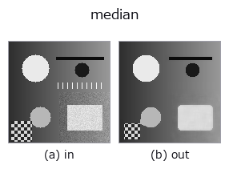
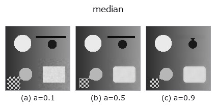
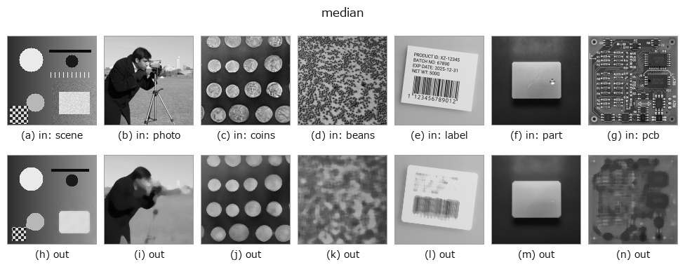

# median — 2D `rank` op

- **データ種**: `image` → `image`
- **呼び出し**: `fullseye.apply(img, "median", a=0.5, b=0.5)` (2-D は 1 画像 + 2 スカラつまみ `a,b∈[0,1]` のモデル)
- **HALCON 相当**: `median_image`(意味・パラメータは HALCON リファレンスが参考になる)



*図は合成の入力 128×128 で実際に走らせた出力。左が入力、右が出力。点群は上から見た散布(明るさ = z)、1-D 列は折れ線、体積は z 方向の最大値投影、動画は中央フレーム、複素画像は振幅、絵にならない返り値は値そのもの。*

**つまみ a を振る**(0.1 / 0.5 / 0.9、もう一方は既定):



*つまみ b は出力を変えない(実測: 0.1 / 0.5 / 0.9 で同一)。*

**別の画像でも**(合成シーン / 写真 / 硬貨。上段が入力、下段がその出力。つまみは既定):



*カラー (H,W,3) の入力は載せていない: この op は色チャネルを 3 本目の空間軸として扱う(色を跨ぐ)ため。チャネルごとに分けて呼ぶこと。*

## 使い方

メディアン（中央値）フィルタ。HALCON の ``median_image``（Compute a median filter with various masks.）に相当。

``a`` が窓サイズを ``3,5,7,9``（``_k(a)``）に振る。``b`` は未使用。塩胡椒ノイズなど外れ値に強く、ガウシアン平滑よりエッジを保ちやすい。

## 詳しい使い方ガイド

- [gallery2d_smoothing_rank ファミリ ガイド](../guides/gallery2d_smoothing_rank.md)

## 参考(サンプルデータ・文献)

- [サンプルデータ カタログ(DL URL / ライセンス)](../../SAMPLES.md) — 2-D は skimage.data(BSD/public)+ 合成、3-D は実データ源(Stanford/PDS 等)の DL URL。
- [演算子の来歴・参考文献](../../../REFERENCES.md) — この op 族の元になった研究/手法の出典。
- アルゴリズムの正典(著者・年)と用途は上記**ファミリ使い方ガイド**に記載。

## Studio で試す

下のプログラムは実際に走ることを確かめてある(図と同じ入力)。Studio のヘルプではこのブロックがボタンになり、その場で読み込んで実行できる。

```program
median 0.50 0.50
```

## 実行できる例(この op を実際に呼ぶ検証済みサンプル)

- [astro_stacking](../../../../examples/astro_stacking.py) — `py -3.11 examples/astro_stacking.py`
- [blas_thread_budget](../../../../examples/blas_thread_budget.py) — `py -3.11 examples/blas_thread_budget.py`
- [ct_reconstruction](../../../../examples/ct_reconstruction.py) — `py -3.11 examples/ct_reconstruction.py`
- [gallery2d_smoothing_rank](../../../../examples/gallery2d_smoothing_rank.py) — `py -3.11 examples/gallery2d_smoothing_rank.py`
- [lightfield_depth](../../../../examples/lightfield_depth.py) — `py -3.11 examples/lightfield_depth.py`
- [photon_timeresolved](../../../../examples/photon_timeresolved.py) — `py -3.11 examples/photon_timeresolved.py`
- [piv_flow_from_particles](../../../../examples/piv_flow_from_particles.py) — `py -3.11 examples/piv_flow_from_particles.py`
- [poc_astro_photometry](../../../../examples/poc_astro_photometry.py) — `py -3.11 examples/poc_astro_photometry.py`
- [poc_dtof_ranging](../../../../examples/poc_dtof_ranging.py) — `py -3.11 examples/poc_dtof_ranging.py`
- [poc_geodetic_height_frames](../../../../examples/poc_geodetic_height_frames.py) — `py -3.11 examples/poc_geodetic_height_frames.py`
- [poc_lidar_terrain_change](../../../../examples/poc_lidar_terrain_change.py) — `py -3.11 examples/poc_lidar_terrain_change.py`
- [poc_nuclei_ploidy](../../../../examples/poc_nuclei_ploidy.py) — `py -3.11 examples/poc_nuclei_ploidy.py`
- [poc_pv_thermal_survey](../../../../examples/poc_pv_thermal_survey.py) — `py -3.11 examples/poc_pv_thermal_survey.py`
- [poc_river_surface_velocity](../../../../examples/poc_river_surface_velocity.py) — `py -3.11 examples/poc_river_surface_velocity.py`
- [poc_web_roll_periodicity](../../../../examples/poc_web_roll_periodicity.py) — `py -3.11 examples/poc_web_roll_periodicity.py`
- [poc_weld_bead_profile](../../../../examples/poc_weld_bead_profile.py) — `py -3.11 examples/poc_weld_bead_profile.py`
- [quickstart](../../../../examples/quickstart.py) — `py -3.11 examples/quickstart.py`
- [specular_photometric](../../../../examples/specular_photometric.py) — `py -3.11 examples/specular_photometric.py`

## 型が繋がる次の op(`image` を入力に取れる)

[identity](../misc/identity.md) · [gaussian](../smoothing/gaussian.md) · [mean_box](../smoothing/mean_box.md) · [bilateral](../smoothing/bilateral.md) · [unsharp](../smoothing/unsharp.md) · [min_filter](min_filter.md) · [max_filter](max_filter.md) · [percentile](percentile.md)

## 同カテゴリ(`rank`)

[min_filter](min_filter.md) · [max_filter](max_filter.md) · [percentile](percentile.md) · [sk_median_disk](sk_median_disk.md) · [cv_median](cv_median.md) · [median_image](median_image.md) · [median_rect](median_rect.md) · [median_separate](median_separate.md)

---
*Provenance: ops.py — 2D operator registry. この per-op ノートは `tools/opdocs.py md` が自動生成(手編集しない)。*

© 2026 Kazufumi Furuse — Fullseye operator documentation. Licensed under Apache-2.0.
