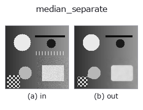
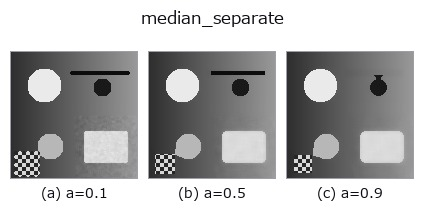
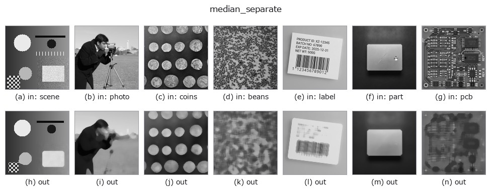

# median_separate — 2D `rank` op

- **データ種**: `image` → `image`
- **呼び出し**: `fullseye.apply(img, "median_separate", a=0.5, b=0.5)` (2-D は 1 画像 + 2 スカラつまみ `a,b∈[0,1]` のモデル)
- **HALCON 相当**: `median_separate`(意味・パラメータは HALCON リファレンスが参考になる)



*図は合成の入力 128×128 で実際に走らせた出力。左が入力、右が出力。点群は上から見た散布(明るさ = z)、1-D 列は折れ線、体積は z 方向の最大値投影、動画は中央フレーム、複素画像は振幅、絵にならない返り値は値そのもの。*

**つまみ a を振る**(0.1 / 0.5 / 0.9、もう一方は既定):



*つまみ b は出力を変えない(実測: 0.1 / 0.5 / 0.9 で同一)。*

**別の画像でも**(合成シーン / 写真 / 硬貨。上段が入力、下段がその出力。つまみは既定):



*カラー (H,W,3) の入力は載せていない: この op は色チャネルを 3 本目の空間軸として扱う(色を跨ぐ)ため。チャネルごとに分けて呼ぶこと。*

## 使い方

実装は ``median_image`` と同じ(``kind: "median"``、正方窓の 2 次元
メディアン)。HALCON の ``median_separate``（Separated median filtering with
rectangle masks.）は行方向・列方向に分離した 1 次元メディアンを 2 パス
掛ける高速近似演算子だが、この代役では区別せず通常の 2 次元メディアンを
返す(結果は近い場合が多いが厳密には別アルゴリズム ―― 近似の限界)。

``a`` が窓の一辺を ``{3,5,7,9}`` で振る。``b`` は未使用。

## 詳しい使い方ガイド

- [gallery2d_smoothing_rank ファミリ ガイド](../guides/gallery2d_smoothing_rank.md)

## 参考(サンプルデータ・文献)

- [サンプルデータ カタログ(DL URL / ライセンス)](../../SAMPLES.md) — 2-D は skimage.data(BSD/public)+ 合成、3-D は実データ源(Stanford/PDS 等)の DL URL。
- [演算子の来歴・参考文献](../../../REFERENCES.md) — この op 族の元になった研究/手法の出典。
- アルゴリズムの正典(著者・年)と用途は上記**ファミリ使い方ガイド**に記載。

## Studio で試す

下のプログラムは実際に走ることを確かめてある(図と同じ入力)。Studio のヘルプではこのブロックがボタンになり、その場で読み込んで実行できる。

```program
median_separate 0.50 0.50
```

## 実行できる例(この op を実際に呼ぶ検証済みサンプル)

- [gallery2d_smoothing_rank](../../../../examples/gallery2d_smoothing_rank.py) — `py -3.11 examples/gallery2d_smoothing_rank.py`

## 型が繋がる次の op(`image` を入力に取れる)

[identity](../misc/identity.md) · [gaussian](../smoothing/gaussian.md) · [mean_box](../smoothing/mean_box.md) · [bilateral](../smoothing/bilateral.md) · [unsharp](../smoothing/unsharp.md) · [median](median.md) · [min_filter](min_filter.md) · [max_filter](max_filter.md)

## 同カテゴリ(`rank`)

[median](median.md) · [min_filter](min_filter.md) · [max_filter](max_filter.md) · [percentile](percentile.md) · [sk_median_disk](sk_median_disk.md) · [cv_median](cv_median.md) · [median_image](median_image.md) · [median_rect](median_rect.md)

---
*Provenance: ops.py — 2D operator registry. この per-op ノートは `tools/opdocs.py md` が自動生成(手編集しない)。*

© 2026 Kazufumi Furuse — Fullseye operator documentation. Licensed under Apache-2.0.
