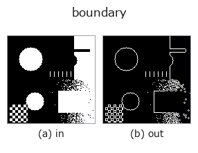
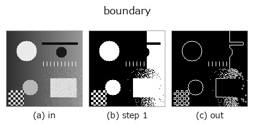
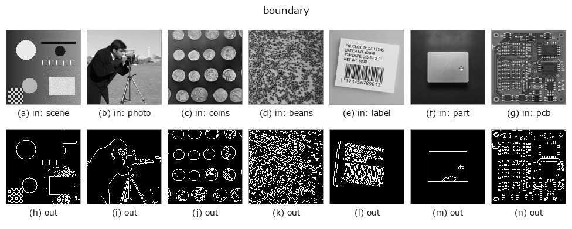

# boundary — 2D `region` op

- **データ種**: `region` → `region`
- **呼び出し**: `fullseye.apply(img, "boundary", a=0.5, b=0.5)` (2-D は 1 画像 + 2 スカラつまみ `a,b∈[0,1]` のモデル)
- **HALCON 相当**: `boundary`(意味・パラメータは HALCON リファレンスが参考になる)



*図は合成の入力 128×128 で実際に走らせた出力。左が入力、右が出力。点群は上から見た散布(明るさ = z)、1-D 列は折れ線、体積は z 方向の最大値投影、動画は中央フレーム、複素画像は振幅、絵にならない返り値は値そのもの。*

*つまみ a は出力を変えない(実測: 0.1 / 0.5 / 0.9 で同一)。*

*つまみ b は出力を変えない(実測: 0.1 / 0.5 / 0.9 で同一)。*

**段階**(前置きの op → この op。左から順):



**別の画像でも**(合成シーン / 写真 / 硬貨。上段が入力、下段がその出力。つまみは既定):



## 使い方

領域からその 1 画素収縮版を引くことで外周境界線(輪郭の内側 1 画素の
リング)を取り出す。塗りつぶされた領域を輪郭線に変換する。HALCON の
``boundary``（Reduce a region to its boundary.）に相当。

``a``, ``b`` は未使用。

## 詳しい使い方ガイド

- [gallery2d_region ファミリ ガイド](../guides/gallery2d_region.md)

## 参考(サンプルデータ・文献)

- [サンプルデータ カタログ(DL URL / ライセンス)](../../SAMPLES.md) — 2-D は skimage.data(BSD/public)+ 合成、3-D は実データ源(Stanford/PDS 等)の DL URL。
- [演算子の来歴・参考文献](../../../REFERENCES.md) — この op 族の元になった研究/手法の出典。
- アルゴリズムの正典(著者・年)と用途は上記**ファミリ使い方ガイド**に記載。

## Studio で試す

下のプログラムは実際に走ることを確かめてある(図と同じ入力)。Studio のヘルプではこのブロックがボタンになり、その場で読み込んで実行できる。

```program
threshold 0.50 0.50
boundary 0.50 0.50
```

## 実行できる例(この op を実際に呼ぶ検証済みサンプル)

- [gallery2d_region](../../../../examples/gallery2d_region.py) — `py -3.11 examples/gallery2d_region.py`
- [voxel_labels_color](../../../../examples/voxel_labels_color.py) — `py -3.11 examples/voxel_labels_color.py`

## 型が繋がる次の op(`region` を入力に取れる)

[identity](../misc/identity.md) · [reg_erode](reg_erode.md) · [reg_dilate](reg_dilate.md) · [reg_open](reg_open.md) · [reg_close](reg_close.md) · [fill_holes](fill_holes.md) · [select_largest](select_largest.md) · [remove_small](remove_small.md)

## 同カテゴリ(`region`)

[reg_erode](reg_erode.md) · [reg_dilate](reg_dilate.md) · [reg_open](reg_open.md) · [reg_close](reg_close.md) · [fill_holes](fill_holes.md) · [select_largest](select_largest.md) · [remove_small](remove_small.md) · [invert_region](invert_region.md)

---
*Provenance: ops.py — 2D operator registry. この per-op ノートは `tools/opdocs.py md` が自動生成(手編集しない)。*

© 2026 Kazufumi Furuse — Fullseye operator documentation. Licensed under Apache-2.0.
