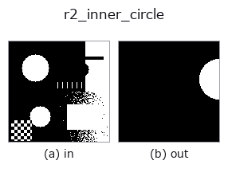
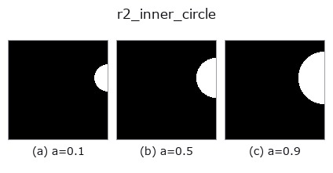
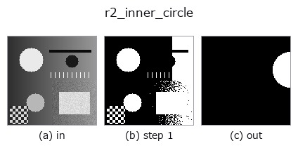
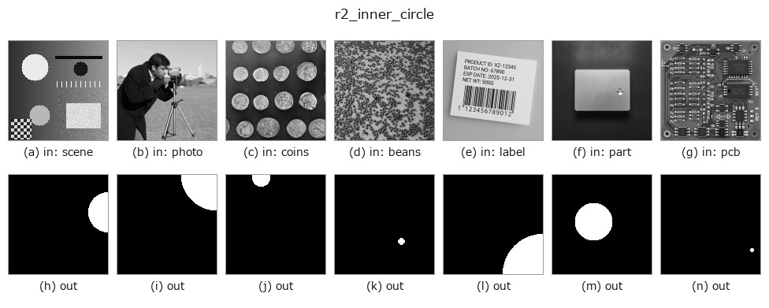

# r2_inner_circle — 2D `region` op

- **データ種**: `region` → `region`
- **呼び出し**: `fullseye.apply(img, "r2_inner_circle", a=0.5, b=0.5)` (2-D は 1 画像 + 2 スカラつまみ `a,b∈[0,1]` のモデル)
- **HALCON 相当**: `inner_circle`(意味・パラメータは HALCON リファレンスが参考になる)



*図は合成の入力 128×128 で実際に走らせた出力。左が入力、右が出力。点群は上から見た散布(明るさ = z)、1-D 列は折れ線、体積は z 方向の最大値投影、動画は中央フレーム、複素画像は振幅、絵にならない返り値は値そのもの。*

**つまみ a を振る**(0.1 / 0.5 / 0.9、もう一方は既定):



*つまみ b は出力を変えない(実測: 0.1 / 0.5 / 0.9 で同一)。*

**段階**(前置きの op → この op。左から順):



**別の画像でも**(合成シーン / 写真 / 硬貨。上段が入力、下段がその出力。つまみは既定):



## 使い方

Largest inscribed circle drawn as a mask (a scales drawn radius; a=0.5=exact).

領域の最大内接円をマスクとして描く。入力を ``> 0.5`` で前景マスクに直し、
``scipy.ndimage.distance_transform_edt`` で各前景画素から最近傍の背景画素
までの距離を取り、その最大値 ``r0`` を与える画素を中心 ``(cy, cx)`` とする
(最大値が複数あれば行優先で最初の画素)。描く半径は
``r = r0 * (0.6 + 0.8*a)`` で、``a=0`` で 0.6 倍、``a=0.5`` で ``r0`` そのまま、
``a=1`` で 1.4 倍(``a`` は [0,1] に clip、非有限なら 0.5)。``b`` は未使用。

返り値は入力と同形の float64 0/1 マスク(円板 ``(y-cy)^2+(x-cx)^2 <= r^2``)。
前景が無ければ全零。座標は (row, col)。

注意: ``r0`` は「背景画素の中心までの距離」なので、``a=0.5`` でも描いた円板は
領域の縁を 1 画素程度はみ出すことがある(10x20 の矩形で 2 画素、半径 7 の
円板で 12 画素の外側画素を実測)。厳密に内側へ収めたいなら ``a`` を少し
下げる。領域が複数の連結成分からなる場合も内接円は 1 つだけ(最も太い成分の
もの)。3 次元配列 (H,W,C) は (H, W*C) に平坦化されるのでカラー画像は渡さない。
前段に ``threshold`` や ``select_largest``、対になる外接円は
``r2_smallest_circle``(両者の半径比が真円度の粗い指標になる)。

## 詳しい使い方ガイド

- [gallery2d_region ファミリ ガイド](../guides/gallery2d_region.md)

## 参考(サンプルデータ・文献)

- [サンプルデータ カタログ(DL URL / ライセンス)](../../SAMPLES.md) — 2-D は skimage.data(BSD/public)+ 合成、3-D は実データ源(Stanford/PDS 等)の DL URL。
- [演算子の来歴・参考文献](../../../REFERENCES.md) — この op 族の元になった研究/手法の出典。
- アルゴリズムの正典(著者・年)と用途は上記**ファミリ使い方ガイド**に記載。

## Studio で試す

下のプログラムは実際に走ることを確かめてある(図と同じ入力)。Studio のヘルプではこのブロックがボタンになり、その場で読み込んで実行できる。

```program
threshold 0.50 0.50
r2_inner_circle 0.50 0.50
```

## 実行できる例(この op を実際に呼ぶ検証済みサンプル)

- [gallery2d_region](../../../../examples/gallery2d_region.py) — `py -3.11 examples/gallery2d_region.py`

## 型が繋がる次の op(`region` を入力に取れる)

[identity](../misc/identity.md) · [reg_erode](reg_erode.md) · [reg_dilate](reg_dilate.md) · [reg_open](reg_open.md) · [reg_close](reg_close.md) · [fill_holes](fill_holes.md) · [select_largest](select_largest.md) · [remove_small](remove_small.md)

## 同カテゴリ(`region`)

[reg_erode](reg_erode.md) · [reg_dilate](reg_dilate.md) · [reg_open](reg_open.md) · [reg_close](reg_close.md) · [fill_holes](fill_holes.md) · [select_largest](select_largest.md) · [remove_small](remove_small.md) · [invert_region](invert_region.md)

---
*Provenance: ops.py — 2D operator registry. この per-op ノートは `tools/opdocs.py md` が自動生成(手編集しない)。*

© 2026 Kazufumi Furuse — Fullseye operator documentation. Licensed under Apache-2.0.
