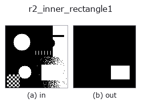
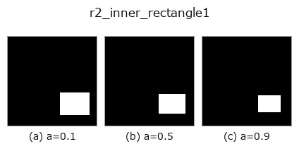
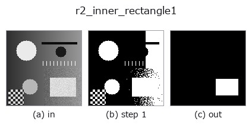
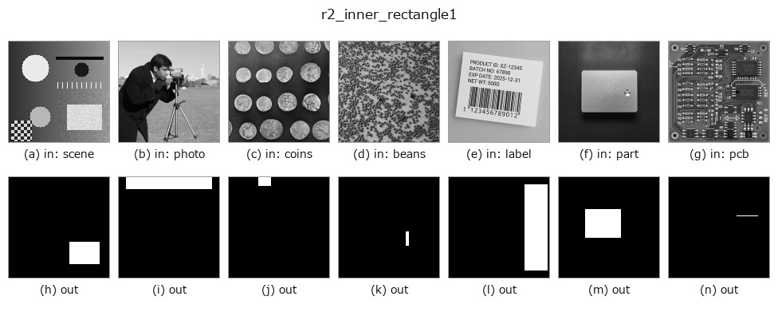

# r2_inner_rectangle1 — 2D `region` op

- **データ種**: `region` → `region`
- **呼び出し**: `fullseye.apply(img, "r2_inner_rectangle1", a=0.5, b=0.5)` (2-D は 1 画像 + 2 スカラつまみ `a,b∈[0,1]` のモデル)
- **HALCON 相当**: `inner_rectangle1`(意味・パラメータは HALCON リファレンスが参考になる)



*図は合成の入力 128×128 で実際に走らせた出力。左が入力、右が出力。点群は上から見た散布(明るさ = z)、1-D 列は折れ線、体積は z 方向の最大値投影、動画は中央フレーム、複素画像は振幅、絵にならない返り値は値そのもの。*

**つまみ a を振る**(0.1 / 0.5 / 0.9、もう一方は既定):



*つまみ b は出力を変えない(実測: 0.1 / 0.5 / 0.9 で同一)。*

**段階**(前置きの op → この op。左から順):



**別の画像でも**(合成シーン / 写真 / 硬貨。上段が入力、下段がその出力。つまみは既定):



## 使い方

Largest axis-aligned inscribed rectangle (a shrinks the drawn rect; a=0=exact).

領域に内接する軸並行矩形のうち面積最大のものをマスクとして描く。前景マスク
(``> 0.5``)に対し、行ごとに各列の連続前景高さを積み、単調スタックで最大
長方形を求めるヒストグラム法(O(H*W))で厳密解を得る。同面積の候補が複数
あるときは走査順で最初に見つかったものを採る。

``a`` は描く矩形を内側へ縮める割合で、``f = 0.3*a`` として高さを
``round(hh*f/2)`` 行ずつ、幅を ``round(ww*f/2)`` 列ずつ両側から削る。``a=0`` で
厳密な最大内接矩形、``a=1`` で各辺が約 15% ずつ縮む(面積ではおよそ半分)。
縮めすぎて辺が潰れる場合は中央の 1 行 / 1 列に丸める。``b`` は未使用。

返り値は入力と同形の float64 0/1 マスク。前景が無ければ全零。矩形は画素境界に
そろうため ``a=0`` の出力は必ず領域に含まれる(``r2_inner_circle`` と異なり
はみ出さない)。孔のある領域では孔を避けた矩形になるので、孔を無視したい
ときは前段に ``fill_up``。回転した矩形は扱えない(軸並行のみ)。外接側の
軸並行矩形は ``r2_smallest_rectangle1``。

## 詳しい使い方ガイド

- [gallery2d_region ファミリ ガイド](../guides/gallery2d_region.md)

## 参考(サンプルデータ・文献)

- [サンプルデータ カタログ(DL URL / ライセンス)](../../SAMPLES.md) — 2-D は skimage.data(BSD/public)+ 合成、3-D は実データ源(Stanford/PDS 等)の DL URL。
- [演算子の来歴・参考文献](../../../REFERENCES.md) — この op 族の元になった研究/手法の出典。
- アルゴリズムの正典(著者・年)と用途は上記**ファミリ使い方ガイド**に記載。

## Studio で試す

下のプログラムは実際に走ることを確かめてある(図と同じ入力)。Studio のヘルプではこのブロックがボタンになり、その場で読み込んで実行できる。

```program
threshold 0.50 0.50
r2_inner_rectangle1 0.50 0.50
```

## 実行できる例(この op を実際に呼ぶ検証済みサンプル)

- [gallery2d_region](../../../../examples/gallery2d_region.py) — `py -3.11 examples/gallery2d_region.py`

## 型が繋がる次の op(`region` を入力に取れる)

[identity](../misc/identity.md) · [reg_erode](reg_erode.md) · [reg_dilate](reg_dilate.md) · [reg_open](reg_open.md) · [reg_close](reg_close.md) · [fill_holes](fill_holes.md) · [select_largest](select_largest.md) · [remove_small](remove_small.md)

## 同カテゴリ(`region`)

[reg_erode](reg_erode.md) · [reg_dilate](reg_dilate.md) · [reg_open](reg_open.md) · [reg_close](reg_close.md) · [fill_holes](fill_holes.md) · [select_largest](select_largest.md) · [remove_small](remove_small.md) · [invert_region](invert_region.md)

---
*Provenance: ops.py — 2D operator registry. この per-op ノートは `tools/opdocs.py md` が自動生成(手編集しない)。*

© 2026 Kazufumi Furuse — Fullseye operator documentation. Licensed under Apache-2.0.
