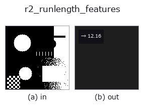
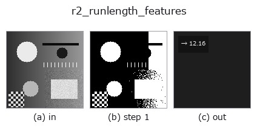

# r2_runlength_features — 2D `region` op

- **データ種**: `region` → `feature`
- **呼び出し**: `fullseye.apply(img, "r2_runlength_features", a=0.5, b=0.5)` (2-D は 1 画像 + 2 スカラつまみ `a,b∈[0,1]` のモデル)
- **HALCON 相当**: `runlength_features`(意味・パラメータは HALCON リファレンスが参考になる)



*図は合成の入力 128×128 で実際に走らせた出力。左が入力、右が出力。点群は上から見た散布(明るさ = z)、1-D 列は折れ線、体積は z 方向の最大値投影、動画は中央フレーム、複素画像は振幅、絵にならない返り値は値そのもの。*

*つまみ a は出力を変えない(実測: 0.1 / 0.5 / 0.9 で同一)。*

*つまみ b は出力を変えない(実測: 0.1 / 0.5 / 0.9 で同一)。*

**段階**(前置きの op → この op。左から順):



## 使い方

Region -> feature: mean length of horizontal foreground runs.

前景マスク(``> 0.5``)の各行を左から走査し、連続する前景画素の並び(水平ラン)の
長さをすべて集めて、その平均(画素数)を 1 つのスカラーで返す。行ごとにゼロ
埋めした行の差分でランの開始/終了を検出する。``a``, ``b`` は未使用。

返り値は ``numpy.float64``。前景が無ければ 0.0。単位は画素で、画像サイズで
正規化しない(同じ形状でも解像度が 2 倍なら値も 2 倍になる)。垂直方向のランは
数えない(縦縞と横縞で値が大きく変わる、向きに依存する特徴量)。細い横線が
多い領域では値が大きく、点状ノイズが多いと 1 に近づく。ラン長の分散や
エントロピーは ``r3_runlength_distribution``、短いランの除去は
``r3_eliminate_runs``。特徴量なので後段に画像 op は繋げない。

## 詳しい使い方ガイド

- [gallery2d_region ファミリ ガイド](../guides/gallery2d_region.md)

## 参考(サンプルデータ・文献)

- [サンプルデータ カタログ(DL URL / ライセンス)](../../SAMPLES.md) — 2-D は skimage.data(BSD/public)+ 合成、3-D は実データ源(Stanford/PDS 等)の DL URL。
- [演算子の来歴・参考文献](../../../REFERENCES.md) — この op 族の元になった研究/手法の出典。
- アルゴリズムの正典(著者・年)と用途は上記**ファミリ使い方ガイド**に記載。

## Studio で試す

下のプログラムは実際に走ることを確かめてある(図と同じ入力)。Studio のヘルプではこのブロックがボタンになり、その場で読み込んで実行できる。

```program
threshold 0.50 0.50
r2_runlength_features 0.50 0.50
```

## 実行できる例(この op を実際に呼ぶ検証済みサンプル)

- [gallery2d_region](../../../../examples/gallery2d_region.py) — `py -3.11 examples/gallery2d_region.py`

## 型が繋がる次の op(`feature` を入力に取れる)

[identity](../misc/identity.md)

## 同カテゴリ(`region`)

[reg_erode](reg_erode.md) · [reg_dilate](reg_dilate.md) · [reg_open](reg_open.md) · [reg_close](reg_close.md) · [fill_holes](fill_holes.md) · [select_largest](select_largest.md) · [remove_small](remove_small.md) · [invert_region](invert_region.md)

---
*Provenance: ops.py — 2D operator registry. この per-op ノートは `tools/opdocs.py md` が自動生成(手編集しない)。*

© 2026 Kazufumi Furuse — Fullseye operator documentation. Licensed under Apache-2.0.
