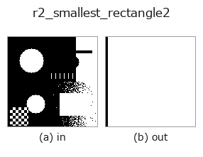
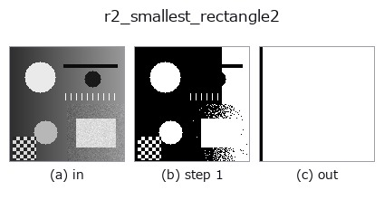
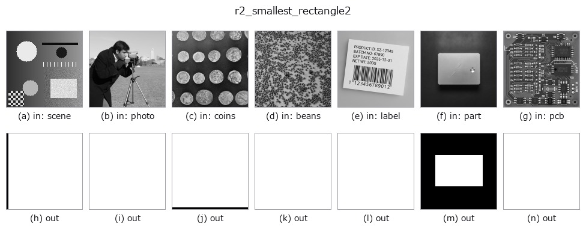

# r2_smallest_rectangle2 — 2D `region` op

- **データ種**: `region` → `region`
- **呼び出し**: `fullseye.apply(img, "r2_smallest_rectangle2", a=0.5, b=0.5)` (2-D は 1 画像 + 2 スカラつまみ `a,b∈[0,1]` のモデル)
- **HALCON 相当**: `smallest_rectangle2`(意味・パラメータは HALCON リファレンスが参考になる)



*図は合成の入力 128×128 で実際に走らせた出力。左が入力、右が出力。点群は上から見た散布(明るさ = z)、1-D 列は折れ線、体積は z 方向の最大値投影、動画は中央フレーム、複素画像は振幅、絵にならない返り値は値そのもの。*

*つまみ a は出力を変えない(実測: 0.1 / 0.5 / 0.9 で同一)。*

*つまみ b は出力を変えない(実測: 0.1 / 0.5 / 0.9 で同一)。*

**段階**(前置きの op → この op。左から順):



**別の画像でも**(合成シーン / 写真 / 硬貨。上段が入力、下段がその出力。つまみは既定):



## 使い方

Minimum-area ORIENTED bounding rectangle as a mask (rotating calipers).

領域の全前景画素を含む最小面積の回転矩形をマスクとして描く。前景座標の凸包を
取り、凸包の各辺に平行な向きで外接矩形を作って面積最小のものを選ぶ
(rotating calipers。最小面積矩形は凸包のいずれかの辺に接するという性質を使う)。
内部表現は中心 ``(cy, cx)``、長辺 ``long_len``、短辺 ``short_len``、長辺の向き
``angle``(画像座標 x=col, y=row で測ったラジアン)。

``a`` は長辺だけを ``1 + 0.3*a`` 倍に伸ばす(``a=0`` で最小矩形そのもの、
``a=1`` で長辺 1.3 倍。短辺は変えない)。``b`` は未使用。描画は中心からの
射影 ``|pu| <= long/2 + 0.5``、``|pv| <= short/2 + 0.5`` で、画素の広がりぶん
0.5 画素の余白を足すため出力は入力領域を必ず含む。

返り値は入力と同形の float64 0/1 マスク、前景が無ければ全零。角度や辺長の
数値は返さない。複数の連結成分があれば全体で 1 つの矩形。前景が 1 画素や
一直線上の場合は退化(点・線分)し、描画は 1 画素幅程度の細い帯になる。
軸並行でよければ ``r2_smallest_rectangle1`` の方が軽い。細長い部品の向きを
見る前処理や、``r2_inner_rectangle1`` との面積比で矩形らしさを見る用途に。

## 詳しい使い方ガイド

- [gallery2d_region ファミリ ガイド](../guides/gallery2d_region.md)

## 参考(サンプルデータ・文献)

- [サンプルデータ カタログ(DL URL / ライセンス)](../../SAMPLES.md) — 2-D は skimage.data(BSD/public)+ 合成、3-D は実データ源(Stanford/PDS 等)の DL URL。
- [演算子の来歴・参考文献](../../../REFERENCES.md) — この op 族の元になった研究/手法の出典。
- アルゴリズムの正典(著者・年)と用途は上記**ファミリ使い方ガイド**に記載。

## Studio で試す

下のプログラムは実際に走ることを確かめてある(図と同じ入力)。Studio のヘルプではこのブロックがボタンになり、その場で読み込んで実行できる。

```program
threshold 0.50 0.50
r2_smallest_rectangle2 0.50 0.50
```

## 実行できる例(この op を実際に呼ぶ検証済みサンプル)

- [gallery2d_region](../../../../examples/gallery2d_region.py) — `py -3.11 examples/gallery2d_region.py`

## 型が繋がる次の op(`region` を入力に取れる)

[identity](../misc/identity.md) · [reg_erode](reg_erode.md) · [reg_dilate](reg_dilate.md) · [reg_open](reg_open.md) · [reg_close](reg_close.md) · [fill_holes](fill_holes.md) · [select_largest](select_largest.md) · [remove_small](remove_small.md)

## 同カテゴリ(`region`)

[reg_erode](reg_erode.md) · [reg_dilate](reg_dilate.md) · [reg_open](reg_open.md) · [reg_close](reg_close.md) · [fill_holes](fill_holes.md) · [select_largest](select_largest.md) · [remove_small](remove_small.md) · [invert_region](invert_region.md)

---
*Provenance: ops.py — 2D operator registry. この per-op ノートは `tools/opdocs.py md` が自動生成(手編集しない)。*

© 2026 Kazufumi Furuse — Fullseye operator documentation. Licensed under Apache-2.0.
