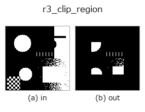
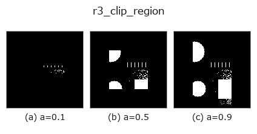
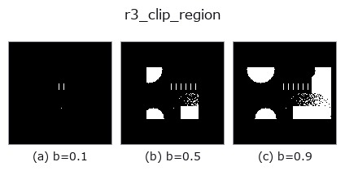
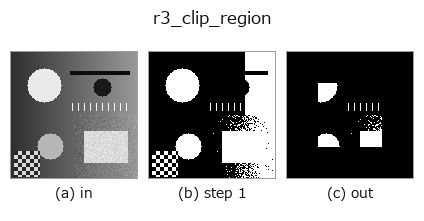
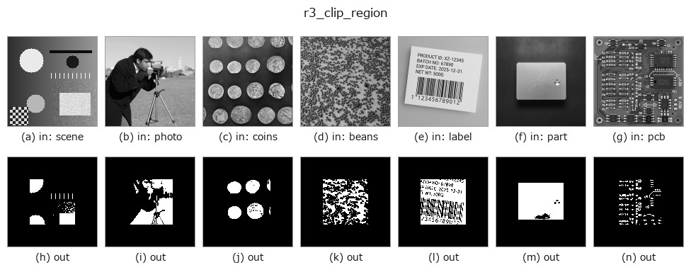

# r3_clip_region — 2D `region` op

- **データ種**: `region` → `region`
- **呼び出し**: `fullseye.apply(img, "r3_clip_region", a=0.5, b=0.5)` (2-D は 1 画像 + 2 スカラつまみ `a,b∈[0,1]` のモデル)
- **HALCON 相当**: `clip_region`(意味・パラメータは HALCON リファレンスが参考になる)



*図は合成の入力 128×128 で実際に走らせた出力。左が入力、右が出力。点群は上から見た散布(明るさ = z)、1-D 列は折れ線、体積は z 方向の最大値投影、動画は中央フレーム、複素画像は振幅、絵にならない返り値は値そのもの。*

**つまみ a を振る**(0.1 / 0.5 / 0.9、もう一方は既定):



**つまみ b を振る**(0.1 / 0.5 / 0.9、もう一方は既定):



**段階**(前置きの op → この op。左から順):



**別の画像でも**(合成シーン / 写真 / 硬貨。上段が入力、下段がその出力。つまみは既定):



## 使い方

領域を画像中心の矩形窓でクリップする（HALCON ``clip_region`` に相当）。

``a`` は残す高さの割合（0〜1）、``b`` は残す幅の割合（0〜1）。窓は画像の中心に置かれ、窓の外側の領域画素はすべて消される。

窓の大きさは ``wh = max(1, round(a*H))`` 行 × ``ww = max(1, round(b*W))`` 列で、左上を ``((H-wh)//2, (W-ww)//2)`` に置く（端数は上・左に寄る）。``a``, ``b`` は [0,1] に clip、非有限なら 0.5。``a=b=1`` で入力そのまま、``a=b=0`` でも中央の 1 画素は残る（全零にはならない）。入力は ``> 0.5`` で前景マスクに直すため、グレー値や NaN は背景扱い。

返り値は入力と同形の float64 0/1 マスク。窓は領域の外接矩形ではなく画像全体を基準にする点に注意（領域が画像の隅にあると ``a=b=0.5`` で丸ごと消えることがある）。領域基準で相対クリップしたいなら ``hx_clip_region_rel``。窓の外を消すのであって窓自体を前景にはしない（領域が無い所は 0 のまま）。画像側で同じ中央窓を切るのは ``it_crop_domain``（こちらは ``a`` 1 つで縦横同じ割合）、輪郭の点を窓で残すのは ``xg_crop_contours``。例外時は0 マスクに落ち、backend_safe の台帳に記録される（strict モードでは再送出）。

## 詳しい使い方ガイド

- [gallery2d_region ファミリ ガイド](../guides/gallery2d_region.md)

## 参考(サンプルデータ・文献)

- [サンプルデータ カタログ(DL URL / ライセンス)](../../SAMPLES.md) — 2-D は skimage.data(BSD/public)+ 合成、3-D は実データ源(Stanford/PDS 等)の DL URL。
- [演算子の来歴・参考文献](../../../REFERENCES.md) — この op 族の元になった研究/手法の出典。
- アルゴリズムの正典(著者・年)と用途は上記**ファミリ使い方ガイド**に記載。

## Studio で試す

下のプログラムは実際に走ることを確かめてある(図と同じ入力)。Studio のヘルプではこのブロックがボタンになり、その場で読み込んで実行できる。

```program
threshold 0.50 0.50
r3_clip_region 0.50 0.50
```

## 実行できる例(この op を実際に呼ぶ検証済みサンプル)

- [gallery2d_region](../../../../examples/gallery2d_region.py) — `py -3.11 examples/gallery2d_region.py`

## 型が繋がる次の op(`region` を入力に取れる)

[identity](../misc/identity.md) · [reg_erode](reg_erode.md) · [reg_dilate](reg_dilate.md) · [reg_open](reg_open.md) · [reg_close](reg_close.md) · [fill_holes](fill_holes.md) · [select_largest](select_largest.md) · [remove_small](remove_small.md)

## 同カテゴリ(`region`)

[reg_erode](reg_erode.md) · [reg_dilate](reg_dilate.md) · [reg_open](reg_open.md) · [reg_close](reg_close.md) · [fill_holes](fill_holes.md) · [select_largest](select_largest.md) · [remove_small](remove_small.md) · [invert_region](invert_region.md)

---
*Provenance: ops.py — 2D operator registry. この per-op ノートは `tools/opdocs.py md` が自動生成(手編集しない)。*

© 2026 Kazufumi Furuse — Fullseye operator documentation. Licensed under Apache-2.0.
