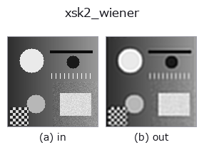
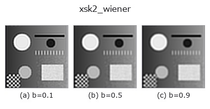
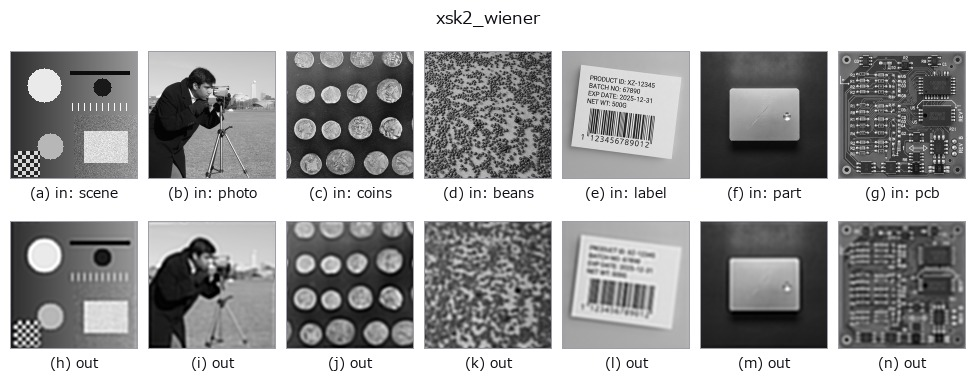

# xsk2_wiener — 2D `restoration` op

- **データ種**: `image` → `image`
- **呼び出し**: `fullseye.apply(img, "xsk2_wiener", a=0.5, b=0.5)` (2-D は 1 画像 + 2 スカラつまみ `a,b∈[0,1]` のモデル)



*図は合成の入力 128×128 で実際に走らせた出力。左が入力、右が出力。点群は上から見た散布(明るさ = z)、1-D 列は折れ線、体積は z 方向の最大値投影、動画は中央フレーム、複素画像は振幅、絵にならない返り値は値そのもの。*

**つまみ a を振る**(0.1 / 0.5 / 0.9、もう一方は既定):


**つまみ b を振る**(0.1 / 0.5 / 0.9、もう一方は既定):



**別の画像でも**(合成シーン / 写真 / 硬貨。上段が入力、下段がその出力。つまみは既定):



*4 列目はカラー (H,W,3) の入力。この op は色を跨がずに扱える(色チャネルを 3 本目の空間軸として畳み込まない)。*

## 使い方

ウィーナー逆畳み込み（既知の点拡がり関数を使ったデブラー）。
``skimage.restoration.wiener`` を呼ぶ。

PSF はガウシアン形状を仮定して自前生成し、a が PSF の広がり
（標準偏差 ``0.5 + 1.5*a``、5x5 窓）を振る。b がバランス項
（``0.05 + 0.5*b``。ノイズ対信号比の逆数に相当し、大きいほどノイズ
抑制寄りになる）を振る。**入力画像のボケが実際にこの想定ガウシアン
PSF と一致している場合にのみ有効**で、PSF の形が違うとリンギングや
復元失敗が出る。

## 詳しい使い方ガイド

- [gallery2d_smoothing_rank ファミリ ガイド](../guides/gallery2d_smoothing_rank.md)

## 参考(サンプルデータ・文献)

- [サンプルデータ カタログ(DL URL / ライセンス)](../../SAMPLES.md) — 2-D は skimage.data(BSD/public)+ 合成、3-D は実データ源(Stanford/PDS 等)の DL URL。
- [演算子の来歴・参考文献](../../../REFERENCES.md) — この op 族の元になった研究/手法の出典。
- アルゴリズムの正典(著者・年)と用途は上記**ファミリ使い方ガイド**に記載。

## Studio で試す

下のプログラムは実際に走ることを確かめてある(図と同じ入力)。Studio のヘルプではこのブロックがボタンになり、その場で読み込んで実行できる。

```program
xsk2_wiener 0.50 0.50
```

## 実行できる例(この op を実際に呼ぶ検証済みサンプル)

- [gallery2d_smoothing_rank](../../../../examples/gallery2d_smoothing_rank.py) — `py -3.11 examples/gallery2d_smoothing_rank.py`

## 型が繋がる次の op(`image` を入力に取れる)

[identity](../misc/identity.md) · [gaussian](../smoothing/gaussian.md) · [mean_box](../smoothing/mean_box.md) · [bilateral](../smoothing/bilateral.md) · [unsharp](../smoothing/unsharp.md) · [median](../rank/median.md) · [min_filter](../rank/min_filter.md) · [max_filter](../rank/max_filter.md)

## 同カテゴリ(`restoration`)

[xsk_inpaint](xsk_inpaint.md) · [xsk_richardson_lucy](xsk_richardson_lucy.md) · [xsk_unwrap_phase](xsk_unwrap_phase.md) · [xcv_inpaint](xcv_inpaint.md) · [xcv3_inpaint_ns](xcv3_inpaint_ns.md) · [iv_richardson_lucy](iv_richardson_lucy.md) · [iv_wiener_deconv_spatial](iv_wiener_deconv_spatial.md) · [iv_unsharp_deblur](iv_unsharp_deblur.md)

---
*Provenance: ops.py — 2D operator registry. この per-op ノートは `tools/opdocs.py md` が自動生成(手編集しない)。*

© 2026 Kazufumi Furuse — Fullseye operator documentation. Licensed under Apache-2.0.
