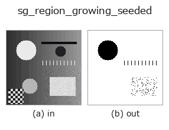
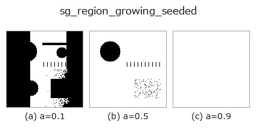
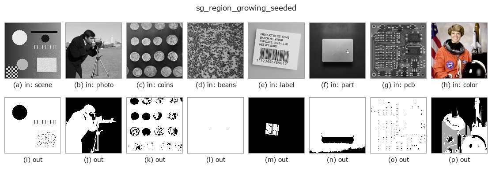

# sg_region_growing_seeded — 2D `segment` op

- **データ種**: `image` → `region`
- **呼び出し**: `fullseye.apply(img, "sg_region_growing_seeded", a=0.5, b=0.5)` (2-D は 1 画像 + 2 スカラつまみ `a,b∈[0,1]` のモデル)



*図は合成の入力 128×128 で実際に走らせた出力。左が入力、右が出力。点群は上から見た散布(明るさ = z)、1-D 列は折れ線、体積は z 方向の最大値投影、動画は中央フレーム、複素画像は振幅、絵にならない返り値は値そのもの。*

**つまみ a を振る**(0.1 / 0.5 / 0.9、もう一方は既定):



*つまみ b は出力を変えない(実測: 0.1 / 0.5 / 0.9 で同一)。*

**別の画像でも**(合成シーン / 写真 / 硬貨。上段が入力、下段がその出力。つまみは既定):



*4 列目はカラー (H,W,3) の入力。この op は色を跨がずに扱える(色チャネルを 3 本目の空間軸として畳み込まない)。*

## 使い方

画像中心を種として、輝度が近い画素を繋げていく領域拡張（シードグロウイング）（HALCON ``regiongrowing`` は既に別 op でカバー済みのため、重複申告を避けて ``halcon=""`` としている）。

種は画像中心の 1 画素。``a``（0〜1）が同質性の許容差（種の輝度 ±a 以内なら繋がる）、``b`` が連結性を切り替える（``b > 0.5`` で 8 連結、それ以外は 4 連結）。結果は種を含む連結成分のみ。

## 詳しい使い方ガイド

- [gallery2d_segmentation ファミリ ガイド](../guides/gallery2d_segmentation.md)

## 参考(サンプルデータ・文献)

- [サンプルデータ カタログ(DL URL / ライセンス)](../../SAMPLES.md) — 2-D は skimage.data(BSD/public)+ 合成、3-D は実データ源(Stanford/PDS 等)の DL URL。
- [演算子の来歴・参考文献](../../../REFERENCES.md) — この op 族の元になった研究/手法の出典。
- アルゴリズムの正典(著者・年)と用途は上記**ファミリ使い方ガイド**に記載。

## Studio で試す

下のプログラムは実際に走ることを確かめてある(図と同じ入力)。Studio のヘルプではこのブロックがボタンになり、その場で読み込んで実行できる。

```program
sg_region_growing_seeded 0.50 0.50
```

## 実行できる例(この op を実際に呼ぶ検証済みサンプル)

- [gallery2d_segmentation](../../../../examples/gallery2d_segmentation.py) — `py -3.11 examples/gallery2d_segmentation.py`

## 型が繋がる次の op(`region` を入力に取れる)

[identity](../misc/identity.md) · [reg_erode](../region/reg_erode.md) · [reg_dilate](../region/reg_dilate.md) · [reg_open](../region/reg_open.md) · [reg_close](../region/reg_close.md) · [fill_holes](../region/fill_holes.md) · [select_largest](../region/select_largest.md) · [remove_small](../region/remove_small.md)

## 同カテゴリ(`segment`)

[sg_slic_superpixels](sg_slic_superpixels.md) · [sg_felzenszwalb](sg_felzenszwalb.md) · [sg_gmm_segment](sg_gmm_segment.md) · [sg_kmeans_intensity](sg_kmeans_intensity.md) · [sg_normalized_cut_2](sg_normalized_cut_2.md) · [sg_watershed_gradient](sg_watershed_gradient.md)

---
*Provenance: ops.py — 2D operator registry. この per-op ノートは `tools/opdocs.py md` が自動生成(手編集しない)。*

© 2026 Kazufumi Furuse — Fullseye operator documentation. Licensed under Apache-2.0.
