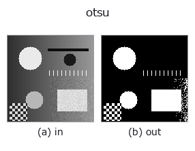
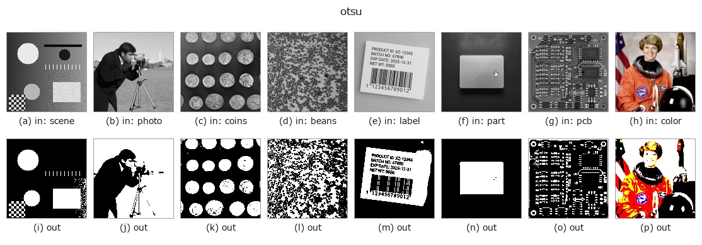

# otsu — 2D `segmentation` op

- **データ種**: `image` → `region`
- **呼び出し**: `fullseye.apply(img, "otsu", a=0.5, b=0.5)` (2-D は 1 画像 + 2 スカラつまみ `a,b∈[0,1]` のモデル)
- **HALCON 相当**: `binary_threshold`(意味・パラメータは HALCON リファレンスが参考になる)



*図は合成の入力 128×128 で実際に走らせた出力。左が入力、右が出力。点群は上から見た散布(明るさ = z)、1-D 列は折れ線、体積は z 方向の最大値投影、動画は中央フレーム、複素画像は振幅、絵にならない返り値は値そのもの。*

*つまみ a は出力を変えない(実測: 0.1 / 0.5 / 0.9 で同一)。*

*つまみ b は出力を変えない(実測: 0.1 / 0.5 / 0.9 で同一)。*

**別の画像でも**(合成シーン / 写真 / 硬貨。上段が入力、下段がその出力。つまみは既定):



*4 列目はカラー (H,W,3) の入力。この op は色を跨がずに扱える(色チャネルを 3 本目の空間軸として畳み込まない)。*

## 使い方

大津の判別分析法（Otsu's method）による自動しきい値処理。HALCON の ``binary_threshold``（Segment an image using binary thresholding.）に相当。

``a``, ``b`` は未使用（しきい値は入力から自動で決まる）。値が ``[0,1]`` に収まっていればその範囲を、はみ出していれば**入力の実際の範囲**を 256 ビンのヒストグラムに分け、クラス間分散 ``ω(1-ω)`` を最大化するしきい値を全探索して選び、それより大きい画素を前景とする。前景・背景 2 クラスの分離を仮定するため、ヒストグラムが単峰（1 山）の画像では意図しない位置で切れることがある。

## 詳しい使い方ガイド

- [gallery2d_segmentation ファミリ ガイド](../guides/gallery2d_segmentation.md)

## 参考(サンプルデータ・文献)

- [サンプルデータ カタログ(DL URL / ライセンス)](../../SAMPLES.md) — 2-D は skimage.data(BSD/public)+ 合成、3-D は実データ源(Stanford/PDS 等)の DL URL。
- [演算子の来歴・参考文献](../../../REFERENCES.md) — この op 族の元になった研究/手法の出典。
- アルゴリズムの正典(著者・年)と用途は上記**ファミリ使い方ガイド**に記載。

## Studio で試す

下のプログラムは実際に走ることを確かめてある(図と同じ入力)。Studio のヘルプではこのブロックがボタンになり、その場で読み込んで実行できる。

```program
otsu 0.50 0.50
```

## 実行できる例(この op を実際に呼ぶ検証済みサンプル)

- [ct_inspection](../../../../examples/ct_inspection.py) — `py -3.11 examples/ct_inspection.py`
- [gallery2d_segmentation](../../../../examples/gallery2d_segmentation.py) — `py -3.11 examples/gallery2d_segmentation.py`
- [poc_bone_trabecular_thickness](../../../../examples/poc_bone_trabecular_thickness.py) — `py -3.11 examples/poc_bone_trabecular_thickness.py`
- [poc_colocalization_crosstalk](../../../../examples/poc_colocalization_crosstalk.py) — `py -3.11 examples/poc_colocalization_crosstalk.py`
- [poc_dimensional_inspection](../../../../examples/poc_dimensional_inspection.py) — `py -3.11 examples/poc_dimensional_inspection.py`
- [poc_document_scan](../../../../examples/poc_document_scan.py) — `py -3.11 examples/poc_document_scan.py`
- [poc_fresco_craquelure](../../../../examples/poc_fresco_craquelure.py) — `py -3.11 examples/poc_fresco_craquelure.py`
- [poc_matrix_code_reading](../../../../examples/poc_matrix_code_reading.py) — `py -3.11 examples/poc_matrix_code_reading.py`
- [poc_metal_grain_size](../../../../examples/poc_metal_grain_size.py) — `py -3.11 examples/poc_metal_grain_size.py`
- [poc_real_coin_metrology](../../../../examples/poc_real_coin_metrology.py) — `py -3.11 examples/poc_real_coin_metrology.py`
- [poc_solar_el_inspection](../../../../examples/poc_solar_el_inspection.py) — `py -3.11 examples/poc_solar_el_inspection.py`
- [poc_vegetation_cover](../../../../examples/poc_vegetation_cover.py) — `py -3.11 examples/poc_vegetation_cover.py`
- [quickstart](../../../../examples/quickstart.py) — `py -3.11 examples/quickstart.py`
- [segment_and_classify](../../../../examples/segment_and_classify.py) — `py -3.11 examples/segment_and_classify.py`

## 型が繋がる次の op(`region` を入力に取れる)

[identity](../misc/identity.md) · [reg_erode](../region/reg_erode.md) · [reg_dilate](../region/reg_dilate.md) · [reg_open](../region/reg_open.md) · [reg_close](../region/reg_close.md) · [fill_holes](../region/fill_holes.md) · [select_largest](../region/select_largest.md) · [remove_small](../region/remove_small.md)

## 同カテゴリ(`segmentation`)

[threshold](threshold.md) · [canny](canny.md) · [adaptive_gauss_thresh](adaptive_gauss_thresh.md) · [sk_otsu](sk_otsu.md) · [sk_li](sk_li.md) · [sk_yen](sk_yen.md) · [sk_sauvola](sk_sauvola.md) · [sk_niblack](sk_niblack.md)

---
*Provenance: ops.py — 2D operator registry. この per-op ノートは `tools/opdocs.py md` が自動生成(手編集しない)。*

© 2026 Kazufumi Furuse — Fullseye operator documentation. Licensed under Apache-2.0.
