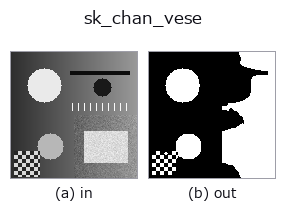
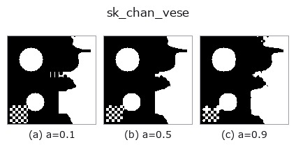
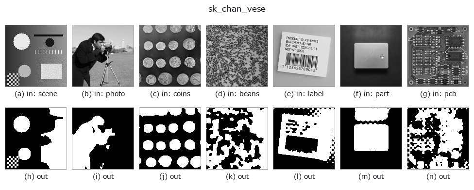

# sk_chan_vese — 2D `segmentation` op

- **データ種**: `image` → `region`
- **呼び出し**: `fullseye.apply(img, "sk_chan_vese", a=0.5, b=0.5)` (2-D は 1 画像 + 2 スカラつまみ `a,b∈[0,1]` のモデル)



*図は合成の入力 128×128 で実際に走らせた出力。左が入力、右が出力。点群は上から見た散布(明るさ = z)、1-D 列は折れ線、体積は z 方向の最大値投影、動画は中央フレーム、複素画像は振幅、絵にならない返り値は値そのもの。*

**つまみ a を振る**(0.1 / 0.5 / 0.9、もう一方は既定):



*つまみ b は出力を変えない(実測: 0.1 / 0.5 / 0.9 で同一)。*

**別の画像でも**(合成シーン / 写真 / 硬貨。上段が入力、下段がその出力。つまみは既定):



*4 列目はカラー (H,W,3) の入力。この op は色を跨がずに扱える(色チャネルを 3 本目の空間軸として畳み込まない)。*

## 使い方

Chan-Vese セグメンテーション。レベルセット(等位集合)を輝度の分散が領域内で最小になるように反復して動かす能動輪郭モデルで、エッジがはっきりしない対象でも領域を検出できる。

HALCON に直接対応するものは無い。実装は ``segmentation.chan_vese(v, mu=0.1+0.4*a, max_num_iter=60)`` —— a は'edge length' 重み mu を 0.1〜0.5 に振る(大きいほど輪郭が丸く滑らかになり細部を無視しやすくなる)。反復回数は 60 に固定。b は未使用。初期レベルセットは既定の 'checkerboard'(チェッカーボード状)。

## 詳しい使い方ガイド

- [gallery2d_segmentation ファミリ ガイド](../guides/gallery2d_segmentation.md)

## 参考(サンプルデータ・文献)

- [サンプルデータ カタログ(DL URL / ライセンス)](../../SAMPLES.md) — 2-D は skimage.data(BSD/public)+ 合成、3-D は実データ源(Stanford/PDS 等)の DL URL。
- [演算子の来歴・参考文献](../../../REFERENCES.md) — この op 族の元になった研究/手法の出典。
- アルゴリズムの正典(著者・年)と用途は上記**ファミリ使い方ガイド**に記載。

## Studio で試す

下のプログラムは実際に走ることを確かめてある(図と同じ入力)。Studio のヘルプではこのブロックがボタンになり、その場で読み込んで実行できる。

```program
sk_chan_vese 0.50 0.50
```

## 実行できる例(この op を実際に呼ぶ検証済みサンプル)

- [gallery2d_segmentation](../../../../examples/gallery2d_segmentation.py) — `py -3.11 examples/gallery2d_segmentation.py`

## 型が繋がる次の op(`region` を入力に取れる)

[identity](../misc/identity.md) · [reg_erode](../region/reg_erode.md) · [reg_dilate](../region/reg_dilate.md) · [reg_open](../region/reg_open.md) · [reg_close](../region/reg_close.md) · [fill_holes](../region/fill_holes.md) · [select_largest](../region/select_largest.md) · [remove_small](../region/remove_small.md)

## 同カテゴリ(`segmentation`)

[threshold](threshold.md) · [otsu](otsu.md) · [canny](canny.md) · [adaptive_gauss_thresh](adaptive_gauss_thresh.md) · [sk_otsu](sk_otsu.md) · [sk_li](sk_li.md) · [sk_yen](sk_yen.md) · [sk_sauvola](sk_sauvola.md)

---
*Provenance: ops.py — 2D operator registry. この per-op ノートは `tools/opdocs.py md` が自動生成(手編集しない)。*

© 2026 Kazufumi Furuse — Fullseye operator documentation. Licensed under Apache-2.0.
