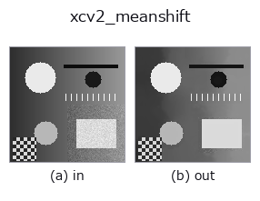
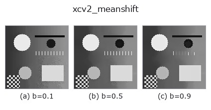
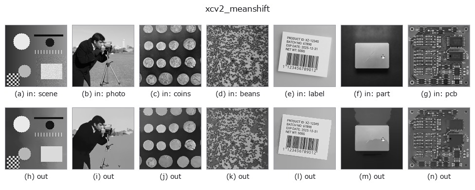

# xcv2_meanshift — 2D `segmentation` op

- **データ種**: `image` → `image`
- **呼び出し**: `fullseye.apply(img, "xcv2_meanshift", a=0.5, b=0.5)` (2-D は 1 画像 + 2 スカラつまみ `a,b∈[0,1]` のモデル)



*図は合成の入力 128×128 で実際に走らせた出力。左が入力、右が出力。点群は上から見た散布(明るさ = z)、1-D 列は折れ線、体積は z 方向の最大値投影、動画は中央フレーム、複素画像は振幅、絵にならない返り値は値そのもの。*

**つまみ a を振る**(0.1 / 0.5 / 0.9、もう一方は既定):


**つまみ b を振る**(0.1 / 0.5 / 0.9、もう一方は既定):



**別の画像でも**(合成シーン / 写真 / 硬貨。上段が入力、下段がその出力。つまみは既定):



*4 列目はカラー (H,W,3) の入力。この op は色を跨がずに扱える(色チャネルを 3 本目の空間軸として畳み込まない)。*

## 使い方

平均値シフト（mean-shift）フィルタリングで色/輝度を領域ごとに均す
（``cv2.pyrMeanShiftFiltering``）。

``a`` は空間窓半径 ``sp`` を 5〜30 に振り（``sp = 5 + 25*a``）、``b`` は
輝度（色）レンジ ``sr`` を 10〜50 に振る（``sr = 10 + 40*b``）。グレースケール
画像を内部で 3ch BGR に複製してから処理し、結果を再びグレースケールへ
戻す。エッジを保ったまま平坦な領域を単色化する前処理（減色・セグメンテー
ション前処理）に向く。

## 詳しい使い方ガイド

- [gallery2d_segmentation ファミリ ガイド](../guides/gallery2d_segmentation.md)

## 参考(サンプルデータ・文献)

- [サンプルデータ カタログ(DL URL / ライセンス)](../../SAMPLES.md) — 2-D は skimage.data(BSD/public)+ 合成、3-D は実データ源(Stanford/PDS 等)の DL URL。
- [演算子の来歴・参考文献](../../../REFERENCES.md) — この op 族の元になった研究/手法の出典。
- アルゴリズムの正典(著者・年)と用途は上記**ファミリ使い方ガイド**に記載。

## Studio で試す

下のプログラムは実際に走ることを確かめてある(図と同じ入力)。Studio のヘルプではこのブロックがボタンになり、その場で読み込んで実行できる。

```program
xcv2_meanshift 0.50 0.50
```

## 実行できる例(この op を実際に呼ぶ検証済みサンプル)

- [gallery2d_segmentation](../../../../examples/gallery2d_segmentation.py) — `py -3.11 examples/gallery2d_segmentation.py`

## 型が繋がる次の op(`image` を入力に取れる)

[identity](../misc/identity.md) · [gaussian](../smoothing/gaussian.md) · [mean_box](../smoothing/mean_box.md) · [bilateral](../smoothing/bilateral.md) · [unsharp](../smoothing/unsharp.md) · [median](../rank/median.md) · [min_filter](../rank/min_filter.md) · [max_filter](../rank/max_filter.md)

## 同カテゴリ(`segmentation`)

[threshold](threshold.md) · [otsu](otsu.md) · [canny](canny.md) · [adaptive_gauss_thresh](adaptive_gauss_thresh.md) · [sk_otsu](sk_otsu.md) · [sk_li](sk_li.md) · [sk_yen](sk_yen.md) · [sk_sauvola](sk_sauvola.md)

---
*Provenance: ops.py — 2D operator registry. この per-op ノートは `tools/opdocs.py md` が自動生成(手編集しない)。*

© 2026 Kazufumi Furuse — Fullseye operator documentation. Licensed under Apache-2.0.
