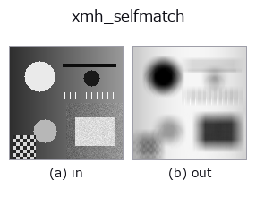
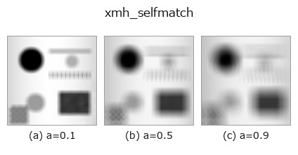
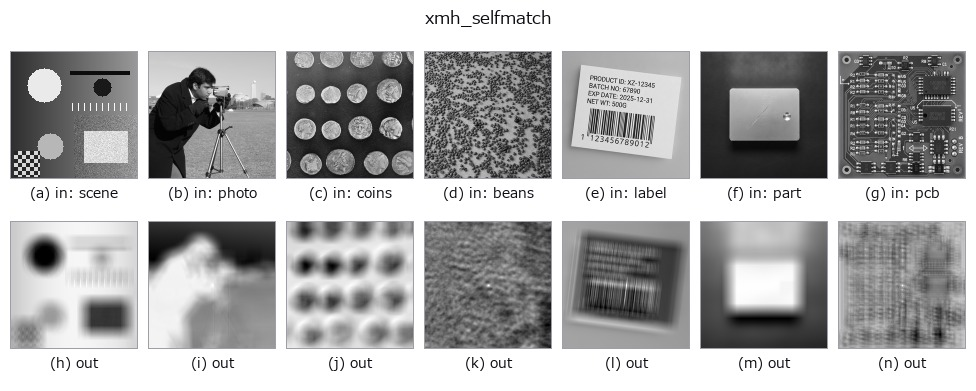

# xmh_selfmatch — 2D `self-similarity` op

- **データ種**: `image` → `image`
- **呼び出し**: `fullseye.apply(img, "xmh_selfmatch", a=0.5, b=0.5)` (2-D は 1 画像 + 2 スカラつまみ `a,b∈[0,1]` のモデル)



*図は合成の入力 128×128 で実際に走らせた出力。左が入力、右が出力。点群は上から見た散布(明るさ = z)、1-D 列は折れ線、体積は z 方向の最大値投影、動画は中央フレーム、複素画像は振幅、絵にならない返り値は値そのもの。*

**つまみ a を振る**(0.1 / 0.5 / 0.9、もう一方は既定):



*つまみ b は出力を変えない(実測: 0.1 / 0.5 / 0.9 で同一)。*

**別の画像でも**(合成シーン / 写真 / 硬貨。上段が入力、下段がその出力。つまみは既定):



*カラー (H,W,3) の入力は載せていない: この op は色チャネルを 3 本目の空間軸として扱う(色を跨ぐ)ため。チャネルごとに分けて呼ぶこと。*

## 使い方

自己相似マップ(``mahotas.template_match`` による自己テンプレートマッチング)。画像中心から切り出した小さなパッチを画像全体に対してテンプレートマッチングし、パッチに似た場所ほど 1 に近い値になるよう正規化して返す。

``a`` はパッチの半径(3+8 px 相当)を振る —— 大きくするほど広い範囲の類似度になる。``b`` は未使用。周期的なテクスチャや繰り返しパターンの検出に使える。

**値の比較可能性(実測)**: 出力を**その画像の最大値で正規化**している(出力の最大が常に 1.0、入力を定数倍しても出力が変わらない)。したがって**画像をまたいで値を比較できない** —— 同じ強さの特徴でも、その画像の中で最も強い特徴が何かによって値が変わる。弱い特徴しか無い画像では雑音が 1.0 まで持ち上がる。画像間で比べたいときは、共通の基準で割り直すこと。

**何も写っていないフレーム(実測)**: 明るさが一様な画像を入れると、**明るさに関係なく全画素が前景(1)**になる。照明が飛んだ・遮られた・被写体が無いフレームは「**欠陥 100%**」として返るので、上流で「一様かどうか」を判定して弾くこと。

## 詳しい使い方ガイド

- [gallery2d_features ファミリ ガイド](../guides/gallery2d_features.md)

## 参考(サンプルデータ・文献)

- [サンプルデータ カタログ(DL URL / ライセンス)](../../SAMPLES.md) — 2-D は skimage.data(BSD/public)+ 合成、3-D は実データ源(Stanford/PDS 等)の DL URL。
- [演算子の来歴・参考文献](../../../REFERENCES.md) — この op 族の元になった研究/手法の出典。
- アルゴリズムの正典(著者・年)と用途は上記**ファミリ使い方ガイド**に記載。

## Studio で試す

下のプログラムは実際に走ることを確かめてある(図と同じ入力)。Studio のヘルプではこのブロックがボタンになり、その場で読み込んで実行できる。

```program
xmh_selfmatch 0.50 0.50
```

## 実行できる例(この op を実際に呼ぶ検証済みサンプル)

- [gallery2d_features](../../../../examples/gallery2d_features.py) — `py -3.11 examples/gallery2d_features.py`

## 型が繋がる次の op(`image` を入力に取れる)

[identity](../misc/identity.md) · [gaussian](../smoothing/gaussian.md) · [mean_box](../smoothing/mean_box.md) · [bilateral](../smoothing/bilateral.md) · [unsharp](../smoothing/unsharp.md) · [median](../rank/median.md) · [min_filter](../rank/min_filter.md) · [max_filter](../rank/max_filter.md)

## 同カテゴリ(`self-similarity`)

—

---
*Provenance: ops.py — 2D operator registry. この per-op ノートは `tools/opdocs.py md` が自動生成(手編集しない)。*

© 2026 Kazufumi Furuse — Fullseye operator documentation. Licensed under Apache-2.0.
