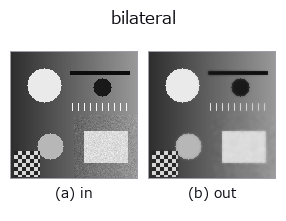
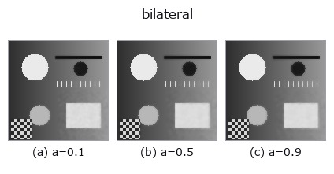
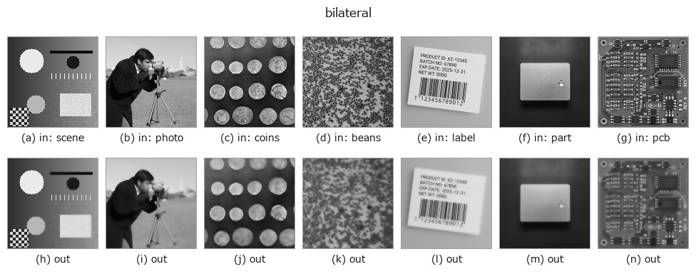

# bilateral — 2D `smoothing` op

- **データ種**: `image` → `image`
- **呼び出し**: `fullseye.apply(img, "bilateral", a=0.5, b=0.5)` (2-D は 1 画像 + 2 スカラつまみ `a,b∈[0,1]` のモデル)
- **HALCON 相当**: `bilateral_filter`(意味・パラメータは HALCON リファレンスが参考になる)



*図は合成の入力 128×128 で実際に走らせた出力。左が入力、右が出力。点群は上から見た散布(明るさ = z)、1-D 列は折れ線、体積は z 方向の最大値投影、動画は中央フレーム、複素画像は振幅、絵にならない返り値は値そのもの。*

**つまみ a を振る**(0.1 / 0.5 / 0.9、もう一方は既定):



**つまみ b を振る**(0.1 / 0.5 / 0.9、もう一方は既定):


**別の画像でも**(合成シーン / 写真 / 硬貨。上段が入力、下段がその出力。つまみは既定):



*4 列目はカラー (H,W,3) の入力。この op は色を跨がずに扱える(色チャネルを 3 本目の空間軸として畳み込まない)。*

## 使い方

エッジ保存平滑化（bilateral filter）。HALCON の ``bilateral_filter``（bilateral filtering of an image.）に相当。

``a`` が空間方向の広がり ``σ_s = 1.0 + 3.0a`` を、``b`` が明るさ方向の許容差 ``σ_r = 0.05 + 0.4b`` を振る。近傍窓は半径 ``r=2``（5×5）固定で ``a`` では変わらない。近傍の重みは ``exp(-距離²/2σ_s²) × exp(-明度差²/2σ_r²)`` の積で、明度差が大きい（=エッジをまたぐ）画素は重みが小さくなるため、平滑化しつつ輪郭を保てる。窓内を Python の二重ループで回すため他の平滑化 op より遅い。

## 詳しい使い方ガイド

- [gallery2d_smoothing_rank ファミリ ガイド](../guides/gallery2d_smoothing_rank.md)

## 参考(サンプルデータ・文献)

- [サンプルデータ カタログ(DL URL / ライセンス)](../../SAMPLES.md) — 2-D は skimage.data(BSD/public)+ 合成、3-D は実データ源(Stanford/PDS 等)の DL URL。
- [演算子の来歴・参考文献](../../../REFERENCES.md) — この op 族の元になった研究/手法の出典。
- アルゴリズムの正典(著者・年)と用途は上記**ファミリ使い方ガイド**に記載。

## Studio で試す

下のプログラムは実際に走ることを確かめてある(図と同じ入力)。Studio のヘルプではこのブロックがボタンになり、その場で読み込んで実行できる。

```program
bilateral 0.35 0.50
```

## 実行できる例(この op を実際に呼ぶ検証済みサンプル)

- [gallery2d_smoothing_rank](../../../../examples/gallery2d_smoothing_rank.py) — `py -3.11 examples/gallery2d_smoothing_rank.py`
- [quickstart](../../../../examples/quickstart.py) — `py -3.11 examples/quickstart.py`

## 型が繋がる次の op(`image` を入力に取れる)

[identity](../misc/identity.md) · [gaussian](gaussian.md) · [mean_box](mean_box.md) · [unsharp](unsharp.md) · [median](../rank/median.md) · [min_filter](../rank/min_filter.md) · [max_filter](../rank/max_filter.md) · [percentile](../rank/percentile.md)

## 同カテゴリ(`smoothing`)

[gaussian](gaussian.md) · [mean_box](mean_box.md) · [unsharp](unsharp.md) · [sk_tv](sk_tv.md) · [sk_wavelet](sk_wavelet.md) · [sk_rolling_ball](sk_rolling_ball.md) · [sk_nlm](sk_nlm.md) · [sk_tv_bregman](sk_tv_bregman.md)

---
*Provenance: ops.py — 2D operator registry. この per-op ノートは `tools/opdocs.py md` が自動生成(手編集しない)。*

© 2026 Kazufumi Furuse — Fullseye operator documentation. Licensed under Apache-2.0.
