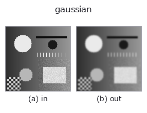
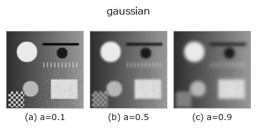
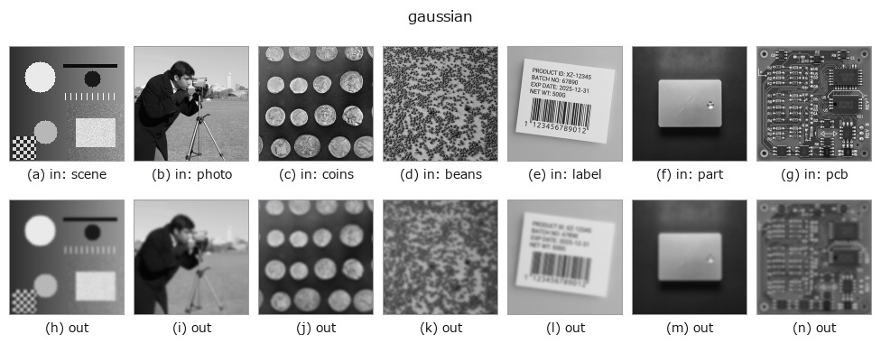

# gaussian — 2D `smoothing` op

- **データ種**: `image` → `image`
- **呼び出し**: `fullseye.apply(img, "gaussian", a=0.5, b=0.5)` (2-D は 1 画像 + 2 スカラつまみ `a,b∈[0,1]` のモデル)
- **HALCON 相当**: `gauss_filter`(意味・パラメータは HALCON リファレンスが参考になる)



*図は合成の入力 128×128 で実際に走らせた出力。左が入力、右が出力。点群は上から見た散布(明るさ = z)、1-D 列は折れ線、体積は z 方向の最大値投影、動画は中央フレーム、複素画像は振幅、絵にならない返り値は値そのもの。*

**つまみ a を振る**(0.1 / 0.5 / 0.9、もう一方は既定):



*つまみ b は出力を変えない(実測: 0.1 / 0.5 / 0.9 で同一)。*

**別の画像でも**(合成シーン / 写真 / 硬貨。上段が入力、下段がその出力。つまみは既定):



*カラー (H,W,3) の入力は載せていない: この op は色チャネルを 3 本目の空間軸として扱う(色を跨ぐ)ため。チャネルごとに分けて呼ぶこと。*

## 使い方

等方ガウシアン平滑化。HALCON の ``gauss_filter``（Smooth using discrete Gauss functions.）に相当。

``a`` が標準偏差 σ を ``0.3〜3.0`` に線形に振る（``σ = 0.3 + 2.7a``）。``b`` は未使用。実装は ``scipy.ndimage.gaussian_filter`` をそのまま呼ぶ（境界は scipy 既定の ``reflect``）。ノイズ除去や後段のエッジ検出前のぼかしに使う。σ が大きいほど細部が失われる。

## 詳しい使い方ガイド

- [gallery2d_smoothing_rank ファミリ ガイド](../guides/gallery2d_smoothing_rank.md)

## 参考(サンプルデータ・文献)

- [サンプルデータ カタログ(DL URL / ライセンス)](../../SAMPLES.md) — 2-D は skimage.data(BSD/public)+ 合成、3-D は実データ源(Stanford/PDS 等)の DL URL。
- [演算子の来歴・参考文献](../../../REFERENCES.md) — この op 族の元になった研究/手法の出典。
- アルゴリズムの正典(著者・年)と用途は上記**ファミリ使い方ガイド**に記載。

## Studio で試す

下のプログラムは実際に走ることを確かめてある(図と同じ入力)。Studio のヘルプではこのブロックがボタンになり、その場で読み込んで実行できる。

```program
gaussian 0.35 0.50
```

## 実行できる例(この op を実際に呼ぶ検証済みサンプル)

- [coherence_scanning](../../../../examples/coherence_scanning.py) — `py -3.11 examples/coherence_scanning.py`
- [color_transport](../../../../examples/color_transport.py) — `py -3.11 examples/color_transport.py`
- [ct_inspection](../../../../examples/ct_inspection.py) — `py -3.11 examples/ct_inspection.py`
- [gallery2d_smoothing_rank](../../../../examples/gallery2d_smoothing_rank.py) — `py -3.11 examples/gallery2d_smoothing_rank.py`
- [photon_timeresolved](../../../../examples/photon_timeresolved.py) — `py -3.11 examples/photon_timeresolved.py`
- [poc_dtof_ranging](../../../../examples/poc_dtof_ranging.py) — `py -3.11 examples/poc_dtof_ranging.py`
- [poc_interferometry_step](../../../../examples/poc_interferometry_step.py) — `py -3.11 examples/poc_interferometry_step.py`
- [poc_nuclei_ploidy](../../../../examples/poc_nuclei_ploidy.py) — `py -3.11 examples/poc_nuclei_ploidy.py`
- [poc_solar_limb_darkening](../../../../examples/poc_solar_limb_darkening.py) — `py -3.11 examples/poc_solar_limb_darkening.py`
- [poc_star_astrometry](../../../../examples/poc_star_astrometry.py) — `py -3.11 examples/poc_star_astrometry.py`
- [poc_wound_area_tracking](../../../../examples/poc_wound_area_tracking.py) — `py -3.11 examples/poc_wound_area_tracking.py`
- [quickstart](../../../../examples/quickstart.py) — `py -3.11 examples/quickstart.py`
- [video_streaming](../../../../examples/video_streaming.py) — `py -3.11 examples/video_streaming.py`

## 型が繋がる次の op(`image` を入力に取れる)

[identity](../misc/identity.md) · [mean_box](mean_box.md) · [bilateral](bilateral.md) · [unsharp](unsharp.md) · [median](../rank/median.md) · [min_filter](../rank/min_filter.md) · [max_filter](../rank/max_filter.md) · [percentile](../rank/percentile.md)

## 同カテゴリ(`smoothing`)

[mean_box](mean_box.md) · [bilateral](bilateral.md) · [unsharp](unsharp.md) · [sk_tv](sk_tv.md) · [sk_wavelet](sk_wavelet.md) · [sk_rolling_ball](sk_rolling_ball.md) · [sk_nlm](sk_nlm.md) · [sk_tv_bregman](sk_tv_bregman.md)

---
*Provenance: ops.py — 2D operator registry. この per-op ノートは `tools/opdocs.py md` が自動生成(手編集しない)。*

© 2026 Kazufumi Furuse — Fullseye operator documentation. Licensed under Apache-2.0.
