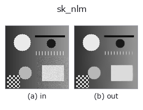
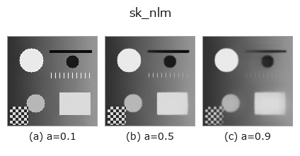
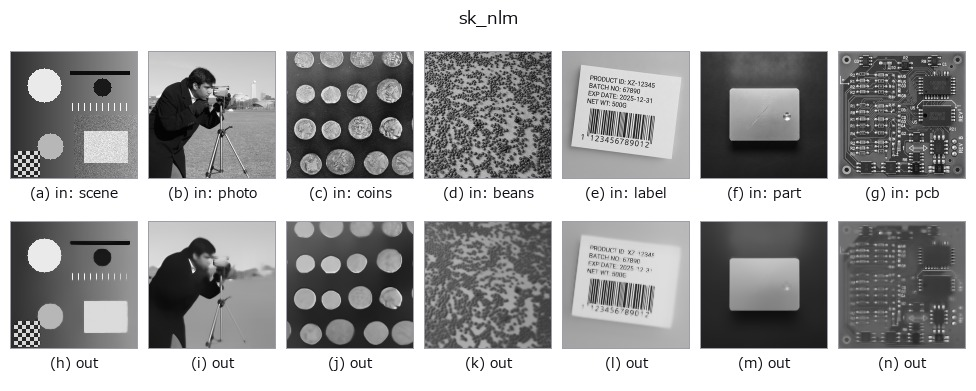

# sk_nlm — 2D `smoothing` op

- **データ種**: `image` → `image`
- **呼び出し**: `fullseye.apply(img, "sk_nlm", a=0.5, b=0.5)` (2-D は 1 画像 + 2 スカラつまみ `a,b∈[0,1]` のモデル)



*図は合成の入力 128×128 で実際に走らせた出力。左が入力、右が出力。点群は上から見た散布(明るさ = z)、1-D 列は折れ線、体積は z 方向の最大値投影、動画は中央フレーム、複素画像は振幅、絵にならない返り値は値そのもの。*

**つまみ a を振る**(0.1 / 0.5 / 0.9、もう一方は既定):



*つまみ b は出力を変えない(実測: 0.1 / 0.5 / 0.9 で同一)。*

**別の画像でも**(合成シーン / 写真 / 硬貨。上段が入力、下段がその出力。つまみは既定):



*カラー (H,W,3) の入力は載せていない: この op は色チャネルを 3 本目の空間軸として扱う(色を跨ぐ)ため。チャネルごとに分けて呼ぶこと。*

## 使い方

Non-local means(非局所平均法)ノイズ除去。近接画素だけでなく画像全体から似たパッチを探して平均する —— 反復模様やテクスチャを保ったまま平坦部のノイズだけを落とせるのが、単純な平滑化との違い。

HALCON に直接対応するものは無い。実装は ``restoration.denoise_nl_means(v, patch_size=5, h=0.02+0.2*a)`` —— a はカットオフ距離 h(大きいほど「似ている」と判定される範囲が広がり、強くノイズ除去される代わりにディテールも失われやすい)を 0.02〜0.22 に振る。パッチサイズは 5x5 に固定。b は未使用。

## 詳しい使い方ガイド

- [gallery2d_smoothing_rank ファミリ ガイド](../guides/gallery2d_smoothing_rank.md)

## 参考(サンプルデータ・文献)

- [サンプルデータ カタログ(DL URL / ライセンス)](../../SAMPLES.md) — 2-D は skimage.data(BSD/public)+ 合成、3-D は実データ源(Stanford/PDS 等)の DL URL。
- [演算子の来歴・参考文献](../../../REFERENCES.md) — この op 族の元になった研究/手法の出典。
- アルゴリズムの正典(著者・年)と用途は上記**ファミリ使い方ガイド**に記載。

## Studio で試す

下のプログラムは実際に走ることを確かめてある(図と同じ入力)。Studio のヘルプではこのブロックがボタンになり、その場で読み込んで実行できる。

```program
sk_nlm 0.35 0.50
```

## 実行できる例(この op を実際に呼ぶ検証済みサンプル)

- [gallery2d_smoothing_rank](../../../../examples/gallery2d_smoothing_rank.py) — `py -3.11 examples/gallery2d_smoothing_rank.py`
- [poc_prnu_camera_fingerprint](../../../../examples/poc_prnu_camera_fingerprint.py) — `py -3.11 examples/poc_prnu_camera_fingerprint.py`

## 型が繋がる次の op(`image` を入力に取れる)

[identity](../misc/identity.md) · [gaussian](gaussian.md) · [mean_box](mean_box.md) · [bilateral](bilateral.md) · [unsharp](unsharp.md) · [median](../rank/median.md) · [min_filter](../rank/min_filter.md) · [max_filter](../rank/max_filter.md)

## 同カテゴリ(`smoothing`)

[gaussian](gaussian.md) · [mean_box](mean_box.md) · [bilateral](bilateral.md) · [unsharp](unsharp.md) · [sk_tv](sk_tv.md) · [sk_wavelet](sk_wavelet.md) · [sk_rolling_ball](sk_rolling_ball.md) · [sk_tv_bregman](sk_tv_bregman.md)

---
*Provenance: ops.py — 2D operator registry. この per-op ノートは `tools/opdocs.py md` が自動生成(手編集しない)。*

© 2026 Kazufumi Furuse — Fullseye operator documentation. Licensed under Apache-2.0.
