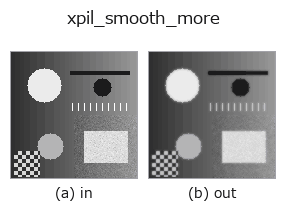
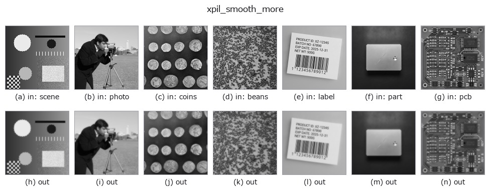

# xpil_smooth_more — 2D `smoothing` op

- **データ種**: `image` → `image`
- **呼び出し**: `fullseye.apply(img, "xpil_smooth_more", a=0.5, b=0.5)` (2-D は 1 画像 + 2 スカラつまみ `a,b∈[0,1]` のモデル)



*図は合成の入力 128×128 で実際に走らせた出力。左が入力、右が出力。点群は上から見た散布(明るさ = z)、1-D 列は折れ線、体積は z 方向の最大値投影、動画は中央フレーム、複素画像は振幅、絵にならない返り値は値そのもの。*

*つまみ a は出力を変えない(実測: 0.1 / 0.5 / 0.9 で同一)。*

*つまみ b は出力を変えない(実測: 0.1 / 0.5 / 0.9 で同一)。*

**別の画像でも**(合成シーン / 写真 / 硬貨。上段が入力、下段がその出力。つまみは既定):



*4 列目はカラー (H,W,3) の入力。この op は色を跨がずに扱える(色チャネルを 3 本目の空間軸として畳み込まない)。*

## 使い方

Pillow の平滑化フィルタ（強め）。``PIL.ImageFilter.SMOOTH_MORE`` の固定カーネルで ``SMOOTH`` よりも強くぼかす。

a, b は未使用（固定カーネル）。

カーネルは 5x5 の重み付き平均（中心 44、その 8 近傍が 5、最外周 16 画素が1、合計 100 で割る）。中心の重みが大きいので同じ 5x5 の一様平均よりぼけは弱く、インパルスは中心 44% + 隣接 8 画素 5% ずつに広がる程度（実測: 255 のインパルス → 中心 112、隣接 13、外周 0）。3x3 の ``SMOOTH``（中心 5、近傍 1、合計 13）よりは広く効く。

入力は [0,1] に clip して ``*255`` の切り捨てで 8 ビット L 画像にし、出力を ``/255`` で戻す（1/255 の量子化が入る）。画像の最外周 2 画素はPillow がフィルタせず入力値のまま。0 サイズの画像は ValueError で拒否され、fail-soft で入力のクリップ版に落ちる（台帳に記録）。ぼかし量を可変にしたいなら ``gaussian`` や ``median`` を使う。エッジ検出（``xpil_contour`` /``xpil_find_edges``）や ``threshold`` の前のノイズ落としに。

## 詳しい使い方ガイド

- [gallery2d_smoothing_rank ファミリ ガイド](../guides/gallery2d_smoothing_rank.md)

## 参考(サンプルデータ・文献)

- [サンプルデータ カタログ(DL URL / ライセンス)](../../SAMPLES.md) — 2-D は skimage.data(BSD/public)+ 合成、3-D は実データ源(Stanford/PDS 等)の DL URL。
- [演算子の来歴・参考文献](../../../REFERENCES.md) — この op 族の元になった研究/手法の出典。
- アルゴリズムの正典(著者・年)と用途は上記**ファミリ使い方ガイド**に記載。

## Studio で試す

下のプログラムは実際に走ることを確かめてある(図と同じ入力)。Studio のヘルプではこのブロックがボタンになり、その場で読み込んで実行できる。

```program
xpil_smooth_more 0.35 0.50
```

## 実行できる例(この op を実際に呼ぶ検証済みサンプル)

- [gallery2d_smoothing_rank](../../../../examples/gallery2d_smoothing_rank.py) — `py -3.11 examples/gallery2d_smoothing_rank.py`

## 型が繋がる次の op(`image` を入力に取れる)

[identity](../misc/identity.md) · [gaussian](gaussian.md) · [mean_box](mean_box.md) · [bilateral](bilateral.md) · [unsharp](unsharp.md) · [median](../rank/median.md) · [min_filter](../rank/min_filter.md) · [max_filter](../rank/max_filter.md)

## 同カテゴリ(`smoothing`)

[gaussian](gaussian.md) · [mean_box](mean_box.md) · [bilateral](bilateral.md) · [unsharp](unsharp.md) · [sk_tv](sk_tv.md) · [sk_wavelet](sk_wavelet.md) · [sk_rolling_ball](sk_rolling_ball.md) · [sk_nlm](sk_nlm.md)

---
*Provenance: ops.py — 2D operator registry. この per-op ノートは `tools/opdocs.py md` が自動生成(手編集しない)。*

© 2026 Kazufumi Furuse — Fullseye operator documentation. Licensed under Apache-2.0.
