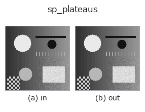
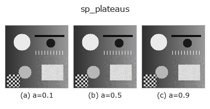
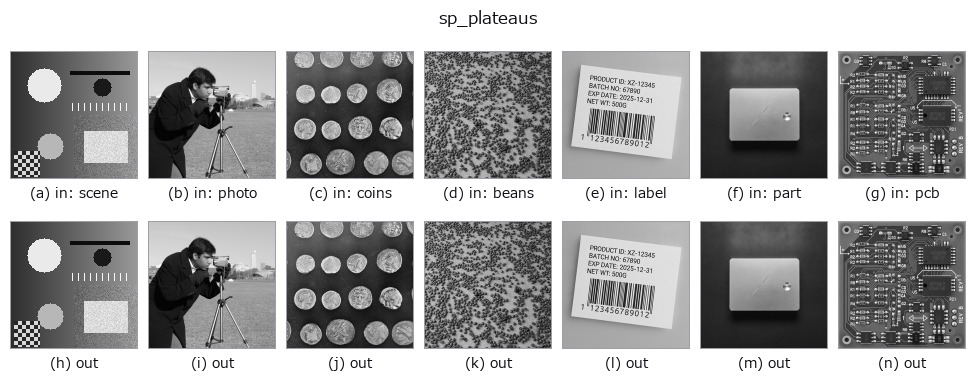

# sp_plateaus — 2D `subpix` op

- **データ種**: `image` → `contour`
- **呼び出し**: `fullseye.apply(img, "sp_plateaus", a=0.5, b=0.5)` (2-D は 1 画像 + 2 スカラつまみ `a,b∈[0,1]` のモデル)
- **HALCON 相当**: `plateaus`(意味・パラメータは HALCON リファレンスが参考になる)



*図は合成の入力 128×128 で実際に走らせた出力。左が入力、右が出力。点群は上から見た散布(明るさ = z)、1-D 列は折れ線、体積は z 方向の最大値投影、動画は中央フレーム、複素画像は振幅、絵にならない返り値は値そのもの。*

**つまみ a を振る**(0.1 / 0.5 / 0.9、もう一方は既定):



*つまみ b は出力を変えない(実測: 0.1 / 0.5 / 0.9 で同一)。*

**別の画像でも**(合成シーン / 写真 / 硬貨。上段が入力、下段がその出力。つまみは既定):



*4 列目はカラー (H,W,3) の入力。この op は色を跨がずに扱える(色チャネルを 3 本目の空間軸として畳み込まない)。*

## 使い方

同じ（量子化した）グレー値が連結した平坦領域（プラトー）の重心をサブピクセル位置として返す（HALCON ``plateaus`` に相当）。

隣接画素同士がしきい値 ``q = 1e-6 + 0.05*a`` 以内で等しければ同じ平坦領域とみなす（Union-Find で連結成分化）。``a`` はこの許容量子化幅と最小面積（``min_area = 2 + round(6*a)``、これ未満の領域は無視）の両方を振る。``b`` は未使用。戻り値は CONTOUR で、各プラトーにつき 1 点（その領域の画素座標の平均、単位はピクセル）。入力が 200,000 画素を超える場合は安全側で空集合を返す（計算量ガード）。

## 詳しい使い方ガイド

- [gallery2d_geometry ファミリ ガイド](../guides/gallery2d_geometry.md)

## 背景知識ガイド(この op の手前にある物理・規約)

- [measurement_uncertainty](../../math/guides/measurement_uncertainty.md) — 計測の不確かさと校正の知識 — 「測れている」を主張するために

## 参考(サンプルデータ・文献)

- [サンプルデータ カタログ(DL URL / ライセンス)](../../SAMPLES.md) — 2-D は skimage.data(BSD/public)+ 合成、3-D は実データ源(Stanford/PDS 等)の DL URL。
- [演算子の来歴・参考文献](../../../REFERENCES.md) — この op 族の元になった研究/手法の出典。
- アルゴリズムの正典(著者・年)と用途は上記**ファミリ使い方ガイド**に記載。

## Studio で試す

下のプログラムは実際に走ることを確かめてある(図と同じ入力)。Studio のヘルプではこのブロックがボタンになり、その場で読み込んで実行できる。

```program
sp_plateaus 0.50 0.50
```

## 実行できる例(この op を実際に呼ぶ検証済みサンプル)

- [gallery2d_geometry](../../../../examples/gallery2d_geometry.py) — `py -3.11 examples/gallery2d_geometry.py`

## 型が繋がる次の op(`contour` を入力に取れる)

[identity](../misc/identity.md) · [select_contours](../contour/select_contours.md) · [smooth_contours](../contour/smooth_contours.md) · [fit_line_contours](../contour/fit_line_contours.md) · [contours_to_region](../contour/contours_to_region.md) · [count_contours](../features/count_contours.md) · [total_length](../features/total_length.md) · [select_contours_xld](../contour/select_contours_xld.md)

## 同カテゴリ(`subpix`)

[sp_local_max_sub_pix](sp_local_max_sub_pix.md) · [sp_local_min_sub_pix](sp_local_min_sub_pix.md) · [sp_saddle_points_sub_pix](sp_saddle_points_sub_pix.md) · [sp_critical_points_sub_pix](sp_critical_points_sub_pix.md) · [sp_lowlands_center](sp_lowlands_center.md)

---
*Provenance: ops.py — 2D operator registry. この per-op ノートは `tools/opdocs.py md` が自動生成(手編集しない)。*

© 2026 Kazufumi Furuse — Fullseye operator documentation. Licensed under Apache-2.0.
