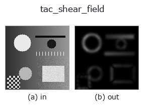
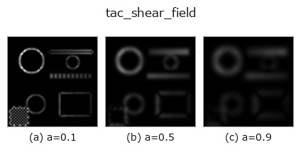
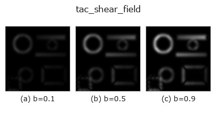
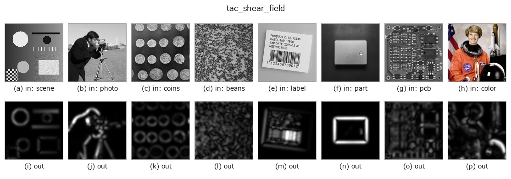

# tac_shear_field — 2D `tactile` op

- **データ種**: `image` → `image`
- **呼び出し**: `fullseye.apply(img, "tac_shear_field", a=0.5, b=0.5)` (2-D は 1 画像 + 2 スカラつまみ `a,b∈[0,1]` のモデル)



*図は合成の入力 128×128 で実際に走らせた出力。左が入力、右が出力。点群は上から見た散布(明るさ = z)、1-D 列は折れ線、体積は z 方向の最大値投影、動画は中央フレーム、複素画像は振幅、絵にならない返り値は値そのもの。*

**つまみ a を振る**(0.1 / 0.5 / 0.9、もう一方は既定):



**つまみ b を振る**(0.1 / 0.5 / 0.9、もう一方は既定):



**別の画像でも**(合成シーン / 写真 / 硬貨。上段が入力、下段がその出力。つまみは既定):



*4 列目はカラー (H,W,3) の入力。この op は色を跨がずに扱える(色チャネルを 3 本目の空間軸として畳み込まない)。*

## 使い方

In-plane shear proxy from the 2-D structure tensor (Foerstner /
Bigun-Granlund orientation coherence). The tensor
``J = G_sigma(grad v * grad v^T)`` has eigenvalues l1 >= l2, and the
coherence ``(l1-l2)/(l1+l2) = sqrt((J11-J22)^2 + 4*J12^2) / (J11+J22)``
is 1 where the gel texture is stretched into a single dominant orientation
(as it is under tangential/shear load) and 0 where it is isotropic. The
result is additionally weighted by the tensor trace (gradient energy) so
that texture-free, un-contacted gel stays dark instead of amplifying noise
orientation. ``a`` = tensor integration sigma (0.6..4.6), ``b`` = output gain
(0.5..2.5). Output clipped to [0,1], HxW; a constant frame has zero gradient
energy and yields an all-zero shear field.

## 参考(サンプルデータ・文献)

- [サンプルデータ カタログ(DL URL / ライセンス)](../../SAMPLES.md) — 2-D は skimage.data(BSD/public)+ 合成、3-D は実データ源(Stanford/PDS 等)の DL URL。
- [演算子の来歴・参考文献](../../../REFERENCES.md) — この op 族の元になった研究/手法の出典。

## Studio で試す

下のプログラムは実際に走ることを確かめてある(図と同じ入力)。Studio のヘルプではこのブロックがボタンになり、その場で読み込んで実行できる。

```program
tac_shear_field 0.50 0.50
```

## 実行できる例(この op を実際に呼ぶ検証済みサンプル)

- [sim2real_and_alife](../../../../examples/sim2real_and_alife.py) — `py -3.11 examples/sim2real_and_alife.py`

## 型が繋がる次の op(`image` を入力に取れる)

[identity](../misc/identity.md) · [gaussian](../smoothing/gaussian.md) · [mean_box](../smoothing/mean_box.md) · [bilateral](../smoothing/bilateral.md) · [unsharp](../smoothing/unsharp.md) · [median](../rank/median.md) · [min_filter](../rank/min_filter.md) · [max_filter](../rank/max_filter.md)

## 同カテゴリ(`tactile`)

[tac_contact_mask](tac_contact_mask.md) · [tac_height_from_shading](tac_height_from_shading.md) · [tac_surface_normal](tac_surface_normal.md) · [tac_pressure_proxy](tac_pressure_proxy.md)

---
*Provenance: ops.py — 2D operator registry. この per-op ノートは `tools/opdocs.py md` が自動生成(手編集しない)。*

© 2026 Kazufumi Furuse — Fullseye operator documentation. Licensed under Apache-2.0.
