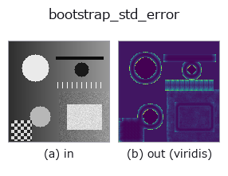
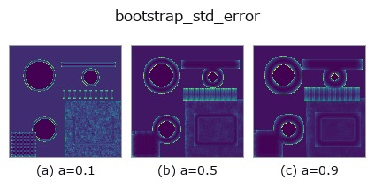
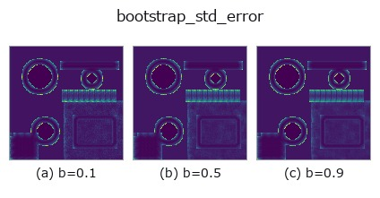
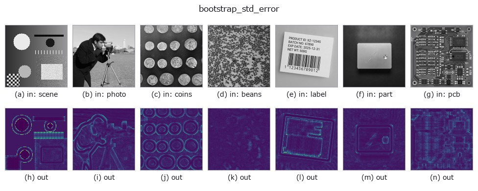

# bootstrap_std_error — 2D `texture` op

- **データ種**: `image` → `image`
- **呼び出し**: `fullseye.apply(img, "bootstrap_std_error", a=0.5, b=0.5)` (2-D は 1 画像 + 2 スカラつまみ `a,b∈[0,1]` のモデル)



*図は合成の入力 128×128 で実際に走らせた出力。左が入力、右が出力。点群は上から見た散布(明るさ = z)、1-D 列は折れ線、体積は z 方向の最大値投影、動画は中央フレーム、複素画像は振幅、絵にならない返り値は値そのもの。*

*出力は viridis 風の疑似カラー(暗い紫 = 小、黄 = 大)。距離・位相・向き・深度のような「量の場」を読むため。*

**つまみ a を振る**(0.1 / 0.5 / 0.9、もう一方は既定):



**つまみ b を振る**(0.1 / 0.5 / 0.9、もう一方は既定):



**別の画像でも**(合成シーン / 写真 / 硬貨。上段が入力、下段がその出力。つまみは既定):



*4 列目はカラー (H,W,3) の入力。この op は色を跨がずに扱える(色チャネルを 3 本目の空間軸として畳み込まない)。*

## 使い方

局所標準偏差の**標準誤差**を、分布を仮定せずに測る(ブートストラップ)。

``local_std`` が併記する誤差 ``1/sqrt(2(n-1))`` は**雑音が正規分布**という仮定の
上に立っている。外れ値や二峰性があると、その式は本当のばらつきを過小に言う。
ここでは窓の中の値を**そこから重複ありで取り直して**統計量を作り直し、その散らばり
そのものを誤差とする —— 仮定が要らない代わりに計算で買う。

``a`` が窓(3〜9 画素)、``b`` が取り直しの回数(8〜64)。出力は窓内の標準偏差に
対する**相対**標準誤差で、``1.0`` が「100 % ぶれる」。

**読み方**: **絶対値ではなく、場所ごとの比で読む**。正規分布の白色雑音に当てると
閉形式 ``1/sqrt(2(n-1))`` より**低めに出る**(ブートストラップは小標本で標準偏差の
ばらつきを過小に言う)。実測(``b=1.0``、取り直し 64 回):

    窓 3x3 (n=9)  実測 0.216 / 閉形式 0.250 = 0.86
    窓 5x5 (n=25) 実測 0.133 / 閉形式 0.144 = 0.92
    窓 7x7 (n=49) 実測 0.096 / 閉形式 0.102 = 0.94
    窓 9x9 (n=81) 実測 0.076 / 閉形式 0.079 = 0.96

つまり窓が大きくなるほど近づく。**読みどころは「どこが周りより高いか」**で、
そこは分布が正規から外れている(傷・外れ値・二つの材質の境目)。外れ値を 2 % 混ぜた
画像では中央値が閉形式の **1.8 倍**まで跳ね上がり、正規の場合(0.9 倍前後)と
はっきり分かれる —— この差が使いどころ。``local_std`` と並べて、「ばらつきの
大きさ」と「その数字の信用できなさ」を同時に見る。

**適用条件**: (1) 窓が小さいとブートストラップ自体がぶれるうえ、上のとおり
系統的に低く出る。(2) 取り直し回数(``b``)を増やすと地図は滑らかになるが、
真の誤差が下がるわけではない。(3) 決定的にするため種は固定してある —— 同じ入力なら
必ず同じ出力を返す。(4) **仮定を計算で買う op**なので遅い: 実測で 128x128 が
0.26 秒、256x256 が 1.27 秒(``b=1.0``、64 回)。閉形式で足りる場面では
``local_std`` の誤差限界を使うこと —— この op は「その閉形式が信用できるか」を
確かめたいときの道具。

## 詳しい使い方ガイド

- [gallery2d_texture_freq ファミリ ガイド](../guides/gallery2d_texture_freq.md)

## 参考(サンプルデータ・文献)

- [サンプルデータ カタログ(DL URL / ライセンス)](../../SAMPLES.md) — 2-D は skimage.data(BSD/public)+ 合成、3-D は実データ源(Stanford/PDS 等)の DL URL。
- [演算子の来歴・参考文献](../../../REFERENCES.md) — この op 族の元になった研究/手法の出典。
- アルゴリズムの正典(著者・年)と用途は上記**ファミリ使い方ガイド**に記載。

## Studio で試す

下のプログラムは実際に走ることを確かめてある(図と同じ入力)。Studio のヘルプではこのブロックがボタンになり、その場で読み込んで実行できる。

```program
bootstrap_std_error 0.50 0.50
```

## 実行できる例(この op を実際に呼ぶ検証済みサンプル)

- [gallery2d_texture_freq](../../../../examples/gallery2d_texture_freq.py) — `py -3.11 examples/gallery2d_texture_freq.py`

## 型が繋がる次の op(`image` を入力に取れる)

[identity](../misc/identity.md) · [gaussian](../smoothing/gaussian.md) · [mean_box](../smoothing/mean_box.md) · [bilateral](../smoothing/bilateral.md) · [unsharp](../smoothing/unsharp.md) · [median](../rank/median.md) · [min_filter](../rank/min_filter.md) · [max_filter](../rank/max_filter.md)

## 同カテゴリ(`texture`)

[std_filter](std_filter.md) · [local_std](local_std.md) · [scale_select_std](scale_select_std.md) · [structure_tensor_orientation](structure_tensor_orientation.md) · [structure_tensor_coherence](structure_tensor_coherence.md) · [gabor](gabor.md) · [sk_frangi](sk_frangi.md) · [sk_meijering](sk_meijering.md)

---
*Provenance: ops.py — 2D operator registry. この per-op ノートは `tools/opdocs.py md` が自動生成(手編集しない)。*

© 2026 Kazufumi Furuse — Fullseye operator documentation. Licensed under Apache-2.0.
