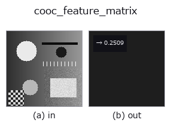
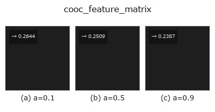

# cooc_feature_matrix — 2D `texture` op

- **データ種**: `image` → `feature`
- **呼び出し**: `fullseye.apply(img, "cooc_feature_matrix", a=0.5, b=0.5)` (2-D は 1 画像 + 2 スカラつまみ `a,b∈[0,1]` のモデル)
- **HALCON 相当**: `cooc_feature_matrix`(意味・パラメータは HALCON リファレンスが参考になる)



*図は合成の入力 128×128 で実際に走らせた出力。左が入力、右が出力。点群は上から見た散布(明るさ = z)、1-D 列は折れ線、体積は z 方向の最大値投影、動画は中央フレーム、複素画像は振幅、絵にならない返り値は値そのもの。*

**つまみ a を振る**(0.1 / 0.5 / 0.9、もう一方は既定):



*つまみ b は出力を変えない(実測: 0.1 / 0.5 / 0.9 で同一)。*

## 使い方

グレーレベル共起行列(GLCM、``skimage.feature.graycomatrix``、16 階調
に量子化、距離 ``1+3*a``、角度 0°)から Haralick テクスチャ特徴量
``energy``(角二次モーメント、行列の値の集中度=テクスチャの均一性)を計算
する。HALCON の ``cooc_feature_matrix``（Calculate gray value features
from a co-occurrence matrix.）に相当(HALCON は複数の特徴量・複数角度を
同時に返せるが、ここでは energy・角度 0° 固定に単純化)。

``a`` が共起を取る画素間距離を 1〜4 の範囲で振る。★``b >= 0.75`` で **0/45/90/135 度の 4 方向を平均**する(既定 ``b=0.5`` は従来どおり 0 度だけなので、既存の結果は 1 ビットも変わらない)。

実写テクスチャ(brick / grass / gravel)を 12 角度回して測ると(``poc_texture_rotation_identity``)、**効くかどうかは ``a`` で決まる**:

* 距離 1(``a=0``): 取り違え **3/36 -> 0/36**。効く。
* 距離 2(既定 ``a=0.5``): どちらも 0/36 だが、brick の振れ幅は素材間差の **1.36 -> 0.63 倍**に下がる。余裕が増える。
* 距離 4(``a=1``): **3/36 -> 8/36 と悪化する**。

悪化の原因は平均そのものではなく**分母**: 距離を伸ばすと 3 素材の 0 度での差そのものが 0.0448 -> 0.0221 と半分に潰れる。残り少ない差を平均すると、先に消える。**長い距離で使うときは、平均を掛ける前に素材が分かれているかを確かめること。**

## 詳しい使い方ガイド

- [gallery2d_texture_freq ファミリ ガイド](../guides/gallery2d_texture_freq.md)

## 参考(サンプルデータ・文献)

- [サンプルデータ カタログ(DL URL / ライセンス)](../../SAMPLES.md) — 2-D は skimage.data(BSD/public)+ 合成、3-D は実データ源(Stanford/PDS 等)の DL URL。
- [演算子の来歴・参考文献](../../../REFERENCES.md) — この op 族の元になった研究/手法の出典。
- アルゴリズムの正典(著者・年)と用途は上記**ファミリ使い方ガイド**に記載。

## Studio で試す

下のプログラムは実際に走ることを確かめてある(図と同じ入力)。Studio のヘルプではこのブロックがボタンになり、その場で読み込んで実行できる。

```program
cooc_feature_matrix 0.50 0.50
```

## 実行できる例(この op を実際に呼ぶ検証済みサンプル)

- [gallery2d_texture_freq](../../../../examples/gallery2d_texture_freq.py) — `py -3.11 examples/gallery2d_texture_freq.py`
- [poc_texture_rotation_identity](../../../../examples/poc_texture_rotation_identity.py) — `py -3.11 examples/poc_texture_rotation_identity.py`

## 型が繋がる次の op(`feature` を入力に取れる)

[identity](../misc/identity.md)

## 同カテゴリ(`texture`)

[std_filter](std_filter.md) · [gabor](gabor.md) · [sk_frangi](sk_frangi.md) · [sk_meijering](sk_meijering.md) · [sk_hessian](sk_hessian.md) · [sk_gabor](sk_gabor.md) · [sk_lbp](sk_lbp.md) · [sk_entropy](sk_entropy.md)

---
*Provenance: ops.py — 2D operator registry. この per-op ノートは `tools/opdocs.py md` が自動生成(手編集しない)。*

© 2026 Kazufumi Furuse — Fullseye operator documentation. Licensed under Apache-2.0.
